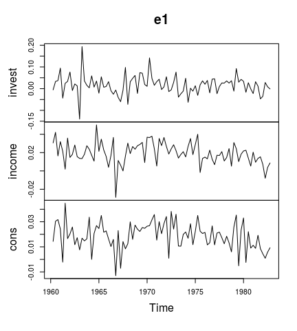
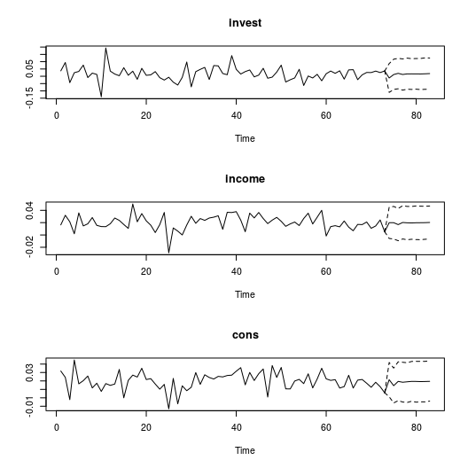
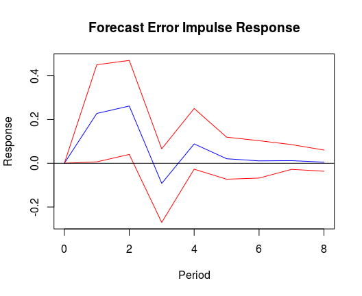
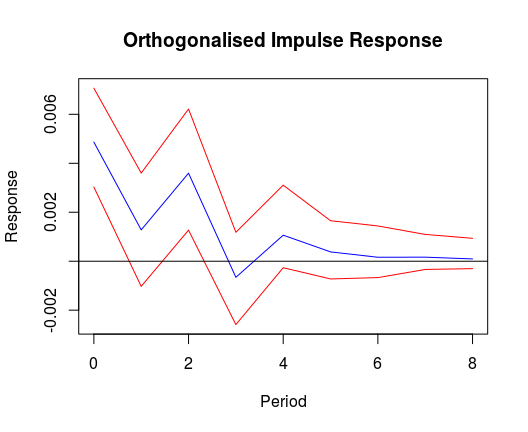
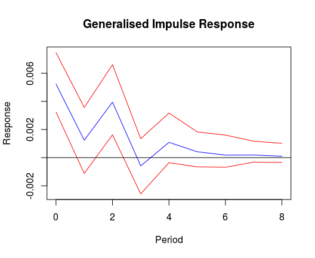
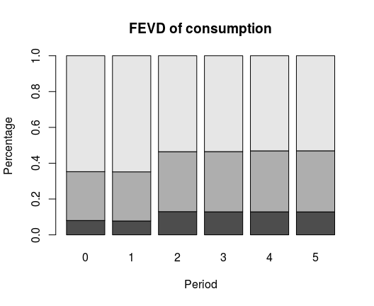

bvartools
=========

[](https://cran.r-project.org/package=bvartools) [](https://travis-ci.org/franzmohr/bvartools)

Overview
--------

The package `bvartools` implements some common functions used for Bayesian inference for mulitvariate time series models. It should give researchers maximum freedom in setting up an MCMC algorithm in R and keep calculation time limited at the same time. This is achieved by implementing posterior simulation functions in C++. Its main features are

-   The `bvar` and `bvec` function collects the output of a Gibbs sampler in standardised objects, which can be used for further analyses
-   Further functions such as `predict`, `irf`, `fevd` for forecasting, impulse response analysis and forecast error variance decomposition, respectively.
-   Computationally intensive functions - such as for posterior simulation - are written in C++ using the `RcppArmadillo` package of Eddelbuettel and Sanderson (2014).[1]

Similar packages worth checking out are

-   [BVAR](https://cran.r-project.org/package=BVAR)
-   [bvarsv](https://cran.r-project.org/package=bvarsv)
-   [BMR](https://github.com/kthohr/BMR)

Installation
------------

``` r
install.packages("bvartools")
```

### Development version

``` r
# install.packages("devtools")
devtools::install_github("franzmohr/bvartools")
```

Usage
-----

This example covers the estimation of a simple Bayesian VAR (BVAR) model. For further examples on time varying parameter (TVP), stochastic volatility (SV), and vector error correction (VEC) models as well as shrinkage methods like stochastic search variable selection (SSVS) or Bayesian variable selection (BVS) see the vignettes of the package.

### Data

To illustrate the estimation process the dataset E1 from Lütkepohl (2007) is used. It contains data on West German fixed investment, disposable income and consumption expenditures in billions of DM from 1960Q1 to 1982Q4.

``` r
library(bvartools)

data("e1")
e1 <- diff(log(e1))

plot(e1) # Plot the series
```



### Prepare data for estimation

The `gen_var` function produces the inputs `y` and `x` for the BVAR estimator, where `y` is the matrix of dependent variables and `x` is the matrix of regressors.

``` r
data <- gen_var(e1, p = 2, deterministic = "const")

y <- data$Y[, 1:73]
x <- data$Z[, 1:73]
```

As in Lütkepohl (2007) only the first 73 observations are used.

### Estimation

The following code sets up a simple Gibbs sampler algorithm.

``` r
set.seed(1234567)

iter <- 15000 # Number of iterations of the Gibbs sampler
burnin <- 5000 # Number of burn-in draws
store <- iter - burnin

t <- ncol(y) # Number of observations
k <- nrow(y) # Number of endogenous variables
m <- k * nrow(x) # Number of estimated coefficients

# Set (uninformative) priors
a_mu_prior <- matrix(0, m) # Vector of prior parameter means
a_v_i_prior <- diag(0, m) # Inverse of the prior covariance matrix

u_sigma_df_prior <- 0 # Prior degrees of freedom
u_sigma_scale_prior <- diag(0, k) # Prior covariance matrix
u_sigma_df_post <- t + u_sigma_df_prior # Posterior degrees of freedom

# Initial values
u_sigma_i <- diag(.00001, k)
u_sigma <- solve(u_sigma_i)

# Data containers for posterior draws
draws_a <- matrix(NA, m, store)
draws_sigma <- matrix(NA, k^2, store)

# Start Gibbs sampler
for (draw in 1:iter) {
  # Draw conditional mean parameters
  a <- post_normal(y, x, u_sigma_i, a_mu_prior, a_v_i_prior)
  
  # Draw variance-covariance matrix
  u <- y - matrix(a, k) %*% x # Obtain residuals
  u_sigma_scale_post <- solve(u_sigma_scale_prior + tcrossprod(u))
  u_sigma_i <- matrix(rWishart(1, u_sigma_df_post, u_sigma_scale_post)[,, 1], k)
  u_sigma <- solve(u_sigma_i) # Invert Sigma_i to obtain Sigma
  
  # Store draws
  if (draw > burnin) {
    draws_a[, draw - burnin] <- a
    draws_sigma[, draw - burnin] <- u_sigma
  }
}
```

Obtain point estimates as the mean of the posterior draws

``` r
A <- rowMeans(draws_a) # Obtain means for every row
A <- matrix(A, k) # Transform mean vector into a matrix
A <- round(A, 3) # Round values
dimnames(A) <- list(dimnames(y)[[1]], dimnames(x)[[1]]) # Rename matrix dimensions

A # Print
```

    ##        invest.1 income.1 cons.1 invest.2 income.2 cons.2  const
    ## invest   -0.321    0.147  0.966   -0.160    0.104  0.936 -0.017
    ## income    0.044   -0.152  0.287    0.050    0.019 -0.009  0.016
    ## cons     -0.003    0.223 -0.263    0.034    0.354 -0.020  0.013

``` r
Sigma <- rowMeans(draws_sigma) # Obtain means for every row
Sigma <- matrix(Sigma, k) # Transform mean vector into a matrix
Sigma <- round(Sigma * 10^4, 2) # Round values
dimnames(Sigma) <- list(dimnames(y)[[1]], dimnames(y)[[1]]) # Rename matrix dimensions

Sigma # Print
```

    ##        invest income cons
    ## invest  22.67   0.77 1.32
    ## income   0.77   1.46 0.65
    ## cons     1.32   0.65 0.95

The means of the coefficient draws are very close to the results of the frequentist estimatior in Lütkepohl (2007).

### `bvar` objects

The `bvar` function can be used to collect relevant output of the Gibbs sampler in a standardised object, which can be used by further functions such as `predict` to obtain forecasts or `irf` for impulse respons analysis.

``` r
bvar_est <- bvar(y = y, x = x, A = draws_a[1:18,],
                 C = draws_a[19:21, ], Sigma = draws_sigma)
```

### Forecasts

Forecasts can be obtained with the function `predict`. If the model contains deterministic terms, new values have to be provided in the argument `new_D`, which must be of the same length as the argument `n.ahead`.

``` r
bvar_pred <- predict(bvar_est, n.ahead = 10, new_D = rep(1, 10))

plot(bvar_pred)
```



### Impulse response analysis

#### Forecast error impulse response

``` r
IR <- irf(bvar_est, impulse = "income", response = "cons", n.ahead = 8)

plot(IR, main = "Forecast Error Impulse Response", xlab = "Period", ylab = "Response")
```



#### Orthogonalised impulse response

``` r
OIR <- irf(bvar_est, impulse = "income", response = "cons", n.ahead = 8, type = "oir")

plot(OIR, main = "Orthogonalised Impulse Response", xlab = "Period", ylab = "Response")
```



#### Generalised impulse response

``` r
GIR <- irf(bvar_est, impulse = "income", response = "cons", n.ahead = 8, type = "gir")

plot(GIR, main = "Generalised Impulse Response", xlab = "Period", ylab = "Response")
```



### Forecast error variance decomposition

``` r
bvar_fevd <- fevd(bvar_est, response = "cons")

plot(bvar_fevd, main = "FEVD of consumption")
```



References
----------

Eddelbuettel, D., & Sanderson C. (2014). RcppArmadillo: Accelerating R with high-performance C++ linear algebra. *Computational Statistics and Data Analysis, 71*, 1054-1063. <https://doi.org/10.1016/j.csda.2013.02.005>

Lütkepohl, H. (2007). *New introduction to multiple time series analysis* (2nd ed.). Berlin: Springer.

Pesaran, H. H., & Shin, Y. (1998). Generalized impulse response analysis in linear multivariate models. *Economics Letters, 58*, 17-29. <https://doi.org/10.1016/S0165-1765(97)00214-0>

Sanderson, C., & Curtin, R. (2016). Armadillo: a template-based C++ library for linear algebra. *Journal of Open Source Software, 1*(2), 26. <https://doi.org/10.21105/joss.00026>

[1] `RcppArmadillo` is the `Rcpp` bridge to the open source 'Armadillo' library of Sanderson and Curtin (2016).
