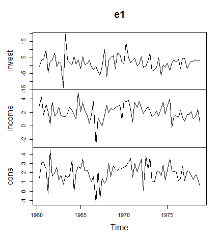
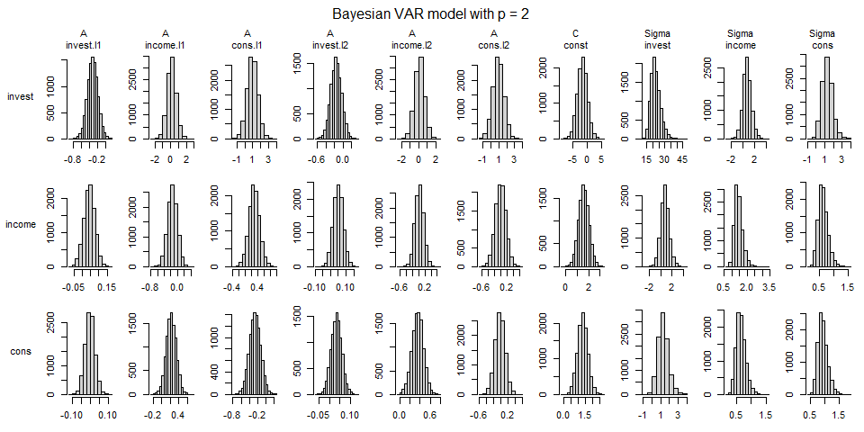
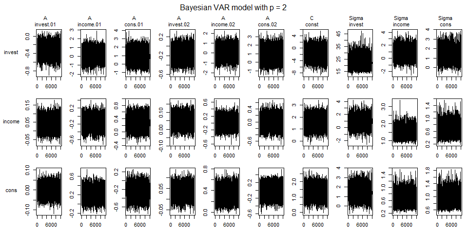
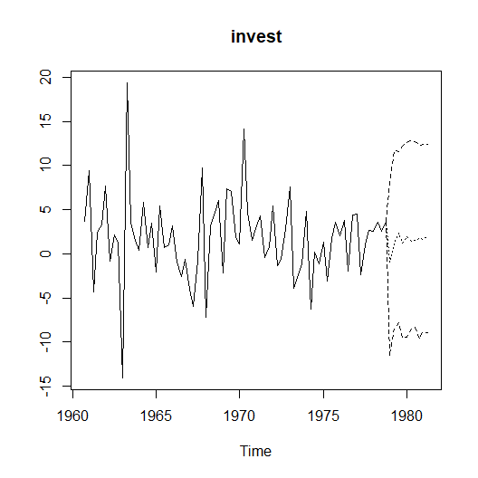
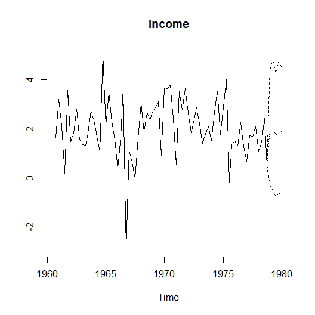
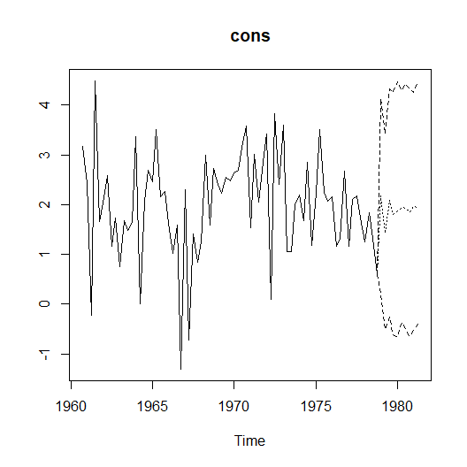
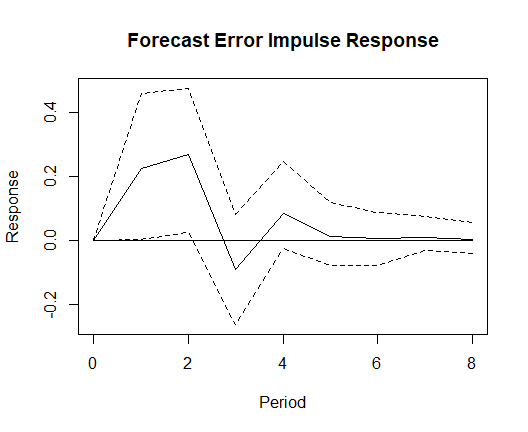
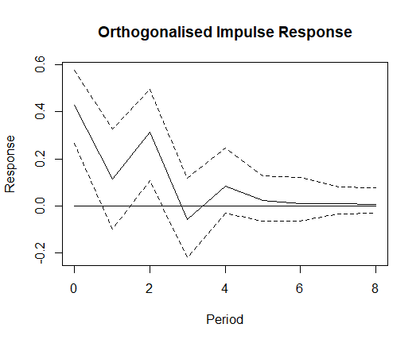
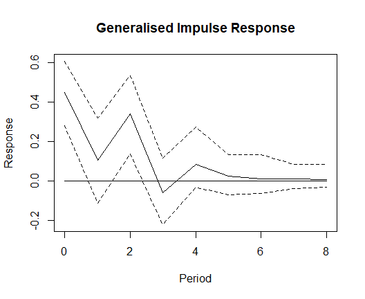
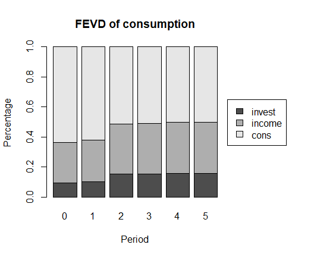

# bvartools

[](https://cran.r-project.org/package=bvartools)
[](https://cran.r-project.org/package=bvartools)
[](https://cran.r-project.org/package=bvartools)
[](https://github.com/franzmohr/bvartools/actions/workflows/R-CMD-check.yaml)
[](https://app.codecov.io/gh/franzmohr/bvartools)
[](https://www.gnu.org/licenses/gpl-2.0)

[](https://github.com/sponsors/franzmohr)
[](https://www.buymeacoffee.com/franzmohr)

## Overview

The package `bvartools` implements functions for Bayesian inference of
linear time series models with a focus on vector autoregressive (VAR)
and vector error correction (VEC). It separates a typical analytics
workflow into multiple steps:

- *Model set-up*
  - Produce data matrices for given lag orders and model types, which
    can be used for posterior simulation. This includes a set-up for
    expanding window estimation.
  - Set prior hyperparameters either manually or based on established
    approaches such as the Minnesota prior.
  - Set initial values based on maximum likelihood estiamtes or drawing
    from a prior.
- *Posterior simulation*
  - Perform posterior simulation of coefficients, forecasts and
    likelihoods using algortihms from the
    [BayesTS](github.com/franzmohr/BayesTS) library.
  - Researchers can also choose to use they own algorthms.
- *Evaluation*
  - Traditional summary statistics for individual coefficients
  - In-sample performance measures (LL, AIC, BIC, HQ)
  - Out-of-sample performance (MAFE, RMSFE)
- *Application*
  - Forecasts
  - Impulse response functions
  - Forecast error variance decomposition

In each step researchers are provided with the opportunity to fine-tune
a model according to their specific requirements or to use the default
framework for commonly used models and priors. Since version 1.0.0 the
package includes simulation functions from the
[BayesTS](github.com/franzmohr/BayesTS) C++ library.

For Bayesian inference of *VAR models* the package covers

- Standard BVAR models with independent normal-Wishart priors
- BVAR models employing stochastic search variable selection à la
  Gerorge, Sun and Ni (2008)
- BVAR models employing Bayesian variable selection à la Korobilis
  (2013)
- Structural BVAR models, where the structural coefficients are
  estimated from contemporary endogenous variables (A-model)
- Stochastic volatility (SV) of the errors à la Kim, Shephard and Chip
  (1998)
- Time varying parameter models (TVP-VAR)

For Bayesian inference of *cointegrated VAR models* the package
implements the algorithm of Koop, León-González and Strachan (2010)
\[KLS\] – which places identification restrictions on the cointegration
space – in the following variants

- The BVEC model as presented in Koop, León-González and Strachan (2010)
- The KLS model employing stochastic search variable selection à la
  Gerorge, Sun and Ni (2008)
- The KLS modol employing Bayesian variable selection à la Korobilis
  (2013)
- Structural BVEC models, where the structural coefficients are
  estimated from contemporaneous endogenous variables (A-model).
  However, no further restrictions are made regarding the cointegration
  term.
- Stochastic volatility (SV) of the errors à la Kim, Shephard and Chip
  (1998)
- Time varying parameter models (TVP-VEC) à la Koop, León-González and
  Strachan (2011)[^1]

For Bayesian inference of *dynamic factor models* the package implements
the althorithm used in the textbook of Chan, Koop, Poirer and Tobias
(2019).

Similar packages worth checking out are

- [BVAR](https://cran.r-project.org/package=BVAR)
- [bvarsv](https://cran.r-project.org/package=bvarsv)
- [bvar](https://github.com/nk027/bvar)
- [bvarr](https://github.com/bdemeshev/bvarr)
- [bvars](https://github.com/joergrieger/bvars)
- [mfbvar](https://github.com/ankargren/mfbvar)
- [BMR](https://github.com/kthohr/BMR)

## Installation

``` r
install.packages("bvartools")
```

### Development version

``` r
# install.packages("devtools")
devtools::install_github("franzmohr/bvartools")
```

## Usage

This example covers the estimation of a simple Bayesian VAR (BVAR)
model. For further examples on time varying parameter (TVP), stochastic
volatility (SV), and vector error correction (VEC) models as well as
shrinkage methods like stochastic search variable selection (SSVS) or
Bayesian variable selection (BVS) see the vignettes of the package and
[r-econometrics.com](https://www.r-econometrics.com/timeseriesintro/).

### Data

To illustrate the estimation process the dataset E1 from Lütkepohl
(2006) is used. It contains data on West German fixed investment,
disposable income and consumption expenditures in billions of DM from
1960Q1 to 1982Q4. Like in the textbook only the first 73 observations of
the log-differenced series are used.

``` r
library(bvartools)
```

    ## Lade nötiges Paket: coda

``` r
# Load data
data("e1")
e1 <- diff(log(e1)) * 100

# Reduce number of oberservations
e1 <- window(e1, end = c(1978, 4))

# Plot the series
plot(e1)
```



### Setting up a model

The `create_bvarmodel` function produces an object, which contains
information on the specification of the VAR model that should be
estimated. The following code specifies a VAR(2) model with an intercept
term. The number of iterations and burn-in draws is already specified at
this stage.

``` r
model <- create_bvarmodel(e1, p = 2, deterministic = "const",
                          iterations = 5000, burnin = 1000)
```

Note that the function is also capable of generating more than one
model. For example, specifying `p = 0:2` would result in three models.

### Adding model priors

Function `add_priors` produces priors for the specified model(s) in
object `model` and augments the object accordingly.

``` r
# Add uninformative prior
model_with_prior <- add_priors(model,
                               coef = list(v_i = 0, v_i_det = 0),
                               sigma = list(df = 1, scale = .0001))
```

If researchers want to fine-tune individual prior specifications, this
can be done by directly accessing the respective elements in object
`model_with_prior`.

### Adding initial values

Function `add_initial_values` adds initial values of posterior
coefficients to `model_with_prior`. The default behaviour of the
function is to obtain an LS estimate of the coefficients.

``` r
model <- add_initial_values(model_with_prior)
```

To be sure, check the initial values, the function produced:

``` r
# 
round(matrix(model[["initial"]][["a"]], 3), 3)
```

    ##        [,1]   [,2]   [,3]   [,4]  [,5]   [,6]   [,7]
    ## [1,] -0.320  0.146  0.961 -0.161 0.115  0.934 -1.672
    ## [2,]  0.044 -0.153  0.289  0.050 0.019 -0.010  1.577
    ## [3,] -0.002  0.225 -0.264  0.034 0.355 -0.022  1.293

### Posterior simulation of coefficients

#### Using the built-in functions of the package

The output of `add_priors` and `add_initial_values` can be used as the
input for user-written algorithms for posterior simulation. However,
`bvartools` also comes with built-in posterior simulation functions from
the [BayesTS](github.com/franzmohr/BayesTS) library. By using function
`add_posterior_coefficients`, the model input is forwarded to a
posterior function and the output is added to the original object:

``` r
model <- add_posterior_coefficients(model)
```

#### Using custom posterior functions

The following code sets up a simple Gibbs sampler algorithm based on the
input data, which was available after the application of `add_priors`.

``` r
# Reset random number generator for reproducibility
set.seed(1234567)

iterations <- 10000 # Number of saved iterations of the Gibbs sampler
burnin <- 5000 # Number of burn-in draws
draws <- iterations + burnin # Total number of MCMC draws

y <- t(model_with_prior[["data"]][["train"]][["y"]])
x <- t(model_with_prior[["data"]][["train"]][["x"]])

tt <- ncol(y) # Number of observations
k <- nrow(y) # Number of endogenous variables
m <- k * nrow(x) # Number of estimated coefficients

# Set (uninformative) priors
a_mu_prior <- model_with_prior[["priors"]][["a"]][["mu"]] # Vector of prior parameter means
a_v_i_prior <- model_with_prior[["priors"]][["a"]][["v_inv"]] # Inverse of the prior covariance matrix

u_sigma_df_prior <- model_with_prior[["priors"]][["u_sigma"]][["df"]] # Prior degrees of freedom
u_sigma_scale_prior <- model_with_prior[["priors"]][["u_sigma"]][["scale"]] # Prior covariance matrix
u_sigma_df_post <- tt + u_sigma_df_prior # Posterior degrees of freedom

# Initial values
u_sigma_i <- diag(1 / .00001, k)

# Data containers for posterior draws
draws_a <- matrix(NA, m, iterations)
draws_sigma <- matrix(NA, k^2, iterations)

# Start Gibbs sampler
for (draw in 1:draws) {
  # Draw conditional mean parameters
  a <- post_normal(y, x, u_sigma_i, a_mu_prior, a_v_i_prior)
  
  # Draw variance-covariance matrix
  u <- y - matrix(a, k) %*% x # Obtain residuals
  u_sigma_scale_post <- solve(u_sigma_scale_prior + tcrossprod(u))
  u_sigma_i <- matrix(rWishart(1, u_sigma_df_post, u_sigma_scale_post)[,, 1], k)
  u_sigma <- solve(u_sigma_i) # Invert Sigma_i to obtain Sigma
  
  # Store draws
  if (draw > burnin) {
    draws_a[, draw - burnin] <- a
    draws_sigma[, draw - burnin] <- u_sigma
  }
}
```

After the posterior simulation, function `bvar` can be used to collect
relevant output of the Gibbs sampler in a standardised object, which can
be used by further applications such as `predict` to obtain forecasts or
`irf` for impulse respons analysis.

``` r
bvar_est <- bvar(y = model_with_prior[["data"]][["train"]][["y"]],
                 x = model_with_prior[["data"]][["train"]][["x"]],
                 A = draws_a[1:18,],
                 C = draws_a[19:21, ],
                 Sigma = draws_sigma)
```

Summary statistics can be obained in the usual manner:

``` r
summary(bvar_est)
```

    ## 
    ## Bayesian VAR model with p = 2 
    ## 
    ## Endogenous variables: invest, income, cons
    ## 
    ## Variable: invest 
    ## 
    ##                 Mean        SD    Naive SD Time-series SD       2.5%        50%
    ## invest.l1 -0.3209994 0.1280102 0.001280102    0.001286291 -0.5734283 -0.3216256
    ## income.l1  0.1471972 0.5653707 0.005653707    0.005653707 -0.9601798  0.1439023
    ## cons.l1    0.9662216 0.6767544 0.006767544    0.006777551 -0.3452887  0.9560136
    ## invest.l2 -0.1600464 0.1263206 0.001263206    0.001304661 -0.4048865 -0.1611636
    ## income.l2  0.1035875 0.5518755 0.005518755    0.005439039 -0.9653135  0.1010048
    ## cons.l2    0.9347698 0.6893889 0.006893889    0.006893889 -0.4164533  0.9283409
    ## const     -1.6636708 1.7556026 0.017556026    0.017556026 -5.1131347 -1.6427596
    ##                 97.5%  
    ## invest.l1 -0.06831104 *
    ## income.l1  1.26083425  
    ## cons.l1    2.32033944  
    ## invest.l2  0.08747471  
    ## income.l2  1.19676048  
    ## cons.l2    2.28239234  
    ## const      1.81571899  
    ## 
    ## Variable: income 
    ## 
    ##                   Mean         SD     Naive SD Time-series SD        2.5%
    ## invest.l1  0.043538817 0.03282873 0.0003282873   0.0003339793 -0.02134167
    ## income.l1 -0.152587178 0.14272417 0.0014272417   0.0014354001 -0.43483749
    ## cons.l1    0.287002517 0.17214572 0.0017214572   0.0017583324 -0.05263822
    ## invest.l2  0.049836048 0.03214857 0.0003214857   0.0003214857 -0.01314576
    ## income.l2  0.019208561 0.13846407 0.0013846407   0.0013846407 -0.25073551
    ## cons.l2   -0.008993818 0.17079324 0.0017079324   0.0017079324 -0.34237291
    ## const      1.577324249 0.44978283 0.0044978283   0.0044978283  0.69836815
    ##                    50%     97.5%  
    ## invest.l1  0.043639581 0.1077596  
    ## income.l1 -0.152102393 0.1277937  
    ## cons.l1    0.284571823 0.6300760  
    ## invest.l2  0.049738086 0.1135096  
    ## income.l2  0.020273010 0.2888129  
    ## cons.l2   -0.009633005 0.3335256  
    ## const      1.573285781 2.4624095 *
    ## 
    ## Variable: cons 
    ## 
    ##                   Mean         SD     Naive SD Time-series SD        2.5%
    ## invest.l1 -0.002622984 0.02648002 0.0002648002   0.0002648002 -0.05469872
    ## income.l1  0.223177576 0.11668272 0.0011668272   0.0011668272 -0.00384140
    ## cons.l1   -0.263005581 0.13888117 0.0013888117   0.0013888117 -0.53917857
    ## invest.l2  0.033789248 0.02612399 0.0002612399   0.0002612399 -0.01770897
    ## income.l2  0.354398279 0.11138451 0.0011138451   0.0011302181  0.13155910
    ## cons.l2   -0.020350735 0.13877699 0.0013877699   0.0013661012 -0.29450792
    ## const      1.292295624 0.35785838 0.0035785838   0.0035785838  0.59071911
    ##                    50%       97.5%  
    ## invest.l1 -0.002433263 0.049704315  
    ## income.l1  0.222296885 0.449267333  
    ## cons.l1   -0.262529739 0.007515141  
    ## invest.l2  0.033990454 0.085768693  
    ## income.l2  0.356159445 0.571057742 *
    ## cons.l2   -0.019763112 0.254939286  
    ## const      1.290012200 2.006568642 *
    ## 
    ## Variance-covariance matrix:
    ## 
    ##                     Mean        SD    Naive SD Time-series SD       2.5%
    ## invest_invest 22.3072220 4.0178380 0.040178380    0.044990338 15.8398654
    ## invest_income  0.7560915 0.7312545 0.007312545    0.008046444 -0.6330327
    ## invest_cons    1.2955574 0.6021675 0.006021675    0.006781077  0.2156928
    ## income_income  1.4378139 0.2610475 0.002610475    0.002853997  1.0191372
    ## income_cons    0.6442296 0.1690491 0.001690491    0.001873490  0.3596336
    ## cons_cons      0.9347527 0.1680653 0.001680653    0.001871957  0.6610009
    ##                      50%     97.5%  
    ## invest_invest 21.7999153 31.326979 *
    ## invest_income  0.7285783  2.294064  
    ## invest_cons    1.2701401  2.576358 *
    ## income_income  1.4056673  2.037694 *
    ## income_cons    0.6279908  1.032157 *
    ## cons_cons      0.9140748  1.311783 *

Note that the means of the posterior draws are very close to the results
of the frequentist estimator in Lütkepohl (2006).

### Inspect posterior draws

Posterior draws can be visually inspected by using the `plot` function.
By default, it produces a series of histograms of all estimated
coefficients.

``` r
plot(bvar_est)
```



Alternatively, the trace plot of the post-burnin draws can be draws by
adding the argument `type = "trace"`:

``` r
plot(bvar_est, type = "trace")
```



### Summary statistics

Summary statistics can be obtained in the usual way using the `summary`
method.

``` r
summary(bvar_est)
```

    ## 
    ## Bayesian VAR model with p = 2 
    ## 
    ## Endogenous variables: invest, income, cons
    ## 
    ## Variable: invest 
    ## 
    ##                 Mean        SD    Naive SD Time-series SD       2.5%        50%
    ## invest.l1 -0.3209994 0.1280102 0.001280102    0.001286291 -0.5734283 -0.3216256
    ## income.l1  0.1471972 0.5653707 0.005653707    0.005653707 -0.9601798  0.1439023
    ## cons.l1    0.9662216 0.6767544 0.006767544    0.006777551 -0.3452887  0.9560136
    ## invest.l2 -0.1600464 0.1263206 0.001263206    0.001304661 -0.4048865 -0.1611636
    ## income.l2  0.1035875 0.5518755 0.005518755    0.005439039 -0.9653135  0.1010048
    ## cons.l2    0.9347698 0.6893889 0.006893889    0.006893889 -0.4164533  0.9283409
    ## const     -1.6636708 1.7556026 0.017556026    0.017556026 -5.1131347 -1.6427596
    ##                 97.5%  
    ## invest.l1 -0.06831104 *
    ## income.l1  1.26083425  
    ## cons.l1    2.32033944  
    ## invest.l2  0.08747471  
    ## income.l2  1.19676048  
    ## cons.l2    2.28239234  
    ## const      1.81571899  
    ## 
    ## Variable: income 
    ## 
    ##                   Mean         SD     Naive SD Time-series SD        2.5%
    ## invest.l1  0.043538817 0.03282873 0.0003282873   0.0003339793 -0.02134167
    ## income.l1 -0.152587178 0.14272417 0.0014272417   0.0014354001 -0.43483749
    ## cons.l1    0.287002517 0.17214572 0.0017214572   0.0017583324 -0.05263822
    ## invest.l2  0.049836048 0.03214857 0.0003214857   0.0003214857 -0.01314576
    ## income.l2  0.019208561 0.13846407 0.0013846407   0.0013846407 -0.25073551
    ## cons.l2   -0.008993818 0.17079324 0.0017079324   0.0017079324 -0.34237291
    ## const      1.577324249 0.44978283 0.0044978283   0.0044978283  0.69836815
    ##                    50%     97.5%  
    ## invest.l1  0.043639581 0.1077596  
    ## income.l1 -0.152102393 0.1277937  
    ## cons.l1    0.284571823 0.6300760  
    ## invest.l2  0.049738086 0.1135096  
    ## income.l2  0.020273010 0.2888129  
    ## cons.l2   -0.009633005 0.3335256  
    ## const      1.573285781 2.4624095 *
    ## 
    ## Variable: cons 
    ## 
    ##                   Mean         SD     Naive SD Time-series SD        2.5%
    ## invest.l1 -0.002622984 0.02648002 0.0002648002   0.0002648002 -0.05469872
    ## income.l1  0.223177576 0.11668272 0.0011668272   0.0011668272 -0.00384140
    ## cons.l1   -0.263005581 0.13888117 0.0013888117   0.0013888117 -0.53917857
    ## invest.l2  0.033789248 0.02612399 0.0002612399   0.0002612399 -0.01770897
    ## income.l2  0.354398279 0.11138451 0.0011138451   0.0011302181  0.13155910
    ## cons.l2   -0.020350735 0.13877699 0.0013877699   0.0013661012 -0.29450792
    ## const      1.292295624 0.35785838 0.0035785838   0.0035785838  0.59071911
    ##                    50%       97.5%  
    ## invest.l1 -0.002433263 0.049704315  
    ## income.l1  0.222296885 0.449267333  
    ## cons.l1   -0.262529739 0.007515141  
    ## invest.l2  0.033990454 0.085768693  
    ## income.l2  0.356159445 0.571057742 *
    ## cons.l2   -0.019763112 0.254939286  
    ## const      1.290012200 2.006568642 *
    ## 
    ## Variance-covariance matrix:
    ## 
    ##                     Mean        SD    Naive SD Time-series SD       2.5%
    ## invest_invest 22.3072220 4.0178380 0.040178380    0.044990338 15.8398654
    ## invest_income  0.7560915 0.7312545 0.007312545    0.008046444 -0.6330327
    ## invest_cons    1.2955574 0.6021675 0.006021675    0.006781077  0.2156928
    ## income_income  1.4378139 0.2610475 0.002610475    0.002853997  1.0191372
    ## income_cons    0.6442296 0.1690491 0.001690491    0.001873490  0.3596336
    ## cons_cons      0.9347527 0.1680653 0.001680653    0.001871957  0.6610009
    ##                      50%     97.5%  
    ## invest_invest 21.7999153 31.326979 *
    ## invest_income  0.7285783  2.294064  
    ## invest_cons    1.2701401  2.576358 *
    ## income_income  1.4056673  2.037694 *
    ## income_cons    0.6279908  1.032157 *
    ## cons_cons      0.9140748  1.311783 *

### Thin results

The MCMC series in object `est_bvar` can be thinned using

``` r
bvar_est <- thin(bvar_est, thin = 10)
```

### Forecasts

Forecasts are obtained in two steps. Function `add_forecast_input`
generates the data of the forecast periods, where deterministic terms
can be provided in the argument `deterministic` and unmodelled variables
in the argument `exogen`. If they are not provided, the function tries
to obtain them from the model. Function `add_posterior_forecasts` then
simulates the forecasts.

``` r
bvar_est <- add_forecast_input(bvar_est, n_ahead = 5)
bvar_est <- add_posterior_forecasts(bvar_est)
```

Forecasts with credible bands can be extracted from the model using the
`predict` function. The `n_ahead` argument can be used to set the given
forecast horizon. However, the number of available forecast periods is
limited to specification used in `add_forecast_input`.

``` r
bvar_pred <- predict(bvar_est)
```

    ## Warning in predict.bvarmodel(bvar_est): Argument 'n_ahead' is larger than the value in object$model$h.
    ## Limiting the output to the latter.

``` r
plot(bvar_pred)
```

<!-- --><!-- --><!-- -->

### Impulse response analysis

#### Forecast error impulse response

``` r
IR <- irf(bvar_est, impulse = "income", response = "cons", n_ahead = 8)

plot(IR, main = "Forecast Error Impulse Response", xlab = "Period", ylab = "Response")
```

<!-- -->

#### Orthogonalised impulse response

``` r
OIR <- irf(bvar_est, impulse = "income", response = "cons", n_ahead = 8, type = "oir")

plot(OIR, main = "Orthogonalised Impulse Response", xlab = "Period", ylab = "Response")
```

<!-- -->

#### Generalised impulse response

``` r
GIR <- irf(bvar_est, impulse = "income", response = "cons", n_ahead = 8, type = "gir")

plot(GIR, main = "Generalised Impulse Response", xlab = "Period", ylab = "Response")
```

<!-- -->

### Forecast error variance decomposition

``` r
bvar_fevd <- fevd(bvar_est, response = "cons")

plot(bvar_fevd, main = "FEVD of consumption")
```

<!-- -->

## References

Eddelbuettel, D., & Sanderson C. (2014). RcppArmadillo: Accelerating R
with high-performance C++ linear algebra. *Computational Statistics and
Data Analysis, 71*, 1054-1063.
<https://doi.org/10.1016/j.csda.2013.02.005>

George, E. I., Sun, D., & Ni, S. (2008). Bayesian stochastic search for
VAR model restrictions. *Journal of Econometrics, 142*(1), 553-580.
<https://doi.org/10.1016/j.jeconom.2007.08.017>

Kim, S., Shephard, N., & Chib, S. (1998). Stochastic volatility:
Likelihood inference and comparison with ARCH models. *Review of
Economic Studies 65*(3), 361-396.

Koop, G., León-González, R., & Strachan R. W. (2010). Efficient
posterior simulation for cointegrated models with priors on the
cointegration space. *Econometric Reviews, 29*(2), 224-242.
<https://doi.org/10.1080/07474930903382208>

Koop, G., León-González, R., & Strachan R. W. (2011). Bayesian inference
in a time varying cointegration model. *Journal of Econometrics,
165*(2), 210-220. <https://doi.org/10.1016/j.jeconom.2011.07.007>

Korobilis, D. (2013). VAR forecasting using Bayesian variable selection.
*Journal of Applied Econometrics, 28*(2), 204-230.
<https://doi.org/10.1002/jae.1271>

Lütkepohl, H. (2006). *New introduction to multiple time series
analysis* (2nd ed.). Berlin: Springer.

Pesaran, H. H., & Shin, Y. (1998). Generalized impulse response analysis
in linear multivariate models. *Economics Letters, 58*, 17-29.
<https://doi.org/10.1016/S0165-1765(97)00214-0>

Sanderson, C., & Curtin, R. (2016). Armadillo: a template-based C++
library for linear algebra. *Journal of Open Source Software, 1*(2), 26.
<https://doi.org/10.21105/joss.00026>

[^1]: In contrast to Koop et al. (2011) version 0.2.1 assumes a fixed
    value for the autocorrelation coefficient of the time varying
    cointegration space. A step for drawing this coefficient will be
    introduced in a future release.
