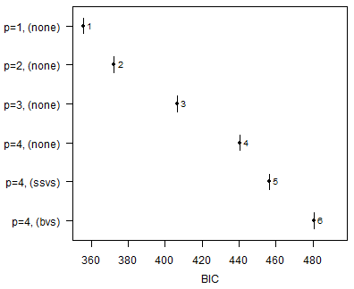
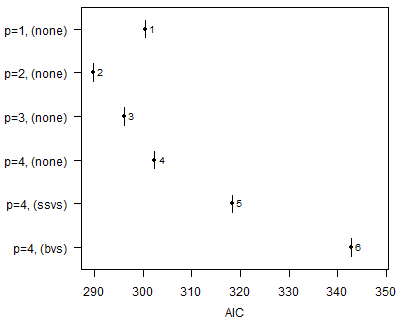
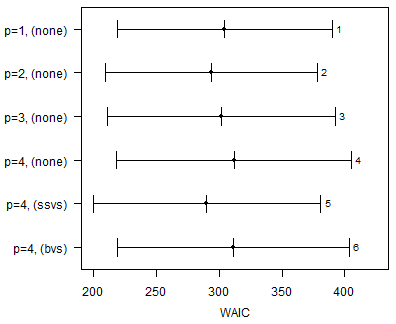
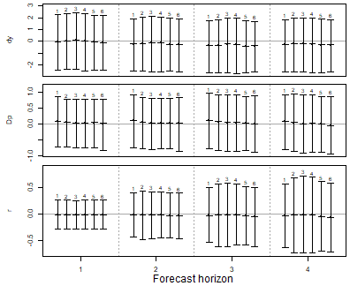
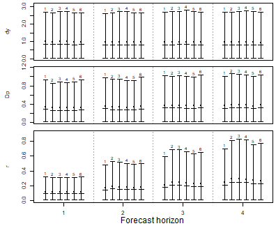
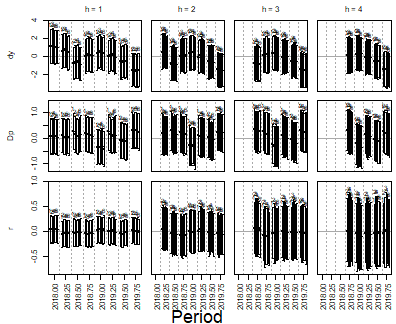
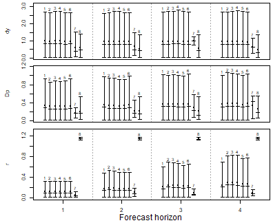

# Horse Races

``` r

library(bvartools)
```

## Introduction

In a horse race a set of competing models is estimated on the same data
and ranked by how well they forecast. The comparison is more convincing,
if it rests on forecasts that could actually have been made at the time.
Therefore, each model is estimated repeatedly over an expanding window:
the first window ends some periods before the end of the sample, each
further window adds one period, and every estimate forecasts the
periods, which follow the end of its window. The forecast errors of all
windows are then summarised by out-of-sample statistics, which are
complemented by the in-sample criteria of the vignette on model
comparison.

This vignette lets three specifications of a VAR model compete: models
with a weakly informative prior and lag orders from one to four, a model
with stochastic search variable selection (SSVS) and a model with
Bayesian variable selection (BVS). The last section shows how forecasts
from other sources can join the race.

## Workflow

The models compete on the growth rate of Austrian real GDP (`dy`),
inflation (`Dp`) and the short-term interest rate (`r`) from data set
`at_macrodata`, all in percent per quarter and up to 2019Q4, which
leaves out the quarters in which the pandemic moved output growth by ten
percent. Each model is estimated over an expanding window, whose first
estimation sample ends in 2017Q4.

``` r

data("at_macrodata")
at <- at_macrodata[["domestic"]]
data <- ts.intersect(dy = diff(at[, "y"]), Dp = at[, "Dp"], r = at[, "r"]) * 100
data <- window(data, end = c(2019, 4))

expanding_window_start <- 2018
```

### Producing candidate models

``` r

# Shared specifications
iterations <- 2000
burnin <- 1000

# Reset random number generator for reproducibility
set.seed(1234567)
```

First, create a series of traditional VAR models:

``` r

var_default <- create_bvarmodel(data,
                                p = 1:4,
                                deterministic = "const",
                                iterations = iterations,
                                burnin = burnin)

var_default <- use_expanding_window(var_default, start = expanding_window_start)

var_default <- add_priors(var_default,
                          coef = list(v_i = 1 / 10, v_i_det = 1 / 100),
                          sigma = list(df = 3, scale = 1))

var_default <- add_initial_values(var_default)
```

Second, create a series of VAR models with stochastic search variable
selection (SSVS):

``` r

var_ssvs <- create_bvarmodel(data,
                            p = 4,
                            varsel = "ssvs",
                            deterministic = "const",
                            iterations = iterations,
                            burnin = burnin)

var_ssvs <- use_expanding_window(var_ssvs, start = expanding_window_start)

var_ssvs <- add_priors(var_ssvs,
                          coef = list(v_i = 1 / 10, v_i_det = 1 / 100),
                          sigma = list(df = 3, scale = 1),
                          varsel = list(inprior = 0.5, tau = c(0.05, 10), exclude_det = TRUE))

var_ssvs <- add_initial_values(var_ssvs)
```

Third, create a series of VAR models with Bayesian variable selection à
la Korobilis (2013):

``` r

var_bvs <- create_bvarmodel(data,
                            p = 4,
                            varsel = "bvs",
                            deterministic = "const",
                            iterations = iterations,
                            burnin = burnin)

var_bvs <- use_expanding_window(var_bvs, start = expanding_window_start)

var_bvs <- add_priors(var_bvs,
                          coef = list(v_i = 1 / 10, v_i_det = 1 / 100),
                          sigma = list(df = 3, scale = 1),
                          varsel = list(inprior = 0.5, exclude_det = TRUE))

var_bvs <- add_initial_values(var_bvs)
```

Use `combine_models` to make one object:

``` r

models <- combine_models(var_default,
                         var_ssvs,
                         var_bvs)
```

### Draw posteriors

``` r

models <- add_posterior_coefficients(models)
```

### Forecasting

Forecasts are obtained in two steps. First, function
`add_forecast_input` generates the data of the forecast periods, where
deterministic terms can be provided in the argument `deterministic` and
unmodelled variables in the argument `exogen`. If they are not provided,
the function tries to obtain them from the model and gives a message, if
it does not succeed. Second, function `add_posterior_forecasts` then
simulates the forecasts.

``` r

models <- add_forecast_input(models, n_ahead = 4)
models <- add_posterior_forecasts(models)
```

Calculate forecast errors on which out-of-sample selection criteria will
be based:

``` r

models <- add_forecast_errors(models, test_sample = data)
```

### Evaluation

Use function `add_posterior_loglik` to add log-likelihoods, on which
in-sample selection criteria will be based:

``` r

models <- add_posterior_loglik(models)
```

Calculate in-sample and out-of-sample selection criteria:

``` r

sc <- selection_criteria(models)
```

Compare the selection criteria. For out-of-sample criteria, the first
model is used as a reference for comparison:

``` r

print(sc, relative = 1)
#> 
#> ------------------------------------------
#> In-sample
#> ------------------------------------------
#> 
#> Log-likelihood
#> 
#>            Mean Median Quantile (2.5%) Quantile (97.5%)
#>  Model 1 -141.4 -141.0          -151.2           -133.3
#>  Model 2 -131.4 -130.9          -143.0           -122.2
#>  Model 3 -130.0 -129.7          -142.7           -119.4
#>  Model 4 -128.8 -128.3          -143.2           -117.6
#>  Model 5 -128.8 -128.4          -141.5           -118.2
#>  Model 6 -140.4 -140.6          -152.5           -128.8
#> 
#> 
#> Akaike Information Criterion (AIC)
#> 
#>           Mean Median Quantile (2.5%) Quantile (97.5%)
#>  Model 1 300.5  300.5                                 
#>  Model 2 289.7  289.7                                 
#>  Model 3 296.1  296.1                                 
#>  Model 4 302.5  302.5                                 
#>  Model 5 318.4  318.4                                 
#>  Model 6 342.8  342.8                                 
#> 
#> 
#> Bayesian Information Criterion (BIC)
#> 
#>           Mean Median Quantile (2.5%) Quantile (97.5%)
#>  Model 1 355.6  355.6                                 
#>  Model 2 372.4  372.4                                 
#>  Model 3 406.4  406.4                                 
#>  Model 4 440.3  440.3                                 
#>  Model 5 456.2  456.2                                 
#>  Model 6 480.6  480.6                                 
#> 
#> 
#> Hannan-Quinn Criterion (HQ)
#> 
#>           Mean Median Quantile (2.5%) Quantile (97.5%)
#>  Model 1 322.9  322.9                                 
#>  Model 2 323.3  323.3                                 
#>  Model 3 340.9  340.9                                 
#>  Model 4 358.4  358.4                                 
#>  Model 5 374.3  374.3                                 
#>  Model 6 398.8  398.8                                 
#> 
#> 
#> Widely Applicable Information Criterion (WAIC)
#> 
#>           Mean Median Quantile (2.5%) Quantile (97.5%)
#>  Model 1 304.4  304.4           218.9            389.9
#>  Model 2 293.5  293.5           209.0            377.9
#>  Model 3 301.9  301.9           211.4            392.5
#>  Model 4 311.8  311.8           218.3            405.3
#>  Model 5 290.2  290.2           199.5            380.8
#>  Model 6 311.3  311.3           218.9            403.8
#> 
#> Periods with a pointwise log-likelihood variance above 0.4, which makes the correction of WAIC unreliable, in models 1 (10), 2 (17), 3 (23), 4 (28), 5 (17), 6 (16).
#> 
#> 
#> Leave-One-Out Information Criterion (LOOIC)
#> 
#>           Mean Median Quantile (2.5%) Quantile (97.5%)
#>  Model 1 304.9  304.9           219.1            390.8
#>  Model 2 294.0  294.0           209.3            378.7
#>  Model 3 302.9  302.9           212.2            393.6
#>  Model 4 313.4  313.4           220.0            406.9
#>  Model 5 290.8  290.8           199.9            381.8
#>  Model 6 312.0  312.0           219.1            404.8
#> 
#> Influential periods, whose importance sampling is unreliable, in models 1 (1), 3 (1), 4 (3), 5 (1), 6 (1), counted as a Pareto k above 0.7.
#> 
#> 
#> ------------------------------------------
#> Out-of-sample
#> ------------------------------------------
#> 
#> Mean absolute forecast errors (MAFE)
#> 
#>  Variable h Model 1 Model 2 Model 3 Model 4 Model 5 Model 6
#>        dy 1       1  0.9937  1.0185  1.0176  0.9812  0.9926
#>        Dp 1       1  0.9398  0.9488  0.9424  0.9456  0.9757
#>         r 1       1  0.9927  0.9902  0.9807  0.9793  0.9933
#>        dy 2       1  1.0207  1.0264  1.0275  1.0018  1.0012
#>        Dp 2       1  0.9437  0.9385  0.9285  0.9339  0.9842
#>         r 2       1  1.0967  1.0648  1.0513  1.0238  1.0334
#>        dy 3       1  1.0055  1.0165  1.0247  1.0175  0.9930
#>        Dp 3       1  1.0051  1.0001  0.9838  0.9698  1.0013
#>         r 3       1  1.1615  1.1503  1.1115  1.0678  1.0905
#>        dy 4       1  0.9994  1.0101  1.0326  0.9989  0.9868
#>        Dp 4       1  1.0297  1.0438  1.0320  0.9725  1.0359
#>         r 4       1  1.2000  1.2151  1.1743  1.1063  1.0944
#> 
#> 
#> Root mean squared forecast errors (RMSFE)
#> 
#>  Variable h Model 1 Model 2 Model 3 Model 4 Model 5 Model 6
#>        dy 1       1  0.9894  1.0137  1.0173  0.9826  0.9900
#>        Dp 1       1  0.9399  0.9540  0.9475  0.9493  0.9848
#>         r 1       1  0.9862  0.9848  0.9801  0.9761  0.9902
#>        dy 2       1  1.0194  1.0298  1.0312  1.0053  1.0039
#>        Dp 2       1  0.9502  0.9444  0.9346  0.9379  0.9917
#>         r 2       1  1.0980  1.0686  1.0474  1.0192  1.0328
#>        dy 3       1  1.0063  1.0177  1.0257  1.0141  0.9944
#>        Dp 3       1  1.0022  1.0000  0.9874  0.9684  1.0026
#>         r 3       1  1.1636  1.1544  1.1127  1.0641  1.0923
#>        dy 4       1  0.9978  1.0097  1.0320  0.9990  0.9915
#>        Dp 4       1  1.0344  1.0461  1.0311  0.9811  1.0398
#>         r 4       1  1.1970  1.2152  1.1781  1.1056  1.1006
```

#### In-sample plots

``` r

plot(sc, criterion = "BIC")
```



plot of chunk bic

``` r

plot(sc, criterion = "AIC")
```



plot of chunk aic

AIC and BIC penalise a model by the number of parameters it nominally
has, which is the same number for the three models with four lags:
variable selection does not remove a coefficient from the model, it
shrinks it towards zero, and how much of the nominal freedom that leaves
is decided by the data rather than by the count. WAIC penalises by the
flexibility the fit actually used and is the criterion to compare such
models with.

``` r

plot(sc, criterion = "WAIC")
```



plot of chunk waic

#### Out-of-sample plots

``` r

plot(sc, criterion = "FE")
```



plot of chunk fe

``` r

plot(sc, criterion = "AFE")
```



plot of chunk afe

``` r

plot_forecast_errors_by_period(models, criterion = "FE")
```



plot of chunk fe-by-period

## Pooling forecasts

No single specification forecasts best in every period, because the
errors of different models are not perfectly correlated. A pool of
forecasts exploits this: it is the mixture of the predictive
distributions of its members, and combining forecasts in this way is one
of the most reliable ways of improving them. Function `pool_forecasts`
forms the equal-weight pool from the draws the models already hold,
taking the same number of draws from each member, and matches the
windows of the members by the end of their estimation samples, so that
every pooled forecast combines forecasts made with the same information.
Here it pools all six models of the race:

``` r

set.seed(1234567)
pool <- pool_forecasts(models)
pool
#> Pooled forecasts, equal weights
#> 
#> Members: Model 1, Model 2, Model 3, Model 4, Model 5, Model 6
#> Variables: dy, Dp, r
#> Forecast horizon: 4
#> Draws per member: 2000
#> Forecasts: 9, from estimation samples ending in 2017Q4 to 2019Q4
```

The pool is scored and ranked like the models. Function `combine_models`
adds it to the list of models, where the functions that estimate a model
leave it unchanged:

``` r

models_and_pool <- combine_models(models, pool)
models_and_pool <- add_forecast_errors(models_and_pool, test_sample = data)
sc_pool <- selection_criteria(models_and_pool)
print(sc_pool, relative = 1)
#> 
#> ------------------------------------------
#> In-sample
#> ------------------------------------------
#> 
#> Log-likelihood
#> 
#>            Mean Median Quantile (2.5%) Quantile (97.5%)
#>  Model 1 -141.4 -141.0          -151.2           -133.3
#>  Model 2 -131.4 -130.9          -143.0           -122.2
#>  Model 3 -130.0 -129.7          -142.7           -119.4
#>  Model 4 -128.8 -128.3          -143.2           -117.6
#>  Model 5 -128.8 -128.4          -141.5           -118.2
#>  Model 6 -140.4 -140.6          -152.5           -128.8
#>  Model 7                                               
#> 
#> 
#> Akaike Information Criterion (AIC)
#> 
#>           Mean Median Quantile (2.5%) Quantile (97.5%)
#>  Model 1 300.5  300.5                                 
#>  Model 2 289.7  289.7                                 
#>  Model 3 296.1  296.1                                 
#>  Model 4 302.5  302.5                                 
#>  Model 5 318.4  318.4                                 
#>  Model 6 342.8  342.8                                 
#>  Model 7                                              
#> 
#> 
#> Bayesian Information Criterion (BIC)
#> 
#>           Mean Median Quantile (2.5%) Quantile (97.5%)
#>  Model 1 355.6  355.6                                 
#>  Model 2 372.4  372.4                                 
#>  Model 3 406.4  406.4                                 
#>  Model 4 440.3  440.3                                 
#>  Model 5 456.2  456.2                                 
#>  Model 6 480.6  480.6                                 
#>  Model 7                                              
#> 
#> 
#> Hannan-Quinn Criterion (HQ)
#> 
#>           Mean Median Quantile (2.5%) Quantile (97.5%)
#>  Model 1 322.9  322.9                                 
#>  Model 2 323.3  323.3                                 
#>  Model 3 340.9  340.9                                 
#>  Model 4 358.4  358.4                                 
#>  Model 5 374.3  374.3                                 
#>  Model 6 398.8  398.8                                 
#>  Model 7                                              
#> 
#> 
#> Widely Applicable Information Criterion (WAIC)
#> 
#>           Mean Median Quantile (2.5%) Quantile (97.5%)
#>  Model 1 304.4  304.4           218.9            389.9
#>  Model 2 293.5  293.5           209.0            377.9
#>  Model 3 301.9  301.9           211.4            392.5
#>  Model 4 311.8  311.8           218.3            405.3
#>  Model 5 290.2  290.2           199.5            380.8
#>  Model 6 311.3  311.3           218.9            403.8
#>  Model 7                                              
#> 
#> Periods with a pointwise log-likelihood variance above 0.4, which makes the correction of WAIC unreliable, in models 1 (10), 2 (17), 3 (23), 4 (28), 5 (17), 6 (16).
#> 
#> 
#> Leave-One-Out Information Criterion (LOOIC)
#> 
#>           Mean Median Quantile (2.5%) Quantile (97.5%)
#>  Model 1 304.9  304.9           219.1            390.8
#>  Model 2 294.0  294.0           209.3            378.7
#>  Model 3 302.9  302.9           212.2            393.6
#>  Model 4 313.4  313.4           220.0            406.9
#>  Model 5 290.8  290.8           199.9            381.8
#>  Model 6 312.0  312.0           219.1            404.8
#>  Model 7                                              
#> 
#> Influential periods, whose importance sampling is unreliable, in models 1 (1), 3 (1), 4 (3), 5 (1), 6 (1), counted as a Pareto k above 0.7.
#> 
#> 
#> ------------------------------------------
#> Out-of-sample
#> ------------------------------------------
#> 
#> Mean absolute forecast errors (MAFE)
#> 
#>  Variable h Model 1 Model 2 Model 3 Model 4 Model 5 Model 6 Model 7
#>        dy 1       1  0.9937  1.0185  1.0176  0.9812  0.9926  1.0006
#>        Dp 1       1  0.9398  0.9488  0.9424  0.9456  0.9757  0.9587
#>         r 1       1  0.9927  0.9902  0.9807  0.9793  0.9933  0.9894
#>        dy 2       1  1.0207  1.0264  1.0275  1.0018  1.0012  1.0129
#>        Dp 2       1  0.9437  0.9385  0.9285  0.9339  0.9842  0.9548
#>         r 2       1  1.0967  1.0648  1.0513  1.0238  1.0334  1.0450
#>        dy 3       1  1.0055  1.0165  1.0247  1.0175  0.9930  1.0095
#>        Dp 3       1  1.0051  1.0001  0.9838  0.9698  1.0013  0.9934
#>         r 3       1  1.1615  1.1503  1.1115  1.0678  1.0905  1.0969
#>        dy 4       1  0.9994  1.0101  1.0326  0.9989  0.9868  1.0047
#>        Dp 4       1  1.0297  1.0438  1.0320  0.9725  1.0359  1.0190
#>         r 4       1  1.2000  1.2151  1.1743  1.1063  1.0944  1.1317
#> 
#> 
#> Root mean squared forecast errors (RMSFE)
#> 
#>  Variable h Model 1 Model 2 Model 3 Model 4 Model 5 Model 6 Model 7
#>        dy 1       1  0.9894  1.0137  1.0173  0.9826  0.9900  0.9989
#>        Dp 1       1  0.9399  0.9540  0.9475  0.9493  0.9848  0.9628
#>         r 1       1  0.9862  0.9848  0.9801  0.9761  0.9902  0.9863
#>        dy 2       1  1.0194  1.0298  1.0312  1.0053  1.0039  1.0150
#>        Dp 2       1  0.9502  0.9444  0.9346  0.9379  0.9917  0.9602
#>         r 2       1  1.0980  1.0686  1.0474  1.0192  1.0328  1.0448
#>        dy 3       1  1.0063  1.0177  1.0257  1.0141  0.9944  1.0098
#>        Dp 3       1  1.0022  1.0000  0.9874  0.9684  1.0026  0.9935
#>         r 3       1  1.1636  1.1544  1.1127  1.0641  1.0923  1.0992
#>        dy 4       1  0.9978  1.0097  1.0320  0.9990  0.9915  1.0051
#>        Dp 4       1  1.0344  1.0461  1.0311  0.9811  1.0398  1.0223
#>         r 4       1  1.1970  1.2152  1.1781  1.1056  1.1006  1.1351
```

The pool is the last model of the list. It was not estimated, so it has
no in-sample criteria. Over these nine forecasts it lands in the middle
of the field in most columns: it seldom beats the best model of a
column, but neither does it share the largest errors, and over a longer
race that robustness is what makes pools hard to beat. A pool is only as
honest as the choice of its members: members chosen because they scored
well over the same periods the pool is judged on flatter the pool with
information it would not have had.

## Adding forecasts from other sources

A horse race becomes more informative, if the models do not only compete
with each other, but also with the forecasts that institutions actually
published. Function `create_external_forecast` turns such forecasts into
an object, which can be added to the list of models and which is then
treated as one more competitor by all the functions above.

Published forecasts can be taken from any source, as long as they are
provided in long format with one point forecast per row. To keep this
vignette self-contained, the following example uses two made-up
forecasters instead. Each of them publishes a forecast for the current
and the following three quarters at the beginning of every quarter from
2018Q1 to 2019Q4. Forecaster A is well informed: its forecasts are the
realised values plus noise, which increases with the forecast horizon.
Forecaster B always forecasts the mean of the series up to 2017Q4.
Neither of them says anything about the performance of real forecasters.

``` r

fcst <- expand.grid(origin = seq(2018, 2019.75, by = 0.25),
                    h = 1:4,
                    variable = colnames(data),
                    forecaster = c("Forecaster A", "Forecaster B"),
                    stringsAsFactors = FALSE)

# Period, for which a forecast is made, as in time(data)
fcst[["period"]] <- fcst[["origin"]] + (fcst[["h"]] - 1) / 4

# Only periods with realised values can be evaluated
fcst <- fcst[fcst[["period"]] <= 2019.75, ]

# Realised values of each forecasted period
realised <- data[cbind(match(round(fcst[["period"]] * 4), round(time(data) * 4)),
                       match(fcst[["variable"]], colnames(data)))]

# Sample before the first publication
before <- window(data, end = c(2017, 4))

noise <- rnorm(nrow(fcst),
               sd = 0.5 * sqrt(fcst[["h"]]) *
                 apply(diff(before), 2, sd)[fcst[["variable"]]])

fcst[["value"]] <- ifelse(fcst[["forecaster"]] == "Forecaster A",
                          realised + noise,
                          colMeans(before)[fcst[["variable"]]])

head(fcst)
#>    origin h variable   forecaster  period     value
#> 1 2018.00 1       dy Forecaster A 2018.00 1.6726137
#> 2 2018.25 1       dy Forecaster A 2018.25 1.3672011
#> 3 2018.50 1       dy Forecaster A 2018.50 1.3653565
#> 4 2018.75 1       dy Forecaster A 2018.75 0.3355216
#> 5 2019.00 1       dy Forecaster A 2019.00 1.2110604
#> 6 2019.25 1       dy Forecaster A 2019.25 0.4161256
```

The columns of the data set do not have to follow a particular naming
convention. They are specified in the arguments `period`, `origin`,
`variable` and `value`, where `origin` contains the date, at which a
forecast was published, and periods follow the convention of `time`,
i.e. 2018.25 for the second quarter of 2018. The names in column
`variable` must be those of the endogenous variables of the models.
Argument `by` produces one object per forecaster:

``` r

external <- create_external_forecast(fcst, models,
                                     period = "period",
                                     origin = "origin",
                                     variable = "variable",
                                     value = "value",
                                     by = "forecaster",
                                     data_lag = 1)
```

A forecaster, which publishes a forecast in the first quarter of 2018,
does not know the value of that quarter yet and, since data are
published with a delay, not even that of 2017Q4 in most cases. Argument
`data_lag` states this publication lag of the data in periods, so that
each forecast is matched to the estimation window, which ends in 2017Q4.
The forecast for 2018Q1 is then the one-step ahead forecast of both the
forecaster and the models. If a forecaster published multiple forecasts
between two data releases, only one of them is used, the latest by
default, so that no forecaster enters the comparison twice.

From here on the external forecasts follow the workflow of the models.
The functions, which add priors, initial values or posterior draws, are
without effect for them:

``` r

all_models <- combine_models(models, external)

all_models <- add_forecast_errors(all_models, test_sample = data)

sc_all <- selection_criteria(all_models)

print(sc_all, relative = 1)
#> 
#> ------------------------------------------
#> In-sample
#> ------------------------------------------
#> 
#> Log-likelihood
#> 
#>            Mean Median Quantile (2.5%) Quantile (97.5%)
#>  Model 1 -141.4 -141.0          -151.2           -133.3
#>  Model 2 -131.4 -130.9          -143.0           -122.2
#>  Model 3 -130.0 -129.7          -142.7           -119.4
#>  Model 4 -128.8 -128.3          -143.2           -117.6
#>  Model 5 -128.8 -128.4          -141.5           -118.2
#>  Model 6 -140.4 -140.6          -152.5           -128.8
#>  Model 7                                               
#>  Model 8                                               
#> 
#> 
#> Akaike Information Criterion (AIC)
#> 
#>           Mean Median Quantile (2.5%) Quantile (97.5%)
#>  Model 1 300.5  300.5                                 
#>  Model 2 289.7  289.7                                 
#>  Model 3 296.1  296.1                                 
#>  Model 4 302.5  302.5                                 
#>  Model 5 318.4  318.4                                 
#>  Model 6 342.8  342.8                                 
#>  Model 7                                              
#>  Model 8                                              
#> 
#> 
#> Bayesian Information Criterion (BIC)
#> 
#>           Mean Median Quantile (2.5%) Quantile (97.5%)
#>  Model 1 355.6  355.6                                 
#>  Model 2 372.4  372.4                                 
#>  Model 3 406.4  406.4                                 
#>  Model 4 440.3  440.3                                 
#>  Model 5 456.2  456.2                                 
#>  Model 6 480.6  480.6                                 
#>  Model 7                                              
#>  Model 8                                              
#> 
#> 
#> Hannan-Quinn Criterion (HQ)
#> 
#>           Mean Median Quantile (2.5%) Quantile (97.5%)
#>  Model 1 322.9  322.9                                 
#>  Model 2 323.3  323.3                                 
#>  Model 3 340.9  340.9                                 
#>  Model 4 358.4  358.4                                 
#>  Model 5 374.3  374.3                                 
#>  Model 6 398.8  398.8                                 
#>  Model 7                                              
#>  Model 8                                              
#> 
#> 
#> Widely Applicable Information Criterion (WAIC)
#> 
#>           Mean Median Quantile (2.5%) Quantile (97.5%)
#>  Model 1 304.4  304.4           218.9            389.9
#>  Model 2 293.5  293.5           209.0            377.9
#>  Model 3 301.9  301.9           211.4            392.5
#>  Model 4 311.8  311.8           218.3            405.3
#>  Model 5 290.2  290.2           199.5            380.8
#>  Model 6 311.3  311.3           218.9            403.8
#>  Model 7                                              
#>  Model 8                                              
#> 
#> Periods with a pointwise log-likelihood variance above 0.4, which makes the correction of WAIC unreliable, in models 1 (10), 2 (17), 3 (23), 4 (28), 5 (17), 6 (16).
#> 
#> 
#> Leave-One-Out Information Criterion (LOOIC)
#> 
#>           Mean Median Quantile (2.5%) Quantile (97.5%)
#>  Model 1 304.9  304.9           219.1            390.8
#>  Model 2 294.0  294.0           209.3            378.7
#>  Model 3 302.9  302.9           212.2            393.6
#>  Model 4 313.4  313.4           220.0            406.9
#>  Model 5 290.8  290.8           199.9            381.8
#>  Model 6 312.0  312.0           219.1            404.8
#>  Model 7                                              
#>  Model 8                                              
#> 
#> Influential periods, whose importance sampling is unreliable, in models 1 (1), 3 (1), 4 (3), 5 (1), 6 (1), counted as a Pareto k above 0.7.
#> 
#> 
#> ------------------------------------------
#> Out-of-sample
#> ------------------------------------------
#> 
#> Mean absolute forecast errors (MAFE)
#> 
#>  Variable h Model 1 Model 2 Model 3 Model 4 Model 5 Model 6 Model 7 Model 8
#>        dy 1       1  0.9937  1.0185  1.0176  0.9812  0.9926  0.5870  0.6042
#>        Dp 1       1  0.9398  0.9488  0.9424  0.9456  0.9757  0.5202  0.6144
#>         r 1       1  0.9927  0.9902  0.9807  0.9793  0.9933  0.4397 10.1737
#>        dy 2       1  1.0207  1.0264  1.0275  1.0018  1.0012  0.7027  0.5601
#>        Dp 2       1  0.9437  0.9385  0.9285  0.9339  0.9842  0.5839  0.5857
#>         r 2       1  1.0967  1.0648  1.0513  1.0238  1.0334  0.5862  6.7976
#>        dy 3       1  1.0055  1.0165  1.0247  1.0175  0.9930  1.0504  0.5657
#>        Dp 3       1  1.0051  1.0001  0.9838  0.9698  1.0013  0.8012  0.5798
#>         r 3       1  1.1615  1.1503  1.1115  1.0678  1.0905  0.4087  5.4600
#>        dy 4       1  0.9994  1.0101  1.0326  0.9989  0.9868  0.6789  0.5155
#>        Dp 4       1  1.0297  1.0438  1.0320  0.9725  1.0359  0.9226  0.6909
#>         r 4       1  1.2000  1.2151  1.1743  1.1063  1.0944  0.3536  4.6988
#> 
#> 
#> Root mean squared forecast errors (RMSFE)
#> 
#>  Variable h Model 1 Model 2 Model 3 Model 4 Model 5 Model 6 Model 7 Model 8
#>        dy 1       1  0.9894  1.0137  1.0173  0.9826  0.9900  0.6228  0.6091
#>        Dp 1       1  0.9399  0.9540  0.9475  0.9493  0.9848  0.4585  0.6407
#>         r 1       1  0.9862  0.9848  0.9801  0.9761  0.9902  0.4371  8.0756
#>        dy 2       1  1.0194  1.0298  1.0312  1.0053  1.0039  0.7018  0.5876
#>        Dp 2       1  0.9502  0.9444  0.9346  0.9379  0.9917  0.5588  0.6256
#>         r 2       1  1.0980  1.0686  1.0474  1.0192  1.0328  0.5364  5.4044
#>        dy 3       1  1.0063  1.0177  1.0257  1.0141  0.9944  0.8490  0.6047
#>        Dp 3       1  1.0022  1.0000  0.9874  0.9684  1.0026  0.8073  0.6288
#>         r 3       1  1.1636  1.1544  1.1127  1.0641  1.0923  0.3733  4.3417
#>        dy 4       1  0.9978  1.0097  1.0320  0.9990  0.9915  0.6128  0.5943
#>        Dp 4       1  1.0344  1.0461  1.0311  0.9811  1.0398  0.8559  0.6988
#>         r 4       1  1.1970  1.2152  1.1781  1.1056  1.1006  0.3197  3.7383
```

The two forecasters are the last two models of the list. Since external
forecasts are point forecasts, each publication contributes a single
value to the out-of-sample statistics instead of a full posterior.
Accordingly, their credible bands are degenerate and in-sample criteria
are not available for them, which the printed comparison and the plots
indicate by an empty entry.

`vignette("macroprojections", package = "bvartools")` races models
against projections that institutions actually published. Those are
annual, and it shows how the quarterly forecast draws of a model are
aggregated to annual figures before they are compared.

``` r

plot(sc_all, criterion = "AFE")
```



plot of chunk external-afe

## Citing bvartools

If you use `bvartools` in published work, please cite it.
`citation("bvartools")` prints the reference, and the package has the
DOI [10.5281/zenodo.22736604](https://doi.org/10.5281/zenodo.22736604),
which always resolves to the latest archived version.

## References

Korobilis, D. (2013). VAR forecasting using Bayesian variable selection.
*Journal of Applied Econometrics, 28*(2), 204-230.
<https://doi.org/10.1002/jae.1271>
