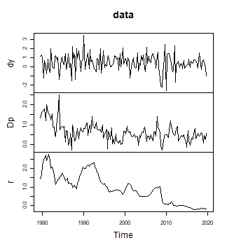

# Minnesota Prior

## Introduction

For the vector autoregressive (VAR) model

``` math
 y_t = A_1 y_{t - 1} + ... + A_p y_{t - p}  + u_t
```

the Minnesota prior reflects a belief that own lags of an endogenous
variable in coefficient matrix $`A`$ are more likely to be important
explanatory variables than other lags. Moreover, more recent lags are
likely to be more important than those in the more distant past. In a
Bayesian VAR model, this is reflected in the prior covariance matrix of
the model’s coefficients, where a small variance indicates a belief that
the coefficient is not important. Mathematically, the Minnesota prior
can be expressed by the following way: For the endogenous variable $`i`$
the prior variance of the $`l`$th lag of regressor $`j`$ is obtained as

``` math
 \frac{\kappa_{1}}{l^2} \textrm{ for own lags of endogenous variables,}
```
``` math
 \frac{\kappa_{1} \kappa_{2}}{l^2} \frac{\sigma_{i}^2}{\sigma_{j}^2} \textrm{ for endogenous variables other than own lags,}
```

``` math
 \frac{\kappa_{1} \kappa_{3}}{(l+1)^2} \frac{\sigma_{i}^2}{\sigma_{j}^2} \textrm{ for unmodelled exogenous variables,} 
```
``` math
 \kappa_{1} \kappa_{4} \sigma_{i}^2 \textrm{ for deterministic terms,} 
```
where $`\sigma_{i}`$ is the residual standard deviation of variable
$`i`$ of an unrestricted LS estimate. For exogenous variables
$`\sigma_{i}`$ is the sample standard deviation. If the model does not
contain exogenous variables, argument `kappa3` will be ignored.

This vignette illustrates how to use the `bvartools` package to work
with the Minnesota prior along the lines of exercise 20.2 in Chan et
al. (2019). It uses data set `at_macrodata`, which contains quarterly
macroeconomic series of Austria, and takes from it the growth rate of
real GDP (`dy`), inflation (`Dp`) and the short-term interest rate
(`r`), all in percent per quarter and up to 2019Q4, which leaves out the
quarters in which the pandemic moved output growth by ten percent.

``` r

library(bvartools)

# Load data
data("at_macrodata")
at <- at_macrodata[["domestic"]]
data <- ts.intersect(dy = diff(at[, "y"]), Dp = at[, "Dp"], r = at[, "r"]) * 100
data <- window(data, end = c(2019, 4))

# Plot the series
plot(data)
```



plot of chunk data

## Workflow for VAR models

### Create a model

The `create_bvarmodel` function produces an object, which contains
information on the specification of the VAR model that should be
estimated. The following code specifies a VAR(1) model with an intercept
term. The number of iterations and burn-in draws is already specified at
this stage.

``` r

model <- create_bvarmodel(data, p = 1, deterministic = "const",
                          iterations = 5000, burnin = 1000)
```

### Adding model priors

#### Direct approach

Minnesota priors can be obtained with function `minnesota_prior`.

``` r

minn <- minnesota_prior(
  model,
  kappa1 = 0.5,
  kappa2 = 0.5,
  kappa3 = NULL,
  kappa4 = 200,
  max_var = NULL,
  coint_var = FALSE,
  sigma = "AR"
)
```

To check the output of the function, access element `mu`, i.e. the prior
coefficient means of matrix $`A`$:

``` r

matrix(minn[["mu"]], 3)
#>      [,1] [,2] [,3] [,4]
#> [1,]    0    0    0    0
#> [2,]    0    0    0    0
#> [3,]    0    0    0    0
```

Also check the corresponding prior coefficient variances:

``` r

matrix(1 / diag(minn[["v_inv"]]), 3)
#>             [,1]       [,2]      [,3]      [,4]
#> [1,] 0.500000000 1.69592115 13.527998 86.222971
#> [2,] 0.036853129 0.50000000  1.994196 12.710345
#> [3,] 0.004620048 0.03134095  0.500000  1.593417
```

#### Using `add_priors`

Function `add_priors` produces priors for the specified model(s) in
object `model` and augments the object accordingly.

``` r

model <- add_priors(model,
                    coef = list(minnesota = list(kappa1 = 0.5, kappa2 = 0.5, kappa3 = NULL, kappa4 = 200)),
                    sigma = list(df = 1, scale = .0001))
```

### Adding initial values

Function `add_initial_values` adds initial values of posterior
coefficients. The default behaviour of the function is to obtain an LS
estimate of the coefficients.

``` r

model <- add_initial_values(model, method = "ols")
```

### Obtaining posterior draws

``` r

# Reset random number generator for reproducibility
set.seed(1234567)

iterations <- 10000 # Number of saved iterations of the Gibbs sampler
burnin <- 5000 # Number of burn-in draws
draws <- iterations + burnin # Total number of MCMC draws

y <- t(model[["data"]][["train"]][["y"]])
x <- t(model[["data"]][["train"]][["x"]])

tt <- ncol(y) # Number of observations
k <- nrow(y) # Number of endogenous variables
m <- k * nrow(x) # Number of estimated coefficients

# Coefficient priors
a_mu_prior <- model[["priors"]][["a"]][["mu"]] # Vector of prior parameter means
a_v_i_prior <- model[["priors"]][["a"]][["v_inv"]] # Inverse of the prior covariance matrix

# Use the error variance estimates from minnesota_prior
u_sigma_i <- minn[["sigma_inv"]]
u_sigma <- solve(u_sigma_i)

# Data containers for posterior draws
draws_a <- matrix(NA, m, iterations)
draws_sigma <- matrix(NA, k^2, iterations)

# Start Gibbs sampler
for (draw in 1:draws) {
  # Draw conditional mean parameters
  a <- post_normal(y, x, u_sigma_i, a_mu_prior, a_v_i_prior)
  
  # Store draws
  if (draw > burnin) {
    draws_a[, draw - burnin] <- a
    draws_sigma[, draw - burnin] <- u_sigma
  }
}
```

Collect the results in a new `bvarmodel` object using `bvar`.

``` r

result <- bvar(y = model[["data"]][["train"]][["y"]],
               x = model[["data"]][["train"]][["x"]],
               A = draws_a[1:9,],
               C = draws_a[10:12, ],
               Sigma = draws_sigma)
```

Look at the summary statistics, which are practically the same as in
example 20.3 in Chan et al. (2019).

``` r

summary(result)
#> 
#> Bayesian VAR model with p = 1 
#> 
#> Endogenous variables: dy, Dp, r
#> 
#> Variable: dy 
#> 
#>              Mean         SD     Naive SD Time-series SD       2.5%         50%
#> dy.l1 -0.05763831 0.07984344 0.0007984344   0.0007984344 -0.2173037 -0.05587954
#> Dp.l1 -0.15101396 0.20068202 0.0020068202   0.0020398831 -0.5398237 -0.15327508
#> r.l1   0.06146476 0.11474281 0.0011474281   0.0011474281 -0.1633870  0.06150310
#> const  0.54960107 0.13535547 0.0013535547   0.0013535547  0.2792208  0.55161855
#>            97.5%  
#> dy.l1 0.09616976  
#> Dp.l1 0.23934329  
#> r.l1  0.28662474  
#> const 0.81593282 *
#> 
#> Variable: Dp 
#> 
#>             Mean         SD     Naive SD Time-series SD        2.5%        50%
#> dy.l1 0.03037819 0.03017892 0.0003017892   0.0003017892 -0.02910958 0.03055016
#> Dp.l1 0.42147632 0.07751895 0.0007751895   0.0007751895  0.26652839 0.42161616
#> r.l1  0.16525958 0.04406617 0.0004406617   0.0004406617  0.07918762 0.16562901
#> const 0.18596442 0.05214480 0.0005214480   0.0005214480  0.08519452 0.18569175
#>            97.5%  
#> dy.l1 0.08953386  
#> Dp.l1 0.57334607 *
#> r.l1  0.25071585 *
#> const 0.28754472 *
#> 
#> Variable: r 
#> 
#>              Mean         SD     Naive SD Time-series SD        2.5%
#> dy.l1  0.04608170 0.01051663 0.0001051663   0.0001051663  0.02569123
#> Dp.l1  0.09862443 0.02720400 0.0002720400   0.0002720400  0.04505687
#> r.l1   0.95823096 0.01569508 0.0001569508   0.0001569508  0.92789816
#> const -0.05516448 0.01854943 0.0001854943   0.0001811623 -0.09164759
#>               50%       97.5%  
#> dy.l1  0.04612159  0.06666502 *
#> Dp.l1  0.09860562  0.15172543 *
#> r.l1   0.95796597  0.98870707 *
#> const -0.05513727 -0.01848947 *
#> 
#> Variance-covariance matrix:
#> 
#>             Mean SD Naive SD Time-series SD       2.5%        50%      97.5%  
#> dy_dy 0.86222971  0        0              0 0.86222971 0.86222971 0.86222971 *
#> dy_Dp 0.00000000  0        0              0 0.00000000 0.00000000 0.00000000  
#> dy_r  0.00000000  0        0              0 0.00000000 0.00000000 0.00000000  
#> Dp_Dp 0.12710345  0        0              0 0.12710345 0.12710345 0.12710345 *
#> Dp_r  0.00000000  0        0              0 0.00000000 0.00000000 0.00000000  
#> r_r   0.01593417  0        0              0 0.01593417 0.01593417 0.01593417 *
```

## Citing bvartools

If you use `bvartools` in published work, please cite it.
`citation("bvartools")` prints the reference, and the package has the
DOI [10.5281/zenodo.22736604](https://doi.org/10.5281/zenodo.22736604),
which always resolves to the latest archived version.

## References

Chan, J., Koop, G., Poirier, D. J., & Tobias, J. L. (2019). *Bayesian
Econometric Methods* (2nd ed.). Cambridge: University Press.
