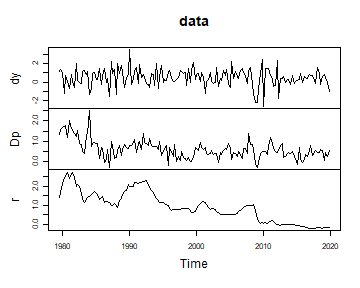
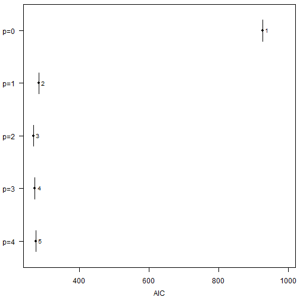
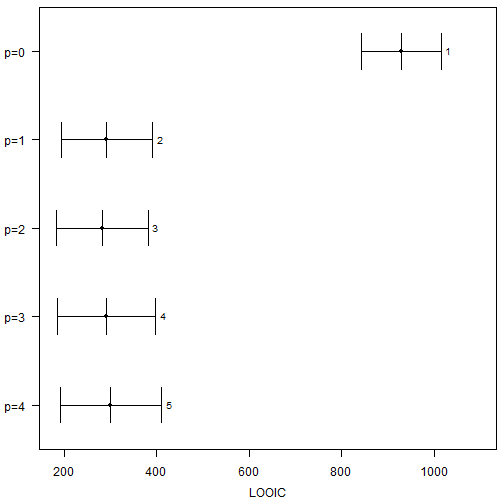
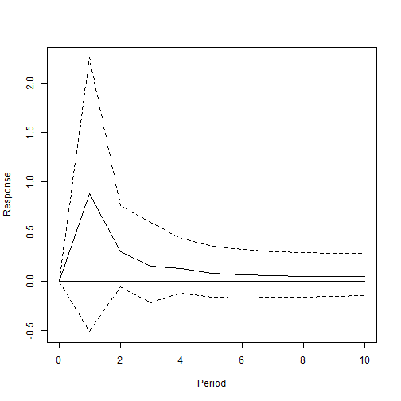

# Model Comparison in bvartools

`bvartools` comes with the functionality to set up and produce posterior
draws for multiple models in an effort to reduce the time required for
this potentially laborious process. This vignette illustrates how the
package can be used to set up multiple models, produce prior
specifications, add initial values, obtain posterior draws and select
the model with the best fit in a few steps.

## Data

For this illustration data set `at_macrodata` is used, which contains
quarterly macroeconomic series of Austria. From its element `domestic`,
which holds the domestic series, the growth rate of real GDP (`dy`),
inflation (`Dp`) and the short-term interest rate (`r`) are taken, all
in percent per quarter. The sample ends in 2019Q4, because output growth
moved by ten percent within a quarter in 2020, which would dominate
models with a constant error variance.

``` r

library(bvartools)

set.seed(123456) # Set seed for reproducibility

data("at_macrodata") # Load data
at <- at_macrodata[["domestic"]]

# Output growth, inflation and the short-term interest rate in percent
data <- ts.intersect(dy = diff(at[, "y"]), Dp = at[, "Dp"], r = at[, "r"]) * 100

# Use data up to 2019Q4
data <- window(data, end = c(2019, 4))

# Plot
plot(data)
```



plot of chunk data

## Set up models

Functions `create_bvarmodel` can be used to obtain a list of different
model specifications. In the following example five models with an
intercept and increasing lag orders are generated.

``` r

models <- create_bvarmodel(data, p = 0:4,
                           deterministic = "const",
                           iterations = 5000, burnin = 1000)
```

All objects use the same amounts of available observations to ensure
consistency for the calculation of information criteria for model
selection.

## Priors

Function `add_priors` can be used to produce priors for each of the
models in object `models`.

``` r

models <- add_priors(models,
                     coef = list(v_i = 0, v_i_det = 0),
                     sigma = list(df = "k", scale = 0.0001))
```

## Initial values

Function `add_initial_values` can be used to generate initial values of
the Gibbs sampler for each of the models in object `models`.

``` r

models <- add_initial_values(models)
```

## Posterior simulation

Posterior draws can be obtained using function
`add_posterior_coefficients`.

``` r

models <- add_posterior_coefficients(models)
```

## Model selection

``` r

models <- add_posterior_loglik(models)
```

If function `selection_criteria` is applied to an object of class
`modellist`, it produces an object of class `selcritlist`. Its elements
are of class `selcrit` and contain the log-likelihood and the selection
criteria of the respective model, which are calculated from its
posterior draws in the following way:

- *Log-likelihood*:
  $`LL^{(i)} = \sum_{t = 1}^{T} \left( -\frac{K}{2} \ln 2\pi - \frac{1}{2} \ln |\Sigma_t^{(i)}| - \frac{1}{2} u_t^{{(i)}\prime} (\Sigma_t^{(i)})^{-1} u_t^{(i)} \right)`$
  for each draw $`i`$ and $`u_t = y_t - \mu_t`$, which is summarised by
  the mean, the median and the credible band of its draws;
- *Akaike information criterion*: $`AIC = D + 2 \kappa`$;
- *Bayesian information criterion*: $`BIC = D + \ln(T) \kappa`$;
- *Hannan-Quinn information criterion*:
  $`HQ = D + 2 \ln(\ln(T)) \kappa`$;
- *Widely applicable information criterion*:
  $`WAIC = -2 \sum_{t = 1}^{T} \left( \ln \left( \frac{1}{R} \sum_{i = 1}^{R} \exp(ll_t^{(i)}) \right) - \mathrm{Var}_i \left[ ll_t^{(i)} \right] \right)`$,
  where $`ll_t^{(i)}`$ is the log-likelihood of period $`t`$ in draw
  $`i`$;
- *Leave-one-out information criterion*:
  $`LOOIC = -2 \sum_{t = 1}^{T} \ln \left( \frac{\sum_{i = 1}^{R} w_t^{(i)} \exp(ll_t^{(i)})}{\sum_{i = 1}^{R} w_t^{(i)}} \right)`$,
  where the weights $`w_t^{(i)}`$ reweight the posterior towards the one
  that has not seen period $`t`$.

The number of estimated parameters is

``` math
\kappa = K \left(K p + M (s + 1) + N \right) + \frac{K (K + 1)}{2},
```

where $`K`$ is the number of endogenous variables and $`p`$ the lag
order of the model. If exogenous variables were used $`M`$ is the number
of stochastic exogenous regressors and $`s`$ is the lag order for those
variables. $`N`$ is the number of deterministic terms. The first term of
$`\kappa`$ counts the coefficients of all $`K`$ equations and the second
the free elements of the covariance matrix of the error term.

$`D`$ is the deviance of the model at its point estimate. AIC, BIC and
HQ correct the deviance of a fitted model for the optimism of having
fitted it, so it is the deviance at the point estimate that their
penalties belong to. The mean of the deviance over the posterior is the
larger quantity, by about the effective number of parameters, and adding
a penalty to it would charge the complexity of the model a second time.
$`D`$ is therefore the deviance at the posterior mean of the parameters,
obtained by evaluating the log-likelihood of the model once at that
point. Since AIC, BIC and HQ are functions of the data and the estimator
rather than parameters with a posterior, they are reported without a
credible band; the bands of WAIC and LOOIC are normal intervals built
from their standard errors.

Textbook presentations state these criteria in a form that is divided by
$`T`$ and that drops every term which does not depend on the lag order.
The AIC in Lütkepohl (2006), for example, is
$`\ln |\tilde{\Sigma}_u| + \frac{2 p K^2}{T}`$. Evaluated at the maximum
likelihood estimates the above formula reduces to $`T`$ times that
expression plus terms that are constant in $`p`$, so the two rank a set
of lag orders in the same way, although their values are on different
scales. Both require that all models are estimated on the same sample.
`create_bvarmodel` ensures this for a vector of lag orders by trimming
the data by the maximum lag. If models from separate calls are combined,
function `align_model_obs` restricts them to the observations they have
in common.

Which criterion to reach for depends on the models that are compared. A
count of parameters describes a model with constant coefficients and a
weak prior, which is the case AIC, BIC and HQ are derived for and the
one of this vignette. It does not describe a model whose coefficients or
variances follow a state equation, where the prior on the state
variances decides how much of the nominal freedom is used, and it does
not describe a shrinkage prior, which buys back degrees of freedom that
$`\kappa`$ does not see. WAIC and LOOIC penalise by the flexibility the
fit actually used and remain defined in those cases.

``` r

selcrit <- selection_criteria(models)
```

Method `print.selcritlist` gives a table with model selection criteria
for each model

``` r

selcrit
#> 
#> ------------------------------------------
#> In-sample
#> ------------------------------------------
#> 
#> Log-likelihood
#> 
#>            Mean Median Quantile (2.5%) Quantile (97.5%)
#>  Model 1 -458.4 -458.1          -463.5           -455.3
#>  Model 2 -133.1 -132.8          -140.0           -128.1
#>  Model 3 -121.4 -121.1          -129.4           -115.1
#>  Model 4 -118.9 -118.5          -128.3           -111.6
#>  Model 5 -115.7 -115.3          -126.4           -107.0
#> 
#> 
#> Akaike Information Criterion (AIC)
#> 
#>           Mean Median Quantile (2.5%) Quantile (97.5%)
#>  Model 1 926.0  926.0                                 
#>  Model 2 284.3  284.3                                 
#>  Model 3 269.8  269.8                                 
#>  Model 4 273.5  273.5                                 
#>  Model 5 275.8  275.8                                 
#> 
#> 
#> Bayesian Information Criterion (BIC)
#> 
#>           Mean Median Quantile (2.5%) Quantile (97.5%)
#>  Model 1 953.5  953.5                                 
#>  Model 2 339.4  339.4                                 
#>  Model 3 352.5  352.5                                 
#>  Model 4 383.8  383.8                                 
#>  Model 5 413.6  413.6                                 
#> 
#> 
#> Hannan-Quinn Criterion (HQ)
#> 
#>           Mean Median Quantile (2.5%) Quantile (97.5%)
#>  Model 1 937.2  937.2                                 
#>  Model 2 306.7  306.7                                 
#>  Model 3 303.3  303.3                                 
#>  Model 4 318.3  318.3                                 
#>  Model 5 331.7  331.7                                 
#> 
#> 
#> Widely Applicable Information Criterion (WAIC)
#> 
#>           Mean Median Quantile (2.5%) Quantile (97.5%)
#>  Model 1 928.9  928.9           842.0           1015.7
#>  Model 2 292.2  292.2           193.3            391.1
#>  Model 3 281.9  281.9           182.9            380.9
#>  Model 4 290.4  290.4           184.9            395.9
#>  Model 5 298.5  298.5           189.1            408.0
#> 
#> Periods with a pointwise log-likelihood variance above 0.4, which makes the correction of WAIC unreliable, in models 1 (7), 2 (14), 3 (22), 4 (32), 5 (35).
#> 
#> 
#> Leave-One-Out Information Criterion (LOOIC)
#> 
#>           Mean Median Quantile (2.5%) Quantile (97.5%)
#>  Model 1 928.9  928.9           842.0           1015.8
#>  Model 2 292.5  292.5           193.5            391.5
#>  Model 3 282.9  282.9           183.7            382.1
#>  Model 4 292.0  292.0           186.0            398.1
#>  Model 5 301.0  301.0           191.0            411.1
#> 
#> Influential periods, whose importance sampling is unreliable, in models 3 (1), 4 (1), 5 (2), counted as a Pareto k above 0.7.
```

Method `plot.selcritlist` plots the criteria of the models against each
other. The log-likelihood is drawn with the credible band of its draws,
WAIC and LOOIC with an interval built from their standard errors, and
the criteria that count parameters as single values.

``` r

plot(selcrit, criterion = "AIC")
```



plot of chunk aic

``` r

plot(selcrit, criterion = "LOOIC")
```



plot of chunk looic

``` r

pos <- choose_best_model(selcrit, criterion = "AIC")
pos
#> [1] 3
```

AIC, HQ, WAIC and LOOIC have their lowest value for the model with
$`p = 2`$. BIC prefers the model with one lag: with 158 observations
$`\ln(T)`$ is about 5, which is more than twice the 2 of the AIC, and
nine additional coefficients for a second lag are more than the gain in
fit pays for at that price. The model without lags comes last by a wide
margin under every criterion, since the short-term interest rate is
highly persistent. The intervals of WAIC and LOOIC overlap for all
models with lags, however, so the data do not rank them decisively. The
table also points out periods whose log-likelihood varies strongly
across the draws, and that number increases with the lag order. The
third element of `models` is used for further analysis.

``` r

plot(irf(models[[pos]], impulse = "r", response = "dy", n_ahead = 10))
```



plot of chunk irf

## Citing bvartools

If you use `bvartools` in published work, please cite it.
`citation("bvartools")` prints the reference, and the package has the
DOI [10.5281/zenodo.22736604](https://doi.org/10.5281/zenodo.22736604),
which always resolves to the latest archived version.

## Literature

Chan, J., Koop, G., Poirier, D. J., & Tobias, J. L. (2019). *Bayesian
Econometric Methods* (2nd ed.). Cambridge: University Press.

Lütkepohl, H. (2006). *New introduction to multiple time series
analysis* (2nd ed.). Berlin: Springer.
