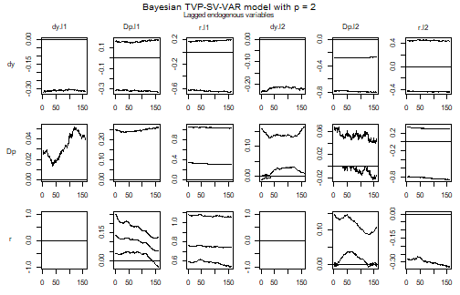
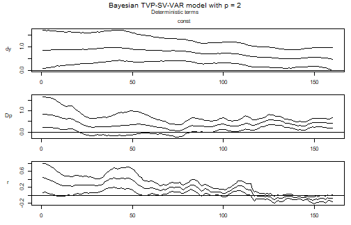
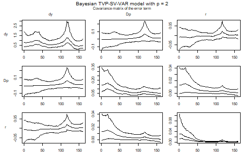
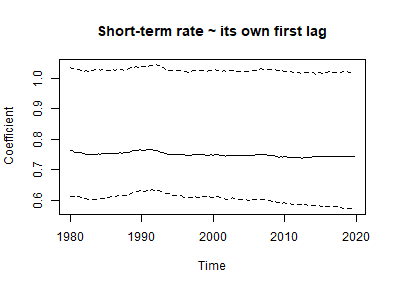
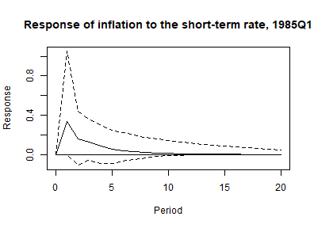
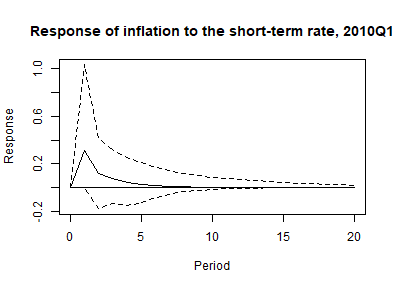
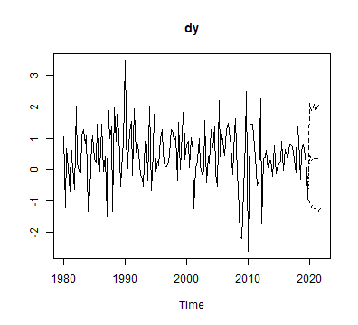

# Time Varying Parameters and Stochastic Volatility in bvartools

## Introduction

A standard VAR makes two constancy assumptions that a long sample rarely
supports. The coefficients are the same in every period, so the dynamics
of the 1970s are estimated jointly with those of the 2000s and the
result describes neither. And the error covariance matrix is the same in
every period, so a sample that contains both a turbulent decade and a
quiet one attributes the average of the two to each – which overstates
the uncertainty of the quiet period and understates the uncertainty of
the turbulent one.

Dropping the first assumption gives a time varying parameter (TVP)
model, dropping the second a stochastic volatility (SV) model.
`bvartools` treats them as two independent switches, `tvp` and `error`,
so a model can have either or both. This vignette estimates a model with
both, and adds Bayesian variable selection on top of it, since a model
with one coefficient per regressor and period is exactly the kind of
model that benefits from being told which regressors it does not need.

The estimated model is

``` math
y_t = Z_t a_t + u_t, \qquad u_t \sim N(0, \Sigma_t),
```

where the coefficients follow a random walk

``` math
a_t = a_{t-1} + v_t, \qquad v_t \sim N(0, Q), \qquad Q = \textrm{diag}(q_1, \dots, q_m),
```

and the error covariance matrix is decomposed as

``` math
\Psi_t \Sigma_t \Psi_t^{\prime} = \Omega_t = \textrm{diag}(\omega_{1t}, \dots, \omega_{Kt}), \qquad
\ln \omega_{it} = \ln \omega_{i, t-1} + w_{it}, \qquad w_{it} \sim N(0, \sigma_i^2),
```

with $`\Psi_t`$ lower triangular with ones on its diagonal. The
log-volatilities are random walks, and in a TVP model the free elements
of $`\Psi_t`$ are random walks as well, so the correlations between the
errors move too. In a model with constant coefficients and
`error = "sv+covar"` only the volatilities move and $`\Psi`$ is
estimated once.

The state equations are what a TVP-SV model estimates in place of the
constant parameters of a standard VAR, and their variances – $`Q`$ for
the coefficients, $`\sigma_i^2`$ for the log-volatilities – decide how
much movement the data are allowed to produce. They are the priors that
matter most here, and they are discussed below.

## Data

Data set `at_macrodata` contains quarterly macroeconomic series of
Austria. The model of this vignette uses the growth rate of real GDP
(`dy`), inflation (`Dp`) and the short-term interest rate (`r`), all in
percent per quarter, from 1979Q3 to 2019Q4. Four decades of Austrian
data are a sample that no constant parameter model describes well: they
contain the disinflation of the early 1980s, the years in which the
schilling was pegged to the Deutsche Mark and the short-term rate
followed the Bundesbank, the start of the monetary union in 1999, the
financial crisis, and a decade of interest rates close to or below zero.
The pandemic quarters are left out. Output growth moved by ten percent
within a quarter in 2020, which is a break of a different kind than the
gradual drift these models are built for.

``` r

library(bvartools)

data("at_macrodata")
at <- at_macrodata[["domestic"]]
data <- ts.intersect(dy = diff(at[, "y"]), Dp = at[, "Dp"], r = at[, "r"]) * 100
data <- window(data, end = c(2019, 4))

plot(data, main = "Austrian macroeconomic data")
```


plot of chunk data

## Model set-up

Argument `tvp = TRUE` makes the coefficients time varying and
`error = "sv+covar"` makes the error covariance matrix time varying. The
posterior sampler follows from the two, which can be checked on the
resulting object.

``` r

model <- create_bvarmodel(data, p = 2, deterministic = "const",
                          tvp = TRUE, error = "sv+covar", varsel = "bvs",
                          iterations = 3000, burnin = 1000)

model[["model"]][["algorithm"]]
#> [1] "VarTvpStochvol"
```

`error = "sv"` would estimate the volatilities without the covariances,
which sets the off-diagonal elements of $`\Sigma_t`$ to zero.
`"sv+covar"` is the specification that corresponds to the model above.

## Priors

The prior of a TVP-SV model is a prior on two state equations beside the
usual prior on the level of the coefficients.

``` r

model <- add_priors(model,
                    coef = list(v_i = 1, v_i_det = 1 / 10,
                                shape = 3, rate = 0.0001, rate_det = 0.01),
                    sigma = list(shape = 3, rate = 0.01,
                                 mu = 0, v_i = 0.01,
                                 state_variance = 0.05, offset = 1e-8),
                    varsel = list(inprior = 0.5, exclude_det = TRUE))
```

In argument `coef`, `v_i` and `v_i_det` are the prior precisions of the
initial state of the coefficients, as they are the prior precisions of
the coefficients themselves in a constant parameter model. `shape` and
`rate` are the parameters of the inverse gamma prior of the elements of
$`Q`$, the variances of the state equation of the coefficients. A small
`rate` relative to the scale of the data pulls those variances towards
zero and the coefficient paths towards straight lines: the prior is that
a coefficient is constant, and the data have to argue it out of that.
`rate_det` does the same for coefficients of deterministic terms, with a
larger value, since an intercept that is allowed to drift is often what
carries a change in the mean of a series.

Since the scale of the data is what makes a `rate` small or large, it is
worth checking rather than copying. A TVP model has one coefficient per
regressor and period, so a model with many regressors and a short sample
can have more coefficients than observations, and a `rate` loose enough
for the path to exploit that produces a model which fits every
observation exactly, has no residuals left, and reports a flat
volatility. The diagnostic is to compare the residuals under the
posterior mean of the coefficient path with the residuals of a least
squares fit of the same regressors: the first should be somewhat smaller
than the second, not very much smaller.

``` r

residual_sd <- function(object) {
  k <- object[["model"]][["k"]]
  m <- ncol(object[["data"]][["train"]][["z"]])
  tt <- nrow(object[["data"]][["train"]][["y"]])
  y <- matrix(t(object[["data"]][["train"]][["y"]]))
  z <- object[["data"]][["train"]][["z"]]

  a <- colMeans(object[["posterior"]][["a"]][["coeffs"]])
  fitted <- rep(NA_real_, tt * k)
  for (period in 1:tt) {
    rows <- (period - 1) * k + 1:k
    fitted[rows] <- z[rows, ] %*% a[(period - 1) * m + 1:m]
  }

  ols <- solve(crossprod(z)) %*% crossprod(z, y)

  result <- rbind(apply(matrix(y - fitted, k), 1, stats::sd),
                  apply(matrix(y - z %*% ols, k), 1, stats::sd))
  dimnames(result) <- list(c("tvp", "ls"), object[["model"]][["endogen"]])
  result
}
```

The function is used further below, once the model has been estimated.

In argument `sigma`, `shape` and `rate` now refer to the state equation
of the log-volatilities rather than to an error variance: they are the
prior of $`\sigma_i^2`$ and control how quickly a volatility is allowed
to move. `mu` and `v_i` are the prior mean and precision of the initial
log-volatility, and `state_variance` is the value $`\sigma_i^2`$ is
initialised at. `offset` is added to the squared errors before their
logarithm is taken, which keeps a residual that happens to be near zero
from producing an infinite log-volatility.

`sigma$rate` deserves a second look, because it decides how much of a
stochastic volatility model one actually gets. With `shape = 3` the
prior mean of $`\sigma_i^2`$ is `rate / 2`, and since the log-volatility
is a random walk, its standard deviation over a sample of $`T`$ periods
is about $`\sqrt{T \sigma_i^2}`$. At `rate = 0.0001` that is about a
tenth of a log point over this sample, so the prior allows the
volatilities to move by a few percent and the specification is a
constant variance model in all but name. At `rate = 0.01`, used here, it
allows them to move by a factor of about two. An equation whose data
demand more than the prior allows will move anyway, so the effect of a
tight prior is selective rather than uniform, which is exactly what
makes it easy to miss.

Argument `varsel` specifies Bayesian variable selection after Korobilis
(2013). One inclusion parameter is drawn per coefficient, not per
coefficient and period, so a regressor is either in the model over the
whole sample or out of it over the whole sample. `exclude_det = TRUE`
keeps the deterministic terms out of the selection.

A note on that last combination: in a model with **constant**
coefficients and an error covariance block, one selection scheme applies
to the coefficients and the covariances together, and `add_priors`
refuses to restrict the selection to the coefficients alone. A time
varying model can treat the two blocks separately, which is why
`exclude_det = TRUE` is accepted here without also specifying
`varsel$covar`.

## Initial values and posterior draws

Initial values of the state variances and volatilities are drawn from
their priors, so the seed is set before them.

``` r

set.seed(1234567)
model <- add_initial_values(model)
```

``` r

model <- add_posterior_coefficients(model)
```

The diagnostic of the previous section says that this specification has
not absorbed its own residuals:

``` r

round(residual_sd(model), 4)
#>         dy     Dp      r
#> tvp 0.8884 0.2764 0.0749
#> ls  0.9023 0.3244 0.1051
```

## Evaluation

### Summary statistics for a period

A TVP model has one set of coefficients per period, so a summary table
has to be the summary of a period. `summary` uses the last one by
default and reports which period that is.

``` r

summary(model)
#> 
#> Bayesian TVP-SV-VAR model with p = 2 
#> 
#> Variable selection algorithm: Bayesian variable selection (Korobilis, 2013)
#> 
#> Endogenous variables: dy, Dp, r
#> 
#> Period: 160 
#> 
#> Variable: dy 
#> 
#>              Mean         SD    Naive SD Time-series SD       2.5%        50%
#> dy.l1 -0.06766177 0.10397267 0.001898273    0.007392209 -0.3194090  0.0000000
#> Dp.l1 -0.01162626 0.09853076 0.001798917    0.003011082 -0.3267298  0.0000000
#> r.l1  -0.05376752 0.20138136 0.003676704    0.010363487 -0.6484436  0.0000000
#> dy.l2 -0.02060344 0.06125665 0.001118388    0.002845653 -0.2224629  0.0000000
#> Dp.l2 -0.27608206 0.26671894 0.004869599    0.017091790 -0.8020163 -0.2676497
#> r.l2  -0.01065359 0.18430811 0.003364990    0.006638106 -0.4296461  0.0000000
#> const  0.49237726 0.25084014 0.004579693    0.011574151  0.0101080  0.4899124
#>           97.5% Incl. prob.  
#> dy.l1 0.0000000   0.4020000  
#> Dp.l1 0.1715765   0.1873333  
#> r.l1  0.1992534   0.2590000  
#> dy.l2 0.0000000   0.1740000  
#> Dp.l2 0.0000000   0.6370000  
#> r.l2  0.4391324   0.2523333  
#> const 0.9886756   1.0000000 *
#> 
#> Variable: Dp 
#> 
#>                Mean         SD     Naive SD Time-series SD          2.5%
#> dy.l1  0.0018245901 0.01370096 0.0002501441   0.0005756225  0.0000000000
#> Dp.l1  0.0253534766 0.07122439 0.0013003735   0.0068516621  0.0000000000
#> r.l1   0.3613668725 0.33059345 0.0060357830   0.0706068185  0.0000000000
#> dy.l2  0.0434754726 0.05436881 0.0009926342   0.0060227282 -0.0009244389
#> Dp.l2  0.0007497872 0.02986807 0.0005453138   0.0014379151 -0.0155039069
#> r.l2  -0.1772978240 0.30546351 0.0055769752   0.0621685542 -0.8530440524
#> const  0.4279407306 0.12716457 0.0023216968   0.0044570686  0.1720831831
#>              50%      97.5% Incl. prob.  
#> dy.l1 0.00000000 0.03973456  0.05066667  
#> Dp.l1 0.00000000 0.26405001  0.18466667  
#> r.l1  0.30895912 1.03824272  0.71933333  
#> dy.l2 0.01091376 0.16552413  0.53933333  
#> Dp.l2 0.00000000 0.04258125  0.06300000  
#> r.l2  0.00000000 0.30428087  0.62500000  
#> const 0.43009563 0.67091270  1.00000000 *
#> 
#> Variable: r 
#> 
#>              Mean         SD     Naive SD Time-series SD         2.5%
#> dy.l1  0.00000000 0.00000000 0.0000000000    0.000000000  0.000000000
#> Dp.l1  0.05220649 0.04012371 0.0007325554    0.002211338 -0.031900495
#> r.l1   0.76547778 0.13585662 0.0024803912    0.032356669  0.540659834
#> dy.l2  0.00000000 0.00000000 0.0000000000    0.000000000  0.000000000
#> Dp.l2  0.02693453 0.03537183 0.0006457983    0.013152542 -0.005023465
#> r.l2  -0.06398210 0.10429857 0.0019042227    0.041424138 -0.325765972
#> const -0.07200072 0.04283763 0.0007821046    0.004921840 -0.158284876
#>                50%      97.5% Incl. prob.  
#> dy.l1  0.000000000 0.00000000       0.000  
#> Dp.l1  0.053186622 0.12767010       1.000  
#> r.l1   0.744148382 1.05703783       1.000 *
#> dy.l2  0.000000000 0.00000000       0.000  
#> Dp.l2  0.001007306 0.10713221       0.534  
#> r.l2   0.000000000 0.00000000       0.356  
#> const -0.071091613 0.00848782       1.000  
#> 
#> Variance-covariance matrix:
#> 
#>               Mean           SD     Naive SD Time-series SD          2.5%
#> dy_dy 0.5549256554 0.2695637998 4.921539e-03   1.168082e-02  0.2169780893
#> dy_Dp 0.0161935012 0.0330812509 6.039782e-04   7.819450e-04 -0.0392778929
#> dy_r  0.0037394042 0.0118258557 2.159096e-04   5.084859e-04 -0.0183331837
#> Dp_Dp 0.0557002682 0.0225878511 4.123959e-04   1.021271e-03  0.0234843645
#> Dp_r  0.0014304985 0.0025211217 4.602917e-05   1.307302e-04 -0.0033831386
#> r_r   0.0008602822 0.0006741049 1.230742e-05   5.140512e-05  0.0001284892
#>                50%       97.5%  
#> dy_dy 0.5056563407 1.185442863 *
#> dy_Dp 0.0137449605 0.083110599  
#> dy_r  0.0028928328 0.029777305  
#> Dp_Dp 0.0520005209 0.110561139 *
#> Dp_r  0.0012771839 0.006934711  
#> r_r   0.0006783617 0.002690065 *
```

Argument `period` asks for another one. It is an index into the
estimation sample, which the following helper turns into a date.

``` r

period_of <- function(object, year, quarter) {
  which(stats::time(object[["data"]][["train"]][["y"]]) == year + (quarter - 1) / 4)
}

summary(model, period = period_of(model, 1985, 1))
#> 
#> Bayesian TVP-SV-VAR model with p = 2 
#> 
#> Variable selection algorithm: Bayesian variable selection (Korobilis, 2013)
#> 
#> Endogenous variables: dy, Dp, r
#> 
#> Period: 21 
#> 
#> Variable: dy 
#> 
#>               Mean         SD    Naive SD Time-series SD       2.5%        50%
#> dy.l1 -0.072134674 0.10537027 0.001923789    0.006704301 -0.3148963  0.0000000
#> Dp.l1 -0.013526138 0.09881734 0.001804149    0.003191526 -0.3125264  0.0000000
#> r.l1  -0.052359100 0.19701054 0.003596904    0.010218271 -0.6243782  0.0000000
#> dy.l2 -0.021631783 0.06144375 0.001121804    0.002797053 -0.2316808  0.0000000
#> Dp.l2 -0.272573770 0.26081901 0.004761882    0.016773706 -0.7808815 -0.2766784
#> r.l2  -0.008907563 0.18479702 0.003373917    0.006567947 -0.4251843  0.0000000
#> const  0.909116827 0.34337761 0.006269189    0.014311110  0.2813589  0.9030186
#>           97.5% Incl. prob.  
#> dy.l1 0.0000000   0.4020000  
#> Dp.l1 0.1544908   0.1873333  
#> r.l1  0.1761092   0.2590000  
#> dy.l2 0.0000000   0.1740000  
#> Dp.l2 0.0000000   0.6370000  
#> r.l2  0.4469828   0.2523333  
#> const 1.6224755   1.0000000 *
#> 
#> Variable: Dp 
#> 
#>               Mean         SD     Naive SD Time-series SD         2.5%
#> dy.l1  0.001223182 0.01065461 0.0001945257   0.0005725423  0.000000000
#> Dp.l1  0.023961741 0.06726437 0.0012280738   0.0062672858  0.000000000
#> r.l1   0.374502915 0.33212748 0.0060637903   0.0756091111  0.000000000
#> dy.l2  0.037568280 0.04736384 0.0008647414   0.0051526043 -0.006451094
#> Dp.l2  0.002244977 0.03051569 0.0005571376   0.0021658408  0.000000000
#> r.l2  -0.157378892 0.29684418 0.0054196084   0.0575494130 -0.797566832
#> const  0.449820064 0.24390705 0.0044531130   0.0233716934  0.003377620
#>              50%      97.5% Incl. prob.  
#> dy.l1 0.00000000 0.02316293  0.05066667  
#> Dp.l1 0.00000000 0.24209397  0.18466667  
#> r.l1  0.33268519 1.05023495  0.71933333  
#> dy.l2 0.00564744 0.13953725  0.53933333  
#> Dp.l2 0.00000000 0.05854793  0.06300000  
#> r.l2  0.00000000 0.32146525  0.62500000  
#> const 0.43807523 0.93219374  1.00000000 *
#> 
#> Variable: r 
#> 
#>              Mean         SD     Naive SD Time-series SD        2.5%        50%
#> dy.l1  0.00000000 0.00000000 0.0000000000    0.000000000  0.00000000 0.00000000
#> Dp.l1  0.11862161 0.04337690 0.0007919502    0.004322264  0.03783040 0.11711549
#> r.l1   0.78114349 0.13041418 0.0023810263    0.032497847  0.58650861 0.75349352
#> dy.l2  0.00000000 0.00000000 0.0000000000    0.000000000  0.00000000 0.00000000
#> Dp.l2  0.03697603 0.04427310 0.0008083125    0.021672938  0.00000000 0.01001898
#> r.l2  -0.05524863 0.09173104 0.0016747721    0.035880180 -0.28198381 0.00000000
#> const  0.25574982 0.11487598 0.0020973388    0.003991628  0.03300074 0.25226729
#>           97.5% Incl. prob.  
#> dy.l1 0.0000000       0.000  
#> Dp.l1 0.2042341       1.000 *
#> r.l1  1.0726864       1.000 *
#> dy.l2 0.0000000       0.000  
#> Dp.l2 0.1321874       0.534  
#> r.l2  0.0000000       0.356  
#> const 0.4882360       1.000 *
#> 
#> Variance-covariance matrix:
#> 
#>               Mean          SD     Naive SD Time-series SD         2.5%
#> dy_dy  0.912996773 0.295187371 0.0053893594   0.0133269841  0.467218367
#> dy_Dp -0.006821686 0.044219083 0.0008073263   0.0012000092 -0.100925158
#> dy_r  -0.010830576 0.022184087 0.0004050242   0.0005743755 -0.058892796
#> Dp_Dp  0.162271955 0.047817857 0.0008730306   0.0042481869  0.092349501
#> Dp_r   0.015009521 0.008391297 0.0001532034   0.0003682097  0.001909403
#> r_r    0.020845748 0.009227624 0.0001684726   0.0005591898  0.009098373
#>                50%      97.5%  
#> dy_dy  0.874570181 1.61600473 *
#> dy_Dp -0.004507798 0.07236357  
#> dy_r  -0.010021401 0.03178108  
#> Dp_Dp  0.153836655 0.28153681 *
#> Dp_r   0.014139235 0.03386032 *
#> r_r    0.018898561 0.04360818 *
```

Comparing the two tables compares two models: the same specification,
fitted to the same sample, describing two different points in it.

The inclusion probabilities are the exception. They do not carry a
period, because variable selection decides on a regressor for the whole
sample, and the column is therefore identical in both tables.

### Coefficient paths

`plot` draws one figure per block of coefficients – the lags of the
endogenous variables, the deterministic terms, and the covariance matrix
of the error term – with one panel per coefficient showing the median
and the bounds of a credible band over time. A block with more
regressors than `max_cols` is split over several figures, which is what
keeps the panels of a model with many regressors large enough to read.

``` r

plot(model)
```



plot of chunk paths



plot of chunk paths



plot of chunk paths

A panel that sits on a flat line at zero is a coefficient that variable
selection has switched off. The remaining panels are the reason for
estimating the model: a coefficient that drifts across the sample is one
that a constant parameter VAR would have averaged.

A single path is easier to read on its own. The draws of the
coefficients sit in `posterior$a$coeffs`, with the coefficients of one
period next to each other and the periods stacked from left to right, so
the path of one coefficient is every $`m`$-th column.

``` r

coefficient_path <- function(object, equation, regressor, ci = 0.9) {
  k <- object[["model"]][["k"]]
  m <- ncol(object[["data"]][["train"]][["z"]])
  tt <- nrow(object[["data"]][["train"]][["y"]])

  # Coefficients are stored as vec(A), so the position of a regressor in an
  # equation is the number of preceding regressors times the number of
  # equations, plus the position of the equation.
  i <- (which(dimnames(object[["data"]][["train"]][["x"]])[[2]] == regressor) - 1) * k +
    which(object[["model"]][["endogen"]] == equation)

  draws <- object[["posterior"]][["a"]][["coeffs"]][, m * 0:(tt - 1) + i]
  bands <- t(apply(draws, 2, stats::quantile,
                   probs = c((1 - ci) / 2, .5, 1 - (1 - ci) / 2)))

  stats::ts(bands, start = stats::start(object[["data"]][["train"]][["y"]]),
            frequency = stats::frequency(object[["data"]][["train"]][["y"]]))
}

path <- coefficient_path(model, equation = "r", regressor = "r.01")

stats::ts.plot(path, lty = c(2, 1, 2),
               main = "Short-term rate ~ its own first lag",
               ylab = "Coefficient")
abline(h = 0, lty = "dotted")
```



plot of chunk one-path

This path is practically flat. With `coef$rate = 0.0001` the prior is
that the coefficients are constant, and for this coefficient the data do
not argue otherwise.

### Volatility paths

The draws of the error covariance matrix are stored as precisions, one
$`K \times K`$ matrix per period, so the standard deviations are the
square roots of the diagonal of its inverse.

``` r

volatility <- function(object) {
  k <- object[["model"]][["k"]]
  kk <- k * k
  tt <- nrow(object[["data"]][["train"]][["y"]])
  draws <- object[["posterior"]][["u_sigma_inv"]][["coeffs"]]

  result <- matrix(NA_real_, tt, k)
  for (i in 1:tt) {
    result[i, ] <- rowMeans(apply(draws[, (i - 1) * kk + 1:kk], 1,
                                  function(x) {sqrt(diag(solve(matrix(x, k))))}))
  }

  stats::ts(result, start = stats::start(object[["data"]][["train"]][["y"]]),
            frequency = stats::frequency(object[["data"]][["train"]][["y"]]),
            names = object[["model"]][["endogen"]])
}

plot(volatility(model),
     main = "Posterior mean of the residual standard deviations")
```


plot of chunk volatility

This is the part of the model that is hardest to do without. The
volatilities of the inflation and interest rate residuals are highest at
the start of the sample and fall to about a half and a tenth of that
level, respectively, the latter almost vanishing once the short-term
rate approached its lower bound. The volatility of output growth has no
such trend: it is highest during the financial crisis in 2009 and lowest
in the years after it. A constant covariance matrix would spread each of
these episodes over the whole sample.

### Impulse responses for a period

`irf` and `fevd` take a `period` in the same way `summary` does, which
is what makes an impulse response of a TVP model a well defined object:
it is the response implied by the coefficients and the covariance matrix
of one period.

``` r

early <- irf(model, impulse = "r", response = "Dp", n_ahead = 20,
             period = period_of(model, 1985, 1))
late <- irf(model, impulse = "r", response = "Dp", n_ahead = 20,
            period = period_of(model, 2010, 1))

plot(early, main = "Response of inflation to the short-term rate, 1985Q1")
```



plot of chunk irf

``` r

plot(late, main = "Response of inflation to the short-term rate, 2010Q1")
```



plot of chunk irf

In both periods inflation rises after an unexpected increase of the
short-term rate, and the response dies out slightly faster in 2010. By
default `irf` computes forecast error impulse responses, whose shock is
one unit of the forecast error of the impulse variable, so the two
responses differ only because the coefficients of the two periods
differ. How large a typical shock was in each period is what the
volatility figure above shows, and with `type = "oir"` it would enter
the responses as well. A forecast error impulse response is not
identified, so its positive sign is no statement about the effect of a
monetary tightening. The vignette on sign restrictions takes up that
question.

### Forecasts

Forecasts start from the state of the **last** period of the estimation
sample, and `add_posterior_forecasts` simulates each draw forward from
there: the coefficients, the covariance block and the log-volatilities
take a step of their random walks every quarter, so the forecast is a
draw from the posterior predictive distribution of the estimated model.
The bands reflect both the uncertainty about $`a_T`$ and $`\Sigma_T`$
and the drift the model allows after the end of the sample.

``` r

model <- add_forecast_input(model, n_ahead = 8)
model <- add_posterior_forecasts(model)

plot(predict(model, n_ahead = 8))
```



plot of chunk forecast


plot of chunk forecast


plot of chunk forecast

`forecast_states = "hold"` carries the draws of $`a_T`$ and $`\Sigma_T`$
forward over the whole horizon instead, which is the forecast
conditional on no further drift. The width of the 90% intervals eight
quarters ahead shows what the drift adds:

``` r

held <- add_posterior_forecasts(model, forecast_states = "hold")

interval_width <- function(object) {
  fcst <- predict(object, n_ahead = 8)[["fcst"]]
  apply(fcst[8, , ], 1, function(x) diff(stats::quantile(x, c(0.05, 0.95))))
}

round(rbind(simulated = interval_width(model), held = interval_width(held)), 2)
#>             dy   Dp    r
#> simulated 2.66 1.18 1.13
#> held      2.54 0.90 0.42
```

Eight quarters ahead, carrying the drift forward leaves the interval of
output growth almost unchanged, widens that of inflation by about a
quarter and makes that of the short-term rate two and a half times as
wide. A forecast that holds the coefficients at the end of the sample
understates the uncertainty this model implies.

## Other combinations

`tvp` and `error` are independent, so the four models below are all
available, and the middle two are useful comparisons rather than
compromises:

- `tvp = FALSE, error = "wishart"` – the standard VAR of the
  introductory vignette.
- `tvp = FALSE, error = "sv+covar"` – constant coefficients, moving
  volatilities. The usual finding for macroeconomic data is that this
  specification accounts for most of what a full TVP-SV model does,
  which makes it the model to beat.
- `tvp = TRUE, error = "wishart"` – moving coefficients, constant
  volatilities. Worth estimating mainly to see how much of the drift in
  the coefficients survives once the volatilities are allowed to move as
  well.
- `tvp = TRUE, error = "sv+covar"` – the model of this vignette.

Since these are ordinary `bvarmodel` objects, they can be compared with
the tools of the model comparison vignette. Only the estimation cost
differs noticeably: the coefficient draws of a TVP model are a path per
draw rather than a vector, so both the sampler and the object it returns
grow with the length of the sample.

The same two switches apply to vector error correction models, which are
the subject of the companion vignette on TVP-SV-VEC models.

## Citing bvartools

If you use `bvartools` in published work, please cite it.
`citation("bvartools")` prints the reference, and the package has the
DOI [10.5281/zenodo.22736604](https://doi.org/10.5281/zenodo.22736604),
which always resolves to the latest archived version.

## References

Chan, J., Koop, G., Poirier, D. J., & Tobias, J. L. (2019). *Bayesian
econometric methods* (2nd ed.). Cambridge: Cambridge University Press.

Cogley, T., & Sargent, T. J. (2005). Drifts and volatilities: Monetary
policies and outcomes in the post WWII US. *Review of Economic Dynamics,
8*(2), 262-302. <https://doi.org/10.1016/j.red.2004.10.009>

Durbin, J., & Koopman, S. J. (2002). A simple and efficient simulation
smoother for state space time series analysis. *Biometrika, 89*(3),
603-616. <https://doi.org/10.1093/biomet/89.3.603>

Kim, S., Shephard, N., & Chib, S. (1998). Stochastic volatility:
Likelihood inference and comparison with ARCH models. *Review of
Economic Studies, 65*(3), 361-393.
<https://doi.org/10.1111/1467-937X.00050>

Koop, G., & Korobilis, D. (2010). Bayesian multivariate time series
methods for empirical macroeconomics. *Foundations and Trends in
Econometrics, 3*(4), 267-358. <https://dx.doi.org/10.1561/0800000013>

Korobilis, D. (2013). VAR forecasting using Bayesian variable selection.
*Journal of Applied Econometrics, 28*(2), 204-230.
<https://doi.org/10.1002/jae.1271>

Primiceri, G. E. (2005). Time varying structural vector autoregressions
and monetary policy. *Review of Economic Studies, 72*(3), 821-852.
<https://doi.org/10.1111/j.1467-937X.2005.00353.x>
