# Time Varying Parameters and Stochastic Volatility in Error Correction Models

## Introduction

The companion vignette on TVP-SV-VAR models describes what the arguments
`tvp` and `error` do and which priors they require. They mean the same
thing for a vector error correction model, and `create_bvecmodel` takes
them in the same way. What changes is the object they are applied to,
and that change is not cosmetic: in a VEC model the time varying block
includes the cointegration term, so the model allows the long-run
relationship itself to move.

The estimated model is

``` math
\Delta y_t = \Pi_t w_t + \sum_{l=1}^{p-1} \Gamma_{l,t} \Delta y_{t-l} + C_t d_t + u_t,
\qquad u_t \sim N(0, \Sigma_t),
```

with $`\Pi_t = \alpha_t \beta_t^{\prime}`$ of rank $`r`$. The
coefficients of the non-cointegration part and the loadings $`\alpha_t`$
follow random walks and $`\Sigma_t`$ is the stochastic volatility
specification of the VAR vignette. The cointegration vectors get a state
equation of their own,

``` math
\beta_t = \rho \beta_{t-1} + \eta_t, \qquad \eta_t \sim N(0, I),
```

which is the specification of Koop, León-González and Strachan (2011). A
constant coefficient VEC model instead puts a matric-variate prior on
the cointegration space, so `add_priors` asks for different arguments in
the two cases: `coint$v_i` and `coint$p_tau_i` for a constant model,
`coint$rho` for a time varying one.

## Data

Data set `at_macrodata` contains, among the domestic series of Austria,
a short-term interest rate (`r`), a long-term interest rate (`lr`) and
inflation (`Dp`). The model uses the three series in percent per quarter
from 1979Q2 to 2019Q4 and asks the question this model is for, and which
Koop, León-González and Strachan (2011) ask of UK data: whether the
long-run relationship between the two rates and inflation is the same at
the end of the sample as it was at its beginning.

``` r

library(bvartools)

data("at_macrodata")

data <- window(at_macrodata[["domestic"]][, c("r", "lr", "Dp")], end = c(2019, 4)) * 100

plot(data, main = "Austrian interest and inflation rates")
```

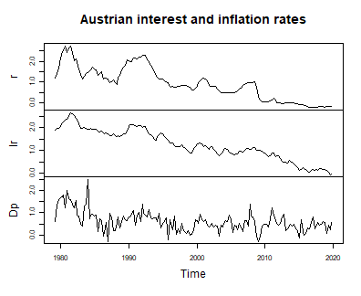

plot of chunk data

## Model set-up

``` r

model <- create_bvecmodel(data, p = 2, r = 1, const = "unrestricted",
                          tvp = TRUE, error = "sv+covar", varsel = "bvs",
                          iterations = 3000, burnin = 1000)

model[["model"]][["algorithm"]]
#> [1] "VecTvpStochvol"
```

`p` is the lag order of the level VAR, so the model contains
$`p - 1 = 1`$ lag of the differenced series. The cointegration rank is
fixed at one, which for a term structure is the natural specification.

Models with a prior on the cointegration space are sensitive to the
scale of the series in the error correction term, and
`scale_error_correction` can divide them by the standard deviation of
their differences. This model is estimated on the series as they are,
for a reason explained with the priors below, so nothing has to be
rescaled after estimation either.

## Priors

``` r

model <- add_priors(model,
                    coef = list(v_i = 1, v_i_det = 1 / 10,
                                shape = 3, rate = 0.000001, rate_det = 0.01),
                    coint = list(rho = 0.999),
                    sigma = list(shape = 3, rate = 0.01,
                                 mu = 0, v_i = 0.01,
                                 state_variance = 0.05, offset = 1e-8),
                    varsel = list(inprior = 0.5, exclude_det = TRUE))
```

Arguments `coef` and `sigma` are the ones of the VAR vignette: prior
precisions for the initial state of the coefficients, an inverse gamma
prior for the variances of their state equation, and the prior of the
stochastic volatility block.

`coef$rate` is two orders of magnitude smaller than in the VAR vignette,
and the series in the error correction term are left unscaled. Both
choices address the same problem. The coefficient paths can absorb most
of the residuals of the short-term interest rate equation, whose
residual standard deviation is then reported at a small fraction of the
one of a least squares fit of the same regressors and almost flat over
forty years – the symptom the VAR vignette describes. In four chains of
the length used here, each with a different seed, that happened in every
chain with `rate = 0.0001`, which put the residual standard deviation of
that equation at between 4 and 53 percent of the least squares value,
and in every chain with `rate = 0.000001` when the series were scaled,
at between 3 and 10 percent. With `rate = 0.000001` and unscaled series,
all four chains put it at about 95 percent.

Neither choice reaches all of the drift, though. The cointegration
vectors take steps of unit variance whatever `coef$rate` is, and how far
those steps move $`\Pi_t`$ depends on the prior precision of the
loadings relative to the scale of $`\Pi`$ and on the levels of the
series in the error correction term, as section ‘Prior on the
cointegration space’ of
[`?add_priors.bvecmodel`](https://franzmohr.github.io/bvartools/reference/add_priors.bvecmodel.md)
explains. Small rates alone therefore do not guarantee that a model
passes the comparison with least squares, which is why that comparison
is the check to make, whichever block would fit the residuals.

Argument `coint` is where a VEC model differs. `rho` is the
autocorrelation of the state equation of $`\beta`$ and must be smaller
than one. The prior on the state before the sample is that equation’s
own stationary distribution, $`N(0, I / (1 - \rho^2))`$, which is what
makes the prior proper, so a value close to one is intended and a value
far from it draws a warning. Only the product
$`\alpha_t \beta_t^{\prime}`$ is identified, and the prior variance of
the loadings is shrunk by $`1 - \rho^2`$ to compensate, which leaves the
product on the scale that `coef$v_i` asks for.

The loadings are never subject to variable selection, so the
cointegration term is always in the model. Variable selection applies to
the coefficients of the differenced regressors, and `exclude_det = TRUE`
keeps the unrestricted constant out of it as well.

## Initial values and posterior draws

Initial values of the state variances and volatilities are drawn from
their priors, so the seed is set before them.

``` r

set.seed(20260912)
model <- add_initial_values(model)
```

``` r

model <- add_posterior_coefficients(model)
```

## Evaluation

### Summary statistics for a period

As for a TVP-SV-VAR, a summary table is the summary of a period, and the
last one is used by default. The first block of columns is the
cointegration matrix $`\Pi_t`$ rather than $`\alpha_t`$ and $`\beta_t`$
separately, since the factors are identified only up to an invertible
$`r \times r`$ transformation while their product is not.

``` r

summary(model)
#> 
#> Bayesian TVP-SV-VEC model with p = 2 
#> 
#> Variable selection algorithm: Bayesian variable selection (Korobilis, 2013)
#> 
#> Endogenous variables: r, lr, Dp
#> 
#> Period: 161 
#> 
#> Variable: r 
#> 
#>                  Mean         SD     Naive SD Time-series SD        2.5%
#> l.r      -0.002938599 0.01978789 0.0003612758   0.0007137597 -0.04988671
#> l.lr     -0.002772397 0.02599323 0.0004745692   0.0009681963 -0.06574716
#> l.Dp      0.012071422 0.04984707 0.0009100787   0.0023456430 -0.08321454
#> d.r.l01   0.004917593 0.03123941 0.0005703511   0.0013090541  0.00000000
#> d.lr.l01  0.185259188 0.10304051 0.0018812537   0.0136517783  0.00000000
#> d.Dp.l01 -0.002905749 0.01150696 0.0002100873   0.0014015797 -0.04614674
#> const     0.008141044 0.02760465 0.0005039896   0.0014105029 -0.04942320
#>                    50%      97.5% Incl. prob. 
#> l.r      -0.0006126434 0.03345131  1.00000000 
#> l.lr     -0.0009243377 0.04889416  1.00000000 
#> l.Dp      0.0108136644 0.11409175  1.00000000 
#> d.r.l01   0.0000000000 0.10919337  0.08133333 
#> d.lr.l01  0.2024879545 0.35424963  0.84400000 
#> d.Dp.l01  0.0000000000 0.00000000  0.07733333 
#> const     0.0095806847 0.05877779  1.00000000 
#> 
#> Variable: lr 
#> 
#>                   Mean          SD     Naive SD Time-series SD        2.5%
#> l.r      -0.0017702623 0.027950091 5.102965e-04   0.0007443590 -0.06364524
#> l.lr     -0.0138546632 0.037549752 6.855615e-04   0.0015229896 -0.10804831
#> l.Dp      0.0245679169 0.068034428 1.242133e-03   0.0023725200 -0.10937222
#> d.r.l01   0.0010253825 0.015056861 2.748994e-04   0.0006494762  0.00000000
#> d.lr.l01  0.0247317144 0.064635373 1.180075e-03   0.0045268665  0.00000000
#> d.Dp.l01 -0.0005220961 0.004945279 9.028803e-05   0.0002474038  0.00000000
#> const    -0.0254675354 0.045441901 8.296518e-04   0.0015549084 -0.11555542
#>                    50%      97.5% Incl. prob. 
#> l.r      -0.0002610902 0.05611225  1.00000000 
#> l.lr     -0.0051613736 0.04578211  1.00000000 
#> l.Dp      0.0221406106 0.16012073  1.00000000 
#> d.r.l01   0.0000000000 0.01550263  0.05033333 
#> d.lr.l01  0.0000000000 0.23663171  0.18800000 
#> d.Dp.l01  0.0000000000 0.00000000  0.03100000 
#> const    -0.0251837202 0.06119783  1.00000000 
#> 
#> Variable: Dp 
#> 
#>                  Mean         SD     Naive SD Time-series SD        2.5%
#> l.r       0.041591615 0.33049696 0.0060340214    0.026910780 -0.65849438
#> l.lr      0.278346808 0.31635627 0.0057758488    0.033682957 -0.36546431
#> l.Dp     -0.813008731 0.21772680 0.0039751293    0.009535635 -1.26069093
#> d.r.l01   0.447763813 0.33138632 0.0060502587    0.018548043  0.00000000
#> d.lr.l01  0.002311575 0.18245289 0.0033311188    0.007429813 -0.44090122
#> d.Dp.l01  0.008474434 0.03928448 0.0007172331    0.001814852  0.00000000
#> const     0.327191757 0.14073232 0.0025694088    0.008619371  0.05728267
#>                  50%      97.5% Incl. prob.  
#> l.r       0.05748908  0.6794250   1.0000000  
#> l.lr      0.28418780  0.8964152   1.0000000  
#> l.Dp     -0.80548956 -0.4064532   1.0000000 *
#> d.r.l01   0.48901970  1.0478705   0.7683333  
#> d.lr.l01  0.00000000  0.4600246   0.2650000  
#> d.Dp.l01  0.00000000  0.1398778   0.1106667  
#> const     0.32986816  0.5995198   1.0000000 *
#> 
#> Variance-covariance matrix:
#> 
#>               Mean           SD     Naive SD Time-series SD         2.5%
#> r_r   0.0005594056 0.0008126868 1.483756e-05   6.720793e-05 3.312924e-06
#> r_lr  0.0001251922 0.0001765597 3.223524e-06   1.496136e-05 6.564978e-07
#> r_Dp  0.0006709755 0.0009872112 1.802393e-05   7.510509e-05 3.565358e-06
#> lr_lr 0.0028052396 0.0011509777 2.101388e-05   6.770087e-05 1.112018e-03
#> lr_Dp 0.0032348525 0.0019664977 3.590317e-05   1.117089e-04 4.306007e-04
#> Dp_Dp 0.0517227595 0.0196492456 3.587445e-04   8.802816e-04 2.420895e-02
#>                50%        97.5%  
#> r_r   3.348864e-04 0.0025415446 *
#> r_lr  7.231165e-05 0.0005821505 *
#> r_Dp  3.799857e-04 0.0032913988 *
#> lr_lr 2.627424e-03 0.0057591334 *
#> lr_Dp 2.908000e-03 0.0078801891 *
#> Dp_Dp 4.856275e-02 0.0999277205 *
```

``` r

period_of <- function(object, year, quarter) {
  which(stats::time(object[["data"]][["train"]][["y"]]) == year + (quarter - 1) / 4)
}

summary(model, period = period_of(model, 1985, 1))
#> 
#> Bayesian TVP-SV-VEC model with p = 2 
#> 
#> Variable selection algorithm: Bayesian variable selection (Korobilis, 2013)
#> 
#> Endogenous variables: r, lr, Dp
#> 
#> Period: 22 
#> 
#> Variable: r 
#> 
#>                  Mean         SD     Naive SD Time-series SD         2.5%
#> l.r      -0.036518485 0.03803583 0.0006944360    0.004357834 -0.129445296
#> l.lr     -0.041922734 0.03713882 0.0006780590    0.004387556 -0.133954092
#> l.Dp      0.126815801 0.06598941 0.0012047963    0.003110769 -0.001062144
#> d.r.l01   0.004898052 0.03123532 0.0005702764    0.001298412  0.000000000
#> d.lr.l01  0.185067759 0.10293343 0.0018792987    0.013746185  0.000000000
#> d.Dp.l01 -0.002991873 0.01186385 0.0002166033    0.001472980 -0.047757136
#> const     0.010956700 0.07180317 0.0013109406    0.007556495 -0.127596467
#>                   50%      97.5% Incl. prob. 
#> l.r      -0.027998535 0.01532436  1.00000000 
#> l.lr     -0.035671495 0.01267745  1.00000000 
#> l.Dp      0.123726318 0.25825991  1.00000000 
#> d.r.l01   0.000000000 0.10823987  0.08133333 
#> d.lr.l01  0.202336927 0.35308185  0.84400000 
#> d.Dp.l01  0.000000000 0.00000000  0.07733333 
#> const     0.009276715 0.16249489  1.00000000 
#> 
#> Variable: lr 
#> 
#>                   Mean          SD     Naive SD Time-series SD        2.5%
#> l.r      -0.0101265581 0.014782045 2.698820e-04   0.0010422163 -0.04699145
#> l.lr     -0.0137021584 0.018269700 3.335576e-04   0.0017008458 -0.06107663
#> l.Dp      0.0386506619 0.037454878 6.838294e-04   0.0008248405 -0.03370959
#> d.r.l01   0.0011055950 0.014862753 2.713555e-04   0.0006940018  0.00000000
#> d.lr.l01  0.0246752812 0.064601371 1.179454e-03   0.0045423531  0.00000000
#> d.Dp.l01 -0.0005033546 0.004777834 8.723092e-05   0.0002441457  0.00000000
#> const     0.0012094530 0.036869658 6.731448e-04   0.0021742927 -0.07265211
#>                    50%      97.5% Incl. prob. 
#> l.r      -0.0069810311 0.01200793  1.00000000 
#> l.lr     -0.0097595354 0.01181288  1.00000000 
#> l.Dp      0.0386076264 0.11302057  1.00000000 
#> d.r.l01   0.0000000000 0.01478077  0.05033333 
#> d.lr.l01  0.0000000000 0.23475345  0.18800000 
#> d.Dp.l01  0.0000000000 0.00000000  0.03100000 
#> const     0.0008041212 0.07598658  1.00000000 
#> 
#> Variable: Dp 
#> 
#>                  Mean         SD     Naive SD Time-series SD        2.5%
#> l.r       0.253298189 0.21149911 0.0038614278    0.036226313 -0.15925043
#> l.lr      0.339348077 0.23627074 0.0043136938    0.046252831 -0.07047625
#> l.Dp     -0.983153549 0.17518344 0.0031983975    0.008331735 -1.33527311
#> d.r.l01   0.447810809 0.33142300 0.0060509284    0.018528853  0.00000000
#> d.lr.l01  0.002259197 0.18225242 0.0033274587    0.007430132 -0.43625231
#> d.Dp.l01  0.008479488 0.03933543 0.0007181634    0.001820788  0.00000000
#> const    -0.225015704 0.32921877 0.0060106849    0.067094459 -0.86878634
#>                 50%      97.5% Incl. prob.  
#> l.r       0.2501560  0.6713863   1.0000000  
#> l.lr      0.3207959  0.8984355   1.0000000  
#> l.Dp     -0.9786278 -0.6478242   1.0000000 *
#> d.r.l01   0.4879336  1.0471895   0.7683333  
#> d.lr.l01  0.0000000  0.4584089   0.2650000  
#> d.Dp.l01  0.0000000  0.1413940   0.1106667  
#> const    -0.2123369  0.4010952   1.0000000  
#> 
#> Variance-covariance matrix:
#> 
#>              Mean          SD     Naive SD Time-series SD        2.5%
#> r_r   0.026639108 0.016634838 3.037092e-04   0.0006277038 0.008432807
#> r_lr  0.006010267 0.004128233 7.537088e-05   0.0001585523 0.001418412
#> r_Dp  0.032586795 0.022271077 4.066124e-04   0.0010285651 0.007544207
#> lr_lr 0.003726789 0.001536377 2.805027e-05   0.0001289423 0.001735931
#> lr_Dp 0.009916508 0.005893674 1.076033e-04   0.0002504134 0.003024234
#> Dp_Dp 0.175557360 0.053107676 9.696091e-04   0.0037812145 0.098693848
#>               50%       97.5%  
#> r_r   0.022951747 0.064586976 *
#> r_lr  0.005085753 0.016296948 *
#> r_Dp  0.027594161 0.088818173 *
#> lr_lr 0.003453288 0.007207267 *
#> lr_Dp 0.008634286 0.024188982 *
#> Dp_Dp 0.166205772 0.305473499 *
```

The inclusion probabilities of the $`\Pi`$ columns are one by
construction, as explained above, and the inclusion probabilities of the
remaining columns do not carry a period: variable selection decides on a
regressor for the whole sample.

### Coefficient and volatility paths

`plot` draws one figure per block of coefficients: the cointegration
matrix $`\Pi_t`$, the lagged differences, the deterministic terms and
the covariance matrix of the error term, each on its own.

``` r

plot(model)
```

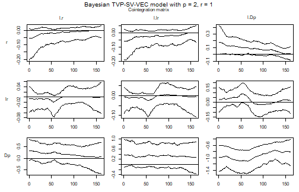

plot of chunk paths

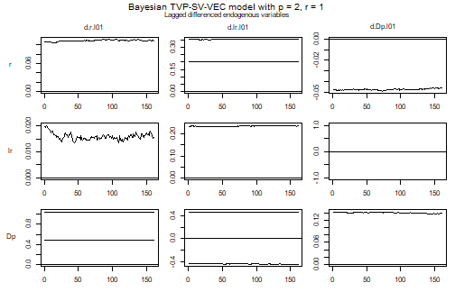

plot of chunk paths

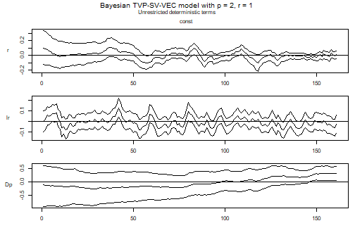

plot of chunk paths

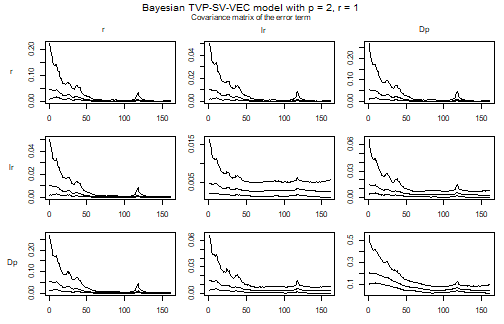

plot of chunk paths

In the figure of $`\Pi_t`$, reading down a column gives the response of
each differenced series to the level of one variable, and reading across
a row gives the error correction of one equation. A panel that sits at
zero among the $`\Gamma`$ coefficients is one that variable selection
has switched off.

A single element of $`\Pi_t`$ is easier to read on its own. The
following computes it from the draws of the loadings, which are the
first $`Kr`$ coefficients of each period of `posterior$a$coeffs`, and
the draws of the cointegration vectors in `posterior$beta$coeffs`.

``` r

pi_path <- function(object, equation, variable, ci = 0.9) {
  k <- object[["model"]][["k"]]
  r <- object[["model"]][["rank"]]
  m <- ncol(object[["data"]][["train"]][["z"]])
  k_ect <- ncol(object[["data"]][["train"]][["w"]])
  tt <- nrow(object[["data"]][["train"]][["y"]])
  draws <- nrow(object[["posterior"]][["a"]][["coeffs"]])

  i <- which(object[["model"]][["endogen"]] == equation)
  j <- which(dimnames(object[["data"]][["train"]][["w"]])[[2]] == variable)

  result <- matrix(NA_real_, draws, tt)
  for (period in 1:tt) {
    alpha <- object[["posterior"]][["a"]][["coeffs"]][, (period - 1) * m + 1:(k * r)]
    beta <- object[["posterior"]][["beta"]][["coeffs"]][, (period - 1) * k_ect * r + 1:(k_ect * r)]
    result[, period] <- rowSums(matrix(alpha, draws, k * r)[, k * 0:(r - 1) + i, drop = FALSE] *
                                  matrix(beta, draws, k_ect * r)[, k_ect * 0:(r - 1) + j, drop = FALSE])
  }

  bands <- t(apply(result, 2, stats::quantile,
                   probs = c((1 - ci) / 2, .5, 1 - (1 - ci) / 2)))

  stats::ts(bands, start = stats::start(object[["data"]][["train"]][["y"]]),
            frequency = stats::frequency(object[["data"]][["train"]][["y"]]))
}

path <- pi_path(model, equation = "r", variable = "l.r")

stats::ts.plot(path, lty = c(2, 1, 2),
               main = "Short-term rate: adjustment to its own level",
               ylab = "Element of Pi")
abline(h = 0, lty = "dotted")
```


plot of chunk pi-path

The band of this element is widest in the early 1980s and narrows over
the sample, while its median rises from about -0.05 to zero: whatever
adjustment of the short-term rate to its own level there is fades out
over the four decades.

Note what is *not* plotted here. The path of $`\beta_t`$ on its own is
not a quantity to read: a cointegration vector is identified only up to
normalisation, and normalising it on a variable whose coefficient
wanders near zero produces a path that swings between large values
without anything having happened to the model. $`\Pi_t`$ carries the
same information and is identified.

The volatilities are extracted from the draws of the error precision
exactly as in the VAR case.

``` r

volatility <- function(object) {
  k <- object[["model"]][["k"]]
  kk <- k * k
  tt <- nrow(object[["data"]][["train"]][["y"]])
  draws <- object[["posterior"]][["u_sigma_inv"]][["coeffs"]]

  result <- matrix(NA_real_, tt, k)
  for (i in 1:tt) {
    result[i, ] <- rowMeans(apply(draws[, (i - 1) * kk + 1:kk], 1,
                                  function(x) {sqrt(diag(solve(matrix(x, k))))}))
  }

  stats::ts(result, start = stats::start(object[["data"]][["train"]][["y"]]),
            frequency = stats::frequency(object[["data"]][["train"]][["y"]]),
            names = object[["model"]][["endogen"]])
}

plot(volatility(model),
     main = "Posterior mean of the residual standard deviations")
```

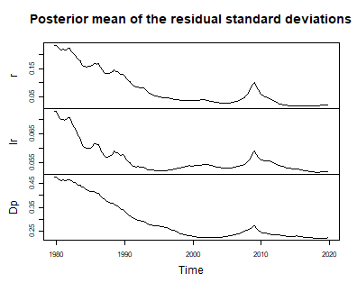

plot of chunk volatility

For these data the volatility block does most of its work in the
equation of the short-term interest rate. Its residual standard
deviation falls from about a quarter of a percentage point in the early
1980s to a tenth of that once the rate approached its lower bound, with
a brief return during the financial crisis. A model that averaged over
the sample would report credible bands for the 2010s that are far too
wide. The volatilities of the other two equations move much less: the
one of inflation falls by about half until 2000, the one of the
long-term rate by about a quarter, most of it in the first half of the
1980s.

## A prior centred on the maximum likelihood estimate

The prior used above says nothing about where the cointegration space
lies: under $`\beta_t = \rho \beta_{t-1} + \eta_t`$ the marginal prior
of $`sp(\beta_t)`$ is uniform in every period. The working paper version
of Koop, León-González and Strachan (2011) shows how to centre it on a
given space $`sp(H)`$ instead, by putting
$`P_\tau = H H^{\prime} + H_\perp T H_\perp^{\prime}`$ into the
transition of the state equation,

``` math
\beta_t = \rho (I_r \otimes P_\tau) \beta_{t-1} + \eta_t, \qquad \eta_t \sim N(0, I).
```

The part of $`\beta_t`$ along $`sp(H)`$ keeps the autocorrelation
$`\rho`$ and the part off it decays faster, so the mode of the marginal
distribution of $`sp(\beta_t)`$ is $`sp(H)`$ in every period, while the
space of one period is still centred near the space of the period
before.

With `coint = list(rho = 0.999, p_tau_i = "ml", weight = 1)`,
`add_priors` takes $`H`$ from Johansen’s (1995) maximum likelihood
estimate of the space and chooses $`T`$ so that the prior spread of
$`sp(\beta_t)`$ around it in each period matches the sampling variance
of that estimate, with `weight` counting how many samples’ worth of
information the prior adds. The state before the sample gets the
stationary distribution of the new state equation. The estimate is
computed from the error correction term as it is stored in the model,
here on the scale of the data.

``` r

model_ml <- create_bvecmodel(data, p = 2, r = 1, const = "unrestricted",
                             tvp = TRUE, error = "sv+covar", varsel = "bvs",
                             iterations = 3000, burnin = 1000)

model_ml <- add_priors(model_ml,
                       coef = list(v_i = 1, v_i_det = 1 / 10,
                                   shape = 3, rate = 0.000001, rate_det = 0.01),
                       coint = list(rho = 0.999, p_tau_i = "ml", weight = 1),
                       sigma = list(shape = 3, rate = 0.01,
                                    mu = 0, v_i = 0.01,
                                    state_variance = 0.05, offset = 1e-8),
                       varsel = list(inprior = 0.5, exclude_det = TRUE))
```

How informative this prior can be is bounded by $`\rho`$: even $`T = 0`$
leaves the space $`1 - \rho^2`$ of room to move in each period. Where
the sampling variance of the estimate in some direction is smaller than
that, `add_priors` sets $`T`$ to zero in that direction and warns. On
these data both directions off $`sp(H)`$ stay above the bound, so the
prior matches the sampling variance without a warning. The eigenvalues
of the transition that was stored show the outcome – one for the
direction of $`sp(H)`$ itself, and one for each direction off it:

``` r

round(eigen(model_ml[["priors"]][["beta"]][["p_tau"]], symmetric = TRUE)$values, 3)
#> [1] 1.000 0.989 0.168
```

``` r

set.seed(20260913)
model_ml <- add_initial_values(model_ml)
model_ml <- add_posterior_coefficients(model_ml)
```

The same element of $`\Pi_t`$ as above, with the bands under the
noninformative prior in grey:

``` r

path_ml <- pi_path(model_ml, equation = "r", variable = "l.r")

stats::ts.plot(path, path_ml, lty = c(2, 1, 2, 2, 1, 2),
               col = rep(c("grey60", "black"), each = 3),
               main = "Short-term rate: adjustment to its own level",
               ylab = "Element of Pi")
abline(h = 0, lty = "dotted")
legend("bottomleft", legend = c("Noninformative", "Centred on ML"),
       col = c("grey60", "black"), lty = 1, bty = "n")
```

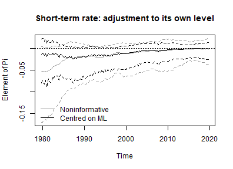

plot of chunk ml-prior-path

Averaged over the sample, the width of the 90% bands of every element of
$`\Pi_t`$ under the prior centred on the maximum likelihood estimate,
relative to the noninformative one – rows are the variables in the error
correction term, columns the equations:

``` r

band_width <- function(object) {
  sapply(object[["model"]][["endogen"]], function(equation) {
    sapply(dimnames(object[["data"]][["train"]][["w"]])[[2]], function(variable) {
      bands <- pi_path(object, equation = equation, variable = variable)
      mean(bands[, 3] - bands[, 1])
    })
  })
}

round(band_width(model_ml) / band_width(model), 2)
#>         r   lr   Dp
#> l.r  0.66 0.67 0.76
#> l.lr 0.62 0.52 0.78
#> l.Dp 0.81 0.84 1.05
```

A ratio below one means that the prior centred on the maximum likelihood
estimate narrows the band of that element. Here it does so for all
elements but one, most for the adjustment to the lagged long-term rate,
while the band of the adjustment of inflation to its own level is about
five percent wider than under the noninformative prior. It need not
narrow every band, and that is a property of how the prior is built
rather than a failure of it: a larger `weight` makes the prior tighter
by lowering $`T`$, but $`T`$ is also how much of the position of the
space carries over from one period to the next. In a direction where
$`T`$ is zero, the position does not carry over at all, each period is
informed by its own data alone, and the posterior in that direction can
be wider than under the noninformative prior – see
[`?add_priors.bvecmodel`](https://franzmohr.github.io/bvartools/reference/add_priors.bvecmodel.md).
How this plays out for the elements of $`\Pi_t`$ depends on how the
directions of the space line up with the variables.

Two further things to keep in mind. First, the centre is estimated from
the same sample the model is estimated on, so the data enter twice, and
where the bands do narrow they overstate how precisely the space is
known. Second, and most important for these data, $`H`$ is the estimate
of a *constant* space. Centring every period on it pulls the path
towards the average of the sample, which works against the question the
model is estimated to answer, whether the long-run relationship moved. A
prior like this is best suited to a model whose cointegration space is
expected to move around a stable centre, rather than to drift away from
one.

## Impulse responses and forecasts

Impulse responses and variance decompositions of a VEC model are
obtained from its VAR representation in levels, which `vec_to_var`
computes draw by draw. A time varying model is a VEC model per period,
so the transformation is applied period by period, and the result is a
VAR model with time varying parameters:

``` r

bvar_form <- vec_to_var(model)

bvar_form[["model"]][["algorithm"]]
#> [1] "VarTvpStochvol"
```

The draws of the variances of the state equations of the VEC
coefficients and of $`\rho`$ are not carried over: they describe how the
coefficients of the VEC model drift and have no counterpart among the
coefficients in levels. The paths of the coefficients and the draws of
the error term are, and they are all the application functions need.

Impulse responses and forecast error variance decompositions are those
of one period, which argument `period` selects, the last period being
the default. The response of inflation to a shock to the short-term
interest rate in 1985Q1:

``` r

feir <- irf(bvar_form, impulse = "r", response = "Dp", n_ahead = 20,
            period = period_of(model, 1985, 1))

plot(feir, main = "Forecast error impulse response, 1985Q1",
     xlab = "Period", ylab = "Response")
```

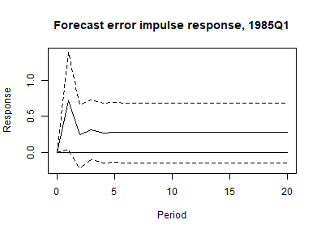

plot of chunk feir-1985

Forecasts are made from the VEC model itself. `add_forecast_input`
prepares the regressors of the forecast periods, in levels, and
`add_posterior_forecasts` simulates each draw forward from the last
period of the sample: the loadings, the short-run coefficients and the
volatilities take a step of their random walks every quarter, the
cointegration vectors a step of their state equation, and the VAR in
levels is rebuilt from them in every period. The bands therefore reflect
both the uncertainty about where the coefficients are at the end of the
sample and the drift the model allows after it.

``` r

model <- add_forecast_input(model, n_ahead = 8)
model <- add_posterior_forecasts(model)

plot(predict(model, n_ahead = 8), n_pre = 20)
```

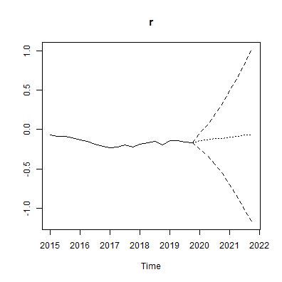

plot of chunk forecasts

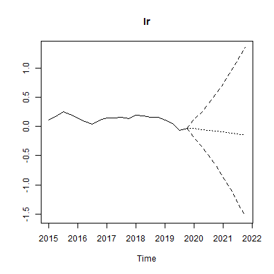

plot of chunk forecasts

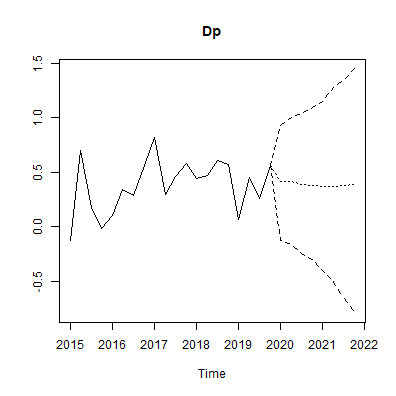

plot of chunk forecasts

The VAR representation above has no state equation for its coefficients
in levels, so it can only hold them at their values in the last period.
`forecast_states = "hold"` gives that forecast from the VEC model as
well. The width of the 90% intervals eight quarters ahead shows what the
drift adds:

``` r

held <- add_posterior_forecasts(model, forecast_states = "hold")

interval_width <- function(object) {
  fcst <- predict(object, n_ahead = 8)[["fcst"]]
  apply(fcst[8, , ], 1, function(x) diff(stats::quantile(x, c(0.05, 0.95))))
}

round(rbind(simulated = interval_width(model), held = interval_width(held)), 2)
#>              r   lr  Dp
#> simulated 1.83 2.38 1.8
#> held      0.71 1.21 1.2
```

Eight quarters ahead, carrying the drift forward about doubles the
interval of the long-term rate, widens that of inflation by half and
makes that of the short-term rate between two and three times as wide. A
forecast that holds the coefficients at the end of the sample
understates the uncertainty this model implies.

The constant coefficient model with stochastic volatility, estimated
with `tvp = FALSE`, remains the model a TVP-SV specification has to
beat. The two can be compared out of sample by estimating both over an
expanding window with `use_expanding_window` and forecasting the models
of its windows directly: `add_forecast_input` and
`add_posterior_forecasts` take VEC models, forecast them in levels and,
for the time varying one, simulate its cointegration vectors and
volatility forward over the forecast horizon.

## Citing bvartools

If you use `bvartools` in published work, please cite it.
`citation("bvartools")` prints the reference, and the package has the
DOI [10.5281/zenodo.22736604](https://doi.org/10.5281/zenodo.22736604),
which always resolves to the latest archived version.

## References

Johansen, S. (1995). *Likelihood-based inference in cointegrated vector
autoregressive models*. Oxford: Oxford University Press.

Koop, G., León-González, R., & Strachan R. W. (2011). Bayesian inference
in a time varying cointegration model. *Journal of Econometrics,
165*(2), 210-220. <https://doi.org/10.1016/j.jeconom.2011.07.007>

Koop, G., León-González, R., & Strachan R. W. (2010). Efficient
posterior simulation for cointegrated models with priors on the
cointegration space. *Econometric Reviews, 29*(2), 224-242.
<https://doi.org/10.1080/07474930903382208>

Korobilis, D. (2013). VAR forecasting using Bayesian variable selection.
*Journal of Applied Econometrics, 28*(2), 204-230.
<https://doi.org/10.1002/jae.1271>

Lütkepohl, H. (2006). *New introduction to multiple time series
analysis* (2nd ed.). Berlin: Springer.

Primiceri, G. E. (2005). Time varying structural vector autoregressions
and monetary policy. *Review of Economic Studies, 72*(3), 821-852.
<https://doi.org/10.1111/j.1467-937X.2005.00353.x>
