  


## Introduction

The package `bvartools` implements functions for Bayesian inference of linear time series models with a focus on vector autoregressive (VAR) and vector error correction (VEC). It separates a typical analytics workflow into multiple steps:

- *Model set-up*
  * Produce data matrices for given lag orders and model types, which can be used for posterior simulation. This includes a set-up for expanding window estimation.
  * Set prior hyperparameters either manually or based on established approaches such as the Minnesota prior.
  * Set initial values based on maximum likelihood estimates or drawing from a prior.
- *Posterior simulation*
  * Perform posterior simulation of coefficients, forecasts and likelihoods using algorithms from the [BayesTS](https://github.com/franzmohr/BayesTS) library.
  * Researchers can also choose to use they own algorithms.
- *Evaluation*
  * Traditional summary statistics for individual coefficients
  * In-sample performance measures (LL, AIC, BIC, HQ, WAIC, LOOIC)
  * Out-of-sample performance (MAFE, RMSFE)
- *Application*
  * Forecasts
  * Impulse response functions
  * Forecast error variance decomposition

In each step researchers are provided with the opportunity to fine-tune a model according to their specific requirements or to use the default framework for commonly used models and priors. Since version 1.0.0 the package includes simulation functions from the [BayesTS](https://github.com/franzmohr/BayesTS) C++ library.

For Bayesian inference of *VAR models* the package covers

* Standard BVAR models with independent normal-Wishart priors
* BVAR models employing stochastic search variable selection à la Gerorge, Sun and Ni (2008)
* BVAR models employing Bayesian variable selection à la Korobilis (2013)
* Structural BVAR models, where the structural coefficients are estimated from contemporary endogenous variables (A-model)
* Stochastic volatility (SV) of the errors à la Kim, Shephard and Chip (1998)
* Time varying parameter models (TVP-VAR)
* Bayesian quantile VARs, which estimate a conditional quantile instead of the conditional mean, à la Kozumi and Kobayashi (2011)

For Bayesian inference of *cointegrated VAR models* the package implements the algorithm of Koop, León-González and Strachan (2010) [KLS] -- which places identification restrictions on the cointegration space -- in the following variants

* The BVEC model as presented in Koop, León-González and Strachan (2010)
* The KLS model employing stochastic search variable selection à la Gerorge, Sun and Ni (2008)
* The KLS modol employing Bayesian variable selection à la Korobilis (2013)
* Structural BVEC models, where the structural coefficients are estimated from contemporaneous endogenous variables (A-model). However, no further restrictions are made regarding the cointegration term.
* Stochastic volatility (SV) of the errors à la Kim, Shephard and Chip (1998)
* Time varying parameter models (TVP-VEC) à la Koop, León-González and Strachan (2011)[^tvpvec]

For Bayesian inference of *dynamic factor models* the package implements the althorithm used in the textbook of Chan, Koop, Poirer and Tobias (2019).

This introduction to `bvartools` provides the code to set up and estimate a basic Bayesian VAR (BVAR) model.[^further] The first part covers a basic workflow, where the standard posterior simulation algorithm of the package is employed for Bayesian inference. The second part presents a workflow for a posterior algorithm as it could be implemented by a researcher.

## Model set-up

### Data

For both illustrations the data set E1 from Lütkepohl (2006) is used. It contains data on West German fixed investment, disposable income and consumption expenditures in billions of DM from 1960Q1 to 1982Q4. Like in the textbook only the first 73 observations of the log-differenced series are used.


``` r
library(bvartools)

# Load data
data("e1")
e1 <- diff(log(e1)) * 100

# Reduce number of oberservations
e1 <- window(e1, end = c(1978, 4))

# Plot the series
plot(e1)
```

<div class="figure" style="text-align: center">
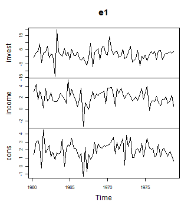
<p class="caption">plot of chunk data</p>
</div>

### Setting up a model

The `create_bvarmodel` function produces an object, which contains information on the specification of the VAR model that should be estimated. The following code specifies a VAR(2) model with an intercept term. The number of iterations and burn-in draws is already specified at this stage.


``` r
model <- create_bvarmodel(e1, p = 2, deterministic = "const",
                          iterations = 5000, burnin = 1000)
```

Note that the function is also capable of generating more than one model. For example, specifying `p = 0:2` would result in three models.

### Adding prior hyperparameters

Function `add_priors` produces priors for the specified model(s) in object `model` and augments the object accordingly.


``` r
model <- add_priors(model,
                    coef = list(v_i = 0, v_i_det = 0),
                    sigma = list(df = 1, scale = .0001))
```

If researchers want to fine-tune individual prior specifications, this can be done by directly accessing the respective elements in object `model_with_prior`.

### Adding initial values

Function `add_initial_values` adds initial values of posterior coefficients to `model_with_prior`. The default behaviour of the function is to obtain an LS estimate of the coefficients.


``` r
# The seed of the posterior simulation is drawn here
set.seed(1234567)
model <- add_initial_values(model, method = "ols")
```

## Obtaining posterior draws

`bvartools` comes with built-in posterior simulation functions from the [BayesTS](https://github.com/franzmohr/BayesTS) library. By using function `add_posterior_coefficients` the model input is forwarded to a posterior function and the output is added to the original object:


``` r
model <- add_posterior_coefficients(model)
```

If researchers prefer to use their own posterior algorithms, this can be done by specifying argument `posterior_function` with a function that uses object `model` as its input.

## Evaluation

### Inspect posterior draws

Posterior draws can be visually inspected by using the `plot` function. By default, it produces a series of histograms of all estimated coefficients.


``` r
plot(model)
```

<div class="figure" style="text-align: center">
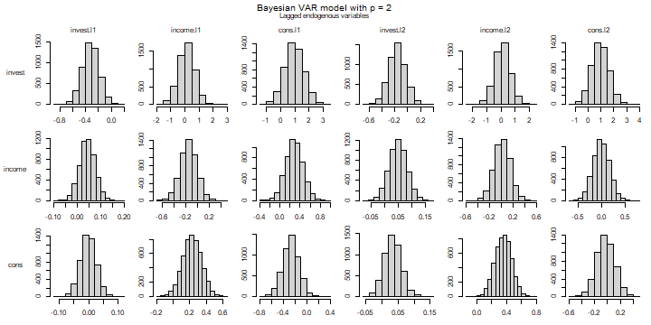
<p class="caption">plot of chunk histograms</p>
</div><div class="figure" style="text-align: center">
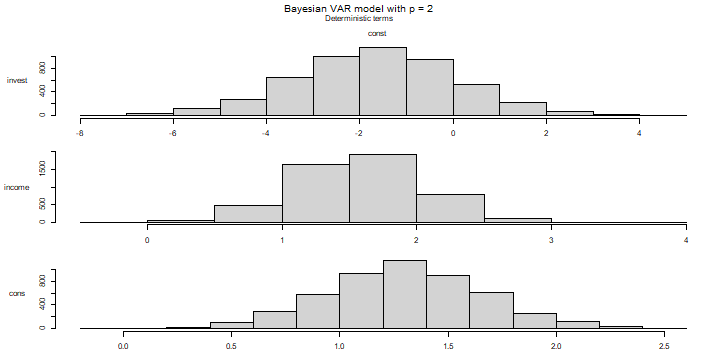
<p class="caption">plot of chunk histograms</p>
</div><div class="figure" style="text-align: center">
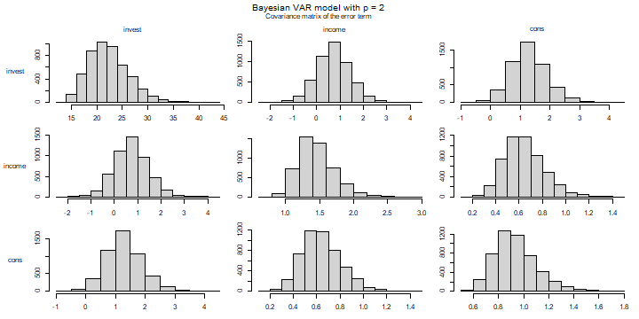
<p class="caption">plot of chunk histograms</p>
</div>

Alternatively, the trace plot of the post-burnin draws can be drawn by adding the argument `type = "trace"`:


``` r
plot(model, type = "trace")
```

<div class="figure" style="text-align: center">
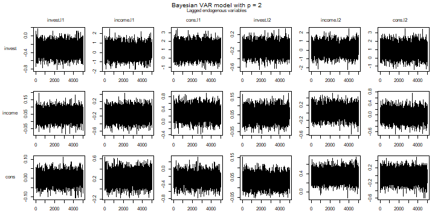
<p class="caption">plot of chunk traceplots</p>
</div><div class="figure" style="text-align: center">
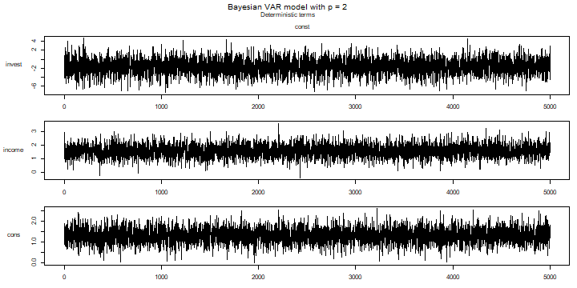
<p class="caption">plot of chunk traceplots</p>
</div><div class="figure" style="text-align: center">
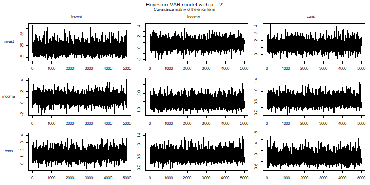
<p class="caption">plot of chunk traceplots</p>
</div>

### Summary statistics

Summary statistics can be obtained in the usual way using the `summary` method.


``` r
summary(model)
#> 
#> Bayesian VAR model with p = 2 
#> 
#> Endogenous variables: invest, income, cons
#> 
#> Variable: invest 
#> 
#>                 Mean        SD    Naive SD Time-series SD       2.5%        50%
#> invest.l1 -0.3203060 0.1279956 0.001810131    0.001810131 -0.5718547 -0.3201118
#> income.l1  0.1424317 0.5594494 0.007911809    0.007108336 -0.9691589  0.1441895
#> cons.l1    0.9642472 0.6724965 0.009510537    0.009646315 -0.3367044  0.9505872
#> invest.l2 -0.1613877 0.1295269 0.001831787    0.001776471 -0.4121541 -0.1612701
#> income.l2  0.1086389 0.5531500 0.007822723    0.007822723 -0.9933172  0.1096671
#> cons.l2    0.9361046 0.6707353 0.009485630    0.009738923 -0.3763424  0.9409542
#> const     -1.6550115 1.7450633 0.024678922    0.024678922 -5.1628759 -1.6257428
#>                 97.5%  
#> invest.l1 -0.07193361 *
#> income.l1  1.23387932  
#> cons.l1    2.31279819  
#> invest.l2  0.09019922  
#> income.l2  1.21134024  
#> cons.l2    2.25209415  
#> const      1.67946912  
#> 
#> Variable: income 
#> 
#>                   Mean         SD     Naive SD Time-series SD        2.5%
#> invest.l1  0.043942531 0.03298429 0.0004664683   0.0004664683 -0.01952417
#> income.l1 -0.152671388 0.14073254 0.0019902587   0.0019902587 -0.43313298
#> cons.l1    0.287757921 0.17146598 0.0024248951   0.0023350613 -0.04063613
#> invest.l2  0.049701368 0.03253800 0.0004601568   0.0004601568 -0.01376721
#> income.l2  0.019545148 0.13896774 0.0019653006   0.0019653006 -0.25121800
#> cons.l2   -0.009855836 0.17233068 0.0024371239   0.0024371239 -0.34587953
#> const      1.579222043 0.45618722 0.0064514615   0.0064514615  0.69651513
#>                   50%     97.5%  
#> invest.l1  0.04372061 0.1098251  
#> income.l1 -0.15387455 0.1203594  
#> cons.l1    0.28650831 0.6269482  
#> invest.l2  0.04984610 0.1143634  
#> income.l2  0.01942392 0.2960480  
#> cons.l2   -0.01155792 0.3256886  
#> const      1.57579759 2.4841305 *
#> 
#> Variable: cons 
#> 
#>                   Mean         SD    Naive SD Time-series SD         2.5%
#> invest.l1 -0.001836747 0.02677417 0.000378644   0.0003882236 -0.054491820
#> income.l1  0.228459820 0.11543691 0.001632524   0.0014184958  0.001674708
#> cons.l1   -0.268580628 0.13948190 0.001972572   0.0019725720 -0.543925537
#> invest.l2  0.033544937 0.02635026 0.000372649   0.0003726490 -0.017926896
#> income.l2  0.356564581 0.11182527 0.001581448   0.0015814482  0.138655141
#> cons.l2   -0.025501264 0.14022460 0.001983075   0.0019830753 -0.295588927
#> const      1.300183022 0.36488084 0.005160194   0.0051601943  0.585607251
#>                   50%        97.5%  
#> invest.l1 -0.00170442  0.049108341  
#> income.l1  0.22881767  0.450705708 *
#> cons.l1   -0.26627195 -0.001352864 *
#> invest.l2  0.03348491  0.085652005  
#> income.l2  0.35673537  0.573623920 *
#> cons.l2   -0.02781087  0.250517570  
#> const      1.29648603  2.028044414 *
#> 
#> Variance-covariance matrix:
#> 
#>                     Mean        SD    Naive SD Time-series SD       2.5%
#> invest_invest 22.3351407 4.0217605 0.056876282    0.062536333 15.7824157
#> invest_income  0.7227433 0.7380442 0.010437521    0.011472421 -0.7273071
#> invest_cons    1.2907978 0.6069315 0.008583307    0.009740524  0.1794817
#> income_income  1.4445651 0.2589445 0.003662028    0.004043948  1.0183738
#> income_cons    0.6434349 0.1685107 0.002383101    0.002631009  0.3614980
#> cons_cons      0.9353396 0.1683432 0.002380732    0.002624154  0.6632334
#>                      50%     97.5%  
#> invest_invest 21.9123711 31.176113 *
#> invest_income  0.7059832  2.234627  
#> invest_cons    1.2550332  2.615498 *
#> income_income  1.4159077  2.031911 *
#> income_cons    0.6277095  1.009114 *
#> cons_cons      0.9153014  1.315926 *
```

As expected for an algrotihm with uninformative priors the posterior means are fairly close to the results of the frequentist estimator, which can be obtaind in the following way:


``` r
# Obtain data for LS estimator
k <- model[["model"]][["k"]]
y <- t(model[["data"]][["train"]][["y"]])
x <- t(model[["data"]][["train"]][["x"]])

# Calculate LS estimates
A_freq <- tcrossprod(y, x) %*% solve(tcrossprod(x))

# Round estimates and print
round(A_freq, 3)
#>        invest.01 income.01 cons.01 invest.02 income.02 cons.02  const
#> invest    -0.320     0.146   0.961    -0.161     0.115   0.934 -1.672
#> income     0.044    -0.153   0.289     0.050     0.019  -0.010  1.577
#> cons      -0.002     0.225  -0.264     0.034     0.355  -0.022  1.293
```

### Thin results

The MCMC series in object `model` can be thinned using


``` r
model <- thin(model, thin = 10)
```


## Application

### Forecasts

Forecasts are obtained in two steps. First, function `add_forecast_input` generates the data of the forecast periods, where deterministic terms can be provided in the argument `deterministic` and unmodelled variables in the argument `exogen`. If they are not provided, the function tries to obtain them from the model and gives a message, if it does not succeed. Second, function `add_posterior_forecasts` then simulates the forecasts.


``` r
model <- add_forecast_input(model, n_ahead = 10)
model <- add_posterior_forecasts(model)
```

Forecasts with credible bands can be extracted from the model using the `predict` function. The `n_ahead` argument can be used to set the given forecast horizon. However, the number of available forecast periods is limited to specification used in `add_forecast_input`.


``` r
bvar_pred <- predict(model, n_ahead = 10)

plot(bvar_pred, n_pre = 20)
```

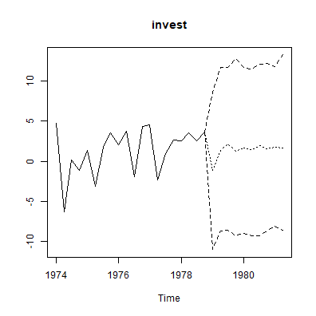

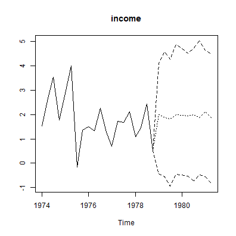

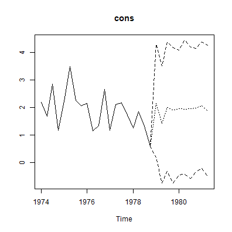

### Impulse response analysis

`bvartools` supports commonly used impulse response functions. See [https://www.r-econometrics.com/timeseries/irf/](https://www.r-econometrics.com/timeseries/irf/) for an introduction.

#### Forecast error impulse response


``` r
FEIR <- irf(model, impulse = "income", response = "cons", n_ahead = 8)

plot(FEIR, main = "Forecast Error Impulse Response", xlab = "Period", ylab = "Response")
```

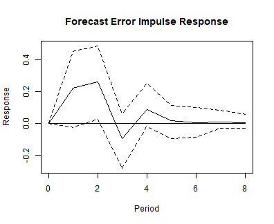

#### Orthogonalised impulse response


``` r
OIR <- irf(model, impulse = "income", response = "cons", n_ahead = 8, type = "oir")

plot(OIR, main = "Orthogonalised Impulse Response", xlab = "Period", ylab = "Response")
```

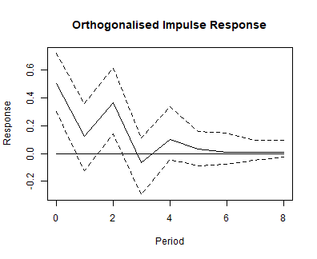

#### Generalised impulse response


``` r
GIR <- irf(model, impulse = "income", response = "cons", n_ahead = 8, type = "gir")

plot(GIR, main = "Generalised Impulse Response", xlab = "Period", ylab = "Response")
```

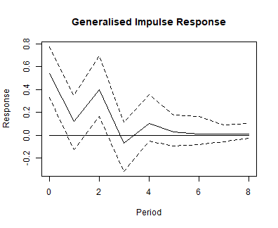

### Variance decomposition

`bvartools` also supports forecast error variance decomposition (FEVD) and generalised forecast error variance decomposition.

#### Forecast error variance decomposition 


``` r
bvar_fevd_oir <- fevd(model, response = "cons")

plot(bvar_fevd_oir, main = "OIR-based FEVD of consumption")
```

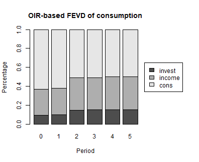

#### Generalised forecast error variance decomposition 

It is also possible to calculate FEVDs, which are based on generalised impulse responses (GIR). Note that these do not automatically add up to unity. However, this could be changed by adding `normalise_gir = TRUE` to the function's arguments.


``` r
bvar_fevd_gir <- fevd(model, response = "cons", type = "gir")

plot(bvar_fevd_gir, main = "GIR-based FEVD of consumption")
```

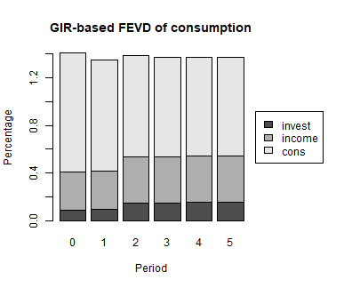

## Using `bvartools` with user-written algorithms

`bvartools` was created to assist researchers in building and evaluating their own posterior simulation algorithms for linear BVAR models. Functions `create_bvarmodel` simply help to quickly obtain the relevant data matrices for posterior simulation. Estimation can be done using algortihms, which are usually implemented by researchers themselves. But once posterior draws are obtained `bvartools` can assist throughout in the following steps of the analysis. In this context the main contributions of the package are:

- Function `bvar` collects the output of a Gibbs sampler in a standardized object, which can be used for subsequent steps in an analysis.
- Functions such as `predict`, `irf`, `fevd` for forecasting, impulse response analysis and forecast error variance decomposition, respectively, use the output of `bvar` and, hence, researchers do not have to implement them themselves and can save time.
- Computationally intensive functions - such as for posterior simulation - are written in C++ using the `RcppArmadillo` package of Eddelbuettel and Sanderson (2014).[^cpp] This decreases calculation time and makes the code less complex and, thus, less prone to mistakes.

If researchers are willing to rely on the model generation and evaluation functions of `bvartools`, the only remaining step is to illustrate how user specific algorithms can be combined with the functional framework of the package. This is shown in the remainder of this introduction.

### Model set-up and prior specifications

These steps are exactly the same as described above. Thus, the following Gibbs sampler departs from object `model_with_priors` from above.

### A Gibbs sampler algorithm


``` r
# Reset random number generator for reproducibility
set.seed(1234567)

iterations <- 10000 # Number of saved iterations of the Gibbs sampler
burnin <- 5000 # Number of burn-in draws
draws <- iterations + burnin # Total number of MCMC draws

y <- t(model[["data"]][["train"]][["y"]])
x <- t(model[["data"]][["train"]][["x"]])

tt <- ncol(y) # Number of observations
k <- nrow(y) # Number of endogenous variables
m <- k * nrow(x) # Number of estimated coefficients

# Set (uninformative) priors
a_mu_prior <- model[["priors"]][["a"]][["mu"]] # Vector of prior parameter means
a_v_i_prior <- model[["priors"]][["a"]][["v_inv"]] # Inverse of the prior covariance matrix

u_sigma_df_prior <- model[["priors"]][["u_sigma"]][["df"]] # Prior degrees of freedom
u_sigma_scale_prior <- model[["priors"]][["u_sigma"]][["scale"]] # Prior covariance matrix
u_sigma_df_post <- tt + u_sigma_df_prior # Posterior degrees of freedom

# Initial values
u_sigma_i <- diag(1 / .00001, k)

# Data containers for posterior draws
draws_a <- matrix(NA, m, iterations)
draws_sigma <- matrix(NA, k^2, iterations)

# Start Gibbs sampler
for (draw in 1:draws) {
  # Draw conditional mean parameters
  a <- post_normal(y, x, u_sigma_i, a_mu_prior, a_v_i_prior)
  
  # Draw variance-covariance matrix
  u <- y - matrix(a, k) %*% x # Obtain residuals
  u_sigma_scale_post <- solve(u_sigma_scale_prior + tcrossprod(u))
  u_sigma_i <- matrix(rWishart(1, u_sigma_df_post, u_sigma_scale_post)[,, 1], k)
  
  # Store draws
  if (draw > burnin) {
    draws_a[, draw - burnin] <- a
    # Store inverted Sigma_i to obtain Sigma
    draws_sigma[, draw - burnin] <- solve(u_sigma_i)
  }
}
```

### `bvarmodel` objects

The `bvar` function can be used to collect relevant output of the Gibbs sampler into a standardized object of class `bvarmodel`, which can be used by functions such as `predict` to obtain forecasts or `irf` for impulse respons analysis.


``` r
y <- model[["data"]][["train"]][["y"]]

bvar_est_two <- bvar(y = y,
                     x = model[["data"]][["train"]][["x"]],
                     A = draws_a[1:18,],
                     C = draws_a[19:21, ],
                     Sigma = draws_sigma)
```

Since the output of function `draw_posterior` is an object of class `bvarmodel` as well, the calculation of summary statistics, forecasts, impulse responses and forecast error variance decompositions is performed as described above.


``` r
summary(bvar_est_two)
#> 
#> Bayesian VAR model with p = 2 
#> 
#> Endogenous variables: invest, income, cons
#> 
#> Variable: invest 
#> 
#>                 Mean        SD    Naive SD Time-series SD       2.5%        50%
#> invest.l1 -0.3209994 0.1280102 0.001280102    0.001286291 -0.5734283 -0.3216256
#> income.l1  0.1471972 0.5653707 0.005653707    0.005653707 -0.9601798  0.1439023
#> cons.l1    0.9662216 0.6767544 0.006767544    0.006777551 -0.3452887  0.9560136
#> invest.l2 -0.1600464 0.1263206 0.001263206    0.001304661 -0.4048865 -0.1611636
#> income.l2  0.1035875 0.5518755 0.005518755    0.005439039 -0.9653135  0.1010048
#> cons.l2    0.9347698 0.6893889 0.006893889    0.006893889 -0.4164533  0.9283409
#> const     -1.6636708 1.7556026 0.017556026    0.017556026 -5.1131347 -1.6427596
#>                 97.5%  
#> invest.l1 -0.06831104 *
#> income.l1  1.26083425  
#> cons.l1    2.32033944  
#> invest.l2  0.08747471  
#> income.l2  1.19676048  
#> cons.l2    2.28239234  
#> const      1.81571899  
#> 
#> Variable: income 
#> 
#>                   Mean         SD     Naive SD Time-series SD        2.5%
#> invest.l1  0.043538817 0.03282873 0.0003282873   0.0003339793 -0.02134167
#> income.l1 -0.152587178 0.14272417 0.0014272417   0.0014354001 -0.43483749
#> cons.l1    0.287002517 0.17214572 0.0017214572   0.0017583324 -0.05263822
#> invest.l2  0.049836048 0.03214857 0.0003214857   0.0003214857 -0.01314576
#> income.l2  0.019208561 0.13846407 0.0013846407   0.0013846407 -0.25073551
#> cons.l2   -0.008993818 0.17079324 0.0017079324   0.0017079324 -0.34237291
#> const      1.577324249 0.44978283 0.0044978283   0.0044978283  0.69836815
#>                    50%     97.5%  
#> invest.l1  0.043639581 0.1077596  
#> income.l1 -0.152102393 0.1277937  
#> cons.l1    0.284571823 0.6300760  
#> invest.l2  0.049738086 0.1135096  
#> income.l2  0.020273010 0.2888129  
#> cons.l2   -0.009633005 0.3335256  
#> const      1.573285781 2.4624095 *
#> 
#> Variable: cons 
#> 
#>                   Mean         SD     Naive SD Time-series SD        2.5%
#> invest.l1 -0.002622984 0.02648002 0.0002648002   0.0002648002 -0.05469872
#> income.l1  0.223177576 0.11668272 0.0011668272   0.0011668272 -0.00384140
#> cons.l1   -0.263005581 0.13888117 0.0013888117   0.0013888117 -0.53917857
#> invest.l2  0.033789248 0.02612399 0.0002612399   0.0002612399 -0.01770897
#> income.l2  0.354398279 0.11138451 0.0011138451   0.0011302181  0.13155910
#> cons.l2   -0.020350735 0.13877699 0.0013877699   0.0013661012 -0.29450792
#> const      1.292295624 0.35785838 0.0035785838   0.0035785838  0.59071911
#>                    50%       97.5%  
#> invest.l1 -0.002433263 0.049704315  
#> income.l1  0.222296885 0.449267333  
#> cons.l1   -0.262529739 0.007515141  
#> invest.l2  0.033990454 0.085768693  
#> income.l2  0.356159445 0.571057742 *
#> cons.l2   -0.019763112 0.254939286  
#> const      1.290012200 2.006568642 *
#> 
#> Variance-covariance matrix:
#> 
#>                     Mean        SD    Naive SD Time-series SD       2.5%
#> invest_invest 22.3072220 4.0178380 0.040178380    0.044990338 15.8398654
#> invest_income  0.7560915 0.7312545 0.007312545    0.008046444 -0.6330327
#> invest_cons    1.2955574 0.6021675 0.006021675    0.006781077  0.2156928
#> income_income  1.4378139 0.2610475 0.002610475    0.002853997  1.0191372
#> income_cons    0.6442296 0.1690491 0.001690491    0.001873490  0.3596336
#> cons_cons      0.9347527 0.1680653 0.001680653    0.001871957  0.6610009
#>                      50%     97.5%  
#> invest_invest 21.7999153 31.326979 *
#> invest_income  0.7285783  2.294064  
#> invest_cons    1.2701401  2.576358 *
#> income_income  1.4056673  2.037694 *
#> income_cons    0.6279908  1.032157 *
#> cons_cons      0.9140748  1.311783 *
```

## Citing bvartools

If you use `bvartools` in published work, please cite it. `citation("bvartools")` prints the reference, and the package has the DOI [10.5281/zenodo.22736604](https://doi.org/10.5281/zenodo.22736604), which always resolves to the latest archived version.

## References

Chan, J., Koop, G., Poirier, D. J., & Tobias, J. L. (2019). *Bayesian Econometric Methods* (2nd ed.). Cambridge: University Press.

Eddelbuettel, D., & Sanderson C. (2014). RcppArmadillo: Accelerating R with high-performance C++ linear algebra. *Computational Statistics and Data Analysis, 71*, 1054-1063. <https://doi.org/10.1016/j.csda.2013.02.005>

George, E. I., Sun, D., & Ni, S. (2008). Bayesian stochastic search for VAR model restrictions. *Journal of Econometrics, 142*(1), 553-580. <https://doi.org/10.1016/j.jeconom.2007.08.017>

Kim, S., Shephard, N., & Chib, S. (1998). Stochastic volatility: Likelihood inference and comparison with ARCH models. *Review of Economic Studies, 65*(3), 361-393. <https://doi.org/10.1111/1467-937X.00050>

Koop, G., León-González, R., & Strachan R. W. (2010). Efficient posterior simulation for cointegrated models with priors on the cointegration space. *Econometric Reviews, 29*(2), 224-242. <https://doi.org/10.1080/07474930903382208>

Koop, G., León-González, R., & Strachan R. W. (2011). Bayesian inference in a time varying cointegration model. *Journal of Econometrics, 165*(2), 210-220. <https://doi.org/10.1016/j.jeconom.2011.07.007>

Koop, G., Pesaran, M. H., & Potter, S.M. (1996). Impulse response analysis in nonlinear multivariate models. *Journal of Econometrics 74*(1), 119-147. <https://doi.org/10.1016/0304-4076(95)01753-4>

Korobilis, D. (2013). VAR forecasting using Bayesian variable selection. *Journal of Applied Econometrics, 28*(2), 204-230. <https://doi.org/10.1002/jae.1271>

Lütkepohl, H. (2006). *New introduction to multiple time series analysis* (2nd ed.). Berlin: Springer.

Pesaran, H. H., & Shin, Y. (1998). Generalized impulse response analysis in linear multivariate models. *Economics Letters, 58*(1), 17-29. <https://doi.org/10.1016/S0165-1765(97)00214-0>

Sanderson, C., & Curtin, R. (2016). Armadillo: a template-based C++ library for linear algebra. *Journal of Open Source Software, 1*(2), 26. <https://doi.org/10.21105/joss.00026>

[^cpp]: `RcppArmadillo` is the `Rcpp` bridge to the open source 'Armadillo' library of Sanderson and Curtin (2016).

[^further]: Further examples about the use of the `bvartools` package are available at <https://www.r-econometrics.com/timeseriesintro/>.
