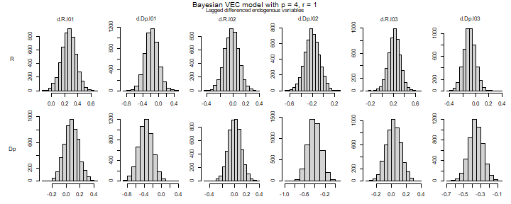
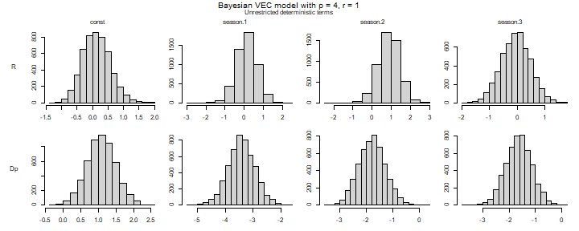
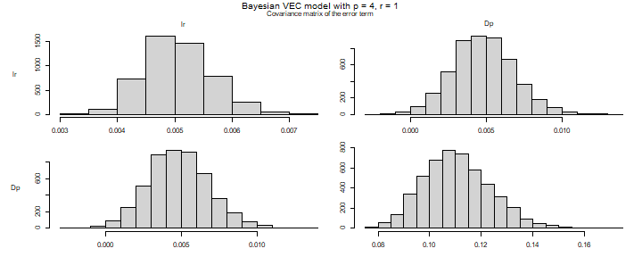

## Introduction

This vignette provides the code to set up and estimate a Bayesian vector error correction (BVEC) model with the `bvartools` package. The presented Gibbs sampler is based on the approach of Koop et al. (2010), who propose a prior on the cointegration space. The estimated model has the following form

$$\Delta y_t = \Pi y_{t - 1} + \sum_{l = 1}^{p - 1} \Gamma_l \Delta y_{t - l} + C d_t + u_t,$$
where $\Pi = \alpha \beta^{\prime}$ with cointegration rank $r$, $u_t \sim N(0, \Sigma)$ and $d_t$ contains deterministic terms. For an introduction to vector error correction models see [https://www.r-econometrics.com/timeseries/vecintro/](https://www.r-econometrics.com/timeseries/vecintro/).

## Data

To illustrate the workflow of the analysis, the Austrian long-term interest rate (`lr`) and inflation (`Dp`) are taken from data set `at_macrodata`, both in percent per quarter from 1979Q2 to 2019Q4. The series are seasonally adjusted, so that $d_t$ contains only an intercept.


``` r
library(bvartools)

data("at_macrodata")

data <- window(at_macrodata[["domestic"]][, c("lr", "Dp")], end = c(2019, 4)) * 100
plot(data) # Plot the series
```

<div class="figure" style="text-align: center">

<p class="caption">plot of chunk data</p>
</div>

The `create_bvecmodel` function produces an object of class `bvecmodel`, where the element `data$train` contains the data matrices `y`, `w` and `x` for the BVEC estimator, where `y` is the matrix of dependent variables, `w` is a matrix of potentially cointegrated regressors, and `x` is the matrix of non-cointegration regressors.


``` r
object <- create_bvecmodel(data, p = 4, r = 1,
                           const = "unrestricted",
                           iterations = 5000, burnin = 1000)
```

Argument `p` represents the lag order of the VAR form of the model and `r` is the cointegration rank of `Pi`. Function `create_bvecmodel` requires to specify the inclusion of intercepts, trends and seasonal dummies separately. This allows to decide on whether they enter the cointegration term (`"restricted"`) or the non-cointegration part (`"unrestricted"`) of the model.

Models such as the one proposed in Koop, Leon-Gonzalez and Strachan (2010) put a restriction on the space spanned by $\beta$. This means, that the scale of the variables in the error correction term becomes important. A reasonable approach to handle this, is to rescale the series in the error correction term. Function `scale_error_correction_term` can be used for this purpose. It rescales all non-deterministic elements by their respective differenced series' standard deviation. If `object[["data"]][["train"]][["w"]]` contains a column named `trend`, its valus are replaced by $(t - T/2) / T$.


``` r
object <- scale_error_correction(object)
```


## Priors

Function `add_priors` adds the necessary prior specifications to object `object`. For the current application non-informative priors are used:


``` r
object <- add_priors(object,
                     coef = list(v_i = 0, v_i_det = 0),
                     coint = list(v_i = 0, p_tau_i = 1),
                     sigma = list(df = 0, scale = .0001))
```

### Adding initial values

Function `add_initial_values` generates of first draws of the Gibbs sampler for the specified model(s) in object `model` and augments the object accordingly.


``` r
object <- add_initial_values(object, method = "maxlik")
```


## Estimation

### User-specific algorithm

The following code produces posterior draws using the algorithm described in Koop et al. (2010).


``` r
# Reset random number generator for reproducibility
set.seed(7654321)

# Obtain data matrices
y <- t(object[["data"]][["train"]][["y"]])
w <- t(object[["data"]][["train"]][["w"]])
x <- t(object[["data"]][["train"]][["x"]])

r <- object[["model"]][["rank"]] # Set rank

tt <- ncol(y) # Number of observations
k <- nrow(y) # Number of endogenous variables
k_w <- nrow(w) # Number of regressors in error correction term
k_x <- nrow(x) # Number of differenced regressors and unrestrictec deterministic terms
k_gamma <- k * k_x # Total number of non-cointegration coefficients

k_alpha <- k * r # Number of elements in alpha
k_beta <- k_w * r # Number of elements in beta

# Priors
a_mu_prior <- object[["priors"]][["a"]][["mu"]] # Prior means
a_v_i_prior <- object[["priors"]][["a"]][["v_inv"]] # Inverse of the prior covariance matrix

v_i <- object[["priors"]][["beta"]][["v_inv"]]
p_tau_i <- object[["priors"]][["beta"]][["p_tau_inv"]]

sigma_df_prior <- object[["priors"]][["u_sigma"]][["df"]] # Prior degrees of freedom
sigma_scale_prior <- object[["priors"]][["u_sigma"]][["scale"]] # Prior covariance matrix
sigma_df_post <- tt + sigma_df_prior # Posterior degrees of freedom

# Initial values
beta <- object[["initial"]][["beta"]]
sigma_i <- object[["initial"]][["u_sigma_inv"]]

g_i <- sigma_i

iterations <- object[["model"]][["iterations"]] # Number of iterations of the Gibbs sampler
burnin <- object[["model"]][["burnin"]] # Number of burn-in draws
draws <- iterations + burnin # Total number of draws

# Data containers
draws_alpha <- matrix(NA, k_alpha, iterations)
draws_beta <- matrix(NA, k_beta, iterations)
draws_pi <- matrix(NA, k * k_w, iterations)
draws_gamma <- matrix(NA, k_gamma, iterations)
draws_sigma <- matrix(NA, k^2, iterations)

# Start Gibbs sampler
for (draw in 1:draws) {
  
  # Draw conditional mean parameters
  temp <- post_coint_kls(y = y, beta = beta, w = w, x = x, sigma_i = sigma_i,
                         v_i = v_i, p_tau_i = p_tau_i, g_i = g_i,
                         gamma_mu_prior = a_mu_prior,
                         gamma_v_i_prior = a_v_i_prior)
  alpha <- temp[["alpha"]]
  beta <- temp[["beta"]]
  Pi <- temp[["Pi"]]
  gamma <- temp[["Gamma"]]
  
  # Draw variance-covariance matrix
  u <- y - Pi %*% w - matrix(gamma, k) %*% x
  sigma_scale_post <- solve(tcrossprod(u) + v_i * alpha %*% tcrossprod(crossprod(beta, p_tau_i) %*% beta, alpha))
  sigma_i <- matrix(rWishart(1, sigma_df_post, sigma_scale_post)[,, 1], k)
  sigma <- solve(sigma_i)
  
  # Update g_i
  g_i <- sigma_i
  
  # Store draws
  if (draw > burnin) {
    draws_alpha[, draw - burnin] <- alpha
    draws_beta[, draw - burnin] <- beta
    draws_pi[, draw - burnin] <- Pi
    draws_gamma[, draw - burnin] <- gamma
    draws_sigma[, draw - burnin] <- sigma
  }
}
```

The `bvec` function can be used to collect output of the above Gibbs sampler in a standardized object of class `bvecmodel`, which can be used further for forecasting, impulse response analysis or forecast error variance decomposition. The error correction term is described by the draws of `alpha` and `beta` and not by those of `Pi`, since the latter cannot be decomposed into the former.


``` r
# Number of non-deterministic coefficients
k_nondet <- (k_x - 1) * k

# Generate bvecmodel object
bvec_est <- bvec(y = object[["data"]][["train"]][["y"]],
                 w = object[["data"]][["train"]][["w"]],
                 x = object[["data"]][["train"]][["x"]][, 1:6],
                 x_d = object[["data"]][["train"]][["x"]][, -(1:6), drop = FALSE],
                 r = 1,
                 alpha = draws_alpha,
                 beta = draws_beta,
                 Gamma = draws_gamma[1:k_nondet,],
                 C = draws_gamma[(k_nondet + 1):nrow(draws_gamma),],
                 Sigma = draws_sigma)
```

The draws were obtained from the rescaled error correction term, so they refer to the rescaled series in `w`. Function `rescale_error_correction` undoes the transformation of `scale_error_correction`: it puts the series in `object$data$train$w` back on the scale of the input data and multiplies the draws of `beta` by the inverse of the scaling factors. The draws of `alpha` are not affected, because the error correction term of the estimated model is $\alpha \beta^{\prime} D^{-1} w_t$, where $D$ is the diagonal matrix of scaling factors.


``` r
bvec_est <- rescale_error_correction(bvec_est)
```

This step is required before the model is used any further. Functions such as `vec_to_var` recover the levels of the endogenous variables from the differences in `y` and their lags in `w`, which is only possible if both are on the same scale.

Obtain point estimates of cointegration variables:


``` r
beta <- bvec_est[["posterior"]][["beta"]][["coeffs"]] # Obtain draws of beta
beta <- apply(beta / beta[, 1], 2, median) # Normalise and obtain medians
beta <- matrix(beta, k_w) # Transform vector into a matrix
beta <- round(beta, 3) # Round values
dimnames(beta) <- list(dimnames(w)[[1]], NULL) # Rename matrix dimensions

beta # Print
#>        [,1]
#> l.lr  1.000
#> l.Dp -3.727
```

Posterior draws can be inspected with `plot`. Note that the coefficients of the error correction term are displayed as draws of `Pi`, i.e. as the product of `alpha` and `beta`, since the two matrices are only identified up to a rotation.


``` r
plot(bvec_est)
```

<div class="figure" style="text-align: center">

<p class="caption">plot of chunk unnamed-chunk-6</p>
</div><div class="figure" style="text-align: center">

<p class="caption">plot of chunk unnamed-chunk-6</p>
</div><div class="figure" style="text-align: center">

<p class="caption">plot of chunk unnamed-chunk-6</p>
</div><div class="figure" style="text-align: center">

<p class="caption">plot of chunk unnamed-chunk-6</p>
</div>

Obtain summaries of posterior draws


``` r
summary(bvec_est)
#> 
#> Bayesian VEC model with p = 4 
#> 
#> Endogenous variables: lr, Dp
#> 
#> Variable: lr 
#> 
#>                   Mean          SD     Naive SD Time-series SD        2.5%
#> l.lr      0.0001800521 0.005999351 8.484363e-05   8.484363e-05 -0.01264254
#> l.Dp     -0.0016945997 0.021039799 2.975477e-04   2.975477e-04 -0.04262135
#> d.lr.l01  0.4577095133 0.083548723 1.181557e-03   1.181557e-03  0.29383604
#> d.Dp.l01  0.0143507751 0.021921597 3.100182e-04   3.181241e-04 -0.02902253
#> d.lr.l02 -0.2179769740 0.089961488 1.272248e-03   1.272248e-03 -0.39615212
#> d.Dp.l02  0.0068815365 0.021500957 3.040694e-04   3.040694e-04 -0.03633953
#> d.lr.l03  0.1535682100 0.083119227 1.175483e-03   1.175483e-03 -0.01022201
#> d.Dp.l03 -0.0092384500 0.017432977 2.465395e-04   2.465395e-04 -0.04303250
#> const    -0.0073744787 0.009034828 1.277718e-04   1.312298e-04 -0.02479927
#>                    50%       97.5%  
#> l.lr      0.0002057335  0.01226585  
#> l.Dp     -0.0014732527  0.03921226  
#> d.lr.l01  0.4578171187  0.62822821 *
#> d.Dp.l01  0.0141410915  0.05799969  
#> d.lr.l02 -0.2178411003 -0.04139785 *
#> d.Dp.l02  0.0070121796  0.04850665  
#> d.lr.l03  0.1528919289  0.31806734  
#> d.Dp.l03 -0.0093654356  0.02407668  
#> const    -0.0075252970  0.01090390  
#> 
#> Variable: Dp 
#> 
#>                 Mean         SD     Naive SD Time-series SD         2.5%
#> l.lr      0.11770442 0.05259828 0.0007438519    0.001366545  0.012291479
#> l.Dp     -0.44172162 0.10241320 0.0014483414    0.001516644 -0.640479460
#> d.lr.l01  0.43814434 0.38813310 0.0054890310    0.005822437 -0.338749763
#> d.Dp.l01 -0.28802695 0.10459126 0.0014791438    0.001603386 -0.492007133
#> d.lr.l02  0.14554735 0.41783980 0.0059091472    0.005909147 -0.669198804
#> d.Dp.l02 -0.12040005 0.09935509 0.0014050931    0.001527643 -0.317069640
#> d.lr.l03  0.49330887 0.38885684 0.0054992661    0.005625185 -0.298238792
#> d.Dp.l03  0.01051368 0.08006451 0.0011322831    0.001190007 -0.146525986
#> const     0.12819249 0.06039045 0.0008540499    0.001840523  0.009279599
#>                  50%       97.5%  
#> l.lr      0.11805435  0.22264308 *
#> l.Dp     -0.44261427 -0.23831731 *
#> d.lr.l01  0.44033614  1.17881775  
#> d.Dp.l01 -0.28733072 -0.08395376 *
#> d.lr.l02  0.14525534  0.97046299  
#> d.Dp.l02 -0.11920729  0.07527149  
#> d.lr.l03  0.50137013  1.23892786  
#> d.Dp.l03  0.01016353  0.16916103  
#> const     0.12930340  0.24599078 *
#> 
#> Variance-covariance matrix:
#> 
#>              Mean           SD     Naive SD Time-series SD         2.5%
#> lr_lr 0.005056863 0.0005786848 8.183839e-06   8.685985e-06 0.0040396908
#> lr_Dp 0.004820433 0.0020169567 2.852408e-05   2.941573e-05 0.0009997567
#> Dp_Dp 0.110748405 0.0131121372 1.854336e-04   1.923718e-04 0.0877985208
#>               50%       97.5%  
#> lr_lr 0.005015815 0.006304927 *
#> lr_Dp 0.004786599 0.009032807 *
#> Dp_Dp 0.109859966 0.138229363 *
```

### Default algorithm

As an alternative to a user-specific algorithm, function `add_posterior_coefficients` can be used to estimate such a model as well:


``` r
bvec_est <- add_posterior_coefficients(object)
bvec_est <- rescale_error_correction(bvec_est)
```

### A prior centred on the maximum likelihood estimate

The prior used above is uniform on the cointegration space. That is not a consequence of `p_tau_i = 1` alone: the sampler uses `v_i` and `p_tau_i` only through their product, so with `v_i = 0` the prior on the space is uniform whatever `p_tau_i` is. An informative prior on the space needs a positive `v_i`.

A natural centre for such a prior is the space spanned by Johansen's (1995) maximum likelihood estimate of $\beta$. With `coint = list(p_tau_i = "ml")`, `add_priors` builds $P_\tau$ so that, given $\alpha$, the prior on how far $\beta$ tilts away from that space is the sampling distribution of the estimator itself, with its precision multiplied by `weight`. With `weight = 1` the prior adds as much information about the space as the sample holds. With `v_i = "ml"` the shrinkage of the loadings is set from their maximum likelihood estimate as well, so that it is weak on the scale the data put them on.

Because the prior is built from Johansen's estimate on the series as they are stored in the model, it moves with the units of the error correction term, and scaling the series makes practically no difference to the posterior. The model below is therefore estimated without `scale_error_correction`, and consequently without `rescale_error_correction`. If the series are scaled, that has to happen before `add_priors`, which is enforced.


``` r
object_ml <- create_bvecmodel(data, p = 4, r = 1,
                              const = "unrestricted",
                              iterations = 5000, burnin = 1000)

object_ml <- add_priors(object_ml,
                        coef = list(v_i = 0, v_i_det = 0),
                        coint = list(v_i = "ml", p_tau_i = "ml", weight = 1),
                        sigma = list(df = 0, scale = .0001))

object_ml <- add_initial_values(object_ml, method = "maxlik")

set.seed(7654321)
bvec_ml <- add_posterior_coefficients(object_ml)
```

The posterior median of the normalised cointegration vector stays close to that under the uniform prior, while its credible interval narrows:


``` r
beta_ratio <- function(object) {
  draws <- object[["posterior"]][["beta"]][["coeffs"]]
  quantile(draws[, 2] / draws[, 1], c(0.05, 0.25, 0.5, 0.75, 0.95))
}

round(rbind("Uniform prior" = beta_ratio(bvec_est),
            "ML prior, weight = 1" = beta_ratio(bvec_ml)), 3)
#>                          5%    25%    50%    75%    95%
#> Uniform prior        -8.926 -4.802 -3.727 -3.031 -2.333
#> ML prior, weight = 1 -6.496 -4.418 -3.711 -3.222 -2.683
```

Since the centre is estimated from the same sample that the model is estimated on, the data enter twice, and the posterior overstates the precision of the cointegration space. Smaller values of `weight` reduce this. The prior is most useful where the likelihood alone is weakly informative about the space, for example in short samples or in larger systems.

## Evaluation

Posterior draws can be thinned with function `thin`:


``` r
bvec_est <- thin(bvec_est, thin = 5)
```

The function `vec_to_var` can be used to transform the VEC model into a VAR in levels:


``` r
bvar_form <- vec_to_var(bvec_est)
```

The output of `vec_to_var` is an object of class `bvarmodel` for which summary statistics, forecasts, impulse responses and variance decompositions can be obtained in the usual manner using `summary`, `predict`, `irf` and `fevd`, respectively.


``` r
summary(bvar_form)
#> 
#> Bayesian VAR model with p = 4 
#> 
#> Endogenous variables: lr, Dp
#> 
#> Variable: lr 
#> 
#>               Mean          SD     Naive SD Time-series SD        2.5%
#> lr.l1  1.462621098 0.081092700 0.0025643763   0.0025643763  1.30438020
#> Dp.l1  0.012824013 0.017868899 0.0005650642   0.0005650642 -0.02138521
#> lr.l2 -0.678390691 0.140753547 0.0044510180   0.0044510180 -0.95970904
#> Dp.l2 -0.007967771 0.018555985 0.0005867918   0.0005867918 -0.04642853
#> lr.l3  0.367010693 0.142128382 0.0044944941   0.0046625901  0.09534312
#> Dp.l3 -0.016040664 0.017283792 0.0005465615   0.0005465615 -0.05141039
#> lr.l4 -0.150949811 0.085311117 0.0026977744   0.0026977744 -0.31297851
#> Dp.l4  0.009307111 0.017762801 0.0005617091   0.0005617091 -0.02411658
#> const -0.007041342 0.009314285 0.0002945436   0.0002945436 -0.02577164
#>                50%       97.5%  
#> lr.l1  1.463429698  1.61386886 *
#> Dp.l1  0.012709996  0.04692572  
#> lr.l2 -0.677770310 -0.41404545 *
#> Dp.l2 -0.008305487  0.02791499  
#> lr.l3  0.368059171  0.63862929 *
#> Dp.l3 -0.015942613  0.01571222  
#> lr.l4 -0.154432810  0.01799558  
#> Dp.l4  0.009038086  0.04353424  
#> const -0.007317340  0.01301053  
#> 
#> Variable: Dp 
#> 
#>               Mean         SD    Naive SD Time-series SD         2.5%
#> lr.l1  0.552751992 0.38867576 0.012291007    0.012291007 -0.234460923
#> Dp.l1  0.270425251 0.08431089 0.002666144    0.002666144  0.106913297
#> lr.l2 -0.267988521 0.67504056 0.021346657    0.022371145 -1.517834275
#> Dp.l2  0.166149722 0.08290389 0.002621651    0.002621651  0.011885633
#> lr.l3  0.314638606 0.67035519 0.021198493    0.023983176 -1.041165764
#> Dp.l3  0.130163940 0.08504044 0.002689215    0.002689215 -0.044378337
#> lr.l4 -0.481727848 0.38438068 0.012155184    0.012155184 -1.192064711
#> Dp.l4 -0.006276769 0.07977544 0.002522721    0.002522721 -0.165171559
#> const  0.126522711 0.06073572 0.001920632    0.002296292  0.004997734
#>                50%     97.5%  
#> lr.l1  0.563250962 1.2854366  
#> Dp.l1  0.271993038 0.4441822 *
#> lr.l2 -0.256463629 1.0691787  
#> Dp.l2  0.163865857 0.3264441 *
#> lr.l3  0.316981526 1.5395619  
#> Dp.l3  0.131280713 0.2918491  
#> lr.l4 -0.481927505 0.2814969  
#> Dp.l4 -0.005411678 0.1426607  
#> const  0.128550964 0.2381864 *
#> 
#> Variance-covariance matrix:
#> 
#>              Mean           SD     Naive SD Time-series SD        2.5%
#> lr_lr 0.005087326 0.0005837053 1.845838e-05   2.097157e-05 0.004068290
#> lr_Dp 0.004862924 0.0019449666 6.150524e-05   6.150524e-05 0.001248388
#> Dp_Dp 0.110527824 0.0128804199 4.073146e-04   4.073146e-04 0.087241136
#>               50%       97.5%  
#> lr_lr 0.005052703 0.006348303 *
#> lr_Dp 0.004822071 0.008816841 *
#> Dp_Dp 0.109882969 0.138865529 *
```

### Forecasts


``` r
bvar_form <- add_forecast_input(bvar_form, n_ahead = 10)
```


``` r
bvar_form <- add_posterior_forecasts(bvar_form)
```


``` r
# Genrate forecasts
bvar_pred <- predict(bvar_form, n_ahead = 10)

# Plot forecasts
plot(bvar_pred, n_pre = 20)
```


### Forecast error impulse response


``` r
FEIR <- irf(bvar_form, impulse = "lr", response = "Dp", n_ahead = 20)

plot(FEIR, main = "Forecast Error Impulse Response", xlab = "Period", ylab = "Response")
```


## Forecast error variance decomposition 


``` r
bvar_fevd_oir <- fevd(bvar_form, response = "Dp", n_ahead = 20)

plot(bvar_fevd_oir, main = "OIR-based FEVD of inflation")
```


## Citing bvartools

If you use `bvartools` in published work, please cite it. `citation("bvartools")` prints the reference, and the package has the DOI [10.5281/zenodo.22736604](https://doi.org/10.5281/zenodo.22736604), which always resolves to the latest archived version.

## References

Johansen, S. (1995). *Likelihood-based inference in cointegrated vector autoregressive models*. Oxford: Oxford University Press.

Koop, G., León-González, R., & Strachan R. W. (2010). Efficient posterior simulation for cointegrated models with priors on the cointegration space. *Econometric Reviews, 29*(2), 224-242. <https://doi.org/10.1080/07474930903382208>

Pesaran, H. H., & Shin, Y. (1998). Generalized impulse response analysis in linear multivariate models, *Economics Letters, 58*, 17-29. <https://doi.org/10.1016/S0165-1765(97)00214-0>
