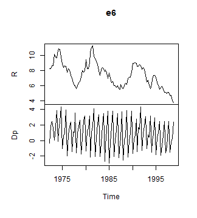
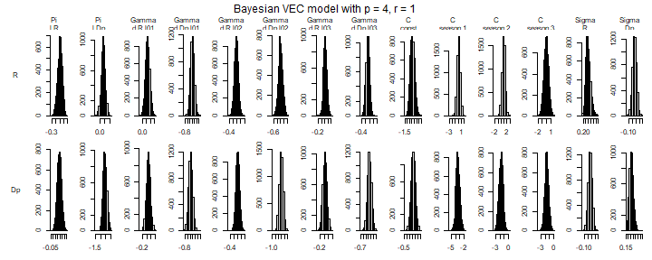
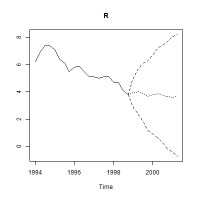
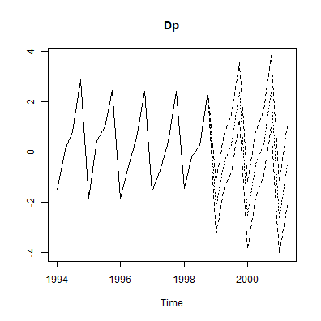
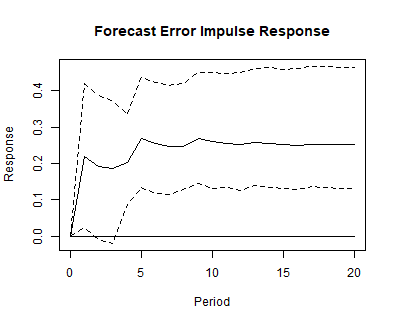
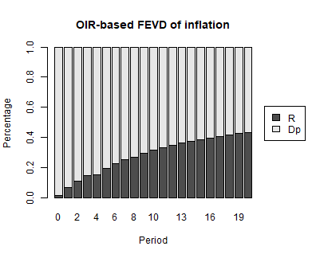

## Introduction

This vignette provides the code to set up and estimate a Bayesian vector error correction (BVEC) model with the `bvartools` package. The presented Gibbs sampler is based on the approach of Koop et al. (2010), who propose a prior on the cointegration space. The estimated model has the following form

$$\Delta y_t = \Pi y_{t - 1} + \sum_{l = 1}^{p - 1} \Gamma_l \Delta y_{t - l} + C d_t + u_t,$$
where $\Pi = \alpha \beta^{\prime}$ with cointegration rank $r$, $u_t \sim N(0, \Sigma)$ and $d_t$ contains an intercept and seasonal dummies. For an introduction to vector error correction models see [https://www.r-econometrics.com/timeseries/vecintro/](https://www.r-econometrics.com/timeseries/vecintro/).

## Data

To illustrate the workflow of the analysis, data set E6 from Lütkepohl (2006) is used, which contains data on German long-term interest rates and inflation from 1972Q2 to 1998Q4.


``` r
library(bvartools)

data("e6")

e6 <- e6 * 100
plot(e6) # Plot the series
```

<div class="figure" style="text-align: center">

<p class="caption">plot of chunk data</p>
</div>

The `create_bvecmodel` function produces an object of class `bvecmodel`, where the element `data$train` contains the data matrices `y`, `w` and `x` for the BVEC estimator, where `y` is the matrix of dependent variables, `w` is a matrix of potentially cointegrated regressors, and `x` is the matrix of non-cointegration regressors.


``` r
object <- create_bvecmodel(e6, p = 4, r = 1,
                           const = "unrestricted", season = "unrestricted",
                           iterations = 5000, burnin = 1000)
```

Argument `p` represents the lag order of the VAR form of the model and `r` is the cointegration rank of `Pi`. Function `create_bvecmodel` requires to specify the inclusion of intercepts, trends and seasonal dummies separately. This allows to decide on whether they enter the cointegration term (`"restricted"`) or the non-cointegration part (`"unrestricted"`) of the model.

Models such as the one proposed in Koop, Leon-Gonzalez and Strachan (2010) put a restriction on the space spanned by $\beta$. This means, that the scale of the variables in the error correction term becomes important. A reasonable approach to handle this, is to rescale the series in the error correction term. Function `scale_error_correction_term` can be used for this purpose. It rescales all non-deterministic elements by their respective differenced series' standard deviation. If `object[["data"]][["train"]][["w"]]` contains a column named `trend`, its valus are replaced by $(t - T/2) / T$.


``` r
object <- scale_error_correction(object)
```


## Priors

Function `add_priors` adds the necessary prior specifications to object `object`. For the current application we use non-informative priors to compare the with the result in Lütkepohl (2006):


``` r
object <- add_priors(object,
                     coef = list(v_i = 0, v_i_det = 0),
                     coint = list(v_i = 0, p_tau_i = 1),
                     sigma = list(df = 0, scale = .0001))
```

### Adding initial values

Function `add_initial_values` generates of first draws of the Gibbs sampler for the specified model(s) in object `model` and augments the object accordingly.


``` r
object <- add_initial_values(object, method = "maxlik")
```


## Estimation

### User-specific algorithm

The following code produces posterior draws using the algorithm described in Koop et al. (2010).


``` r
# Reset random number generator for reproducibility
set.seed(7654321)

# Obtain data matrices
y <- t(object[["data"]][["train"]][["y"]])
w <- t(object[["data"]][["train"]][["w"]])
x <- t(object[["data"]][["train"]][["x"]])

r <- object[["model"]][["rank"]] # Set rank

tt <- ncol(y) # Number of observations
k <- nrow(y) # Number of endogenous variables
k_w <- nrow(w) # Number of regressors in error correction term
k_x <- nrow(x) # Number of differenced regressors and unrestrictec deterministic terms
k_gamma <- k * k_x # Total number of non-cointegration coefficients

k_alpha <- k * r # Number of elements in alpha
k_beta <- k_w * r # Number of elements in beta

# Priors
a_mu_prior <- object[["priors"]][["a"]][["mu"]] # Prior means
a_v_i_prior <- object[["priors"]][["a"]][["v_inv"]] # Inverse of the prior covariance matrix

v_i <- object[["priors"]][["beta"]][["v_inv"]]
p_tau_i <- object[["priors"]][["beta"]][["p_tau_inv"]]

sigma_df_prior <- object[["priors"]][["u_sigma"]][["df"]] # Prior degrees of freedom
sigma_scale_prior <- object[["priors"]][["u_sigma"]][["scale"]] # Prior covariance matrix
sigma_df_post <- tt + sigma_df_prior # Posterior degrees of freedom

# Initial values
beta <- object[["initial"]][["beta"]]
sigma_i <- object[["initial"]][["u_sigma_inv"]]

g_i <- sigma_i

iterations <- object[["model"]][["iterations"]] # Number of iterations of the Gibbs sampler
burnin <- object[["model"]][["burnin"]] # Number of burn-in draws
draws <- iterations + burnin # Total number of draws

# Data containers
draws_alpha <- matrix(NA, k_alpha, iterations)
draws_beta <- matrix(NA, k_beta, iterations)
draws_pi <- matrix(NA, k * k_w, iterations)
draws_gamma <- matrix(NA, k_gamma, iterations)
draws_sigma <- matrix(NA, k^2, iterations)

# Start Gibbs sampler
for (draw in 1:draws) {
  
  # Draw conditional mean parameters
  temp <- post_coint_kls(y = y, beta = beta, w = w, x = x, sigma_i = sigma_i,
                         v_i = v_i, p_tau_i = p_tau_i, g_i = g_i,
                         gamma_mu_prior = a_mu_prior,
                         gamma_v_i_prior = a_v_i_prior)
  alpha <- temp[["alpha"]]
  beta <- temp[["beta"]]
  Pi <- temp[["Pi"]]
  gamma <- temp[["Gamma"]]
  
  # Draw variance-covariance matrix
  u <- y - Pi %*% w - matrix(gamma, k) %*% x
  sigma_scale_post <- solve(tcrossprod(u) + v_i * alpha %*% tcrossprod(crossprod(beta, p_tau_i) %*% beta, alpha))
  sigma_i <- matrix(rWishart(1, sigma_df_post, sigma_scale_post)[,, 1], k)
  sigma <- solve(sigma_i)
  
  # Update g_i
  g_i <- sigma_i
  
  # Store draws
  if (draw > burnin) {
    draws_alpha[, draw - burnin] <- alpha
    draws_beta[, draw - burnin] <- beta
    draws_pi[, draw - burnin] <- Pi
    draws_gamma[, draw - burnin] <- gamma
    draws_sigma[, draw - burnin] <- sigma
  }
}
```

The `bvec` function can be used to collect output of the above Gibbs sampler in a standardized object of class `bvecmodel`, which can be used further for forecasting, impulse response analysis or forecast error variance decomposition. The error correction term is described by the draws of `alpha` and `beta` and not by those of `Pi`, since the latter cannot be decomposed into the former.


``` r
# Number of non-deterministic coefficients
k_nondet <- (k_x - 4) * k

# Generate bvecmodel object
bvec_est <- bvec(y = object[["data"]][["train"]][["y"]],
                 w = object[["data"]][["train"]][["w"]],
                 x = object[["data"]][["train"]][["x"]][, 1:6],
                 x_d = object[["data"]][["train"]][["x"]][, -(1:6)],
                 r = 1,
                 alpha = draws_alpha,
                 beta = draws_beta,
                 Gamma = draws_gamma[1:k_nondet,],
                 C = draws_gamma[(k_nondet + 1):nrow(draws_gamma),],
                 Sigma = draws_sigma)
```

The draws were obtained from the rescaled error correction term, so they refer to the rescaled series in `w`. Function `rescale_error_correction` undoes the transformation of `scale_error_correction`: it puts the series in `object$data$train$w` back on the scale of the input data and multiplies the draws of `beta` by the inverse of the scaling factors. The draws of `alpha` are not affected, because the error correction term of the estimated model is $\alpha \beta^{\prime} D^{-1} w_t$, where $D$ is the diagonal matrix of scaling factors.


``` r
bvec_est <- rescale_error_correction(bvec_est)
```

This step is required before the model is used any further. Functions such as `vec_to_var` recover the levels of the endogenous variables from the differences in `y` and their lags in `w`, which is only possible if both are on the same scale.

Obtain point estimates of cointegration variables:


``` r
beta <- bvec_est[["posterior"]][["beta"]][["coeffs"]] # Obtain draws of beta
beta <- apply(beta / beta[, 1], 2, median) # Normalise and obtain medians
beta <- matrix(beta, k_w) # Transform vector into a matrix
beta <- round(beta, 3) # Round values
dimnames(beta) <- list(dimnames(w)[[1]], NULL) # Rename matrix dimensions

beta # Print
#>        [,1]
#> l.R   1.000
#> l.Dp -4.008
```

Posterior draws can be inspected with `plot`. Note that the coefficients of the error correction term are displayed as draws of `Pi`, i.e. as the product of `alpha` and `beta`, since the two matrices are only identified up to a rotation.


``` r
plot(bvec_est)
```

<div class="figure" style="text-align: center">

<p class="caption">plot of chunk unnamed-chunk-6</p>
</div>

Obtain summaries of posterior draws


``` r
summary(bvec_est)
#> 
#> Bayesian VEC model with p = 4 
#> 
#> Endogenous variables: R, Dp
#> 
#> Variable: R 
#> 
#>                 Mean         SD     Naive SD Time-series SD        2.5%
#> l.R      -0.09452315 0.05670807 0.0008019732    0.002859439 -0.21259726
#> l.Dp      0.36021793 0.19694663 0.0027852459    0.005723887 -0.04537673
#> d.R.l01   0.26169399 0.10980190 0.0015528333    0.002243868  0.04004647
#> d.Dp.l01 -0.17561638 0.16593313 0.0023466488    0.004579734 -0.49616115
#> d.R.l02  -0.02307685 0.10911509 0.0015431205    0.001885303 -0.24038446
#> d.Dp.l02 -0.20065343 0.13142227 0.0018585916    0.002990039 -0.45811227
#> d.R.l03   0.21980151 0.10509336 0.0014862446    0.001669380  0.01080735
#> d.Dp.l03 -0.09710498 0.08752183 0.0012377455    0.001403448 -0.26681920
#> const     0.12527957 0.44060104 0.0062310396    0.018955087 -0.69095042
#> season.1  0.15321939 0.51825567 0.0073292419    0.007329242 -0.87579272
#> season.2  0.88558442 0.53590039 0.0075787759    0.007578776 -0.19769959
#> season.3 -0.04311596 0.52026802 0.0073577009    0.007357701 -1.07072395
#>                  50%       97.5%  
#> l.R      -0.09196699 0.007591864  
#> l.Dp      0.36067841 0.742616444  
#> d.R.l01   0.26361240 0.480880499 *
#> d.Dp.l01 -0.17491836 0.154489440  
#> d.R.l02  -0.02118085 0.190656458  
#> d.Dp.l02 -0.20318366 0.057281268  
#> d.R.l03   0.22220814 0.423007891 *
#> d.Dp.l03 -0.09697027 0.073150637  
#> const     0.11101990 1.040540862  
#> season.1  0.15991861 1.150368587  
#> season.2  0.89137551 1.903349375  
#> season.3 -0.03510442 0.977717806  
#> 
#> Variable: Dp 
#> 
#>                  Mean         SD     Naive SD Time-series SD        2.5%
#> l.R       0.142979337 0.04949543 0.0006999711    0.001812914  0.04498404
#> l.Dp     -0.581986169 0.19663456 0.0027808327    0.006911449 -0.95623311
#> d.R.l01   0.076779702 0.10368250 0.0014662919    0.001533154 -0.12020989
#> d.Dp.l01 -0.370277505 0.16413237 0.0023211823    0.005229675 -0.69885052
#> d.R.l02   0.002957355 0.10433212 0.0014754789    0.001533924 -0.20269411
#> d.Dp.l02 -0.409926352 0.12829370 0.0018143469    0.003790089 -0.66047236
#> d.R.l03   0.026865947 0.09935586 0.0014051040    0.001602613 -0.16589147
#> d.Dp.l03 -0.357249984 0.08388958 0.0011863778    0.002051840 -0.52140452
#> const     1.086190297 0.41064030 0.0058073308    0.017721962  0.28371597
#> season.1 -3.415497670 0.48542726 0.0068649781    0.006864978 -4.37874358
#> season.2 -1.784009365 0.50672387 0.0071661577    0.007166158 -2.75053676
#> season.3 -1.630861768 0.49485291 0.0069982769    0.006998277 -2.58764425
#>                   50%       97.5%  
#> l.R       0.143040655  0.24341859 *
#> l.Dp     -0.585148253 -0.18011272 *
#> d.R.l01   0.074831943  0.28694811  
#> d.Dp.l01 -0.370518069 -0.05678916 *
#> d.R.l02   0.002997781  0.20880847  
#> d.Dp.l02 -0.410392483 -0.15547899 *
#> d.R.l03   0.026520173  0.22228803  
#> d.Dp.l03 -0.358750432 -0.19161892 *
#> const     1.081462699  1.89851015 *
#> season.1 -3.420929548 -2.45234389 *
#> season.2 -1.781801888 -0.78469583 *
#> season.3 -1.628361312 -0.65512254 *
#> 
#> Variance-covariance matrix:
#> 
#>              Mean         SD     Naive SD Time-series SD        2.5%
#> R_R    0.29625152 0.04613406 0.0006524342   0.0007215167  0.21879288
#> R_Dp  -0.01938982 0.03014350 0.0004262935   0.0004793717 -0.07854665
#> Dp_Dp  0.26575047 0.04021462 0.0005687206   0.0007022474  0.19756884
#>               50%      97.5%  
#> R_R    0.29187505 0.39799885 *
#> R_Dp  -0.01924877 0.03813544  
#> Dp_Dp  0.26223705 0.35594929 *
```

### Default algorithm

As an alternative to a user-specific algorithm, function `add_posterior_coefficients` can be used to estimate such a model as well:


``` r
bvec_est <- add_posterior_coefficients(object)
bvec_est <- rescale_error_correction(bvec_est)
```

## Evaluation

Posterior draws can be thinned with function `thin`:


``` r
bvec_est <- thin(bvec_est, thin = 5)
```

The function `vec_to_var` can be used to transform the VEC model into a VAR in levels:


``` r
bvar_form <- vec_to_var(bvec_est)
```

The output of `vec_to_var` is an object of class `bvarmodel` for which summary statistics, forecasts, impulse responses and variance decompositions can be obtained in the usual manner using `summary`, `predict`, `irf` and `fevd`, respectively.


``` r
summary(bvar_form)
#> 
#> Bayesian VAR model with p = 4 
#> 
#> Endogenous variables: R, Dp
#> 
#> Variable: R 
#> 
#>                 Mean         SD    Naive SD Time-series SD        2.5%
#> R.l1      1.16535200 0.10635328 0.003363186    0.003363186  0.96040921
#> Dp.l1     0.18703316 0.08816151 0.002787912    0.003037291  0.02568937
#> R.l2     -0.28045625 0.16292889 0.005152264    0.005830606 -0.59601340
#> Dp.l2    -0.02727234 0.08879364 0.002807902    0.002807902 -0.21755281
#> R.l3      0.24218148 0.15651881 0.004949559    0.004949559 -0.06518237
#> Dp.l3     0.09793482 0.08843064 0.002796422    0.002796422 -0.08247304
#> R.l4     -0.22073591 0.10599604 0.003351889    0.003351889 -0.41578775
#> Dp.l4     0.09871367 0.08660835 0.002738796    0.002738796 -0.07082975
#> const     0.10175351 0.41575466 0.013147317    0.021906349 -0.66102819
#> season.1  0.16972358 0.49494542 0.015651549    0.015651549 -0.80926491
#> season.2  0.91460667 0.51465136 0.016274705    0.016274705 -0.17680539
#> season.3 -0.01350075 0.49742703 0.015730024    0.015730024 -1.02852953
#>                   50%        97.5%  
#> R.l1      1.165209529  1.376522192 *
#> Dp.l1     0.185440828  0.358769462 *
#> R.l2     -0.280000898  0.036128457  
#> Dp.l2    -0.022951967  0.137207153  
#> R.l3      0.248029804  0.543799548  
#> Dp.l3     0.098215830  0.269574279  
#> R.l4     -0.224404446 -0.006545631 *
#> Dp.l4     0.096657007  0.275705191  
#> const     0.072182698  0.960045437  
#> season.1  0.164373169  1.169010601  
#> season.2  0.946769687  1.858976575  
#> season.3  0.001850098  0.914500479  
#> 
#> Variable: Dp 
#> 
#>                 Mean         SD    Naive SD Time-series SD       2.5%
#> R.l1      0.21764881 0.10061217 0.003181636    0.003181636  0.0236903
#> Dp.l1     0.04862158 0.08467136 0.002677543    0.003201182 -0.1129235
#> R.l2     -0.07009270 0.15501954 0.004902148    0.004902148 -0.3691183
#> Dp.l2    -0.03704200 0.08714828 0.002755870    0.003003290 -0.2126571
#> R.l3      0.02004906 0.15418555 0.004875775    0.005111392 -0.2985578
#> Dp.l3     0.05446494 0.08649928 0.002735347    0.002933581 -0.1144698
#> R.l4     -0.02583801 0.10255139 0.003242960    0.003748381 -0.2271787
#> Dp.l4     0.35819386 0.08225026 0.002600981    0.003312464  0.1916144
#> const     1.09509444 0.40168571 0.012702417    0.017833599  0.2739916
#> season.1 -3.42211697 0.47297618 0.014956820    0.017028794 -4.3981150
#> season.2 -1.79112114 0.48690803 0.015397384    0.015397384 -2.7505368
#> season.3 -1.63345044 0.48038545 0.015191122    0.015636452 -2.5411048
#>                  50%      97.5%  
#> R.l1      0.21887320  0.4203582 *
#> Dp.l1     0.04810570  0.2177169  
#> R.l2     -0.06950397  0.2385823  
#> Dp.l2    -0.03916367  0.1356531  
#> R.l3      0.01992348  0.3309874  
#> Dp.l3     0.05502949  0.2306447  
#> R.l4     -0.03000496  0.1797410  
#> Dp.l4     0.36086034  0.5195213 *
#> const     1.09583119  1.8785809 *
#> season.1 -3.41325445 -2.5098953 *
#> season.2 -1.79820852 -0.8641108 *
#> season.3 -1.61402339 -0.6788912 *
#> 
#> Variance-covariance matrix:
#> 
#>              Mean         SD     Naive SD Time-series SD        2.5%
#> R_R    0.29505798 0.04518565 0.0014288958   0.0014288958  0.21792777
#> R_Dp  -0.01984879 0.03038295 0.0009607931   0.0009954063 -0.08061825
#> Dp_Dp  0.26679642 0.04318741 0.0013657059   0.0014611085  0.19673759
#>               50%      97.5%  
#> R_R    0.29052182 0.39580673 *
#> R_Dp  -0.01987815 0.03740623  
#> Dp_Dp  0.26432931 0.36126131 *
```

### Forecasts


``` r
bvar_form <- add_forecast_input(bvar_form, n_ahead = 10)
```


``` r
bvar_form <- add_posterior_forecasts(bvar_form)
```


``` r
# Genrate forecasts
bvar_pred <- predict(bvar_form, n_ahead = 10)

# Plot forecasts
plot(bvar_pred, n_pre = 20)
```





### Forecast error impulse response


``` r
FEIR <- irf(bvar_form, impulse = "R", response = "Dp", n_ahead = 20)

plot(FEIR, main = "Forecast Error Impulse Response", xlab = "Period", ylab = "Response")
```



## Forecast error variance decomposition 


``` r
bvar_fevd_oir <- fevd(bvar_form, response = "Dp", n_ahead = 20)

plot(bvar_fevd_oir, main = "OIR-based FEVD of inflation")
```




## References

Koop, G., León-González, R., & Strachan R. W. (2010). Efficient posterior simulation for cointegrated models with priors on the cointegration space. *Econometric Reviews, 29*(2), 224-242. <https://doi.org/10.1080/07474930903382208>

Lütkepohl, H. (2006). *New introduction to multiple time series analysis* (2nd ed.). Berlin: Springer.

Pesaran, H. H., & Shin, Y. (1998). Generalized impulse response analysis in linear multivariate models, *Economics Letters, 58*, 17-29. <https://doi.org/10.1016/S0165-1765(97)00214-0>
