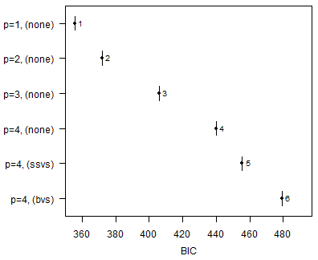
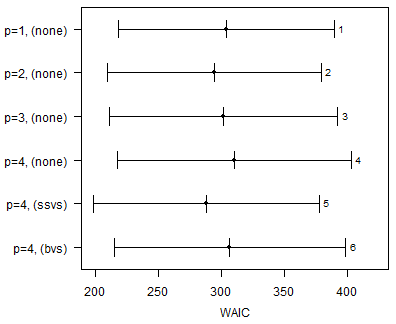
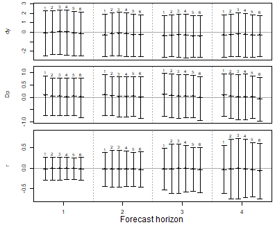
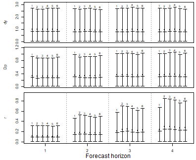
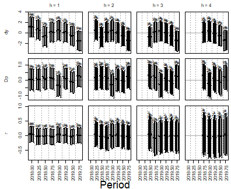
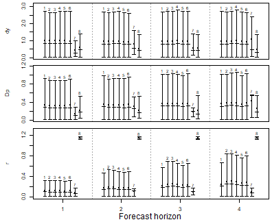

``` r
library(bvartools)
```

## Introduction

In a horse race a set of competing models is estimated on the same data and ranked by how well they forecast. The comparison is more convincing, if it rests on forecasts that could actually have been made at the time. Therefore, each model is estimated repeatedly over an expanding window: the first window ends some periods before the end of the sample, each further window adds one period, and every estimate forecasts the periods, which follow the end of its window. The forecast errors of all windows are then summarised by out-of-sample statistics, which are complemented by the in-sample criteria of the vignette on model comparison.

This vignette lets three specifications of a VAR model compete: models with a weakly informative prior and lag orders from one to four, a model with stochastic search variable selection (SSVS) and a model with Bayesian variable selection (BVS). The last section shows how forecasts from other sources can join the race.

## Workflow

The models compete on the growth rate of Austrian real GDP (`dy`), inflation (`Dp`) and the short-term interest rate (`r`) from data set `at_macrodata`, all in percent per quarter and up to 2019Q4, which leaves out the quarters in which the pandemic moved output growth by ten percent. Each model is estimated over an expanding window, whose first estimation sample ends in 2017Q4.


``` r
data("at_macrodata")
at <- at_macrodata[["domestic"]]
data <- ts.intersect(dy = diff(at[, "y"]), Dp = at[, "Dp"], r = at[, "r"]) * 100
data <- window(data, end = c(2019, 4))

expanding_window_start <- 2018
```


### Producing candidate models


``` r
# Shared specifications
iterations <- 2000
burnin <- 1000

# Reset random number generator for reproducibility
set.seed(1234567)
```


First, create a series of traditional VAR models:


``` r
var_default <- create_bvarmodel(data,
                                p = 1:4,
                                deterministic = "const",
                                iterations = iterations,
                                burnin = burnin)

var_default <- use_expanding_window(var_default, start = expanding_window_start)

var_default <- add_priors(var_default,
                          coef = list(v_i = 1 / 10, v_i_det = 1 / 100),
                          sigma = list(df = 3, scale = 1))

var_default <- add_initial_values(var_default)
```

Second, create a series of VAR models with stochastic search variable selection (SSVS):


``` r
var_ssvs <- create_bvarmodel(data,
                            p = 4,
                            varsel = "ssvs",
                            deterministic = "const",
                            iterations = iterations,
                            burnin = burnin)

var_ssvs <- use_expanding_window(var_ssvs, start = expanding_window_start)

var_ssvs <- add_priors(var_ssvs,
                          coef = list(v_i = 1 / 10, v_i_det = 1 / 100),
                          sigma = list(df = 3, scale = 1),
                          varsel = list(inprior = 0.5, tau = c(0.05, 10), exclude_det = TRUE))

var_ssvs <- add_initial_values(var_ssvs)
```

Third, create a series of VAR models with Bayesian variable selection à la Korobilis (2013):


``` r
var_bvs <- create_bvarmodel(data,
                            p = 4,
                            varsel = "bvs",
                            deterministic = "const",
                            iterations = iterations,
                            burnin = burnin)

var_bvs <- use_expanding_window(var_bvs, start = expanding_window_start)

var_bvs <- add_priors(var_bvs,
                          coef = list(v_i = 1 / 10, v_i_det = 1 / 100),
                          sigma = list(df = 3, scale = 1),
                          varsel = list(inprior = 0.5, exclude_det = TRUE))

var_bvs <- add_initial_values(var_bvs)
```

Use `combine_models` to make one object:


``` r
models <- combine_models(var_default,
                         var_ssvs,
                         var_bvs)
```


### Draw posteriors


``` r
models <- add_posterior_coefficients(models)
```


### Forecasting

Forecasts are obtained in two steps. First, function `add_forecast_input` generates the data of the forecast periods, where deterministic terms can be provided in the argument `deterministic` and unmodelled variables in the argument `exogen`. If they are not provided, the function tries to obtain them from the model and gives a message, if it does not succeed. Second, function `add_posterior_forecasts` then simulates the forecasts.


``` r
models <- add_forecast_input(models, n_ahead = 4)
models <- add_posterior_forecasts(models)
```

Calculate forecast errors on which out-of-sample selection criteria will be based:


``` r
models <- add_forecast_errors(models, test_sample = data)
```


### Evaluation

Use function `add_posterior_loglik` to add log-likelihoods, on which in-sample selection criteria will be based:


``` r
models <- add_posterior_loglik(models)
```

Calculate in-sample and out-of-sample selection criteria:


``` r
sc <- selection_criteria(models)
```

Compare the selection criteria. For out-of-sample criteria, the first model is used as a reference for comparison:


``` r
print(sc, relative = 1)
#> 
#> ------------------------------------------
#> In-sample
#> ------------------------------------------
#> 
#> Log-likelihood
#> 
#>            Mean Median Quantile (2.5%) Quantile (97.5%)
#>  Model 1 -141.2 -140.8          -151.3           -133.3
#>  Model 2 -131.4 -131.0          -142.1           -121.9
#>  Model 3 -129.9 -129.5          -141.7           -119.5
#>  Model 4 -128.6 -128.5          -142.0           -116.7
#>  Model 5 -128.3 -128.1          -140.3           -118.2
#>  Model 6 -138.7 -138.2          -152.5           -127.6
#> 
#> 
#> Akaike Information Criterion (AIC)
#> 
#>           Mean Median Quantile (2.5%) Quantile (97.5%)
#>  Model 1 300.5  300.5                                 
#>  Model 2 289.5  289.5                                 
#>  Model 3 295.9  295.9                                 
#>  Model 4 302.3  302.3                                 
#>  Model 5 317.8  317.8                                 
#>  Model 6 341.6  341.6                                 
#> 
#> 
#> Bayesian Information Criterion (BIC)
#> 
#>           Mean Median Quantile (2.5%) Quantile (97.5%)
#>  Model 1 355.6  355.6                                 
#>  Model 2 372.1  372.1                                 
#>  Model 3 406.2  406.2                                 
#>  Model 4 440.1  440.1                                 
#>  Model 5 455.6  455.6                                 
#>  Model 6 479.4  479.4                                 
#> 
#> 
#> Hannan-Quinn Criterion (HQ)
#> 
#>           Mean Median Quantile (2.5%) Quantile (97.5%)
#>  Model 1 322.9  322.9                                 
#>  Model 2 323.0  323.0                                 
#>  Model 3 340.7  340.7                                 
#>  Model 4 358.3  358.3                                 
#>  Model 5 373.8  373.8                                 
#>  Model 6 397.5  397.5                                 
#> 
#> 
#> Widely Applicable Information Criterion (WAIC)
#> 
#>           Mean Median Quantile (2.5%) Quantile (97.5%)
#>  Model 1 303.7  303.7           218.1            389.3
#>  Model 2 294.6  294.6           210.0            379.2
#>  Model 3 301.5  301.5           211.1            392.0
#>  Model 4 310.2  310.2           217.5            402.9
#>  Model 5 287.9  287.9           198.2            377.6
#>  Model 6 306.6  306.6           214.8            398.4
#> 
#> Periods with a pointwise log-likelihood variance above 0.4, which makes the correction of WAIC unreliable, in models 1 (11), 2 (17), 3 (23), 4 (28), 5 (16), 6 (15).
#> 
#> 
#> Leave-One-Out Information Criterion (LOOIC)
#> 
#>           Mean Median Quantile (2.5%) Quantile (97.5%)
#>  Model 1 303.9  303.9           218.3            389.6
#>  Model 2 295.1  295.1           210.4            379.9
#>  Model 3 303.1  303.1           212.1            394.1
#>  Model 4 312.1  312.1           218.8            405.4
#>  Model 5 288.2  288.2           198.6            377.9
#>  Model 6 307.6  307.6           215.1            400.2
#> 
#> Influential periods, whose importance sampling is unreliable, in models 3 (1), 4 (2), 6 (2), counted as a Pareto k above 0.7.
#> 
#> 
#> ------------------------------------------
#> Out-of-sample
#> ------------------------------------------
#> 
#> Mean absolute forecast errors (MAFE)
#> 
#>  Variable h Model 1 Model 2 Model 3 Model 4 Model 5 Model 6
#>        dy 1       1  1.0012  1.0006  1.0179  1.0019  0.9882
#>        Dp 1       1  0.9399  0.9442  0.9488  0.9487  0.9738
#>         r 1       1  0.9879  0.9713  0.9735  0.9491  0.9764
#>        dy 2       1  0.9952  1.0086  1.0215  0.9825  0.9717
#>        Dp 2       1  0.9405  0.9405  0.9352  0.9315  0.9790
#>         r 2       1  1.1084  1.0904  1.0511  1.0169  1.0489
#>        dy 3       1  1.0116  1.0179  1.0363  1.0113  1.0190
#>        Dp 3       1  1.0005  1.0007  0.9875  0.9662  0.9978
#>         r 3       1  1.1672  1.1822  1.1164  1.0585  1.1031
#>        dy 4       1  1.0077  1.0215  1.0260  0.9947  0.9767
#>        Dp 4       1  1.0190  1.0442  1.0324  0.9713  1.0178
#>         r 4       1  1.2126  1.2328  1.1976  1.1134  1.1475
#> 
#> 
#> Root mean squared forecast errors (RMSFE)
#> 
#>  Variable h Model 1 Model 2 Model 3 Model 4 Model 5 Model 6
#>        dy 1       1  0.9955  0.9968  1.0150  0.9993  0.9868
#>        Dp 1       1  0.9419  0.9486  0.9496  0.9505  0.9797
#>         r 1       1  0.9868  0.9748  0.9745  0.9531  0.9819
#>        dy 2       1  0.9942  1.0057  1.0193  0.9852  0.9759
#>        Dp 2       1  0.9406  0.9438  0.9390  0.9339  0.9833
#>         r 2       1  1.1125  1.0953  1.0558  1.0183  1.0551
#>        dy 3       1  1.0114  1.0190  1.0392  1.0118  1.0162
#>        Dp 3       1  0.9987  1.0013  0.9871  0.9663  0.9982
#>         r 3       1  1.1809  1.1864  1.1201  1.0628  1.1126
#>        dy 4       1  1.0054  1.0177  1.0254  0.9931  0.9774
#>        Dp 4       1  1.0152  1.0428  1.0340  0.9720  1.0225
#>         r 4       1  1.2232  1.2363  1.2059  1.1184  1.1622
```


#### In-sample plots


``` r
plot(sc, criterion = "BIC")
```




``` r
plot(sc, criterion = "AIC")
```


AIC and BIC penalise a model by the number of parameters it nominally has, which
is the same number for the three models with four lags: variable selection does not remove
a coefficient from the model, it shrinks it towards zero, and how much of the
nominal freedom that leaves is decided by the data rather than by the count. WAIC
penalises by the flexibility the fit actually used and is the criterion to
compare such models with.


``` r
plot(sc, criterion = "WAIC")
```



#### Out-of-sample plots


``` r
plot(sc, criterion = "FE")
```



``` r
plot(sc, criterion = "AFE")
```




``` r
plot_forecast_errors_by_period(models, criterion = "FE")
```




## Adding forecasts from other sources

A horse race becomes more informative, if the models do not only compete with each
other, but also with the forecasts that institutions actually published. Function
`create_external_forecast` turns such forecasts into an object, which can be added
to the list of models and which is then treated as one more competitor by all the
functions above.

Published forecasts can be taken from any source, as long as they are provided in
long format with one point forecast per row. To keep this vignette self-contained,
the following example uses two made-up forecasters instead. Each of them publishes
a forecast for the current and the following three quarters at the beginning of
every quarter from 2018Q1 to 2019Q4. Forecaster A is well informed: its forecasts
are the realised values plus noise, which increases with the forecast horizon.
Forecaster B always forecasts the mean of the series up to 2017Q4. Neither of them
says anything about the performance of real forecasters.


``` r
fcst <- expand.grid(origin = seq(2018, 2019.75, by = 0.25),
                    h = 1:4,
                    variable = colnames(data),
                    forecaster = c("Forecaster A", "Forecaster B"),
                    stringsAsFactors = FALSE)

# Period, for which a forecast is made, as in time(data)
fcst[["period"]] <- fcst[["origin"]] + (fcst[["h"]] - 1) / 4

# Only periods with realised values can be evaluated
fcst <- fcst[fcst[["period"]] <= 2019.75, ]

# Realised values of each forecasted period
realised <- data[cbind(match(round(fcst[["period"]] * 4), round(time(data) * 4)),
                       match(fcst[["variable"]], colnames(data)))]

# Sample before the first publication
before <- window(data, end = c(2017, 4))

noise <- rnorm(nrow(fcst),
               sd = 0.5 * sqrt(fcst[["h"]]) *
                 apply(diff(before), 2, sd)[fcst[["variable"]]])

fcst[["value"]] <- ifelse(fcst[["forecaster"]] == "Forecaster A",
                          realised + noise,
                          colMeans(before)[fcst[["variable"]]])

head(fcst)
#>    origin h variable   forecaster  period      value
#> 1 2018.00 1       dy Forecaster A 2018.00  1.6488127
#> 2 2018.25 1       dy Forecaster A 2018.25  1.9068402
#> 3 2018.50 1       dy Forecaster A 2018.50 -1.0217169
#> 4 2018.75 1       dy Forecaster A 2018.75 -0.3977054
#> 5 2019.00 1       dy Forecaster A 2019.00  0.7443746
#> 6 2019.25 1       dy Forecaster A 2019.25  0.3509513
```

The columns of the data set do not have to follow a particular naming convention.
They are specified in the arguments `period`, `origin`, `variable` and `value`,
where `origin` contains the date, at which a forecast was published, and periods
follow the convention of `time`, i.e. 2018.25 for the second quarter of 2018. The
names in column `variable` must be those of the endogenous variables of the models.
Argument `by` produces one object per forecaster:


``` r
external <- create_external_forecast(fcst, models,
                                     period = "period",
                                     origin = "origin",
                                     variable = "variable",
                                     value = "value",
                                     by = "forecaster",
                                     data_lag = 1)
```

A forecaster, which publishes a forecast in the first quarter of 2018, does not
know the value of that quarter yet and, since data are published with a delay, not
even that of 2017Q4 in most cases. Argument `data_lag` states this publication lag
of the data in periods, so that each forecast is matched to the estimation window,
which ends in 2017Q4. The forecast for 2018Q1 is then the one-step ahead forecast of
both the forecaster and the models. If a forecaster published multiple forecasts
between two data releases, only one of them is used, the latest by default, so that
no forecaster enters the comparison twice.

From here on the external forecasts follow the workflow of the models. The
functions, which add priors, initial values or posterior draws, are without effect
for them:


``` r
all_models <- combine_models(models, external)

all_models <- add_forecast_errors(all_models, test_sample = data)

sc_all <- selection_criteria(all_models)

print(sc_all, relative = 1)
#> 
#> ------------------------------------------
#> In-sample
#> ------------------------------------------
#> 
#> Log-likelihood
#> 
#>            Mean Median Quantile (2.5%) Quantile (97.5%)
#>  Model 1 -141.2 -140.8          -151.3           -133.3
#>  Model 2 -131.4 -131.0          -142.1           -121.9
#>  Model 3 -129.9 -129.5          -141.7           -119.5
#>  Model 4 -128.6 -128.5          -142.0           -116.7
#>  Model 5 -128.3 -128.1          -140.3           -118.2
#>  Model 6 -138.7 -138.2          -152.5           -127.6
#>  Model 7                                               
#>  Model 8                                               
#> 
#> 
#> Akaike Information Criterion (AIC)
#> 
#>           Mean Median Quantile (2.5%) Quantile (97.5%)
#>  Model 1 300.5  300.5                                 
#>  Model 2 289.5  289.5                                 
#>  Model 3 295.9  295.9                                 
#>  Model 4 302.3  302.3                                 
#>  Model 5 317.8  317.8                                 
#>  Model 6 341.6  341.6                                 
#>  Model 7                                              
#>  Model 8                                              
#> 
#> 
#> Bayesian Information Criterion (BIC)
#> 
#>           Mean Median Quantile (2.5%) Quantile (97.5%)
#>  Model 1 355.6  355.6                                 
#>  Model 2 372.1  372.1                                 
#>  Model 3 406.2  406.2                                 
#>  Model 4 440.1  440.1                                 
#>  Model 5 455.6  455.6                                 
#>  Model 6 479.4  479.4                                 
#>  Model 7                                              
#>  Model 8                                              
#> 
#> 
#> Hannan-Quinn Criterion (HQ)
#> 
#>           Mean Median Quantile (2.5%) Quantile (97.5%)
#>  Model 1 322.9  322.9                                 
#>  Model 2 323.0  323.0                                 
#>  Model 3 340.7  340.7                                 
#>  Model 4 358.3  358.3                                 
#>  Model 5 373.8  373.8                                 
#>  Model 6 397.5  397.5                                 
#>  Model 7                                              
#>  Model 8                                              
#> 
#> 
#> Widely Applicable Information Criterion (WAIC)
#> 
#>           Mean Median Quantile (2.5%) Quantile (97.5%)
#>  Model 1 303.7  303.7           218.1            389.3
#>  Model 2 294.6  294.6           210.0            379.2
#>  Model 3 301.5  301.5           211.1            392.0
#>  Model 4 310.2  310.2           217.5            402.9
#>  Model 5 287.9  287.9           198.2            377.6
#>  Model 6 306.6  306.6           214.8            398.4
#>  Model 7                                              
#>  Model 8                                              
#> 
#> Periods with a pointwise log-likelihood variance above 0.4, which makes the correction of WAIC unreliable, in models 1 (11), 2 (17), 3 (23), 4 (28), 5 (16), 6 (15).
#> 
#> 
#> Leave-One-Out Information Criterion (LOOIC)
#> 
#>           Mean Median Quantile (2.5%) Quantile (97.5%)
#>  Model 1 303.9  303.9           218.3            389.6
#>  Model 2 295.1  295.1           210.4            379.9
#>  Model 3 303.1  303.1           212.1            394.1
#>  Model 4 312.1  312.1           218.8            405.4
#>  Model 5 288.2  288.2           198.6            377.9
#>  Model 6 307.6  307.6           215.1            400.2
#>  Model 7                                              
#>  Model 8                                              
#> 
#> Influential periods, whose importance sampling is unreliable, in models 3 (1), 4 (2), 6 (2), counted as a Pareto k above 0.7.
#> 
#> 
#> ------------------------------------------
#> Out-of-sample
#> ------------------------------------------
#> 
#> Mean absolute forecast errors (MAFE)
#> 
#>  Variable h Model 1 Model 2 Model 3 Model 4 Model 5 Model 6 Model 7 Model 8
#>        dy 1       1  1.0012  1.0006  1.0179  1.0019  0.9882  0.4509  0.6050
#>        Dp 1       1  0.9399  0.9442  0.9488  0.9487  0.9738  0.3914  0.6127
#>         r 1       1  0.9879  0.9713  0.9735  0.9491  0.9764  0.6489 10.0343
#>        dy 2       1  0.9952  1.0086  1.0215  0.9825  0.9717  0.8154  0.5530
#>        Dp 2       1  0.9405  0.9405  0.9352  0.9315  0.9790  0.8675  0.5850
#>         r 2       1  1.1084  1.0904  1.0511  1.0169  1.0489  0.5860  6.8391
#>        dy 3       1  1.0116  1.0179  1.0363  1.0113  1.0190  0.6000  0.5699
#>        Dp 3       1  1.0005  1.0007  0.9875  0.9662  0.9978  0.4991  0.5804
#>         r 3       1  1.1672  1.1822  1.1164  1.0585  1.1031  0.4572  5.4908
#>        dy 4       1  1.0077  1.0215  1.0260  0.9947  0.9767  1.1346  0.5112
#>        Dp 4       1  1.0190  1.0442  1.0324  0.9713  1.0178  1.1652  0.6914
#>         r 4       1  1.2126  1.2328  1.1976  1.1134  1.1475  0.3615  4.7399
#> 
#> 
#> Root mean squared forecast errors (RMSFE)
#> 
#>  Variable h Model 1 Model 2 Model 3 Model 4 Model 5 Model 6 Model 7 Model 8
#>        dy 1       1  0.9955  0.9968  1.0150  0.9993  0.9868  0.4694  0.6098
#>        Dp 1       1  0.9419  0.9486  0.9496  0.9505  0.9797  0.3932  0.6380
#>         r 1       1  0.9868  0.9748  0.9745  0.9531  0.9819  0.6285  8.0116
#>        dy 2       1  0.9942  1.0057  1.0193  0.9852  0.9759  0.7735  0.5792
#>        Dp 2       1  0.9406  0.9438  0.9390  0.9339  0.9833  0.7922  0.6240
#>         r 2       1  1.1125  1.0953  1.0558  1.0183  1.0551  0.5347  5.4637
#>        dy 3       1  1.0114  1.0190  1.0392  1.0118  1.0162  0.6117  0.6080
#>        Dp 3       1  0.9987  1.0013  0.9871  0.9663  0.9982  0.4288  0.6280
#>         r 3       1  1.1809  1.1864  1.1201  1.0628  1.1126  0.4073  4.3971
#>        dy 4       1  1.0054  1.0177  1.0254  0.9931  0.9774  1.2094  0.5897
#>        Dp 4       1  1.0152  1.0428  1.0340  0.9720  1.0225  1.0409  0.6961
#>         r 4       1  1.2232  1.2363  1.2059  1.1184  1.1622  0.3653  3.7953
```

The two forecasters are the last two models of the list. Since external forecasts
are point forecasts, each publication contributes a single value to the
out-of-sample statistics instead of a full posterior. Accordingly, their credible
bands are degenerate and in-sample criteria are not available for them, which the
printed comparison and the plots indicate by an empty entry.

`vignette("macroprojections", package = "bvartools")` races models against
projections that institutions actually published. Those are annual, and it shows
how the quarterly forecast draws of a model are aggregated to annual figures
before they are compared.


``` r
plot(sc_all, criterion = "AFE")
```




## Citing bvartools

If you use `bvartools` in published work, please cite it. `citation("bvartools")` prints the reference, and the package has the DOI [10.5281/zenodo.22736604](https://doi.org/10.5281/zenodo.22736604), which always resolves to the latest archived version.

## References

Korobilis, D. (2013). VAR forecasting using Bayesian variable selection. *Journal of Applied Econometrics, 28*(2), 204-230. <https://doi.org/10.1002/jae.1271>
