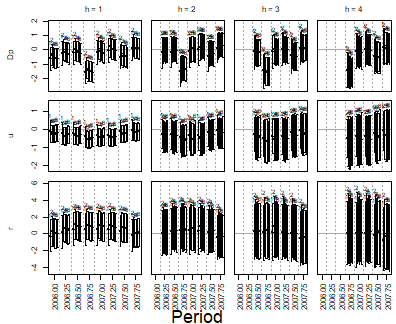

``` r
library(bvartools)
```

## Introduction


## Workflow


``` r
data("us_macrodata")

#us_macrodata <- diff(us_macrodata)

expanding_window_start <- 2006
```


### Producing candidate models


``` r
# Shared specifications
iterations <- 2000
burnin <- 1000
```


First, create a series of traditional VAR models:


``` r
var_default <- create_bvarmodel(us_macrodata,
                                p = 1:4,
                                deterministic = "const",
                                iterations = iterations,
                                burnin = burnin)

var_default <- use_expanding_window(var_default, start = expanding_window_start)

var_default <- add_priors(var_default,
                          coef = list(v_i = 1 / 10, v_i_det = 1 / 100),
                          sigma = list(df = 3, scale = 1))

var_default <- add_initial_values(var_default)
```

Second, create a series of VAR models with stochastic search variable selection (SSVS):


``` r
var_ssvs <- create_bvarmodel(us_macrodata,
                            p = 4,
                            varsel = "ssvs",
                            deterministic = "const",
                            iterations = iterations,
                            burnin = burnin)

var_ssvs <- use_expanding_window(var_ssvs, start = expanding_window_start)

var_ssvs <- add_priors(var_ssvs,
                          coef = list(v_i = 1 / 10, v_i_det = 1 / 100),
                          sigma = list(df = 3, scale = 1),
                          varsel = list(inprior = 0.5, tau = c(0.05, 10), exclude_det = TRUE))

var_ssvs <- add_initial_values(var_ssvs)
```

Thrird, create a series of VAR models with Bayesian variable selection à la Korobilis (2013):


``` r
var_bvs <- create_bvarmodel(us_macrodata,
                            p = 4,
                            varsel = "bvs",
                            deterministic = "const",
                            iterations = iterations,
                            burnin = burnin)

var_bvs <- use_expanding_window(var_bvs, start = expanding_window_start)

var_bvs <- add_priors(var_bvs,
                          coef = list(v_i = 1 / 10, v_i_det = 1 / 100),
                          sigma = list(df = 3, scale = 1),
                          varsel = list(inprior = 0.5, exclude_det = TRUE))

var_bvs <- add_initial_values(var_bvs)
```

Use `combine_models` to make one object:


``` r
models <- combine_models(var_default,
                         var_ssvs,
                         var_bvs)
```

<!-- Ensure that all models look at the same time series: -->

<!-- ```{r} -->
<!-- models <- align_model_obs(models) -->
<!-- ``` -->


### Draw posteriors


``` r
models <- add_posterior_coefficients(models)
```


### Forecasting

Forecasts are obtained in two steps. First, function `add_forecast_input` generates the data of the forecast periods, where deterministic terms can be provided in the argument `deterministic` and unmodelled variables in the argument `exogen`. If they are not provided, the function tries to obtain them from the model and gives a message, if it does not succeed. Second, function `add_posterior_forecasts` then simulates the forecasts.


``` r
models <- add_forecast_input(models, n_ahead = 4)
models <- add_posterior_forecasts(models)
```

Calculate forecast errors on which out-of-sample selection criteria will be based:


``` r
models <- add_forecast_errors(models, test_sample = us_macrodata)
```


### Evaluation

Use function `add_posterior_loglik` to add log-likelihoods, on which in-sample selection criteria will be based:


``` r
models <- add_posterior_loglik(models)
```

Calculate in-sample and out-of-sample selection criteria:


``` r
sc <- selection_criteria(models)
```

Compare the selection criteria. For out-of-sample criteria, the first model is used as a reference for comparison:


``` r
print(sc, relative = 1)
#> 
#> ------------------------------------------
#> In-sample
#> ------------------------------------------
#> 
#> Log-likelihood
#> 
#>            Mean Median Quantile (2.5%) Quantile (97.5%)
#>  Model 1 -363.8 -363.4          -371.1           -358.5
#>  Model 2 -301.3 -301.0          -309.8           -294.1
#>  Model 3 -274.9 -274.5          -285.0           -266.9
#>  Model 4 -276.7 -276.3          -287.8           -267.7
#>  Model 5 -285.7 -285.5          -298.2           -274.1
#>  Model 6 -280.8 -280.5          -289.5           -273.5
#> 
#> 
#> Akaike Information Criterion (AIC)
#> 
#>           Mean Median Quantile (2.5%) Quantile (97.5%)
#>  Model 1 732.2  732.2                                 
#>  Model 2 610.8  610.8                                 
#>  Model 3 563.3  563.3                                 
#>  Model 4 575.3  575.3                                 
#>  Model 5 602.2  602.2                                 
#>  Model 6 600.2  600.2                                 
#> 
#> 
#> Bayesian Information Criterion (BIC)
#> 
#>           Mean Median Quantile (2.5%) Quantile (97.5%)
#>  Model 1 790.7  790.7                                 
#>  Model 2 698.6  698.6                                 
#>  Model 3 680.4  680.4                                 
#>  Model 4 721.6  721.6                                 
#>  Model 5 748.5  748.5                                 
#>  Model 6 746.6  746.6                                 
#> 
#> 
#> Hannan-Quinn Criterion (HQ)
#> 
#>           Mean Median Quantile (2.5%) Quantile (97.5%)
#>  Model 1 755.9  755.9                                 
#>  Model 2 646.4  646.4                                 
#>  Model 3 610.7  610.7                                 
#>  Model 4 634.5  634.5                                 
#>  Model 5 661.5  661.5                                 
#>  Model 6 659.5  659.5                                 
#> 
#> 
#> Widely Applicable Information Criterion (WAIC)
#> 
#>           Mean Median Quantile (2.5%) Quantile (97.5%)
#>  Model 1 761.9  761.9           614.0            909.9
#>  Model 2 654.4  654.4           505.4            803.4
#>  Model 3 617.0  617.0           471.3            762.6
#>  Model 4 633.8  633.8           484.0            783.6
#>  Model 5 640.5  640.5           495.4            785.6
#>  Model 6 620.7  620.7           476.8            764.5
#> 
#> 
#> Leave-One-Out Information Criterion (LOOIC)
#> 
#>           Mean Median Quantile (2.5%) Quantile (97.5%)
#>  Model 1 761.3  761.3           614.5            908.1
#>  Model 2 654.5  654.5           506.6            802.4
#>  Model 3 616.1  616.1           473.0            759.2
#>  Model 4 632.2  632.2           486.9            777.5
#>  Model 5 642.1  642.1           497.1            787.1
#>  Model 6 622.0  622.0           477.6            766.5
#> 
#> Influential periods, whose importance sampling is unreliable, in models 1 (2), 2 (4), 3 (4), 4 (3), 5 (4), 6 (4), counted as a Pareto k above 0.7.
#> 
#> 
#> ------------------------------------------
#> Out-of-sample
#> ------------------------------------------
#> 
#> Mean absolute forecast errors (MAFE)
#> 
#>  Variable h Model 1 Model 2 Model 3 Model 4 Model 5 Model 6
#>        Dp 1       1  0.8428  0.8811  0.8890  0.9260  0.9702
#>         u 1       1  1.1578  1.2066  1.2184  1.0758  1.0315
#>         r 1       1  1.2120  1.1095  1.0645  1.0311  1.0167
#>        Dp 2       1  0.8810  0.8462  0.8514  0.8376  0.8579
#>         u 2       1  1.2651  1.2843  1.3039  1.2029  1.1759
#>         r 2       1  1.1129  1.0449  1.0290  0.9743  0.9770
#>        Dp 3       1  0.9098  0.9106  0.9282  0.8849  0.9141
#>         u 3       1  1.3265  1.3395  1.3663  1.2883  1.2776
#>         r 3       1  1.1142  0.9972  0.9967  0.9677  0.9770
#>        Dp 4       1  0.9561  0.9615  0.9818  0.9551  0.9900
#>         u 4       1  1.3667  1.4079  1.4479  1.3580  1.3399
#>         r 4       1  1.0995  1.0193  1.0289  0.9757  1.0189
#> 
#> 
#> Root mean squared forecast errors (RMSFE)
#> 
#>  Variable h Model 1 Model 2 Model 3 Model 4 Model 5 Model 6
#>        Dp 1       1  0.8442  0.9046  0.9108  0.9435  0.9800
#>         u 1       1  1.1073  1.1477  1.1594  1.0406  1.0054
#>         r 1       1  1.1876  1.0916  1.0532  1.0217  1.0084
#>        Dp 2       1  0.8809  0.8443  0.8497  0.8403  0.8664
#>         u 2       1  1.2391  1.2546  1.2727  1.1832  1.1619
#>         r 2       1  1.1105  1.0433  1.0344  0.9772  0.9832
#>        Dp 3       1  0.9078  0.9391  0.9523  0.9114  0.9371
#>         u 3       1  1.3130  1.3161  1.3502  1.2745  1.2647
#>         r 3       1  1.1141  1.0013  1.0006  0.9733  0.9787
#>        Dp 4       1  0.9481  0.9708  0.9945  0.9704  0.9960
#>         u 4       1  1.3520  1.3954  1.4340  1.3454  1.3302
#>         r 4       1  1.1022  1.0216  1.0329  0.9810  1.0141
```


#### In-sample plots


``` r
plot(sc, criterion = "BIC")
```


``` r
plot(sc, criterion = "AIC")
```


AIC and BIC penalise a model by the number of parameters it nominally has, which
is the same number for all three models here: variable selection does not remove
a coefficient from the model, it shrinks it towards zero, and how much of the
nominal freedom that leaves is decided by the data rather than by the count. WAIC
penalises by the flexibility the fit actually used and is the criterion to
compare such models with.


``` r
plot(sc, criterion = "WAIC")
```


#### Out-of-sample plots


``` r
plot(sc, criterion = "FE")
```


``` r
plot(sc, criterion = "AFE")
```


``` r
plot_forecast_errors_by_period(models, criterion = "FE")
```




## Adding forecasts from other sources

A horse race becomes more informative, if the models do not only compete with each
other, but also with the forecasts that institutions actually published. Function
`create_external_forecast` turns such forecasts into an object, which can be added
to the list of models and which is then treated as one more competitor by all the
functions above.

The example below uses the [repository of macroeconomic
projections](https://github.com/franzmohr/macroprojections), which collects the
published forecasts of public institutions in a machine-readable format. It is not
evaluated, because it requires an internet connection and the actual values of the
forecasted variables, which have to be obtained from a statistical office. Any other
source can be used in the same way, as long as the forecasts are provided in long
format with one point forecast per row.


``` r
# Forecasts of Austrian institutions for Austria
fcst <- read.csv("https://github.com/franzmohr/macroprojections/raw/master/data/forecasts.csv")
fcst <- fcst[fcst[["ctry"]] == "122" &
               fcst[["variable"]] %in% c("NGDP_RPCH", "PCPIPCH", "LUR"), ]

# 'actual' contains the annual realisations of the three variables, where the
# columns are named as the variables of the forecasts
model <- create_bvarmodel(actual, p = 1, deterministic = "const",
                          iterations = 5000, burnin = 1000)

model <- use_expanding_window(model, start = 2015)

model <- add_priors(model,
                    coef = list(v_i = 1 / 10, v_i_det = 1 / 100),
                    sigma = list(df = 3, scale = 1))

model <- add_initial_values(model)
model <- add_posterior_coefficients(model)
model <- add_forecast_input(model, n_ahead = 3)
model <- add_posterior_forecasts(model)
```

The columns of the data set do not have to follow a particular naming convention.
They are specified in the arguments `period`, `origin`, `variable` and `value`,
where `origin` contains the date, at which a forecast was published. Argument `by`
produces one object per forecaster:


``` r
external <- create_external_forecast(fcst, model,
                                     period = "year",
                                     origin = "pubdate",
                                     variable = "variable",
                                     value = "value",
                                     by = "institution",
                                     data_lag = 1)
```

An institution, which publishes a forecast in the course of 2021, does not know the
annual figures of 2021 yet. Argument `data_lag` states this publication lag of the
data in periods, so that each forecast is matched to the estimation window, which
ends in 2020. The forecast for 2021 is then the one-step ahead forecast of both the
institution and the model. If an institution published multiple forecasts between
two annual figures, only one of them is used, the latest by default, so that no
forecaster enters the comparison twice.

From here on the external forecasts follow the workflow of the models. The functions,
which add priors, initial values or posterior draws, are without effect for them:


``` r
models <- combine_models(model, external)

models <- add_forecast_errors(models, test_sample = actual)

sc <- selection_criteria(models)

print(sc, relative = 1)
```

Since external forecasts are point forecasts, each publication contributes a single
value to the out-of-sample statistics instead of a full posterior. Accordingly, their
credible bands are degenerate and in-sample criteria are not available for them,
which the printed comparison and the plots indicate by an empty entry.


## References

Korobilis, D. (2013). VAR forecasting using Bayesian variable selection. *Journal of Applied Econometrics, 28*(2), 204-230. <https://doi.org/10.1002/jae.1271>
