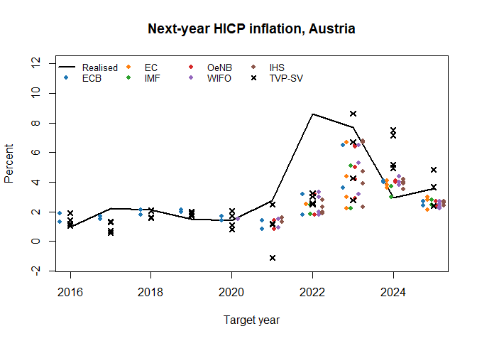

``` r
library(bvartools)
```

## Introduction

The vignette on horse races lets models compete with two made-up forecasters. This
one races them against forecasts that were actually published: the projections of
the European Central Bank (ECB), the European Commission (EC), the International
Monetary Fund (IMF), the Oesterreichische Nationalbank (OeNB) and the two Austrian
institutes WIFO and IHS for Austrian real GDP growth, HICP inflation and the
unemployment rate, as collected by the
[macroprojections](https://github.com/franzmohr/macroprojections) repository.

Those projections are **annual** -- growth of annual GDP, the annual average rate of
inflation, the annual average unemployment rate -- while the models are estimated
on quarterly data. The comparison therefore happens at the annual frequency.
Function `aggregate_forecasts()` turns every draw of a model's quarterly forecast
into the annual figures it implies, using the quarters of the current year that
were already observed, and `create_external_forecast()` then matches the annual
projections to the quarterly estimation windows.

## Data

Both data sets are read from GitHub, pinned to a commit so that the vignette
always sees the same numbers. The quarterly series come from
[AustriaMacroData](https://github.com/franzmohr/AustriaMacroData): real GDP and
the HICP from Eurostat and the harmonised (ILO) unemployment rate.


``` r
amd <- paste0("https://raw.githubusercontent.com/franzmohr/AustriaMacroData/",
              "443b5216d81b5245a573acd3dc238f682d727b0e/output/aut_panel.csv")
panel <- read.csv(amd)
first <- as.Date(panel[["date"]][1])
as_quarterly <- function(x) {
  ts(x, start = c(as.numeric(format(first, "%Y")), (as.numeric(format(first, "%m")) + 2) / 3),
     frequency = 4)
}

levels <- cbind(y = 100 * log(as_quarterly(panel[["real_gdp"]])),
                p = 100 * log(as_quarterly(panel[["cpi_index"]])),
                u = as_quarterly(panel[["unemployment_rate"]]))
levels <- window(levels, start = c(1996, 1), end = c(2025, 4))
stopifnot(!anyNA(levels))
```

The models see GDP and prices as quarterly log changes in percent and the
unemployment rate in levels. The HICP is not seasonally adjusted, which is why
the models below carry seasonal dummies.


``` r
data <- ts.intersect(dy = diff(levels[, "y"]),
                     dp = diff(levels[, "p"]),
                     u = levels[, "u"])
colnames(data) <- c("dy", "dp", "u")
```

The projections have one row per forecaster, country, variable, target year and
publication date. Austria is country 122 in the IMF's numbering the repository
uses, and the institutions are identified by their legal entity identifiers. The
variables are given the names they have in the models.


``` r
mp <- paste0("https://raw.githubusercontent.com/franzmohr/macroprojections/",
             "c179f0a4cd26d271701a576bd82368481e91d90b/data/forecasts.csv")
proj <- read.csv(mp)
proj <- proj[proj[["ctry"]] == 122, ]

forecasters <- c("549300DTUYXVMJXZNY75" = "ECB", "254900ZNYA1FLUQ9U393" = "EC",
                 "E7EXN6FJGRUTJYNZ3Z71" = "IMF", "5299001Z8JOKGWV5O949" = "OeNB",
                 "5299004QA39L2ORLX198" = "WIFO", "529900FMFN29HKS4BE19" = "IHS")
proj[["forecaster"]] <- forecasters[proj[["institution"]]]
proj <- proj[!is.na(proj[["forecaster"]]), ]
proj[["variable"]] <- c(NGDP_RPCH = "dy", PCPIPCH = "dp", LUR = "u")[proj[["variable"]]]
proj[["pubdate"]] <- as.Date(proj[["pubdate"]])

table(proj[["forecaster"]], proj[["variable"]])
#>       
#>         dp  dy   u
#>   EC    31  31  23
#>   ECB  155 157 157
#>   IHS   57  55  55
#>   IMF   60  62  64
#>   OeNB  69  60  42
#>   WIFO  63  63  59
```

The comparison covers the current year and the next for publications from 2015
onwards:


``` r
ahead <- proj[["year"]] - as.numeric(format(proj[["pubdate"]], "%Y"))
proj <- proj[ahead %in% 0:1 & proj[["pubdate"]] >= as.Date("2015-01-01"), ]
```

## Models

Three specifications with two lags compete, each estimated on an expanding window
whose first sample ends in 2014Q4 and whose last ends in 2025Q3. The first is a
BVAR with a Minnesota prior and a constant error covariance. The second adds
stochastic volatility, which lets the variances of the errors move, and the third
lets the coefficients drift as well.


``` r
set.seed(20260922)

minnesota <- list(kappa1 = 0.2, kappa2 = 0.5, kappa4 = 100)
sv_prior <- list(mu = 0, v_i = 0.01, shape = 3, rate = 0.01,
                 state_variance = 0.05, offset = 1e-8)

bvar <- create_bvarmodel(data, p = 2, seasonal = TRUE,
                         iterations = 4000, burnin = 2000)
bvar <- use_expanding_window(bvar, start = 2015)
bvar <- add_priors(bvar, coef = list(minnesota = minnesota),
                   sigma = list(df = "k", scale = 1))

bvar_sv <- create_bvarmodel(data, p = 2, seasonal = TRUE, error = "sv+covar",
                            iterations = 4000, burnin = 2000)
bvar_sv <- use_expanding_window(bvar_sv, start = 2015)
bvar_sv <- add_priors(bvar_sv, coef = list(minnesota = minnesota, v_i = 1),
                      sigma = sv_prior)

tvp_sv <- create_bvarmodel(data, p = 2, seasonal = TRUE, tvp = TRUE, error = "sv+covar",
                           iterations = 1000, burnin = 2000, thin = 4)
tvp_sv <- use_expanding_window(tvp_sv, start = 2015)
tvp_sv <- add_priors(tvp_sv,
                     coef = list(v_i = 1, v_i_det = 1 / 10,
                                 shape = 3, rate = 0.0001, rate_det = 0.01),
                     sigma = sv_prior)

models <- combine_models(bvar, bvar_sv, tvp_sv)
labels <- c("BVAR", "BVAR-SV", "TVP-SV")
```

The time varying model keeps a quarter of the draws of the others, but runs its
chain as long as theirs with `thin = 4`: it stores a path of coefficients for
every period and every draw, and 44 windows of those add up.


``` r
models <- add_initial_values(models)
models <- add_posterior_coefficients(models, cores = 4)
models <- add_forecast_input(models, n_ahead = 8)
models <- add_posterior_forecasts(models, cores = 4)
```

Eight quarters are enough for any publication: one made in the first quarter needs
the four quarters of the current year and the four of the next.

## From quarterly draws to annual forecasts

`aggregate_forecasts()` needs to know how each variable was transformed before
it entered the models, which it is told by the transformation codes of FRED-MD
and FRED-QD (see `transform_variables()`). GDP and prices are log differences
(code 5), multiplied by 100, which argument `scale` says, and the unemployment
rate enters as it is (code 1). Every draw of the forecast is turned back into a
path of the levels, continued from the quarters of the year that were already
observed at the end of a window, so every draw of the quarterly forecast becomes
a draw of the annual one. With the default `target = "average"` the annual
figure of GDP and prices is the growth of the annual average of the levels --
which is also the growth of the annual sum, so GDP, a flow, and the price index,
an average, are treated alike -- and that of the unemployment rate its annual
average. That is the convention of the projections.


``` r
annual <- aggregate_forecasts(models, code = c(dy = 5, dp = 5, u = 1), scale = 100)
```

Horizon 1 is now the year of the forecast origin and horizon 2 the year after.
The realised annual values are computed from the models' data in the same way and
travel with each window in `data$test$y`.

## Timing

A forecast is compared with a model, which could have been estimated when the
forecast was published. Quarterly national accounts appear about a quarter after
the end of the quarter they describe, so a projection published in quarter $Q$ is
matched with the model estimated on data up to $Q - 1$, which is what argument
`data_lag = 1` of `create_external_forecast()` says. The forecast origin of both
is then $Q$, the first quarter neither of them has seen, and a projection for the
year of its publication is horizon 1 whichever quarter it was published in. If a
forecaster published twice between two data releases, the later publication is
used.


``` r
external <- create_external_forecast(proj, annual,
                                     period = "year", origin = "pubdate",
                                     variable = "variable", value = "value",
                                     by = "forecaster", data_lag = 1)
race <- add_forecast_errors(combine_models(annual, external))
```

No test sample has to be given: models and forecasters alike are scored against
the realised annual values of the models' data. The first three elements of
`race` are the models, the others the forecasters, in the order of `external`.


``` r
n_models <- length(labels)
names(external)
#> [1] "EC"   "OeNB" "WIFO" "IHS"  "ECB"  "IMF"
```

## The race among the models

`selection_criteria(race)` gives the out-of-sample statistics of the package --
the forecast errors, their absolute and their root squared values -- for every
model and forecaster over all of its windows, draw by draw. The comparison with
the published projections needs two things more: a point forecast of each model,
and the pairing of each forecaster with the models on the publications it made.

For the point forecast the posterior median serves: the mean is at the mercy of a
single draw from the heavy tails that stochastic volatility produces over two
years. The following helper collects, for every window, the error of the median
and whether the outcome fell inside the 90% credible band. Since the errors are
the realised values minus the forecast, the median of the draws of the error is
the error of the median forecast. A window whose second year the data do not
cover yet has errors for its first year only.


``` r
point_errors <- function(windows, name) {
  out <- do.call(rbind, lapply(windows, function(w) {
    errors <- get_forecast_errors(w)
    if (is.null(errors)) {
      return(NULL)
    }
    # Only the years the data cover have errors, and they come first
    fcst <- w[["posterior"]][["forecast"]][["forecasts"]][, seq_len(ncol(errors)), drop = FALSE]
    actual <- fcst[1, ] + errors[1, ]
    data.frame(name = name, end = w[["model"]][["aggregation"]][["end"]],
               variable = sub("_[0-9]+$", "", colnames(fcst)),
               horizon = as.integer(sub(".*_", "", colnames(fcst))),
               error = apply(errors, 2, stats::median),
               inside = actual >= apply(fcst, 2, stats::quantile, probs = 0.05, na.rm = TRUE) &
                        actual <= apply(fcst, 2, stats::quantile, probs = 0.95, na.rm = TRUE),
               row.names = NULL)
  }))
  out[!is.na(out[["error"]]), ]
}

model_errors <- do.call(rbind, lapply(seq_len(n_models), function(i) {
  point_errors(race[[i]], labels[i])
}))
inst_errors <- do.call(rbind, lapply(seq_along(external), function(i) {
  point_errors(race[[n_models + i]], names(external)[i])
}))
```

Over all 44 forecast origins from 2015Q1 to 2025Q4, the root mean squared errors
of the three models and the share of outcomes inside their 90% credible bands are:


``` r
rmse <- function(x) sqrt(mean(x^2))
race_table <- aggregate(cbind(error, inside) ~ name + variable + horizon, model_errors,
                        function(x) c(rmse = rmse(x), share = mean(x)))
race_table <- data.frame(model = race_table$name, variable = race_table$variable,
                         horizon = race_table$horizon,
                         RMSE = race_table$error[, "rmse"], coverage = race_table$inside[, "share"])
knitr::kable(race_table[order(race_table$variable, race_table$horizon, race_table$model), ],
             digits = 2, row.names = FALSE)
```


|model   |variable | horizon| RMSE| coverage|
|:-------|:--------|-------:|----:|--------:|
|BVAR    |dp       |       1| 1.12|     0.77|
|BVAR-SV |dp       |       1| 1.07|     0.86|
|TVP-SV  |dp       |       1| 1.11|     0.84|
|BVAR    |dp       |       2| 2.67|     0.80|
|BVAR-SV |dp       |       2| 2.58|     0.85|
|TVP-SV  |dp       |       2| 2.53|     0.85|
|BVAR    |dy       |       1| 2.01|     0.84|
|BVAR-SV |dy       |       1| 1.80|     0.91|
|TVP-SV  |dy       |       1| 1.69|     0.91|
|BVAR    |dy       |       2| 3.60|     0.82|
|BVAR-SV |dy       |       2| 3.22|     0.85|
|TVP-SV  |dy       |       2| 3.21|     0.85|
|BVAR    |u        |       1| 0.40|     0.86|
|BVAR-SV |u        |       1| 0.38|     0.95|
|TVP-SV  |u        |       1| 0.43|     0.91|
|BVAR    |u        |       2| 0.89|     0.85|
|BVAR-SV |u        |       2| 0.84|     0.88|
|TVP-SV  |u        |       2| 0.86|     0.92|


The pandemic is in this sample: a model estimated on data up to 2020Q2 has just
seen output fall by more than ten percent within a quarter. A constant error
covariance attributes such a quarter to the dynamics of the economy and projects
it into the next year, while stochastic volatility attributes it to a large
shock, which is why the two models with moving variances forecast GDP better
and why their credible bands cover the outcomes more often than those of the
BVAR with a constant covariance.

## The race against published projections

Each publication is paired with the forecast of each model from the same window,
and a forecaster is compared with a model only on the publications it made.
Relative RMSEs below one favour the model.


``` r
pairs <- merge(inst_errors[, c("name", "end", "variable", "horizon", "error")],
               model_errors[, c("name", "end", "variable", "horizon", "error")],
               by = c("end", "variable", "horizon"), suffixes = c("_inst", "_model"))

against <- do.call(rbind, lapply(split(pairs, pairs[, c("name_inst", "variable", "horizon")], drop = TRUE),
                                 function(x) {
  inst <- x[x[["name_model"]] == labels[1], ]
  rel <- sapply(labels, function(m) rmse(x[x[["name_model"]] == m, "error_model"]) / rmse(inst[["error_inst"]]))
  data.frame(forecaster = x[["name_inst"]][1], variable = x[["variable"]][1],
             horizon = x[["horizon"]][1], n = nrow(inst),
             RMSE = rmse(inst[["error_inst"]]), t(rel), check.names = FALSE)
}))
against <- against[order(against$variable, against$horizon, against$forecaster), ]
knitr::kable(against, digits = 2, row.names = FALSE)
```


|forecaster |variable | horizon|  n| RMSE| BVAR| BVAR-SV| TVP-SV|
|:----------|:--------|-------:|--:|----:|----:|-------:|------:|
|EC         |dp       |       1| 13| 1.76| 1.08|    1.02|   1.07|
|ECB        |dp       |       1| 22| 0.59| 1.39|    1.36|   1.39|
|IHS        |dp       |       1| 16| 0.92| 1.92|    1.82|   1.87|
|IMF        |dp       |       1| 10| 1.13| 1.06|    1.04|   1.05|
|OeNB       |dp       |       1| 17| 0.60| 1.73|    1.71|   1.75|
|WIFO       |dp       |       1| 18| 0.86| 1.96|    1.86|   1.90|
|EC         |dp       |       2| 11| 3.13| 1.09|    1.04|   1.03|
|ECB        |dp       |       2| 20| 2.31| 1.09|    1.06|   1.01|
|IHS        |dp       |       2| 14| 3.49| 1.12|    1.08|   1.06|
|IMF        |dp       |       2|  8| 3.93| 1.00|    0.97|   0.91|
|OeNB       |dp       |       2| 13| 2.91| 1.10|    1.10|   0.99|
|WIFO       |dp       |       2| 15| 3.24| 1.17|    1.13|   1.10|
|EC         |dy       |       1| 13| 1.10| 1.15|    0.83|   0.97|
|ECB        |dy       |       1| 22| 0.75| 2.03|    2.11|   1.95|
|IHS        |dy       |       1| 16| 1.25| 1.56|    1.57|   1.51|
|IMF        |dy       |       1| 10| 1.33| 1.20|    1.28|   1.26|
|OeNB       |dy       |       1| 16| 0.87| 1.98|    2.05|   1.89|
|WIFO       |dy       |       1| 18| 1.08| 1.70|    1.71|   1.65|
|EC         |dy       |       2| 11| 1.82| 0.79|    0.79|   0.72|
|ECB        |dy       |       2| 20| 2.71| 1.09|    1.07|   1.13|
|IHS        |dy       |       2| 14| 1.60| 1.36|    1.30|   1.59|
|IMF        |dy       |       2|  8| 1.80| 0.94|    0.95|   0.84|
|OeNB       |dy       |       2| 12| 1.38| 1.43|    1.30|   1.64|
|WIFO       |dy       |       2| 15| 2.48| 1.15|    1.13|   1.23|
|EC         |u        |       1|  9| 0.44| 0.40|    0.43|   0.41|
|ECB        |u        |       1| 22| 0.40| 0.80|    0.86|   0.93|
|IHS        |u        |       1| 16| 0.39| 1.02|    1.06|   1.32|
|IMF        |u        |       1| 10| 0.33| 0.84|    1.02|   0.91|
|OeNB       |u        |       1| 12| 0.43| 0.96|    1.04|   1.14|
|WIFO       |u        |       1| 17| 0.42| 0.82|    0.80|   1.09|
|EC         |u        |       2|  7| 0.32| 1.53|    1.61|   2.00|
|ECB        |u        |       2| 20| 0.58| 1.21|    1.36|   1.51|
|IHS        |u        |       2| 14| 0.54| 1.25|    1.50|   1.60|
|IMF        |u        |       2|  8| 0.58| 1.27|    1.51|   1.56|
|OeNB       |u        |       2| 10| 0.47| 1.53|    1.85|   2.15|
|WIFO       |u        |       2| 14| 0.66| 0.88|    1.00|   1.14|


Three things stand out.

- **Inside the year, the institutions are hard to beat.** For the current year
  (horizon 1) the Austrian forecasters and the ECB beat every model by a wide
  margin on GDP and inflation, with errors a quarter to a half smaller. They see
  monthly data, surveys and the flash estimates of the quarter they publish in,
  while a quarterly model with a publication lag of one quarter sees none of that.
- **A year ahead, the gap closes.** For next year's inflation (horizon 2), over a
  period that includes the surge of 2022 and 2023, the time varying model is
  within about ten percent of every institution and level with the ECB and the
  OeNB. For next year's GDP all three models are ahead of the EC and the IMF.
  With samples between seven and twenty-two publications per forecaster, none of
  these differences should be read as a ranking.
- **Unemployment is the variable to be most careful with.** The series was revised
  when Austria's labour force survey was redesigned in 2021, so older
  projections were made for a series that is no longer the one they are scored
  against.

The figure shows what the numbers summarise for next year's inflation: the
projections for each target year published in the year before, the forecasts of
the time varying model from the same origins, and what inflation turned out to be.


``` r
infl <- proj[proj[["variable"]] == "dp" &
             proj[["year"]] == as.numeric(format(proj[["pubdate"]], "%Y")) + 1, ]
tvp <- do.call(rbind, lapply(race[[3]], function(w) {
  fcst <- w[["posterior"]][["forecast"]][["forecasts"]]
  data.frame(year = floor(w[["model"]][["aggregation"]][["end"]] + 0.25) + 1,
             median = stats::median(fcst[, "dp_2"]))
}))
tvp <- tvp[tvp[["year"]] <= 2025, ]
act <- window(annual[[1]][[1]][["data"]][["original"]][["endogen"]][, "dp"], start = 2016)

cols <- c(ECB = "#1f77b4", EC = "#ff7f0e", IMF = "#2ca02c", OeNB = "#d62728",
          WIFO = "#9467bd", IHS = "#8c564b")
plot(act, lwd = 2, ylim = c(-1.5, 12), xlab = "Target year", ylab = "Percent",
     main = "Next-year HICP inflation, Austria")
off <- seq(-0.25, 0.25, length.out = length(cols))
for (i in seq_along(cols)) {
  x <- infl[infl[["forecaster"]] == names(cols)[i], ]
  points(x[["year"]] + off[i], x[["value"]], pch = 16, cex = 0.8, col = cols[i])
}
points(tvp[["year"]], tvp[["median"]], pch = 4, lwd = 2)
legend("topleft", c("Realised", names(cols), "TVP-SV"), bty = "n", cex = 0.8, ncol = 4,
       lty = c(1, rep(NA, length(cols) + 1)), lwd = c(2, rep(NA, length(cols)), 2),
       pch = c(NA, rep(16, length(cols)), 4), col = c("black", cols, "black"))
```

<div class="figure">

<p class="caption">plot of chunk inflation-plot</p>
</div>

## What this comparison does not do

- **The data are revised data.** The models are estimated on today's vintage of
  the national accounts, while the forecasters worked with the data of their day.
  That favours the models, most of all for GDP, whose revisions are largest. A
  real-time comparison needs a vintage of the data per publication.
- **GDP is seasonally and calendar adjusted.** Annual growth computed from the
  adjusted quarters differs slightly from the growth of unadjusted annual GDP,
  which is what most institutions project. An annual time series of official
  figures can be passed to `add_forecast_errors()` as `test_sample` to score
  against those instead.
- **One quarter of publication lag is a convention.** A forecaster publishing late
  in a quarter often has the flash estimate of the quarter before, and one
  publishing early may not; `data_lag` is the place to say otherwise.

## Citing bvartools

If you use `bvartools` in published work, please cite it. `citation("bvartools")` prints the reference, and the package has the DOI [10.5281/zenodo.22736604](https://doi.org/10.5281/zenodo.22736604), which always resolves to the latest archived version.
