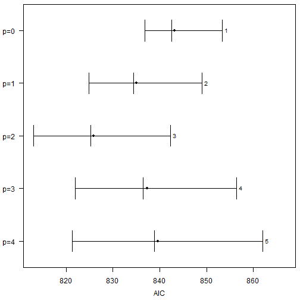
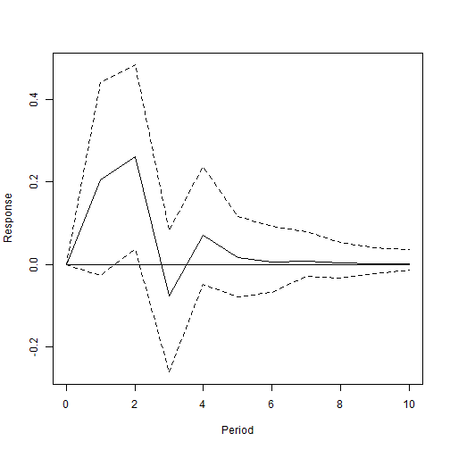

`bvartools` comes with the functionality to set up and produce posterior draws for multiple models in an effort to reduce the time required for this potentially laborious process. This vignette illustrates how the package can be used to set up multiple models, produce prior specifications, add initial values, obtain posterior draws and select the model with the best fit in a few steps.

## Data

For this illustrations the data set E1 from Lütkepohl (2006) is used. It contains data on West German fixed investment, disposable income and consumption expenditures in billions of DM from 1960Q1 to 1982Q4. Like in the textbook only the log-differenced series up to 1978Q4 are used.


``` r
library(bvartools)

set.seed(123456) # Set seed for reproducibility

data("e1") # Load data
data <- diff(log(e1)) * 100 # Obtain log-differences

# Use date up to 1978Q4
data <- window(data, end = c(1978, 4))

# Plot
plot(data)
```


## Set up models

Functions `create_bvarmodel` can be used to obtain a list of different model specifications. In the following example five models with an intercept and increasing lag orders are generated.


``` r
models <- create_bvarmodel(data, p = 0:4,
                           deterministic = "const",
                           iterations = 5000, burnin = 1000)
```

All objects use the same amounts of available observations to ensure consistency for the calculation of information criteria for model selection.

## Priors

Function `add_priors` can be used to produce priors for each of the models in object `models`.


``` r
models <- add_priors(models,
                     coef = list(v_i = 0, v_i_det = 0),
                     sigma = list(df = "k", scale = 0.0001))
```

## Initial values

Function `add_initial_values` can be used to generate initial values of the Gibbs sampler for each of the models in object `models`.


``` r
models <- add_initial_values(models)
```

## Posterior simulation

Posterior draws can be obtained using function `add_posterior_coefficients`.


## Model selection


If function `selection_criteria` is applied to an object of class `posteriorlist`, it produces an object of class `selcritlist`. Its elements are of class `selcrit` and contain the log-likelihood, the number of estimated parameters and a table of selection criteria. The information criteria are calculated based on the posterior draws of the respective model and calculated in the following way:

* *Log-likelihood*: $LL = \frac{1}{R} \sum_{i = 1}^{R} \left( \sum_{t = 1}^{T} -\frac{K}{2} \ln 2\pi - \frac{1}{2} \ln |\Sigma_t^{(i)}| -\frac{1}{2} (u_t^{{(i)}\prime} (\Sigma_t^{(i)})^{-1} u_t^{(i)} \right)$ for each draw $i$ and $u_t = y_t - \mu_t$;
* *Akaika information criterion*: $AIC = 2 (Kp + M (s + 1) + N) - 2 LL$;
* *Bayesian information criterion*: $BIC =  ln(T) (Kp + M (s + 1) + N) - 2 LL$;
* *Hannan-Quinn information criterion*: $HQ = 2 ln(ln(T)) (Kp + M (s + 1) + N) - 2 LL$.

$K$ is the number of endogenous variables and $p$ the lag order of the model. If exogenous variables were used $M$ is the number of stochastic exogenous regressors and $s$ is the lag order for those variables. $N$ is the number of deterministic terms.


``` r
selcrit <- selection_criteria(models)
```

Method `print.selcritlist` gives a table with model selection criteria for each model


``` r
selcrit
#> 
#> ------------------------------------------
#> In-sample
#> ------------------------------------------
#> 
#> Log-likelihood
#> 
#>            Mean Median Quantile (2.5%) Quantile (97.5%)
#>  Model 1 -420.6 -420.3          -425.7           -417.4
#>  Model 2 -413.5 -413.2          -420.5           -408.4
#>  Model 3 -405.9 -405.6          -414.1           -399.5
#>  Model 4 -408.6 -408.2          -418.2           -401.0
#>  Model 5 -406.8 -406.4          -418.0           -397.7
#> 
#> 
#> Akaike Information Criterion (AIC)
#> 
#>           Mean Median Quantile (2.5%) Quantile (97.5%)
#>  Model 1 843.2  842.5           836.9            853.3
#>  Model 2 835.0  834.4           824.9            849.0
#>  Model 3 825.8  825.2           813.0            842.3
#>  Model 4 837.3  836.5           821.9            856.4
#>  Model 5 839.6  838.8           821.3            862.0
#> 
#> 
#> Bayesian Information Criterion (BIC)
#> 
#>           Mean Median Quantile (2.5%) Quantile (97.5%)
#>  Model 1 845.5  844.8           839.2            855.6
#>  Model 2 844.1  843.4           833.9            858.1
#>  Model 3 841.7  841.0           828.9            858.1
#>  Model 4 859.9  859.1           844.6            879.1
#>  Model 5 869.0  868.3           850.8            891.4
#> 
#> 
#> Hannan-Quinn Criterion (HQ)
#> 
#>           Mean Median Quantile (2.5%) Quantile (97.5%)
#>  Model 1 844.1  843.4           837.8            854.2
#>  Model 2 838.6  838.0           828.5            852.6
#>  Model 3 832.1  831.5           819.3            848.6
#>  Model 4 846.3  845.5           830.9            865.4
#>  Model 5 851.3  850.5           833.0            873.7
```

Method `plot.selcritlist` plots the distribution for the above selection criteria for each posterior draw.


``` r
plot(selcrit, criterion = "AIC")
```




``` r
pos <- choose_best_model(selcrit, criterion = "AIC")
pos
#> [1] 3
```

Since all information criteria have the lowest value for the model with $p = 2$, the third element of `models` is used for further analysis.


``` r
plot(irf(models[[pos]], impulse = "income", response = "cons", n_ahead = 10))
```



## Literature

Chan, J., Koop, G., Poirier, D. J., & Tobias, J. L. (2019). *Bayesian Econometric Methods* (2nd ed.). Cambridge: University Press.

Lütkepohl, H. (2006). *New introduction to multiple time series analysis* (2nd ed.). Berlin: Springer.
