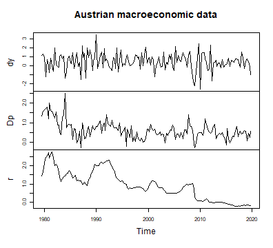
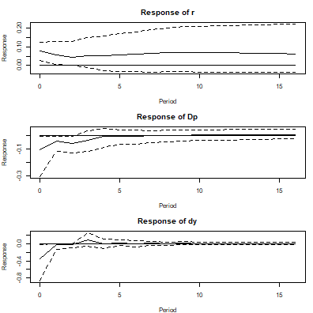
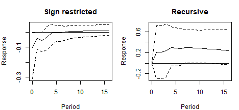
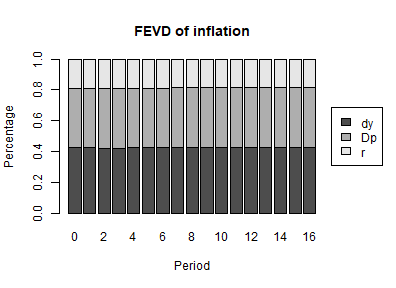

## Introduction

The reduced form of a vector autoregressive model describes the data through a covariance matrix of its errors. That covariance says how the errors move together, but not which shock caused what: any decomposition $\Sigma = P P^\prime$ reproduces it equally well, and the likelihood is silent about which one to prefer. Identification is the act of choosing among them, and it always rests on information that the data do not contain.

A recursive identification chooses the Choleski factor, which amounts to assuming that some variables do not react to some shocks within the period. That is a strong assumption and it is rarely the one a theory suggests. *Sign restrictions*, proposed by Faust (1998), Canova and De Nicolò (2002) and Uhlig (2005), replace it with a weaker one: instead of saying that a response is exactly zero, they say only which direction a handful of responses point in.

The weakening has a price. A recursive identification picks out one model; a set of sign restrictions is satisfied by many, and the data give no reason to rank them. The identification is *set valued*, and every number that comes out of it has to be read accordingly. This vignette shows how to impose such restrictions with `bvartools` and what the result does and does not say.

## The model

The illustration uses data set `at_macrodata`, from which it takes the growth rate of Austrian real GDP (`dy`), inflation (`Dp`) and the short-term interest rate (`r`), all in percent per quarter from 1979Q3 to 2019Q4, and asks the question these series are usually asked: what does a contractionary monetary policy shock do? The pandemic quarters are left out, because output growth moved by ten percent within a quarter in 2020.

For Austria the short-term rate was set abroad for most of the sample: by the Bundesbank, to whose currency the schilling was pegged, and from 1999 by the European Central Bank. A shock to it is therefore a shock to the monetary conditions Austria faced rather than to a domestic policy decision, which does not change how the restrictions below are imposed.


``` r
library(bvartools)

data("at_macrodata")
at <- at_macrodata[["domestic"]]
data <- ts.intersect(dy = diff(at[, "y"]), Dp = at[, "Dp"], r = at[, "r"]) * 100
data <- window(data, end = c(2019, 4))

plot(data, main = "Austrian macroeconomic data")
```

<div class="figure" style="text-align: center">

<p class="caption">plot of chunk data</p>
</div>

The model is a VAR(4) with an intercept, estimated in the usual way. Nothing about the set-up anticipates the identification: sign restrictions are imposed on the posterior draws after the fact, so the same estimated model can be identified in several ways and compared.


``` r
model <- create_bvarmodel(data, p = 4, deterministic = "const",
                          iterations = 10000, burnin = 5000)

model <- add_priors(model,
                    coef = list(v_i = 1, v_i_det = 1 / 10),
                    sigma = list(df = "k", scale = 1))

model <- add_initial_values(model)

set.seed(1234567)
model <- add_posterior_coefficients(model)
```

## Imposing the restrictions

The restrictions are a data frame with one row per restriction. Each row names the shock it speaks about, the variable whose response is restricted, the direction of that response, and the horizon it applies to, counted from zero for the impact period.

A contractionary monetary policy shock is conventionally taken to raise the policy rate, lower inflation and lower output growth. Here that pattern is imposed for the impact quarter and the two that follow.


``` r
restrictions <- data.frame(
  impulse  = "r",
  response = c("r", "Dp", "dy"),
  sign     = c(1, -1, -1),
  horizon  = rep(0:2, each = 3)
)

restrictions
#>   impulse response sign horizon
#> 1       r        r    1       0
#> 2       r       Dp   -1       0
#> 3       r       dy   -1       0
#> 4       r        r    1       1
#> 5       r       Dp   -1       1
#> 6       r       dy   -1       1
#> 7       r        r    1       2
#> 8       r       Dp   -1       2
#> 9       r       dy   -1       2
```

The shock is named after a variable -- `impulse = "r"` -- because a structural shock has no name of its own. The convention is the same one `irf` uses, and it means no more than that this is the shock the restrictions describe. Nothing forces it to be "the" monetary policy shock beyond the pattern that was asked for.

`add_sign_restrictions` then searches, for every posterior draw, for a rotation of that draw's Choleski factor whose responses satisfy every row. The search is random, so a seed is needed to reproduce it.


``` r
set.seed(7654321)
model <- add_sign_restrictions(model, restrictions, max_tries = 1000)
```

Some draws may not yield an admissible rotation within `max_tries` attempts, and those are dropped. How many survived is worth looking at before anything else, and `summary` reports it alongside the restrictions:


``` r
summary(model)[["model"]][["sign_restrictions"]][c("accepted", "draws")]
#> $accepted
#> [1] 744
#> 
#> $draws
#> [1] 10000
```

A low acceptance rate is not a technical problem to be solved by raising `max_tries`. It says that the model rarely produces the pattern that was asked of it, which is a finding about the restrictions themselves.

## Impulse responses

The identification is used by passing `type = "sign"` to `irf`. The draws that were not identified are left out.


``` r
par(mfrow = c(3, 1), mar = c(4, 4, 3, 1))

for (i in c("r", "Dp", "dy")) {
  ir <- irf(model, impulse = "r", response = i, n_ahead = 16, type = "sign")
  plot(ir, main = paste("Response of", i))
}
```

<div class="figure" style="text-align: center">

<p class="caption">plot of chunk irf-policy</p>
</div>

The first three quarters of each panel are the restrictions themselves and carry no information: the responses have the sign they have because that is what was imposed. What the restrictions do not determine is everything from the fourth quarter on. There the responses of inflation and output growth return to zero within about a year, while the median response of the interest rate stays positive over the whole horizon, with a band that includes zero after the first few quarters.

## Why not simply order the variables?

It is worth seeing what the weaker assumption buys, by identifying the same posterior draws recursively and comparing the inflation responses.


``` r
sign_ir <- irf(model, impulse = "r", response = "Dp", n_ahead = 16, type = "sign")
chol_ir <- irf(model, impulse = "r", response = "Dp", n_ahead = 16, type = "oir")

par(mfrow = c(1, 2), mar = c(4, 4, 3, 1))
plot(sign_ir, main = "Sign restricted")
plot(chol_ir, main = "Recursive")
```

<div class="figure" style="text-align: center">

<p class="caption">plot of chunk puzzle</p>
</div>


``` r
round(chol_ir[1:4, ], 3)
#>        2.5%   50% 97.5%
#> [1,]  0.000 0.000 0.000
#> [2,] -0.291 0.209 0.713
#> [3,] -0.292 0.205 0.716
#> [4,] -0.265 0.240 0.743
```

The recursive responses show a mild form of the *price puzzle* of Sims (1992): the median response of inflation to a contractionary shock is positive at every horizon, which is the opposite of what a policy tightening is supposed to do, although its credible interval includes zero in the first quarters. They also begin at exactly zero, because ordering the policy rate last assumes that inflation cannot react within the quarter.

Both features are assumptions rather than results. The recursive identification assumes a zero on impact and lets the sign go where it will; the sign restrictions assume the sign for three quarters and let the impact magnitude go where it will. Neither set of responses is evidence against the other, and the comparison is only useful as a reminder of how much of an impulse response comes from the identification rather than the data.

## Variance decomposition and spillovers

`fevd` and `spillover` take `type = "sign"` as well, and use the same rotations.


``` r
decomposition <- fevd(model, response = "Dp", n_ahead = 16, type = "sign")

plot(decomposition, main = "FEVD of inflation")
```

<div class="figure" style="text-align: center">

<p class="caption">plot of chunk fevd</p>
</div>

A rotation of the Choleski factor still factorises $\Sigma$, so the shares add up as they do in the orthogonalised case:


``` r
round(rowSums(decomposition)[1:4], 6)
#> [1] 1 1 1 1
```

## Reading a set identified result

The credible bands above are not credible intervals of a parameter in the usual sense. Each draw contributes a model that the restrictions admit and the data cannot rank, so the band mixes two sources of spread: uncertainty about the coefficients, and indeterminacy about which admissible model is the right one. Narrowing it requires more restrictions, not more data.

The pointwise median has a further difficulty, pointed out by Fry and Pagan (2011): it is the median of each horizon taken separately, so the curve it traces need not be the response of any single admissible model. It is a summary of the set, not a member of it.

Two practical consequences follow. A response at a horizon the restrictions bind reports an assumption and should not be read as a result. And a restriction set large enough to pin the responses down tightly is worth re-examining, because it is doing the work that the data were supposed to do.

Only sign restrictions are supported. Zero restrictions on the impact responses cannot be imposed by searching, since the set of rotations that satisfies them has probability zero, and require the algorithm of Arias et al. (2018).

## References

Arias, J. E., Rubio-Ramírez, J. F., & Waggoner, D. F. (2018). Inference based on structural vector autoregressions identified with sign and zero restrictions: Theory and applications. *Econometrica, 86*(2), 685--720. https://doi.org/10.3982/ECTA14468

Canova, F., & De Nicolò, G. (2002). Monetary disturbances matter for business fluctuations in the G-7. *Journal of Monetary Economics, 49*(6), 1131--1159. https://doi.org/10.1016/S0304-3932(02)00145-9

Chan, J., Koop, G., Poirier, D. J., & Tobias, J. L. (2019). *Bayesian econometric methods* (2nd ed.). Cambridge: Cambridge University Press.

Faust, J. (1998). The robustness of identified VAR conclusions about money. *Carnegie-Rochester Conference Series on Public Policy, 49*, 207--244. https://doi.org/10.1016/S0167-2231(99)00009-3

Fry, R., & Pagan, A. (2011). Sign restrictions in structural vector autoregressions: A critical review. *Journal of Economic Literature, 49*(4), 938--960. https://doi.org/10.1257/jel.49.4.938

Rubio-Ramírez, J. F., Waggoner, D. F., & Zha, T. (2010). Structural vector autoregressions: Theory of identification and algorithms for inference. *The Review of Economic Studies, 77*(2), 665--696. https://doi.org/10.1111/j.1467-937X.2009.00578.x

Sims, C. A. (1992). Interpreting the macroeconomic time series facts: The effects of monetary policy. *European Economic Review, 36*(5), 975--1000. https://doi.org/10.1016/0014-2921(92)90041-T

Uhlig, H. (2005). What are the effects of monetary policy on output? Results from an agnostic identification procedure. *Journal of Monetary Economics, 52*(2), 381--419. https://doi.org/10.1016/j.jmoneco.2004.05.007
