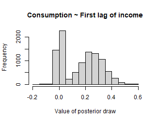

## Introduction

A general drawback of vector autoregressive (VAR) models is that the number of estimated coefficients increases disproportionately with the number of lags. Therefore, fewer information per parameter is available for the estimation as the number of lags increases. In the Bayesian VAR literature one approach to mitigate this so-called *curse of dimensionality* is *stochastic search variable selection* (SSVS) as proposed by George et al. (2008). The basic idea of SSVS is to assign commonly used prior variances to parameters, which should be included in a model, and prior variances close to zero to irrelevant parameters. By that, relevant parameters are estimated in the usual way and posterior draws of irrelevant variables are close to zero so that they have no significant effect on forecasts and impulse responses. This is achieved by adding a hierarchial prior to the model, where the relevance of a variable is assessed in each step of the sampling algorithm.[^koop]

Korobilis (2013) proposes a similar appraoch to variable selection, which can also be applied to timy varying parameter models. The approach is implemented in `bvartools` as function `bvs`, which can be easily added to a standard Gibbs sampling algorithm. It is also implemented in the posterior simulation algorithm of the package an can be specified analogously to the last section of this introduction, where the use of the built-in SSVS sampler is described.

This vignette presents code for Bayesian inference of a vector autoregressive (BVAR) model using stochastic search variable selection. It uses [dataset E1](http://www.jmulti.de/download/datasets/e1.dat) from Lütkepohl (2006), which contains data on West German fixed investment, disposable income and consumption expenditures in billions of DM from 1960Q1 to 1982Q4. Following a related example in Lütkepohl (2006, Section 5.2.10) only the first 71 observations of a VAR(4) model are used. The `bvartools` package can be used to load the data and generate the data matrices for the model.


``` r
library(bvartools)

# Load and transform data
data("e1")
e1 <- diff(log(e1))

# Shorten time series
e1 <- window(e1, end = c(1978, 4))

# Generate VAR
data <- create_bvarmodel(e1, p = 4, deterministic = "const",
                         varsel = "ssvs",
                         iterations = 10000, burnin = 5000)
```

`bvartools` allows to estimate BVAR models with SSVS either by using algorithms that were written by the researchers themselves or by using the built-in posterior simulation algorithm. The first approach is presented in the following section. The latter approach is illustrated at the end of this introduction.

## Inference based on a user-written algorithm

The prior variances of the parameters are set in accordance with the semiautomatic approach described in George et al. (2008). Hence, the prior variance of the $i$th parameter is set to $\tau_{1,i}^2 = (10 \hat{\sigma}_i)^2$ if this parameter should be included in the model and to $\tau_{0,i}^2 = (0.1 \hat{\sigma}_i)^2$ if it should be excluded. $\hat{\sigma}_i$ is the standard error associated with the unconstrained least squares estimate of parameter $i$. For all variables the prior inclusion probabilities are set to 0.5. The necessary calculations can be done with function `ssvs_prior`. The prior of the error variance-covariance matrix is uninformative and, in constrast to George et al. (2008), SSVS is not applied to the covariances.


``` r
# Reset random number generator for reproducibility
set.seed(1234567)

# Get data matrices
y <- t(data$data$train$y)
x <- t(data$data$train$x)

tt <- ncol(y) # Number of observations
k <- nrow(y) # Number of endogenous variables
m <- k * nrow(x) # Number of estimated coefficients

# Coefficient priors
a_mu_prior <- matrix(0, m) # Vector of prior means

# SSVS priors (semiautomatic approach)
vs_prior <- ssvs_prior(data, semiautomatic = c(.1, 10))
tau0 <- vs_prior$tau0
tau1 <- vs_prior$tau1

# Prior for inclusion parameter
prob_prior <- matrix(0.5, m)

# Prior for variance-covariance matrix
u_sigma_df_prior <- 0 # Prior degrees of freedom
u_sigma_scale_prior <- diag(0.00001, k) # Prior covariance matrix
u_sigma_df_post <- tt + u_sigma_df_prior # Posterior degrees of freedom
```

The initial parameter values are set to zero and their corresponding prior variances are set to $\tau_1^2$, which implies that all parameters should be estimated relatively freely in the first step of the Gibbs sampler.


``` r
# Initial values
a <- matrix(0, m)
a_v_i_prior <- diag(1 / c(tau1)^2, m) # Inverse of the prior covariance matrix

# Data containers for posterior draws
iterations <- 10000 # Number of total Gibs sampler draws
burnin <- 5000 # Number of burn-in draws
draws <- iterations + burnin # Total number of draws

draws_a <- matrix(NA, m, iterations)
draws_lambda <- matrix(NA, m, iterations)
draws_sigma <- matrix(NA, k^2, iterations)
```

SSVS can be added to a standard Gibbs sampler algorithm for VAR models in a straightforward manner. The `ssvs` function can be used to obtain a draw of inclusion parameters and its corresponding inverted prior variance matrix. It requires the current draw of parameters, standard errors $\tau_0$ and $\tau_1$, and prior inclusion probabilities as arguments. In this example constant terms are excluded from SSVS, which is achieved by specifying `include = 1:36`. Hence, only parameters 1 to 36 are considered by the function and the remaining three parameters have prior variances that correspond to their values in $\tau_1^2$.


``` r
# Start Gibbs sampler
for (draw in 1:draws) {
  # Draw variance-covariance matrix
  u <- y - matrix(a, k) %*% x # Obtain residuals
  # Scale posterior
  u_sigma_scale_post <- solve(u_sigma_scale_prior + tcrossprod(u))
  # Draw posterior of inverse sigma
  u_sigma_i <- matrix(rWishart(1, u_sigma_df_post, u_sigma_scale_post)[,, 1], k)
  # Obtain sigma
  u_sigma <- solve(u_sigma_i)
  
  # Draw conditional mean parameters
  a <- post_normal(y, x, u_sigma_i, a_mu_prior, a_v_i_prior)
  
  # Draw inclusion parameters and update priors
  temp <- ssvs(a, tau0, tau1, prob_prior, include = 1:36)
  a_v_i_prior <- temp$v_i # Update prior
  
  # Store draws
  if (draw > burnin) {
    draws_a[, draw - burnin] <- a
    draws_lambda[, draw - burnin] <- temp$lambda
    draws_sigma[, draw - burnin] <- u_sigma
  }
}
```

The output of a Gibbs sampler with SSVS can be further analysed in the usual way. With the `bvartools` package the posterior draws can be collected in a `bvarmodel` object and the `summary` method provides summary statistics. It is also possible to add information on the inclusion parameters to the `bvarmodel` object by providing a named list as an argument. The list must contain an element `coeffs`, which contains the MCMC draws of the coefficients, and element `lambda` contains the corresponding draw of the inclusion parameter.


``` r
bvar_est <- bvar(y = data$data$train$y, x = data$data$train$x,
                 A = list(coeffs = draws_a[1:36,],
                          lambda = draws_lambda[1:36,]),
                 C = list(coeffs = draws_a[37:39, ],
                          lambda = draws_lambda[37:39,]),
                 Sigma = draws_sigma)

bvar_summary <- summary(bvar_est)

bvar_summary
#> 
#> Bayesian VAR model with p = 4 
#> 
#> Variable selection algorithm: Bayesian variable selection (Korobilis, 2013)
#> 
#> Endogenous variables: invest, income, cons
#> 
#> Variable: invest 
#> 
#>                   Mean         SD     Naive SD Time-series SD        2.5%
#> invest.l1 -0.100986159 0.13742411 0.0013742411   0.0067556501 -0.41239450
#> income.l1  0.042682902 0.19943921 0.0019943921   0.0041264425 -0.13046411
#> cons.l1    0.092476634 0.31915230 0.0031915230   0.0121500267 -0.15773613
#> invest.l2 -0.014248177 0.05458255 0.0005458255   0.0013462137 -0.19756381
#> income.l2  0.006577502 0.14992115 0.0014992115   0.0016868558 -0.16959094
#> cons.l2    0.023738948 0.18062508 0.0018062508   0.0029225039 -0.18247511
#> invest.l3  0.035039385 0.08645229 0.0008645229   0.0030534463 -0.02680920
#> income.l3 -0.005860130 0.14585850 0.0014585850   0.0020194525 -0.21942234
#> cons.l3   -0.049003849 0.22711236 0.0022711236   0.0047491270 -0.77723465
#> invest.l4  0.261911726 0.16115092 0.0016115092   0.0106788476 -0.01089868
#> income.l4 -0.063442300 0.23147353 0.0023147353   0.0052902901 -0.85244380
#> cons.l4   -0.024209833 0.19028614 0.0019028614   0.0034498646 -0.52387364
#> const      0.013250519 0.01221973 0.0001221973   0.0002292537 -0.01251166
#>                    50%      97.5% Incl. prob. 
#> invest.l1 -0.015717862 0.02182565      0.4211 
#> income.l1  0.010205070 0.71326763      0.1087 
#> cons.l1    0.018955609 1.19355645      0.1278 
#> invest.l2 -0.002650744 0.02941696      0.1248 
#> income.l2  0.002813707 0.28322903      0.0748 
#> cons.l2    0.008862068 0.45498030      0.0680 
#> invest.l3  0.005647765 0.30487125      0.1950 
#> income.l3 -0.003163268 0.15790703      0.0645 
#> cons.l3   -0.013453202 0.16138589      0.0915 
#> invest.l4  0.288621577 0.53858336      0.8119 
#> income.l4 -0.014554829 0.12479525      0.1294 
#> cons.l4   -0.007770704 0.16523694      0.0824 
#> const      0.013196238 0.03796215      1.0000 
#> 
#> Variable: income 
#> 
#>                    Mean          SD     Naive SD Time-series SD         2.5%
#> invest.l1  1.000302e-02 0.022092185 2.209218e-04   0.0008646350 -0.006313980
#> income.l1 -2.191629e-02 0.078706579 7.870658e-04   0.0041292000 -0.293044957
#> cons.l1    1.247627e-01 0.187195431 1.871954e-03   0.0128514379 -0.034187711
#> invest.l2  1.761825e-03 0.010906353 1.090635e-04   0.0002563008 -0.008301976
#> income.l2  3.262304e-03 0.044237151 4.423715e-04   0.0009619065 -0.043491238
#> cons.l2   -8.208839e-04 0.040009041 4.000904e-04   0.0005678557 -0.059479094
#> invest.l3 -3.551712e-05 0.008768670 8.768670e-05   0.0001010823 -0.012647769
#> income.l3  1.701222e-02 0.060078301 6.007830e-04   0.0017445990 -0.031970491
#> cons.l3    7.073433e-03 0.050096850 5.009685e-04   0.0011611897 -0.044233310
#> invest.l4  1.599335e-03 0.009983913 9.983913e-05   0.0001818583 -0.008219919
#> income.l4 -1.159935e-02 0.046668245 4.666825e-04   0.0010420245 -0.169980203
#> cons.l4    1.271028e-03 0.034259461 3.425946e-04   0.0004171838 -0.043668415
#> const      1.755400e-02 0.003946580 3.946580e-05   0.0001675529  0.009025232
#>                     50%      97.5% Incl. prob.  
#> invest.l1  1.744184e-03 0.07579158      0.2143  
#> income.l1 -3.094746e-03 0.03503278      0.1395  
#> cons.l1    2.070874e-02 0.58433187      0.3705  
#> invest.l2  4.182212e-04 0.03355669      0.0794  
#> income.l2  1.365553e-03 0.09711064      0.0788  
#> cons.l2   -2.262667e-04 0.05261400      0.0590  
#> invest.l3  5.870506e-05 0.01167865      0.0736  
#> income.l3  4.713707e-03 0.22945926      0.1041  
#> cons.l3    2.153015e-03 0.12200714      0.0698  
#> invest.l4  4.190348e-04 0.03116070      0.0876  
#> income.l4 -3.234425e-03 0.03130169      0.0942  
#> cons.l4    5.738935e-04 0.05133320      0.0571  
#> const      1.817027e-02 0.02420357      1.0000 *
#> 
#> Variable: cons 
#> 
#>                    Mean         SD     Naive SD Time-series SD         2.5%
#> invest.l1 -0.0019266163 0.01001426 0.0001001426   0.0002523566 -0.035495165
#> income.l1  0.1620969511 0.14143997 0.0014143997   0.0122215470 -0.015647352
#> cons.l1   -0.2764279629 0.19774791 0.0019774791   0.0180704698 -0.597192424
#> invest.l2  0.0059919284 0.01562988 0.0001562988   0.0005909786 -0.005737624
#> income.l2  0.3019294367 0.10595985 0.0010595985   0.0055550233  0.005315183
#> cons.l2    0.0088922878 0.05462031 0.0005462031   0.0022606960 -0.043219482
#> invest.l3  0.0005547670 0.00736967 0.0000736967   0.0001232193 -0.007843287
#> income.l3  0.0108020803 0.04368838 0.0004368838   0.0013251677 -0.026851631
#> cons.l3    0.0205422620 0.06172727 0.0006172727   0.0021501851 -0.029285872
#> invest.l4 -0.0042340603 0.01307736 0.0001307736   0.0005367193 -0.048808663
#> income.l4  0.0212497761 0.05624517 0.0005624517   0.0017100808 -0.022764006
#> cons.l4   -0.0002534639 0.03117457 0.0003117457   0.0003874638 -0.048734071
#> const      0.0142597017 0.00361687 0.0000361687   0.0001126958  0.007209746
#>                     50%       97.5% Incl. prob.  
#> invest.l1 -0.0004061070 0.006740454      0.1047  
#> income.l1  0.1818312006 0.417407526      0.6398  
#> cons.l1   -0.3172985907 0.017025528      0.7383  
#> invest.l2  0.0011036104 0.055674348      0.1816  
#> income.l2  0.3131141638 0.479593769      0.9537 *
#> cons.l2    0.0020861515 0.175021866      0.0950  
#> invest.l3  0.0001286034 0.018610178      0.0815  
#> income.l3  0.0028856784 0.151643839      0.0992  
#> cons.l3    0.0054261776 0.226142897      0.1325  
#> invest.l4 -0.0007996104 0.005317072      0.1384  
#> income.l4  0.0051460267 0.205538753      0.1558  
#> cons.l4    0.0001153474 0.043366956      0.0709  
#> const      0.0142571492 0.021476683      1.0000 *
#> 
#> Variance-covariance matrix:
#> 
#>                       Mean           SD     Naive SD Time-series SD
#> invest_invest 2.197267e-03 4.104461e-04 4.104461e-06   7.803533e-06
#> invest_income 4.684726e-05 7.427031e-05 7.427031e-07   1.001634e-06
#> invest_cons   1.388661e-04 6.191519e-05 6.191519e-07   7.265089e-07
#> income_income 1.512856e-04 2.716744e-05 2.716744e-07   2.856257e-07
#> income_cons   6.645165e-05 1.764350e-05 1.764350e-07   2.315755e-07
#> cons_cons     9.753186e-05 1.802757e-05 1.802757e-07   3.104524e-07
#>                        2.5%          50%        97.5%  
#> invest_invest  1.532153e-03 2.154468e-03 0.0031343579 *
#> invest_income -9.906360e-05 4.495671e-05 0.0001997140  
#> invest_cons    2.777026e-05 1.348563e-04 0.0002723529 *
#> income_income  1.065701e-04 1.481722e-04 0.0002139593 *
#> income_cons    3.619253e-05 6.485046e-05 0.0001056381 *
#> cons_cons      6.814514e-05 9.558795e-05 0.0001382903 *
```

The inclusion probabilities of the constant terms are 100 percent, because they were excluded from SSVS.

Using the results from above the researcher could proceed in the usual way and obtain forecasts and impulse responses based on the output of the Gibbs sampler. The advantage of this approach is that it does not only take into account parameter uncertainty, but also model uncertainty. This can be illustrated by the histogram of the posterior draws of the 6th coefficient, which describes the relationship between the first lag of income and the current value of consumption.


``` r
hist(draws_a[6,], main = "Consumption ~ First lag of income", xlab = "Value of posterior draw")
```



A non-negligible mass of some 23 percent, i.e. 1 - 0.67, of the parameter draws is concentrated around zero. This is the result of SSVS, where posterior draws are close to zero if a constant is assessed to be irrelevant during an iteration of the Gibbs sampler and, therefore, $\tau_{0,6}^2$ is used as its prior variance. On the other hand, about 67 percent of the draws are dispersed around a positive value, where SSVS suggests to include the variable in the model and the larger value $\tau_{1,6}^2$ is used as prior variance. Model uncertainty is then described by the two peaks and parameter uncertainty by the dispersion of the posterior draws around them.

However, if the researcher prefers not to work with a model, where the relevance of a variable can change from one step of the sampling algorithm to the next, a different approach would be to work only with a highly probable model. This can be done with a further simulation, where very tight priors are used for irrelevant variables and relatively uninformative priors for relevant parameters. In this example, coefficients with a posterior inclusion probability of above 40 percent are considered to be relevant.[^threshold] The prior variance is set to 0.00001 for irrelevant and to 9 for relevant variables. No additional SSVS step is required. Everything else remains unchanged.


``` r
# Get inclusion probabilities
lambda <- bvar_summary$a$lambda

# Select variables that should be included
include_var <- c(lambda >= .4)

# Update prior variances
diag(a_v_i_prior)[!include_var] <- 1 / 0.00001 # Very tight prior close to zero
diag(a_v_i_prior)[include_var] <- 1 / 9 # Relatively uninformative prior

# Data containers for posterior draws
draws_a <- matrix(NA, m, iterations)
draws_sigma <- matrix(NA, k^2, iterations)

# Start Gibbs sampler
for (draw in 1:draws) {
  # Draw conditional mean parameters
  a <- post_normal(y, x, u_sigma_i, a_mu_prior, a_v_i_prior)
  
  # Draw variance-covariance matrix
  u <- y - matrix(a, k) %*% x # Obtain residuals
  u_sigma_scale_post <- solve(u_sigma_scale_prior + tcrossprod(u))
  u_sigma_i <- matrix(rWishart(1, u_sigma_df_post, u_sigma_scale_post)[,, 1], k)
  u_sigma <- solve(u_sigma_i) # Invert Sigma_i to obtain Sigma
  
  # Store draws
  if (draw > burnin) {
    draws_a[, draw - burnin] <- a
    draws_sigma[, draw - burnin] <- u_sigma
  }
}
```

The means of the posterior draws are similar to the OLS estimates in Lütkepohl (2006, Section 5.2.10):


``` r
bvar_est <- bvar(y = data$data$train$y,
                 x = data$data$train$x,
                 A = draws_a[1:36,],
                 C = draws_a[37:39, ],
                 Sigma = draws_sigma)

summary(bvar_est)
#> 
#> Bayesian VAR model with p = 4 
#> 
#> Endogenous variables: invest, income, cons
#> 
#> Variable: invest 
#> 
#>                    Mean          SD     Naive SD Time-series SD         2.5%
#> invest.l1 -2.273250e-01 0.109866852 1.098669e-03   1.132053e-03 -0.442479169
#> income.l1  2.939601e-06 0.003206228 3.206228e-05   3.206228e-05 -0.006285774
#> cons.l1   -4.150709e-05 0.003140550 3.140550e-05   3.140550e-05 -0.006290600
#> invest.l2 -1.482848e-04 0.003187547 3.187547e-05   3.187547e-05 -0.006378764
#> income.l2  7.630494e-06 0.003114688 3.114688e-05   3.114688e-05 -0.006061766
#> cons.l2    1.051121e-05 0.003180203 3.180203e-05   3.180203e-05 -0.006185276
#> invest.l3  9.854118e-05 0.003181224 3.181224e-05   3.181224e-05 -0.006222637
#> income.l3 -3.996099e-05 0.003155680 3.155680e-05   3.237552e-05 -0.006291131
#> cons.l3    2.191501e-05 0.003146670 3.146670e-05   3.063204e-05 -0.006147741
#> invest.l4  3.265487e-01 0.108321453 1.083215e-03   1.083215e-03  0.113552022
#> income.l4 -1.682021e-05 0.003134190 3.134190e-05   3.134190e-05 -0.006243050
#> cons.l4    4.776412e-05 0.003155623 3.155623e-05   3.078593e-05 -0.006085435
#> const      1.519025e-02 0.006072390 6.072390e-05   6.072390e-05  0.003176068
#>                     50%        97.5%  
#> invest.l1 -2.279552e-01 -0.013898572 *
#> income.l1 -2.741375e-06  0.006310379  
#> cons.l1   -1.581618e-05  0.006061355  
#> invest.l2 -1.638706e-04  0.006063516  
#> income.l2  5.671895e-06  0.005992804  
#> cons.l2    1.836724e-06  0.006261264  
#> invest.l3  5.585263e-05  0.006298624  
#> income.l3 -1.522106e-05  0.006131262  
#> cons.l3    1.975290e-05  0.006158732  
#> invest.l4  3.266566e-01  0.536211047 *
#> income.l4  8.115318e-06  0.006152905  
#> cons.l4    7.561829e-05  0.006283127  
#> const      1.523293e-02  0.026973686 *
#> 
#> Variable: income 
#> 
#>                    Mean          SD     Naive SD Time-series SD         2.5%
#> invest.l1  6.885718e-04 0.003135318 3.135318e-05   3.192161e-05 -0.005464520
#> income.l1  1.465559e-05 0.003137415 3.137415e-05   3.159233e-05 -0.006210079
#> cons.l1    1.124725e-04 0.003146027 3.146027e-05   3.088348e-05 -0.005923771
#> invest.l2  6.833085e-05 0.003095569 3.095569e-05   3.095569e-05 -0.006008642
#> income.l2  5.678968e-05 0.003195166 3.195166e-05   3.402478e-05 -0.006141012
#> cons.l2   -1.586064e-05 0.003160972 3.160972e-05   3.160972e-05 -0.006245895
#> invest.l3  5.569240e-05 0.003141838 3.141838e-05   3.141838e-05 -0.006148327
#> income.l3  1.736299e-04 0.003155350 3.155350e-05   3.155350e-05 -0.006076551
#> cons.l3    2.836783e-05 0.003135561 3.135561e-05   3.135561e-05 -0.006256133
#> invest.l4  2.913438e-04 0.003172298 3.172298e-05   3.118481e-05 -0.005952241
#> income.l4 -4.552079e-05 0.003162165 3.162165e-05   3.162165e-05 -0.006329514
#> cons.l4   -2.956657e-05 0.003162158 3.162158e-05   3.162158e-05 -0.006233365
#> const      2.013616e-02 0.001478583 1.478583e-05   1.478583e-05  0.017238714
#>                     50%       97.5%  
#> invest.l1  6.906648e-04 0.006844956  
#> income.l1  2.911103e-05 0.006054008  
#> cons.l1    1.093350e-04 0.006296248  
#> invest.l2  1.314539e-04 0.006066144  
#> income.l2  5.507871e-05 0.006295829  
#> cons.l2   -3.052778e-05 0.006190623  
#> invest.l3  7.773226e-05 0.006201061  
#> income.l3  1.598050e-04 0.006285151  
#> cons.l3    3.822078e-05 0.006170100  
#> invest.l4  3.034503e-04 0.006431171  
#> income.l4 -1.337421e-05 0.006074911  
#> cons.l4   -6.234878e-05 0.006139616  
#> const      2.015491e-02 0.023036240 *
#> 
#> Variable: cons 
#> 
#>                    Mean          SD     Naive SD Time-series SD         2.5%
#> invest.l1 -5.319692e-04 0.003132735 3.132735e-05   3.132735e-05 -0.006715879
#> income.l1  2.618515e-01 0.085986920 8.598692e-04   8.922824e-04  0.094695396
#> cons.l1   -4.362099e-01 0.102596535 1.025965e-03   1.083150e-03 -0.638762430
#> invest.l2  6.546425e-04 0.003115811 3.115811e-05   3.115811e-05 -0.005524329
#> income.l2  3.289366e-01 0.076705375 7.670537e-04   7.838637e-04  0.176874010
#> cons.l2   -9.687256e-06 0.003174795 3.174795e-05   3.174795e-05 -0.006189131
#> invest.l3  8.366990e-05 0.003139043 3.139043e-05   3.139043e-05 -0.006144825
#> income.l3  1.188606e-04 0.003193713 3.193713e-05   3.193713e-05 -0.006140453
#> cons.l3    1.699318e-04 0.003189190 3.189190e-05   3.281140e-05 -0.006004454
#> invest.l4 -5.387358e-04 0.003125779 3.125779e-05   3.125779e-05 -0.006710663
#> income.l4  1.547534e-04 0.003161953 3.161953e-05   3.161953e-05 -0.005998973
#> cons.l4    4.349332e-05 0.003130564 3.130564e-05   3.130564e-05 -0.006197957
#> const      1.610468e-02 0.002675432 2.675432e-05   2.781591e-05  0.010777112
#>                     50%        97.5%  
#> invest.l1 -5.384297e-04  0.005676892  
#> income.l1  2.611897e-01  0.431810868 *
#> cons.l1   -4.367847e-01 -0.233265773 *
#> invest.l2  6.799824e-04  0.006694290  
#> income.l2  3.295349e-01  0.479758669 *
#> cons.l2    6.789453e-06  0.006225753  
#> invest.l3  1.191159e-04  0.006270497  
#> income.l3  1.280843e-04  0.006302043  
#> cons.l3    1.320342e-04  0.006470469  
#> invest.l4 -4.976531e-04  0.005556752  
#> income.l4  1.375474e-04  0.006426342  
#> cons.l4    8.350077e-05  0.006137422  
#> const      1.613203e-02  0.021318563 *
#> 
#> Variance-covariance matrix:
#> 
#>                       Mean           SD     Naive SD Time-series SD
#> invest_invest 2.091225e-03 3.724365e-04 3.724365e-06   3.853520e-06
#> invest_income 6.374042e-05 7.090043e-05 7.090043e-07   7.335501e-07
#> invest_cons   1.382719e-04 5.888294e-05 5.888294e-07   6.103386e-07
#> income_income 1.528346e-04 2.709835e-05 2.709835e-07   2.769523e-07
#> income_cons   6.894591e-05 1.760261e-05 1.760261e-07   1.864213e-07
#> cons_cons     9.636453e-05 1.757619e-05 1.757619e-07   1.902460e-07
#>                        2.5%          50%        97.5%  
#> invest_invest  1.487554e-03 2.051405e-03 0.0029372320 *
#> invest_income -7.152458e-05 6.189665e-05 0.0002108996  
#> invest_cons    3.341591e-05 1.342429e-04 0.0002658996 *
#> income_income  1.081411e-04 1.496519e-04 0.0002141974 *
#> income_cons    3.912025e-05 6.724469e-05 0.0001084635 *
#> cons_cons      6.789442e-05 9.432253e-05 0.0001354057 *
```

Forecasts, impulse responses and variance decompositions can be obtained in the usual manner.

## Using the built-in simulation algorithm of `bvartools`

Priors can be added to object `data` using function `add_priors`. To use the same specification as above, argument `ssvs` is a named list, where element `inprior` contains the prior probability that a coefficient enters a model, element `semiautomatic` contains the factors used to obtain $tau_0$ and $tau_1$ based on the semiautomatic approach of George et al. (2008) and `exclude_det = TRUE` tells the algorithm to exclude deterministic terms from the SSVS algorithm.


``` r
# Obtain priors
model_with_priors <- add_priors(data,
                                coef = list(v_i = 0),
                                sigma = list(df = 1, scale = 0.00001),
                                varsel = list(inprior = 0.5, semiautomatic = c(0.01, 10), exclude_det = TRUE))
```

Initial values can be added to the model by using function `add_initial_values`.


``` r
model_with_priors <- add_initial_values(model_with_priors)
```

Posterior draws can be obtained using function `add_posterior_coefficients`. It will recognise the specifications of the model based on the content of object `model_with_priors` and produce the respective draws from the posterior.


``` r
ssvs_est <- add_posterior_coefficients(model_with_priors)
```

The output of `add_posterior_coefficients` is an object of class `bvarmodel`. Thus, further analytical steps can be done as described above.

## References

Chan, J., Koop, G., Poirier, D. J., & Tobias, J. L. (2019). *Bayesian Econometric Methods* (2nd ed.). Cambridge: University Press.

George, E. I., Sun, D., & Ni, S. (2008). Bayesian stochastic search for VAR model restrictions. *Journal of Econometrics, 142*(1), 553-580. <https://doi.org/10.1016/j.jeconom.2007.08.017>

Koop, G., & Korobilis, D. (2010). Bayesian multivariate time series methods for empirical macroeconomics. *Foundations and trends in econometrics, 3*(4), 267-358. <https://dx.doi.org/10.1561/0800000013>

Korobilis, D. (2013). VAR forecasting using Bayesian variable selection. *Journal of Applied Econometrics, 28*(2), 204-230. <https://doi.org/10.1002/jae.1271>

Lütkepohl, H. (2006). *New introduction to multiple time series analysis* (2nd ed.). Berlin: Springer.

[^koop]: See Koop and Korobilis (2010) for an introduction to Bayesian VAR modelling and SSVS.

[^threshold]: This threshold value is usually set to 50 percent. 40 percent is chosen, because it yields similar results as the restricted model in Lütkepohl (2006, Section 5.2.10).
