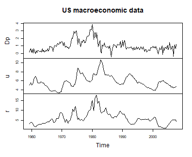
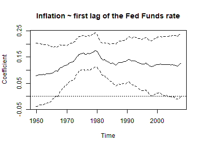
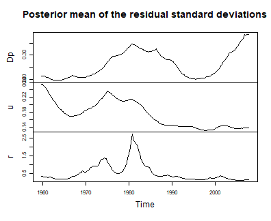
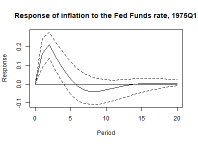
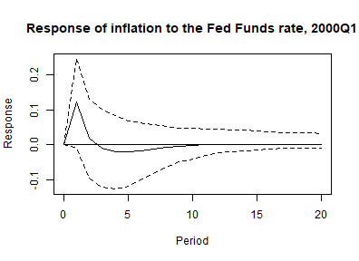
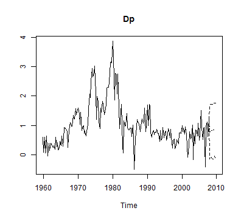
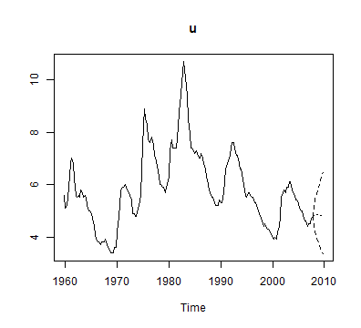
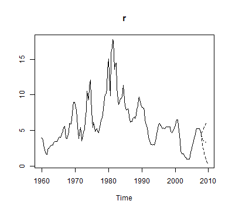

## Introduction

A standard VAR makes two constancy assumptions that a long sample rarely
supports. The coefficients are the same in every period, so the dynamics of the
1970s are estimated jointly with those of the 2000s and the result describes
neither. And the error covariance matrix is the same in every period, so a
sample that contains both a turbulent decade and a quiet one attributes the
average of the two to each -- which overstates the uncertainty of the quiet
period and understates the uncertainty of the turbulent one.

Dropping the first assumption gives a time varying parameter (TVP) model,
dropping the second a stochastic volatility (SV) model. `bvartools` treats them
as two independent switches, `tvp` and `error`, so a model can have either or
both. This vignette estimates a model with both, and adds Bayesian variable
selection on top of it, since a model with one coefficient per regressor and
period is exactly the kind of model that benefits from being told which
regressors it does not need.

The estimated model is

$$y_t = Z_t a_t + u_t, \qquad u_t \sim N(0, \Sigma_t),$$

where the coefficients follow a random walk

$$a_t = a_{t-1} + v_t, \qquad v_t \sim N(0, Q), \qquad Q = \textrm{diag}(q_1, \dots, q_m),$$

and the error covariance matrix is decomposed as

$$\Psi_t \Sigma_t \Psi_t^{\prime} = \Omega_t = \textrm{diag}(\omega_{1t}, \dots, \omega_{Kt}), \qquad
\ln \omega_{it} = \ln \omega_{i, t-1} + w_{it}, \qquad w_{it} \sim N(0, \sigma_i^2),$$

with $\Psi_t$ lower triangular with ones on its diagonal. The log-volatilities
are random walks, and in a TVP model the free elements of $\Psi_t$ are random
walks as well, so the correlations between the errors move too. In a model with
constant coefficients and `error = "sv+covar"` only the volatilities move and
$\Psi$ is estimated once.

The state equations are what a TVP-SV model estimates in place of the constant
parameters of a standard VAR, and their variances -- $Q$ for the coefficients,
$\sigma_i^2$ for the log-volatilities -- decide how much movement the data are
allowed to produce. They are the priors that matter most here, and they are
discussed below.

## Data

Data set `us_macrodata` contains quarterly US CPI inflation, the unemployment
rate and the Fed Funds rate from 1959Q2 to 2007Q4. Half a century of US
macroeconomic data is the standard motivation for these models: it contains the
Great Inflation, the Volcker disinflation and the Great Moderation, and no
constant parameter model describes all three.


``` r
library(bvartools)

data("us_macrodata")

plot(us_macrodata, main = "US macroeconomic data")
```

<div class="figure" style="text-align: center">

<p class="caption">plot of chunk data</p>
</div>

## Model set-up

Argument `tvp = TRUE` makes the coefficients time varying and
`error = "sv+covar"` makes the error covariance matrix time varying. The
posterior sampler follows from the two, which can be checked on the resulting
object.


``` r
model <- create_bvarmodel(us_macrodata, p = 2, deterministic = "const",
                          tvp = TRUE, error = "sv+covar", varsel = "bvs",
                          iterations = 3000, burnin = 1000)

model[["model"]][["algorithm"]]
#> [1] "VarTvpStochvol"
```

`error = "sv"` would estimate the volatilities without the covariances, which
sets the off-diagonal elements of $\Sigma_t$ to zero. `"sv+covar"` is the
specification that corresponds to the model above.

## Priors

The prior of a TVP-SV model is a prior on two state equations beside the usual
prior on the level of the coefficients.


``` r
model <- add_priors(model,
                    coef = list(v_i = 1, v_i_det = 1 / 10,
                                shape = 3, rate = 0.0001, rate_det = 0.01),
                    sigma = list(shape = 3, rate = 0.01,
                                 mu = 0, v_i = 0.01,
                                 state_variance = 0.05, offset = 1e-8),
                    varsel = list(inprior = 0.5, exclude_det = TRUE))
```

In argument `coef`, `v_i` and `v_i_det` are the prior precisions of the initial
state of the coefficients, as they are the prior precisions of the coefficients
themselves in a constant parameter model. `shape` and `rate` are the parameters
of the inverse gamma prior of the elements of $Q$, the variances of the state
equation of the coefficients. A small `rate` relative to the scale of the data
pulls those variances towards zero and the coefficient paths towards straight
lines: the prior is that a coefficient is constant, and the data have to argue
it out of that. `rate_det` does the same for coefficients of deterministic
terms, with a larger value, since an intercept that is allowed to drift is often
what carries a change in the mean of a series.

Since the scale of the data is what makes a `rate` small or large, it is worth
checking rather than copying. A TVP model has one coefficient per regressor and
period, so a model with many regressors and a short sample can have more
coefficients than observations, and a `rate` loose enough for the path to
exploit that produces a model which fits every observation exactly, has no
residuals left, and reports a flat volatility. The diagnostic is to compare the
residuals under the posterior mean of the coefficient path with the residuals of
a least squares fit of the same regressors: the first should be somewhat
smaller than the second, not very much smaller.


``` r
residual_sd <- function(object) {
  k <- object[["model"]][["k"]]
  m <- ncol(object[["data"]][["train"]][["z"]])
  tt <- nrow(object[["data"]][["train"]][["y"]])
  y <- matrix(t(object[["data"]][["train"]][["y"]]))
  z <- object[["data"]][["train"]][["z"]]

  a <- colMeans(object[["posterior"]][["a"]][["coeffs"]])
  fitted <- rep(NA_real_, tt * k)
  for (period in 1:tt) {
    rows <- (period - 1) * k + 1:k
    fitted[rows] <- z[rows, ] %*% a[(period - 1) * m + 1:m]
  }

  ols <- solve(crossprod(z)) %*% crossprod(z, y)

  result <- rbind(apply(matrix(y - fitted, k), 1, stats::sd),
                  apply(matrix(y - z %*% ols, k), 1, stats::sd))
  dimnames(result) <- list(c("tvp", "ls"), object[["model"]][["endogen"]])
  result
}
```

The function is used further below, once the model has been estimated.

In argument `sigma`, `shape` and `rate` now refer to the state equation of the
log-volatilities rather than to an error variance: they are the prior of
$\sigma_i^2$ and control how quickly a volatility is allowed to move. `mu` and
`v_i` are the prior mean and precision of the initial log-volatility, and
`state_variance` is the value $\sigma_i^2$ is initialised at. `offset` is added
to the squared errors before their logarithm is taken, which keeps a residual
that happens to be near zero from producing an infinite log-volatility.

`sigma$rate` deserves a second look, because it decides how much of a
stochastic volatility model one actually gets. With `shape = 3` the prior mean
of $\sigma_i^2$ is `rate / 2`, and since the log-volatility is a random walk,
its standard deviation over a sample of $T$ periods is about
$\sqrt{T \sigma_i^2}$. At `rate = 0.0001` that is a tenth of a log point over
this sample, so the fitted volatilities of the inflation and unemployment
equations move by a few percent and the specification is a constant variance
model in all but name. At `rate = 0.01`, used here, they move by a factor of
about two, which is what the Great Moderation looks like in these series. An
equation whose data demand more than the prior allows will move anyway -- the
Fed Funds rate does so under either value -- so the effect of a tight prior is
selective rather than uniform, which is exactly what makes it easy to miss.

Argument `varsel` specifies Bayesian variable selection after Korobilis (2013).
One inclusion parameter is drawn per coefficient, not per coefficient and
period, so a regressor is either in the model over the whole sample or out of it
over the whole sample. `exclude_det = TRUE` keeps the deterministic terms out of
the selection.

A note on that last combination: in a model with **constant** coefficients and
an error covariance block, one selection scheme applies to the coefficients and
the covariances together, and `add_priors` refuses to restrict the selection to
the coefficients alone. A time varying model can treat the two blocks
separately, which is why `exclude_det = TRUE` is accepted here without also
specifying `varsel$covar`.

## Initial values and posterior draws


``` r
model <- add_initial_values(model)
```


``` r
model <- add_posterior_coefficients(model)
```

The diagnostic of the previous section says that this specification has not
absorbed its own residuals:


``` r
round(residual_sd(model), 4)
#>         Dp      u      r
#> tvp 0.2406 0.1534 0.8327
#> ls  0.3810 0.2304 0.8502
```

## Evaluation

### Summary statistics for a period

A TVP model has one set of coefficients per period, so a summary table has to be
the summary of a period. `summary` uses the last one by default and reports
which period that is.


``` r
summary(model)
#> 
#> Bayesian TVP-SV-VAR model with p = 2 
#> 
#> Variable selection algorithm: Bayesian variable selection (Korobilis, 2013)
#> 
#> Endogenous variables: Dp, u, r
#> 
#> Period: 193 
#> 
#> Variable: Dp 
#> 
#>               Mean         SD     Naive SD Time-series SD        2.5%
#> Dp.l1 -0.069493001 0.08745399 0.0015966841    0.014088684 -0.26594672
#> u.l1  -0.393982260 0.10217596 0.0018654694    0.028019920 -0.61843497
#> r.l1   0.121686281 0.07391841 0.0013495593    0.005149659 -0.02902042
#> Dp.l2 -0.005679965 0.03446942 0.0006293227    0.006622322 -0.10779311
#> u.l2   0.301591405 0.08813019 0.0016090298    0.015461246  0.12503352
#> r.l2  -0.119577011 0.07740239 0.0014131679    0.003127670 -0.27400887
#> const  1.359742078 0.59165482 0.0108020897    0.086636651  0.23675558
#>               50%       97.5% Incl. prob.  
#> Dp.l1 -0.05181986  0.07090043       0.762  
#> u.l1  -0.38574570 -0.21166082       1.000 *
#> r.l1   0.12443520  0.26100892       1.000  
#> Dp.l2  0.00000000  0.00000000       0.045  
#> u.l2   0.29985813  0.48015807       1.000 *
#> r.l2  -0.11737661  0.02968784       1.000  
#> const  1.35998743  2.54296075       1.000 *
#> 
#> Variable: u 
#> 
#>               Mean         SD     Naive SD Time-series SD        2.5%
#> Dp.l1 -0.007078434 0.03617416 0.0006604469    0.003955713 -0.09999708
#> u.l1   1.074784391 0.10586471 0.0019328163    0.027842916  0.87967695
#> r.l1  -0.038150822 0.05399321 0.0009857767    0.003489870 -0.15064864
#> Dp.l2  0.002754336 0.03168077 0.0005784091    0.001736161 -0.06914870
#> u.l2  -0.228520290 0.09613554 0.0017551868    0.024936132 -0.41231609
#> r.l2   0.038920861 0.05429081 0.0009912101    0.004432657 -0.06960828
#> const  0.735324642 0.46798025 0.0085441113    0.034069892 -0.17708934
#>               50%       97.5% Incl. prob.  
#> Dp.l1  0.00000000  0.06630659   0.3480000  
#> u.l1   1.07811624  1.27274520   1.0000000 *
#> r.l1  -0.03664269  0.06200709   1.0000000  
#> Dp.l2  0.00000000  0.09051450   0.3003333  
#> u.l2  -0.22832057 -0.03440627   1.0000000 *
#> r.l2   0.03909256  0.14440870   1.0000000  
#> const  0.71871775  1.65413273   1.0000000  
#> 
#> Variable: r 
#> 
#>              Mean         SD    Naive SD Time-series SD        2.5%
#> Dp.l1  0.12894503 0.08799671 0.001606593     0.02184341  0.00000000
#> u.l1  -0.58671413 0.19595143 0.003577567     0.08579479 -1.01366260
#> r.l1   1.13054668 0.11167976 0.002038984     0.03882043  0.90554830
#> Dp.l2  0.04536107 0.06833320 0.001247588     0.01064907 -0.05624819
#> u.l2   0.30970893 0.16993277 0.003102534     0.06068524  0.02421451
#> r.l2  -0.33903642 0.10034943 0.001832122     0.03376487 -0.52135549
#> const  1.91073803 0.65649946 0.011985985     0.08105261  0.69819626
#>                50%      97.5% Incl. prob.  
#> Dp.l1  0.130657409  0.3022728   0.8643333  
#> u.l1  -0.553385989 -0.2864722   1.0000000 *
#> r.l1   1.140600348  1.3215040   1.0000000 *
#> Dp.l2  0.006442807  0.1976189   0.6116667  
#> u.l2   0.282705792  0.6838832   1.0000000 *
#> r.l2  -0.346368339 -0.1324261   1.0000000 *
#> const  1.885201937  3.2780852   1.0000000 *
#> 
#> Variance-covariance matrix:
#> 
#>               Mean         SD     Naive SD Time-series SD         2.5%
#> Dp_Dp  0.158322249 0.09161481 0.0016726500    0.008647987  0.067680798
#> Dp_u  -0.001781392 0.01316651 0.0002403865    0.001535229 -0.026848406
#> Dp_r   0.027667737 0.02330148 0.0004254248    0.003299904 -0.002515959
#> u_u    0.019755474 0.00972477 0.0001775492    0.000466912  0.007335814
#> u_r   -0.011326630 0.00825747 0.0001507601    0.001502226 -0.033679898
#> r_r    0.040156540 0.05026792 0.0009177624    0.003056623  0.003936183
#>                50%        97.5%  
#> Dp_Dp  0.135185202  0.387749263 *
#> Dp_u  -0.001602033  0.022700334  
#> Dp_r   0.022645836  0.087670147  
#> u_u    0.017869704  0.043445914 *
#> u_r   -0.009440681 -0.001570669 *
#> r_r    0.028380054  0.142704195 *
```

Argument `period` asks for another one. It is an index into the estimation
sample, which the following helper turns into a date.


``` r
period_of <- function(object, year, quarter) {
  which(stats::time(object[["data"]][["train"]][["y"]]) == year + (quarter - 1) / 4)
}

summary(model, period = period_of(model, 1975, 1))
#> 
#> Bayesian TVP-SV-VAR model with p = 2 
#> 
#> Variable selection algorithm: Bayesian variable selection (Korobilis, 2013)
#> 
#> Endogenous variables: Dp, u, r
#> 
#> Period: 62 
#> 
#> Variable: Dp 
#> 
#>               Mean         SD     Naive SD Time-series SD        2.5%
#> Dp.l1 -0.050308999 0.07367609 0.0013451352    0.016409080 -0.22940883
#> u.l1  -0.399712770 0.08685377 0.0015857256    0.029618289 -0.60187253
#> r.l1   0.163986134 0.03954616 0.0007220109    0.004196229  0.08743171
#> Dp.l2 -0.002657828 0.01745919 0.0003187598    0.002750412 -0.04416711
#> u.l2   0.296741086 0.06957368 0.0012702358    0.022671759  0.17294271
#> r.l2   0.041083487 0.04098436 0.0007482686    0.004900957 -0.03918733
#> const  1.331002825 0.52031004 0.0094995182    0.106812147  0.33964821
#>               50%       97.5% Incl. prob.  
#> Dp.l1 -0.03132131  0.06509664       0.762  
#> u.l1  -0.39082641 -0.25481501       1.000 *
#> r.l1   0.16342887  0.24420590       1.000 *
#> Dp.l2  0.00000000  0.00000000       0.045  
#> u.l2   0.29258423  0.43778996       1.000 *
#> r.l2   0.04131030  0.12173618       1.000  
#> const  1.34126207  2.32527934       1.000 *
#> 
#> Variable: u 
#> 
#>               Mean         SD     Naive SD Time-series SD        2.5%
#> Dp.l1  0.001491582 0.03157985 0.0005765666    0.004669064 -0.07407544
#> u.l1   1.100522077 0.09424506 0.0017206714    0.047613716  0.92948609
#> r.l1   0.007498161 0.02975692 0.0005432846    0.002462993 -0.05172842
#> Dp.l2 -0.008660076 0.03025684 0.0005524118    0.003002167 -0.10212806
#> u.l2  -0.251911675 0.08315485 0.0015181930    0.033698539 -0.40713644
#> r.l2   0.095717807 0.03458893 0.0006315047    0.006655687  0.02698835
#> const  0.586608405 0.36962794 0.0067484520    0.046600771 -0.11701100
#>                50%       97.5% Incl. prob.  
#> Dp.l1  0.000000000  0.07950113   0.3480000  
#> u.l1   1.106530947  1.26058765   1.0000000 *
#> r.l1   0.007530691  0.06630044   1.0000000  
#> Dp.l2  0.000000000  0.03550200   0.3003333  
#> u.l2  -0.250294408 -0.09762175   1.0000000 *
#> r.l2   0.096987515  0.16422209   1.0000000 *
#> const  0.577371095  1.32739449   1.0000000  
#> 
#> Variable: r 
#> 
#>              Mean         SD    Naive SD Time-series SD         2.5%
#> Dp.l1  0.15681996 0.11163816 0.002038225     0.04142761 -0.007120417
#> u.l1  -0.52438799 0.19063905 0.003480577     0.09868474 -0.943158634
#> r.l1   1.09666324 0.10743210 0.001961433     0.04704265  0.880711699
#> Dp.l2  0.06796994 0.07519215 0.001372815     0.01639969 -0.003581241
#> u.l2   0.33630569 0.16877922 0.003081473     0.07968193  0.077958439
#> r.l2  -0.31817702 0.10691986 0.001952081     0.04837073 -0.500994189
#> const  2.32445665 0.64711233 0.011814601     0.12456299  1.145679120
#>               50%      97.5% Incl. prob.  
#> Dp.l1  0.16006683  0.3652732   0.8643333  
#> u.l1  -0.49016973 -0.2393989   1.0000000 *
#> r.l1   1.11078296  1.2704622   1.0000000 *
#> Dp.l2  0.04519398  0.2202310   0.6116667  
#> u.l2   0.29370054  0.7113747   1.0000000 *
#> r.l2  -0.33162545 -0.1098016   1.0000000 *
#> const  2.29271861  3.7093405   1.0000000 *
#> 
#> Variance-covariance matrix:
#> 
#>               Mean         SD     Naive SD Time-series SD         2.5%
#> Dp_Dp  0.158322249 0.09161481 0.0016726500    0.008647987  0.067680798
#> Dp_u  -0.001781392 0.01316651 0.0002403865    0.001535229 -0.026848406
#> Dp_r   0.027667737 0.02330148 0.0004254248    0.003299904 -0.002515959
#> u_u    0.019755474 0.00972477 0.0001775492    0.000466912  0.007335814
#> u_r   -0.011326630 0.00825747 0.0001507601    0.001502226 -0.033679898
#> r_r    0.040156540 0.05026792 0.0009177624    0.003056623  0.003936183
#>                50%        97.5%  
#> Dp_Dp  0.135185202  0.387749263 *
#> Dp_u  -0.001602033  0.022700334  
#> Dp_r   0.022645836  0.087670147  
#> u_u    0.017869704  0.043445914 *
#> u_r   -0.009440681 -0.001570669 *
#> r_r    0.028380054  0.142704195 *
```

Comparing the two tables compares two models: the same specification, fitted to
the same sample, describing two different points in it.

The inclusion probabilities are the exception. They do not carry a period,
because variable selection decides on a regressor for the whole sample, and the
column is therefore identical in both tables.

### Coefficient paths

`plot` draws the whole model: one panel per coefficient with the median and the
bounds of a credible band over time, and the panels of $\Sigma_t$ beside them.


``` r
plot(model)
```

<div class="figure" style="text-align: center">

<p class="caption">plot of chunk paths</p>
</div>

A panel that sits on a flat line at zero is a coefficient that variable
selection has switched off. The remaining panels are the reason for estimating
the model: a coefficient that drifts across the sample is one that a constant
parameter VAR would have averaged.

A single path is easier to read on its own. The draws of the coefficients sit in
`posterior$a$coeffs`, with the coefficients of one period next to each other and
the periods stacked from left to right, so the path of one coefficient is every
$m$-th column.


``` r
coefficient_path <- function(object, equation, regressor, ci = 0.9) {
  k <- object[["model"]][["k"]]
  m <- ncol(object[["data"]][["train"]][["z"]])
  tt <- nrow(object[["data"]][["train"]][["y"]])

  # Coefficients are stored as vec(A), so the position of a regressor in an
  # equation is the number of preceding regressors times the number of
  # equations, plus the position of the equation.
  i <- (which(dimnames(object[["data"]][["train"]][["x"]])[[2]] == regressor) - 1) * k +
    which(object[["model"]][["endogen"]] == equation)

  draws <- object[["posterior"]][["a"]][["coeffs"]][, m * 0:(tt - 1) + i]
  bands <- t(apply(draws, 2, stats::quantile,
                   probs = c((1 - ci) / 2, .5, 1 - (1 - ci) / 2)))

  stats::ts(bands, start = stats::start(object[["data"]][["train"]][["y"]]),
            frequency = stats::frequency(object[["data"]][["train"]][["y"]]))
}

path <- coefficient_path(model, equation = "Dp", regressor = "r.01")

stats::ts.plot(path, lty = c(2, 1, 2),
               main = "Inflation ~ first lag of the Fed Funds rate",
               ylab = "Coefficient")
abline(h = 0, lty = "dotted")
```

<div class="figure" style="text-align: center">

<p class="caption">plot of chunk one-path</p>
</div>

### Volatility paths

The draws of the error covariance matrix are stored as precisions, one $K \times K$
matrix per period, so the standard deviations are the square roots of the
diagonal of its inverse.


``` r
volatility <- function(object) {
  k <- object[["model"]][["k"]]
  kk <- k * k
  tt <- nrow(object[["data"]][["train"]][["y"]])
  draws <- object[["posterior"]][["u_sigma_inv"]][["coeffs"]]

  result <- matrix(NA_real_, tt, k)
  for (i in 1:tt) {
    result[i, ] <- rowMeans(apply(draws[, (i - 1) * kk + 1:kk], 1,
                                  function(x) {sqrt(diag(solve(matrix(x, k))))}))
  }

  stats::ts(result, start = stats::start(object[["data"]][["train"]][["y"]]),
            frequency = stats::frequency(object[["data"]][["train"]][["y"]]),
            names = object[["model"]][["endogen"]])
}

plot(volatility(model),
     main = "Posterior mean of the residual standard deviations")
```

<div class="figure" style="text-align: center">

<p class="caption">plot of chunk volatility</p>
</div>

This is the part of the model that is hardest to do without. The volatility of
the Fed Funds rate residual peaks around 1980, when the operating procedure of
the Federal Reserve targeted reserves rather than the rate, and falls back
afterwards. A constant covariance matrix would spread that episode over the
whole sample.

### Impulse responses for a period

`irf` and `fevd` take a `period` in the same way `summary` does, which is what
makes an impulse response of a TVP model a well defined object: it is the
response implied by the coefficients and the covariance matrix of one period.


``` r
early <- irf(model, impulse = "r", response = "Dp", n_ahead = 20,
             period = period_of(model, 1975, 1))
late <- irf(model, impulse = "r", response = "Dp", n_ahead = 20,
            period = period_of(model, 2000, 1))

plot(early, main = "Response of inflation to the Fed Funds rate, 1975Q1")
```

<div class="figure" style="text-align: center">

<p class="caption">plot of chunk irf</p>
</div>

``` r
plot(late, main = "Response of inflation to the Fed Funds rate, 2000Q1")
```

<div class="figure" style="text-align: center">

<p class="caption">plot of chunk irf</p>
</div>

Since the shock is scaled by the covariance matrix of the period, the two
responses differ both because the transmission changed and because the size of a
one standard deviation shock changed. Reading them beside the volatility figure
above separates the two.

### Forecasts

Forecasts are produced from the state of the **last** period of the estimation
sample: the draws of $a_T$ and $\Sigma_T$ are carried forward over the whole
horizon rather than extrapolated along their random walks.


``` r
model <- add_forecast_input(model, n_ahead = 8)
model <- add_posterior_forecasts(model)

plot(predict(model))
#> Warning in predict.bvarmodel(model): Argument 'n_ahead' is larger than the value in object$model$h.
#> Limiting the output to the latter.
```

<div class="figure" style="text-align: center">

<p class="caption">plot of chunk forecast</p>
</div><div class="figure" style="text-align: center">

<p class="caption">plot of chunk forecast</p>
</div><div class="figure" style="text-align: center">

<p class="caption">plot of chunk forecast</p>
</div>

That is a deliberate choice rather than a limitation of the sampler. A random
walk has no mean to revert to, so simulating the states forward widens the
forecast bands without adding information about where the coefficients are
going.

## Other combinations

`tvp` and `error` are independent, so the four models below are all available,
and the middle two are useful comparisons rather than compromises:

* `tvp = FALSE, error = "wishart"` -- the standard VAR of the introductory vignette.
* `tvp = FALSE, error = "sv+covar"` -- constant coefficients, moving volatilities. The usual finding for macroeconomic data is that this specification accounts for most of what a full TVP-SV model does, which makes it the model to beat.
* `tvp = TRUE, error = "wishart"` -- moving coefficients, constant volatilities. Worth estimating mainly to see how much of the drift in the coefficients survives once the volatilities are allowed to move as well.
* `tvp = TRUE, error = "sv+covar"` -- the model of this vignette.

Since these are ordinary `bvarmodel` objects, they can be compared with the
tools of the model comparison vignette. Only the estimation cost differs
noticeably: the coefficient draws of a TVP model are a path per draw rather than
a vector, so both the sampler and the object it returns grow with the length of
the sample.

The same two switches apply to vector error correction models, which are the
subject of the companion vignette on TVP-SV-VEC models.

## References

Chan, J., Koop, G., Poirier, D. J., & Tobias, J. L. (2019). *Bayesian econometric methods* (2nd ed.). Cambridge: Cambridge University Press.

Cogley, T., & Sargent, T. J. (2005). Drifts and volatilities: Monetary policies and outcomes in the post WWII US. *Review of Economic Dynamics, 8*(2), 262-302. <https://doi.org/10.1016/j.red.2004.10.009>

Durbin, J., & Koopman, S. J. (2002). A simple and efficient simulation smoother for state space time series analysis. *Biometrika, 89*(3), 603-616. <https://doi.org/10.1093/biomet/89.3.603>

Kim, S., Shephard, N., & Chib, S. (1998). Stochastic volatility: Likelihood inference and comparison with ARCH models. *Review of Economic Studies, 65*(3), 361-393. <https://doi.org/10.1111/1467-937X.00050>

Koop, G., & Korobilis, D. (2010). Bayesian multivariate time series methods for empirical macroeconomics. *Foundations and Trends in Econometrics, 3*(4), 267-358. <https://dx.doi.org/10.1561/0800000013>

Korobilis, D. (2013). VAR forecasting using Bayesian variable selection. *Journal of Applied Econometrics, 28*(2), 204-230. <https://doi.org/10.1002/jae.1271>

Primiceri, G. E. (2005). Time varying structural vector autoregressions and monetary policy. *Review of Economic Studies, 72*(3), 821-852. <https://doi.org/10.1111/j.1467-937X.2005.00353.x>
