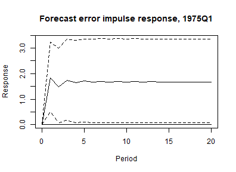

## Introduction

The companion vignette on TVP-SV-VAR models describes what the arguments `tvp`
and `error` do and which priors they require. They mean the same thing for a
vector error correction model, and `create_bvecmodel` takes them in the same
way. What changes is the object they are applied to, and that change is not
cosmetic: in a VEC model the time varying block includes the cointegration term,
so the model allows the long-run relationship itself to move.

The estimated model is

$$\Delta y_t = \Pi_t w_t + \sum_{l=1}^{p-1} \Gamma_{l,t} \Delta y_{t-l} + C_t d_t + u_t,
\qquad u_t \sim N(0, \Sigma_t),$$

with $\Pi_t = \alpha_t \beta_t^{\prime}$ of rank $r$. The coefficients of the
non-cointegration part and the loadings $\alpha_t$ follow random walks and
$\Sigma_t$ is the stochastic volatility specification of the VAR vignette. The
cointegration vectors get a state equation of their own,

$$\beta_t = \rho \beta_{t-1} + \eta_t, \qquad \eta_t \sim N(0, I),$$

which is the specification of Koop, León-González and Strachan (2011). A
constant coefficient VEC model instead puts a matric-variate prior on the
cointegration space, so `add_priors` asks for different arguments in the two
cases: `coint$v_i` and `coint$p_tau_i` for a constant model, `coint$rho` for a
time varying one.

## Data

Data set `uk_macrodata` contains a UK short-term interest rate, a long-term
interest rate and inflation from 1957Q2 to 2009Q2. It is the data set of Koop,
León-González and Strachan (2011), whose subject is exactly the question this
model is for: whether the long-run relationship between the two rates and
inflation is the same in 2009 as it was in 1957.


``` r
library(bvartools)

data("uk_macrodata")

plot(uk_macrodata, main = "UK interest and inflation rates")
```

<div class="figure" style="text-align: center">

<p class="caption">plot of chunk data</p>
</div>

## Model set-up


``` r
model <- create_bvecmodel(uk_macrodata, p = 2, r = 1, const = "unrestricted",
                          tvp = TRUE, error = "sv+covar", varsel = "bvs",
                          iterations = 3000, burnin = 1000)

model[["model"]][["algorithm"]]
#> [1] "VecTvpStochvol"
```

`p` is the lag order of the level VAR, so the model contains $p - 1 = 1$ lag of
the differenced series. The cointegration rank is fixed at one, which for a term
structure is the natural specification.

Models with a prior on the cointegration space are sensitive to the scale of the
series in the error correction term, and `scale_error_correction` divides them
by the standard deviation of their differences. Since it changes what
`coef$v_i` and `coint$rho` are a prior about, it belongs before `add_priors`.


``` r
model <- scale_error_correction(model)
```

## Priors


``` r
model <- add_priors(model,
                    coef = list(v_i = 1, v_i_det = 1 / 10,
                                shape = 3, rate = 0.0001, rate_det = 0.01),
                    coint = list(rho = 0.999),
                    sigma = list(shape = 3, rate = 0.01,
                                 mu = 0, v_i = 0.01,
                                 state_variance = 0.05, offset = 1e-8),
                    varsel = list(inprior = 0.5, exclude_det = TRUE))
```

Arguments `coef` and `sigma` are the ones of the VAR vignette: prior precisions
for the initial state of the coefficients, an inverse gamma prior for the
variances of their state equation, and the prior of the stochastic volatility
block.

Argument `coint` is where a VEC model differs. `rho` is the autocorrelation of
the state equation of $\beta$ and must be smaller than one. The prior on the
state before the sample is that equation's own stationary distribution,
$N(0, I / (1 - \rho^2))$, which is what makes the prior proper, so a value close
to one is intended and a value far from it draws a warning. Only the product
$\alpha_t \beta_t^{\prime}$ is identified, and the prior variance of the
loadings is shrunk by $1 - \rho^2$ to compensate, which leaves the product on
the scale that `coef$v_i` asks for.

The loadings are never subject to variable selection, so the cointegration term
is always in the model. Variable selection applies to the coefficients of the
differenced regressors, and `exclude_det = TRUE` keeps the unrestricted constant
out of it as well.

## Initial values and posterior draws


``` r
model <- add_initial_values(model)
```


``` r
set.seed(20260912)
model <- add_posterior_coefficients(model)
```

Before anything is read off the error correction term, the series in it are put
back on the scale of the input data. The function multiplies the draws of
$\beta$ by the inverse of the scaling matrix and leaves $\alpha$ unchanged,
which leaves $\Pi_t w_t$ where it was.


``` r
model <- rescale_error_correction(model)
```

## Evaluation

### Summary statistics for a period

As for a TVP-SV-VAR, a summary table is the summary of a period, and the last
one is used by default. The first block of columns is the cointegration matrix
$\Pi_t$ rather than $\alpha_t$ and $\beta_t$ separately, since the factors are
identified only up to an invertible $r \times r$ transformation while their
product is not.


``` r
summary(model)
#> 
#> Bayesian TVP-SV-VEC model with p = 2 
#> 
#> Variable selection algorithm: Bayesian variable selection (Korobilis, 2013)
#> 
#> Endogenous variables: rs, rl, Dp
#> 
#> Period: 208 
#> 
#> Variable: rs 
#> 
#>                   Mean          SD     Naive SD Time-series SD         2.5%
#> l.rs     -0.0056808471 0.062189674 1.135423e-03    0.002016932 -0.149193704
#> l.rl      0.0129001966 0.049051432 8.955525e-04    0.001561834 -0.077459925
#> l.Dp     -0.0554964009 0.058191008 1.062418e-03    0.001787986 -0.169083629
#> d.rs.l01  0.3839402008 0.088368361 1.613378e-03    0.010451337  0.216393160
#> d.rl.l01  0.2101380306 0.098926167 1.806136e-03    0.015435870  0.001115703
#> d.Dp.l01  0.0001664022 0.003213275 5.866611e-05    0.000197053  0.000000000
#> const    -0.0661260966 0.156592125 2.858968e-03    0.004153030 -0.389929210
#>                    50%      97.5% Incl. prob.  
#> l.rs     -0.0007858802 0.11645669  1.00000000  
#> l.rl      0.0060830389 0.13410759  1.00000000  
#> l.Dp     -0.0554652064 0.06196134  1.00000000  
#> d.rs.l01  0.3811712668 0.57655555  1.00000000 *
#> d.rl.l01  0.2089949114 0.40444586  0.98833333 *
#> d.Dp.l01  0.0000000000 0.00000000  0.01333333  
#> const    -0.0684484756 0.23415503  1.00000000  
#> 
#> Variable: rl 
#> 
#>                  Mean         SD     Naive SD Time-series SD        2.5%
#> l.rs     -0.001654578 0.03040723 0.0005551576   0.0005742735 -0.06838873
#> l.rl      0.002337671 0.02551661 0.0004658673   0.0004658673 -0.05007248
#> l.Dp     -0.010116795 0.03860339 0.0007047982   0.0008439967 -0.08805091
#> d.rs.l01  0.000000000 0.00000000 0.0000000000   0.0000000000  0.00000000
#> d.rl.l01  0.235168702 0.08722297 0.0015924663   0.0073572916  0.06147726
#> d.Dp.l01  0.000000000 0.00000000 0.0000000000   0.0000000000  0.00000000
#> const     0.042104517 0.11657331 0.0021283278   0.0027432394 -0.18297229
#>                    50%      97.5% Incl. prob.  
#> l.rs     -0.0001978408 0.06125400   1.0000000  
#> l.rl      0.0003206790 0.06470579   1.0000000  
#> l.Dp     -0.0102870594 0.06688178   1.0000000  
#> d.rs.l01  0.0000000000 0.00000000   0.0000000  
#> d.rl.l01  0.2353986642 0.40901878   0.9996667 *
#> d.Dp.l01  0.0000000000 0.00000000   0.0000000  
#> const     0.0402141411 0.27017317   1.0000000  
#> 
#> Variable: Dp 
#> 
#>                 Mean         SD    Naive SD Time-series SD       2.5%
#> l.rs      0.01268277 0.78137845 0.014265953     0.02676950 -1.5260847
#> l.rl      0.25656553 0.59570158 0.010875973     0.03673423 -0.9470608
#> l.Dp     -1.03146057 0.24626389 0.004496143     0.01395525 -1.5054247
#> d.rs.l01  0.51470973 0.23053308 0.004208939     0.05919309  0.0000000
#> d.rl.l01  0.30342818 0.16318322 0.002979304     0.01385988  0.0000000
#> d.Dp.l01 -0.04603337 0.08506733 0.001553110     0.01181278 -0.2501757
#> const     0.14855203 1.08984101 0.019897683     0.12350835 -2.0145997
#>                  50%       97.5% Incl. prob.  
#> l.rs      0.01519708  1.50974538   1.0000000  
#> l.rl      0.25945135  1.48228376   1.0000000  
#> l.Dp     -1.03704450 -0.52805115   1.0000000 *
#> d.rs.l01  0.53397409  0.90835144   0.9673333  
#> d.rl.l01  0.32185464  0.58644844   0.8703333  
#> d.Dp.l01  0.00000000  0.08692737   0.5270000  
#> const     0.16691209  2.36421949   1.0000000  
#> 
#> Variance-covariance matrix:
#> 
#>            Mean        SD    Naive SD Time-series SD       2.5%       50%
#> rs_rs 0.5784974 0.5331054 0.009733129    0.019270123 0.10228600 0.4277538
#> rs_rl 0.2649650 0.2446480 0.004466642    0.008141074 0.04692442 0.1945760
#> rs_Dp 0.3231276 0.3750633 0.006847687    0.025288644 0.02304387 0.2061813
#> rl_rl 0.1874224 0.1268228 0.002315458    0.004706874 0.06267402 0.1547655
#> rl_Dp 0.2705111 0.1995119 0.003642572    0.013989367 0.07932098 0.2191442
#> Dp_Dp 7.8968862 3.8137320 0.069628902    0.318526089 3.29238343 7.1076768
#>            97.5%  
#> rs_rs  1.9757867 *
#> rs_rl  0.9087190 *
#> rs_Dp  1.2810209 *
#> rl_rl  0.5255447 *
#> rl_Dp  0.7959388 *
#> Dp_Dp 17.6173100 *
```


``` r
period_of <- function(object, year, quarter) {
  which(stats::time(object[["data"]][["train"]][["y"]]) == year + (quarter - 1) / 4)
}

summary(model, period = period_of(model, 1975, 1))
#> 
#> Bayesian TVP-SV-VEC model with p = 2 
#> 
#> Variable selection algorithm: Bayesian variable selection (Korobilis, 2013)
#> 
#> Endogenous variables: rs, rl, Dp
#> 
#> Period: 70 
#> 
#> Variable: rs 
#> 
#>                   Mean         SD     Naive SD Time-series SD        2.5%
#> l.rs     -7.638915e-02 0.07633879 1.393749e-03   3.650868e-03 -0.25526929
#> l.rl     -3.988077e-02 0.04708439 8.596393e-04   1.901788e-03 -0.15265884
#> l.Dp      5.884487e-02 0.04650805 8.491169e-04   1.286108e-03 -0.02996285
#> d.rs.l01  3.225160e-01 0.06557238 1.197182e-03   1.254613e-02  0.19024057
#> d.rl.l01  1.903847e-01 0.09374852 1.711606e-03   2.333878e-02  0.00000000
#> d.Dp.l01 -7.106947e-06 0.00238808 4.360017e-05   1.580683e-05  0.00000000
#> const     8.264447e-03 0.16243599 2.965662e-03   3.939749e-03 -0.32062708
#>                   50%      97.5% Incl. prob.  
#> l.rs     -0.063376971 0.03471932  1.00000000  
#> l.rl     -0.032386860 0.03233288  1.00000000  
#> l.Dp      0.058791114 0.15234630  1.00000000  
#> d.rs.l01  0.324168098 0.45257151  1.00000000 *
#> d.rl.l01  0.189237653 0.38593337  0.98833333  
#> d.Dp.l01  0.000000000 0.00000000  0.01333333  
#> const     0.008677281 0.32248251  1.00000000  
#> 
#> Variable: rl 
#> 
#>                 Mean         SD     Naive SD Time-series SD        2.5%
#> l.rs     -0.04733196 0.06114799 0.0011164045    0.002514043 -0.18271683
#> l.rl     -0.02947889 0.03684362 0.0006726694    0.001354611 -0.11498544
#> l.Dp      0.03857382 0.03919472 0.0007155944    0.001624104 -0.04280089
#> d.rs.l01  0.00000000 0.00000000 0.0000000000    0.000000000  0.00000000
#> d.rl.l01  0.25537734 0.07397910 0.0013506674    0.014149957  0.11656646
#> d.Dp.l01  0.00000000 0.00000000 0.0000000000    0.000000000  0.00000000
#> const     0.07316302 0.12319874 0.0022492910    0.003045008 -0.17313392
#>                  50%      97.5% Incl. prob.  
#> l.rs     -0.03922490 0.05754358   1.0000000  
#> l.rl     -0.02173191 0.02433472   1.0000000  
#> l.Dp      0.03928950 0.11503734   1.0000000  
#> d.rs.l01  0.00000000 0.00000000   0.0000000  
#> d.rl.l01  0.25218503 0.40174525   0.9996667 *
#> d.Dp.l01  0.00000000 0.00000000   0.0000000  
#> const     0.07537502 0.31461491   1.0000000  
#> 
#> Variable: Dp 
#> 
#>                 Mean         SD    Naive SD Time-series SD        2.5%
#> l.rs      1.34806589 0.69501568 0.012689192     0.03701797  0.01246897
#> l.rl      0.77269281 0.52925691 0.009662865     0.03387819 -0.23971869
#> l.Dp     -1.08728716 0.19829003 0.003620264     0.01981385 -1.45461190
#> d.rs.l01  0.49560173 0.21341245 0.003896360     0.07230922  0.00000000
#> d.rl.l01  0.29819028 0.14693109 0.002682582     0.01396041  0.00000000
#> d.Dp.l01 -0.03696871 0.06925556 0.001264428     0.01367326 -0.20467537
#> const     0.12329159 0.91834472 0.016766604     0.19980531 -1.61477734
#>                 50%       97.5% Incl. prob.  
#> l.rs      1.3344656  2.75012544   1.0000000 *
#> l.rl      0.7559258  1.82164015   1.0000000  
#> l.Dp     -1.0946338 -0.67477047   1.0000000 *
#> d.rs.l01  0.5112568  0.84348841   0.9673333  
#> d.rl.l01  0.3150919  0.53012560   0.8703333  
#> d.Dp.l01  0.0000000  0.06776777   0.5270000  
#> const     0.1213863  2.14598325   1.0000000  
#> 
#> Variance-covariance matrix:
#> 
#>             Mean        SD    Naive SD Time-series SD        2.5%        50%
#> rs_rs  1.3975763 0.8687460 0.015861060     0.03177203  0.34243457  1.1915990
#> rs_rl  0.4994764 0.3265128 0.005961282     0.01183752  0.11403969  0.4248168
#> rs_Dp  0.4983204 0.5516036 0.010070858     0.12000160 -0.04422343  0.3343416
#> rl_rl  0.6656093 0.2277257 0.004157684     0.01227746  0.34683680  0.6253826
#> rl_Dp  1.0807288 0.4169364 0.007612182     0.04135248  0.53004329  1.0034539
#> Dp_Dp 12.8991694 8.4410405 0.154111610     1.76000075  4.74544099 10.7429992
#>           97.5%  
#> rs_rs  3.557630 *
#> rs_rl  1.324711 *
#> rs_Dp  1.950466  
#> rl_rl  1.209664 *
#> rl_Dp  2.086601 *
#> Dp_Dp 36.708218 *
```

The inclusion probabilities of the $\Pi$ columns are one by construction, as
explained above, and the inclusion probabilities of the remaining columns do not
carry a period: variable selection decides on a regressor for the whole sample.

### Coefficient and volatility paths

`plot` draws one figure per block of coefficients: the cointegration matrix
$\Pi_t$, the lagged differences, the deterministic terms and the covariance
matrix of the error term, each on its own.


``` r
plot(model)
```

<div class="figure" style="text-align: center">

<p class="caption">plot of chunk paths</p>
</div><div class="figure" style="text-align: center">

<p class="caption">plot of chunk paths</p>
</div><div class="figure" style="text-align: center">

<p class="caption">plot of chunk paths</p>
</div><div class="figure" style="text-align: center">

<p class="caption">plot of chunk paths</p>
</div>

In the figure of $\Pi_t$, reading down a column gives the response of each
differenced series to the level of one variable, and reading across a row gives
the error correction of one equation. A panel that sits at zero among the
$\Gamma$ coefficients is one that variable selection has switched off.

A single element of $\Pi_t$ is easier to read on its own. The following computes
it from the draws of the loadings, which are the first $Kr$ coefficients of each
period of `posterior$a$coeffs`, and the draws of the cointegration vectors in
`posterior$beta$coeffs`.


``` r
pi_path <- function(object, equation, variable, ci = 0.9) {
  k <- object[["model"]][["k"]]
  r <- object[["model"]][["rank"]]
  m <- ncol(object[["data"]][["train"]][["z"]])
  k_ect <- ncol(object[["data"]][["train"]][["w"]])
  tt <- nrow(object[["data"]][["train"]][["y"]])
  draws <- nrow(object[["posterior"]][["a"]][["coeffs"]])

  i <- which(object[["model"]][["endogen"]] == equation)
  j <- which(dimnames(object[["data"]][["train"]][["w"]])[[2]] == variable)

  result <- matrix(NA_real_, draws, tt)
  for (period in 1:tt) {
    alpha <- object[["posterior"]][["a"]][["coeffs"]][, (period - 1) * m + 1:(k * r)]
    beta <- object[["posterior"]][["beta"]][["coeffs"]][, (period - 1) * k_ect * r + 1:(k_ect * r)]
    result[, period] <- rowSums(matrix(alpha, draws, k * r)[, k * 0:(r - 1) + i, drop = FALSE] *
                                  matrix(beta, draws, k_ect * r)[, k_ect * 0:(r - 1) + j, drop = FALSE])
  }

  bands <- t(apply(result, 2, stats::quantile,
                   probs = c((1 - ci) / 2, .5, 1 - (1 - ci) / 2)))

  stats::ts(bands, start = stats::start(object[["data"]][["train"]][["y"]]),
            frequency = stats::frequency(object[["data"]][["train"]][["y"]]))
}

path <- pi_path(model, equation = "rs", variable = "l.rs")

stats::ts.plot(path, lty = c(2, 1, 2),
               main = "Short rate: adjustment to its own level",
               ylab = "Element of Pi")
abline(h = 0, lty = "dotted")
```

<div class="figure" style="text-align: center">

<p class="caption">plot of chunk pi-path</p>
</div>

Note what is *not* plotted here. The path of $\beta_t$ on its own is not a
quantity to read: a cointegration vector is identified only up to
normalisation, and normalising it on a variable whose coefficient wanders near
zero produces a path that swings between large values without anything having
happened to the model. $\Pi_t$ carries the same information and is identified.

The volatilities are extracted from the draws of the error precision exactly as
in the VAR case.


``` r
volatility <- function(object) {
  k <- object[["model"]][["k"]]
  kk <- k * k
  tt <- nrow(object[["data"]][["train"]][["y"]])
  draws <- object[["posterior"]][["u_sigma_inv"]][["coeffs"]]

  result <- matrix(NA_real_, tt, k)
  for (i in 1:tt) {
    result[i, ] <- rowMeans(apply(draws[, (i - 1) * kk + 1:kk], 1,
                                  function(x) {sqrt(diag(solve(matrix(x, k))))}))
  }

  stats::ts(result, start = stats::start(object[["data"]][["train"]][["y"]]),
            frequency = stats::frequency(object[["data"]][["train"]][["y"]]),
            names = object[["model"]][["endogen"]])
}

plot(volatility(model),
     main = "Posterior mean of the residual standard deviations")
```

<div class="figure" style="text-align: center">

<p class="caption">plot of chunk volatility</p>
</div>

For these data the volatility block does most of the work that a constant
covariance matrix would have got wrong. The 1970s and early 1980s are an
order of magnitude noisier than the rest of the sample, and a model that
averaged over them would report credible bands for the 1990s that are far too
wide.

## A prior centred on the maximum likelihood estimate

The prior used above says nothing about where the cointegration space lies:
under $\beta_t = \rho \beta_{t-1} + \eta_t$ the marginal prior of
$sp(\beta_t)$ is uniform in every period. The working paper version of Koop,
León-González and Strachan (2011) shows how to centre it on a given space
$sp(H)$ instead, by putting $P_\tau = H H^{\prime} + H_\perp T H_\perp^{\prime}$
into the transition of the state equation,

$$\beta_t = \rho (I_r \otimes P_\tau) \beta_{t-1} + \eta_t, \qquad \eta_t \sim N(0, I).$$

The part of $\beta_t$ along $sp(H)$ keeps the autocorrelation $\rho$ and the
part off it decays faster, so the mode of the marginal distribution of
$sp(\beta_t)$ is $sp(H)$ in every period, while the space of one period is still
centred near the space of the period before.

With `coint = list(rho = 0.999, p_tau_i = "ml", weight = 1)`, `add_priors`
takes $H$ from Johansen's (1995) maximum likelihood estimate of the space and
chooses $T$ so that the prior spread of $sp(\beta_t)$ around it in each period
matches the sampling variance of that estimate, with `weight` counting how many
samples' worth of information the prior adds. The state before the sample gets
the stationary distribution of the new state equation. The estimate is computed
from the error correction term as it is stored in the model, so the series are
scaled before `add_priors`, as above.


``` r
model_ml <- create_bvecmodel(uk_macrodata, p = 2, r = 1, const = "unrestricted",
                             tvp = TRUE, error = "sv+covar", varsel = "bvs",
                             iterations = 3000, burnin = 1000)

model_ml <- scale_error_correction(model_ml)

model_ml <- add_priors(model_ml,
                       coef = list(v_i = 1, v_i_det = 1 / 10,
                                   shape = 3, rate = 0.0001, rate_det = 0.01),
                       coint = list(rho = 0.999, p_tau_i = "ml", weight = 1),
                       sigma = list(shape = 3, rate = 0.01,
                                    mu = 0, v_i = 0.01,
                                    state_variance = 0.05, offset = 1e-8),
                       varsel = list(inprior = 0.5, exclude_det = TRUE))
#> Warning in add_priors.bvecmodel(model_ml, coef = list(v_i = 1, v_i_det = 1/10,
#> : Argument 'coint$weight' asks for a tighter prior on the cointegration space
#> than 'coint$rho' = 0.999 allows; the transition is set to T = 0 in the
#> directions concerned. A value of 'coint$rho' closer to one leaves room for
#> more.
```

The warning is part of the result. How informative this prior can be is bounded
by $\rho$: even $T = 0$ leaves the space $1 - \rho^2$ of room to move in each
period. On these data one direction of the cointegration space is estimated so
precisely that matching its sampling variance would take less than that, so
`add_priors` sets $T$ to zero in that direction and says so. The eigenvalues of
the transition that was stored show the outcome -- one for the direction of
$sp(H)$ itself, and one for each direction off it:


``` r
round(eigen(model_ml[["priors"]][["beta"]][["p_tau"]], symmetric = TRUE)$values, 3)
#> [1] 1.000 0.434 0.000
```


``` r
model_ml <- add_initial_values(model_ml)
set.seed(20260913)
model_ml <- add_posterior_coefficients(model_ml)
model_ml <- rescale_error_correction(model_ml)
```

The same element of $\Pi_t$ as above, with the bands under the noninformative
prior in grey:


``` r
path_ml <- pi_path(model_ml, equation = "rs", variable = "l.rs")

stats::ts.plot(path, path_ml, lty = c(2, 1, 2, 2, 1, 2),
               col = rep(c("grey60", "black"), each = 3),
               main = "Short rate: adjustment to its own level",
               ylab = "Element of Pi")
abline(h = 0, lty = "dotted")
legend("topright", legend = c("Noninformative", "Centred on ML"),
       col = c("grey60", "black"), lty = 1, bty = "n")
```

<div class="figure" style="text-align: center">

<p class="caption">plot of chunk ml-prior-path</p>
</div>

Averaged over the sample, the width of the 90% bands of every element of
$\Pi_t$ under the prior centred on the maximum likelihood estimate, relative to
the noninformative one -- rows are the variables in the error correction term,
columns the equations:


``` r
band_width <- function(object) {
  sapply(object[["model"]][["endogen"]], function(equation) {
    sapply(dimnames(object[["data"]][["train"]][["w"]])[[2]], function(variable) {
      bands <- pi_path(object, equation = equation, variable = variable)
      mean(bands[, 3] - bands[, 1])
    })
  })
}

round(band_width(model_ml) / band_width(model), 2)
#>        rs   rl   Dp
#> l.rs 0.46 0.59 0.21
#> l.rl 1.09 1.21 0.48
#> l.Dp 0.36 0.39 0.67
```

A ratio below one means that the prior centred on the maximum likelihood
estimate narrows the band of that element. It need not do so for every element,
and that is a property of how the prior is built rather than a failure of it: a
larger `weight` makes the prior tighter by lowering $T$, but $T$ is also how
much of the position of the space carries over from one period to the next. In
a direction where $T$ is zero, as in one direction here, the position does not
carry over at all, each period is informed by its own data alone, and the
posterior in that direction can be wider than under the noninformative prior --
see `?add_priors.bvecmodel`. How this plays out for the elements of $\Pi_t$
depends on how the directions of the space line up with the variables.

Two further things to keep in mind. First, the centre is estimated from the
same sample the model is estimated on, so the data enter twice, and where the
bands do narrow they overstate how precisely the space is known. Second, and
most important for these data, $H$ is the estimate of a *constant* space.
Centring every period on it pulls the path towards the average of the sample,
which works against the question the model is estimated to answer, whether the
long-run relationship moved. A prior like this is best suited to a model whose
cointegration space is expected to move around a stable centre, rather than to
drift away from one.

## Impulse responses and forecasts

Impulse responses, variance decompositions and forecasts of a VEC model are
obtained from its VAR representation in levels, which `vec_to_var` computes
draw by draw. A time varying model is a VEC model per period, so the
transformation is applied period by period, and the result is a VAR model with
time varying parameters:


``` r
bvar_form <- vec_to_var(model)

bvar_form[["model"]][["algorithm"]]
#> [1] "VarTvpStochvol"
```

The draws of the variances of the state equations of the VEC coefficients and
of $\rho$ are not carried over: they describe how the coefficients of the VEC
model drift and have no counterpart among the coefficients in levels. The
paths of the coefficients and the draws of the error term are, and they are
all the application functions need.

Impulse responses and forecast error variance decompositions are those of one
period, which argument `period` selects, the last period being the default.
The response of inflation to a shock to the short-term interest rate in 1975Q1:


``` r
feir <- irf(bvar_form, impulse = "rs", response = "Dp", n_ahead = 20,
            period = period_of(model, 1975, 1))

plot(feir, main = "Forecast error impulse response, 1975Q1",
     xlab = "Period", ylab = "Response")
```

<div class="figure" style="text-align: center">

<p class="caption">plot of chunk feir-1975</p>
</div>

Forecasts start from the last period of the sample and hold the coefficients
at their values in that period over the forecast horizon. Their bands
therefore reflect the uncertainty about where the coefficients are at the end
of the sample, but not that the coefficients may keep drifting afterwards.


``` r
bvar_form <- add_forecast_input(bvar_form, n_ahead = 8)
bvar_form <- add_posterior_forecasts(bvar_form)

plot(predict(bvar_form, n_ahead = 8), n_pre = 20)
```

<div class="figure" style="text-align: center">

<p class="caption">plot of chunk forecasts</p>
</div><div class="figure" style="text-align: center">

<p class="caption">plot of chunk forecasts</p>
</div><div class="figure" style="text-align: center">

<p class="caption">plot of chunk forecasts</p>
</div>

The constant coefficient model with stochastic volatility, estimated with
`tvp = FALSE`, remains the model a TVP-SV specification has to beat. The two
can be compared out of sample by estimating both over an expanding window with
`use_expanding_window` and converting the models of its windows with
`vec_to_var` before they are forecast.

## References

Johansen, S. (1995). *Likelihood-based inference in cointegrated vector autoregressive models*. Oxford: Oxford University Press.

Koop, G., León-González, R., & Strachan R. W. (2011). Bayesian inference in a time varying cointegration model. *Journal of Econometrics, 165*(2), 210-220. <https://doi.org/10.1016/j.jeconom.2011.07.007>

Koop, G., León-González, R., & Strachan R. W. (2010). Efficient posterior simulation for cointegrated models with priors on the cointegration space. *Econometric Reviews, 29*(2), 224-242. <https://doi.org/10.1080/07474930903382208>

Korobilis, D. (2013). VAR forecasting using Bayesian variable selection. *Journal of Applied Econometrics, 28*(2), 204-230. <https://doi.org/10.1002/jae.1271>

Lütkepohl, H. (2006). *New introduction to multiple time series analysis* (2nd ed.). Berlin: Springer.

Primiceri, G. E. (2005). Time varying structural vector autoregressions and monetary policy. *Review of Economic Studies, 72*(3), 821-852. <https://doi.org/10.1111/j.1467-937X.2005.00353.x>
