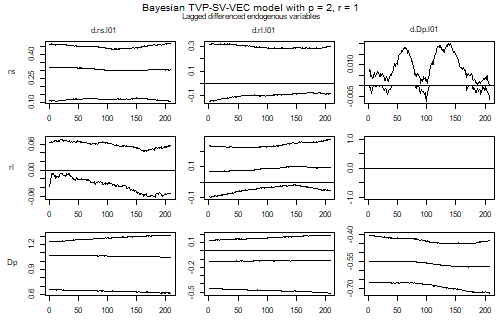
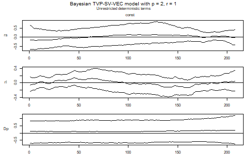
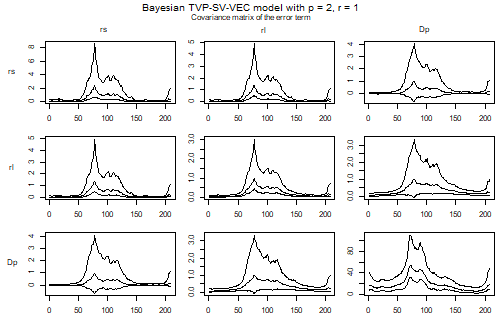

## Introduction

The companion vignette on TVP-SV-VAR models describes what the arguments `tvp`
and `error` do and which priors they require. They mean the same thing for a
vector error correction model, and `create_bvecmodel` takes them in the same
way. What changes is the object they are applied to, and that change is not
cosmetic: in a VEC model the time varying block includes the cointegration term,
so the model allows the long-run relationship itself to move.

The estimated model is

$$\Delta y_t = \Pi_t w_t + \sum_{l=1}^{p-1} \Gamma_{l,t} \Delta y_{t-l} + C_t d_t + u_t,
\qquad u_t \sim N(0, \Sigma_t),$$

with $\Pi_t = \alpha_t \beta_t^{\prime}$ of rank $r$. The coefficients of the
non-cointegration part and the loadings $\alpha_t$ follow random walks and
$\Sigma_t$ is the stochastic volatility specification of the VAR vignette. The
cointegration vectors get a state equation of their own,

$$\beta_t = \rho \beta_{t-1} + \eta_t, \qquad \eta_t \sim N(0, I),$$

which is the specification of Koop, León-González and Strachan (2011). A
constant coefficient VEC model instead puts a matric-variate prior on the
cointegration space, so `add_priors` asks for different arguments in the two
cases: `coint$v_i` and `coint$p_tau_i` for a constant model, `coint$rho` for a
time varying one.

## Data

Data set `uk_macrodata` contains a UK short-term interest rate, a long-term
interest rate and inflation from 1957Q2 to 2009Q2. It is the data set of Koop,
León-González and Strachan (2011), whose subject is exactly the question this
model is for: whether the long-run relationship between the two rates and
inflation is the same in 2009 as it was in 1957.


``` r
library(bvartools)

data("uk_macrodata")

plot(uk_macrodata, main = "UK interest and inflation rates")
```

<div class="figure" style="text-align: center">

<p class="caption">plot of chunk data</p>
</div>

## Model set-up


``` r
model <- create_bvecmodel(uk_macrodata, p = 2, r = 1, const = "unrestricted",
                          tvp = TRUE, error = "sv+covar", varsel = "bvs",
                          iterations = 3000, burnin = 1000)

model[["model"]][["algorithm"]]
#> [1] "VecTvpStochvol"
```

`p` is the lag order of the level VAR, so the model contains $p - 1 = 1$ lag of
the differenced series. The cointegration rank is fixed at one, which for a term
structure is the natural specification.

Models with a prior on the cointegration space are sensitive to the scale of the
series in the error correction term, and `scale_error_correction` divides them
by the standard deviation of their differences. Since it changes what
`coef$v_i` and `coint$rho` are a prior about, it belongs before `add_priors`.


``` r
model <- scale_error_correction(model)
```

## Priors


``` r
model <- add_priors(model,
                    coef = list(v_i = 1, v_i_det = 1 / 10,
                                shape = 3, rate = 0.0001, rate_det = 0.01),
                    coint = list(rho = 0.999),
                    sigma = list(shape = 3, rate = 0.01,
                                 mu = 0, v_i = 0.01,
                                 state_variance = 0.05, offset = 1e-8),
                    varsel = list(inprior = 0.5, exclude_det = TRUE))
```

Arguments `coef` and `sigma` are the ones of the VAR vignette: prior precisions
for the initial state of the coefficients, an inverse gamma prior for the
variances of their state equation, and the prior of the stochastic volatility
block.

Argument `coint` is where a VEC model differs. `rho` is the autocorrelation of
the state equation of $\beta$ and must be smaller than one. The prior on the
state before the sample is that equation's own stationary distribution,
$N(0, I / (1 - \rho^2))$, which is what makes the prior proper, so a value close
to one is intended and a value far from it draws a warning. Only the product
$\alpha_t \beta_t^{\prime}$ is identified, and the prior variance of the
loadings is shrunk by $1 - \rho^2$ to compensate, which leaves the product on
the scale that `coef$v_i` asks for.

The loadings are never subject to variable selection, so the cointegration term
is always in the model. Variable selection applies to the coefficients of the
differenced regressors, and `exclude_det = TRUE` keeps the unrestricted constant
out of it as well.

## Initial values and posterior draws


``` r
model <- add_initial_values(model)
```


``` r
model <- add_posterior_coefficients(model)
```

Before anything is read off the error correction term, the series in it are put
back on the scale of the input data. The function multiplies the draws of
$\beta$ by the inverse of the scaling matrix and leaves $\alpha$ unchanged,
which leaves $\Pi_t w_t$ where it was.


``` r
model <- rescale_error_correction(model)
```

## Evaluation

### Summary statistics for a period

As for a TVP-SV-VAR, a summary table is the summary of a period, and the last
one is used by default. The first block of columns is the cointegration matrix
$\Pi_t$ rather than $\alpha_t$ and $\beta_t$ separately, since the factors are
identified only up to an invertible $r \times r$ transformation while their
product is not.


``` r
summary(model)
#> 
#> Bayesian TVP-SV-VEC model with p = 2 
#> 
#> Variable selection algorithm: Bayesian variable selection (Korobilis, 2013)
#> 
#> Endogenous variables: rs, rl, Dp
#> 
#> Period: 208 
#> 
#> Variable: rs 
#> 
#>                   Mean          SD     Naive SD Time-series SD        2.5%
#> l.rs     -0.2251968463 0.259991842 4.746780e-03   0.0228892305 -0.78554926
#> l.rl      0.0444957586 0.130786040 2.387815e-03   0.0076305089 -0.24035146
#> l.Dp     -0.0072015944 0.025498154 4.655305e-04   0.0009326707 -0.06393066
#> d.rs.l01  0.2977158223 0.089167845 1.627975e-03   0.0142560687  0.10694018
#> d.rl.l01  0.0579459353 0.096980469 1.770613e-03   0.0210189992 -0.08315038
#> d.Dp.l01 -0.0001657017 0.004667771 8.522145e-05   0.0003198022 -0.00661128
#> const    -0.0160356649 0.211161807 3.855270e-03   0.0089617212 -0.42481119
#>                   50%      97.5% Incl. prob.  
#> l.rs     -0.206652888 0.22277732       1.000  
#> l.rl      0.046146478 0.30919249       1.000  
#> l.Dp     -0.002925802 0.04175214       1.000  
#> d.rs.l01  0.301722105 0.46602294       1.000 *
#> d.rl.l01  0.000000000 0.30058910       0.566  
#> d.Dp.l01  0.000000000 0.00000000       0.057  
#> const    -0.014971680 0.40357390       1.000  
#> 
#> Variable: rl 
#> 
#>                   Mean         SD     Naive SD Time-series SD        2.5%
#> l.rs     -5.360863e-02 0.15110255 0.0027587424   0.0068289499 -0.39285792
#> l.rl      9.270241e-03 0.07842612 0.0014318586   0.0030505233 -0.17859551
#> l.Dp     -5.823909e-04 0.01192649 0.0002177468   0.0003414527 -0.02599615
#> d.rs.l01 -3.844451e-05 0.02378059 0.0004341722   0.0018457453 -0.05361986
#> d.rl.l01  9.856186e-02 0.08962349 0.0016362935   0.0102235607 -0.05433469
#> d.Dp.l01  0.000000e+00 0.00000000 0.0000000000   0.0000000000  0.00000000
#> const     4.675439e-02 0.14434826 0.0026354267   0.0039458319 -0.22460168
#>                    50%      97.5% Incl. prob. 
#> l.rs     -0.0365124185 0.23034850   1.0000000 
#> l.rl      0.0065143970 0.16842928   1.0000000 
#> l.Dp     -0.0001963954 0.02540337   1.0000000 
#> d.rs.l01  0.0000000000 0.05667895   0.1350000 
#> d.rl.l01  0.0956150737 0.27848835   0.8926667 
#> d.Dp.l01  0.0000000000 0.00000000   0.0000000 
#> const     0.0426952919 0.33879719   1.0000000 
#> 
#> Variable: Dp 
#> 
#>                 Mean         SD    Naive SD Time-series SD       2.5%
#> l.rs     -0.57003674 0.67660411 0.012353044    0.035365687 -2.2229269
#> l.rl      0.27082154 0.44816622 0.008182358    0.023796373 -0.3533300
#> l.Dp     -0.01480507 0.06229274 0.001137305    0.001709405 -0.1646868
#> d.rs.l01  1.00844255 0.19713332 0.003599146    0.079491402  0.6156145
#> d.rl.l01 -0.13743942 0.18759739 0.003425044    0.043486773 -0.5124254
#> d.Dp.l01 -0.57673609 0.07367037 0.001345031    0.006917971 -0.7269042
#> const     0.21251411 0.49445831 0.009027532    0.019915288 -0.7538546
#>                   50%      97.5% Incl. prob.  
#> l.rs     -0.433834316  0.4308987   1.0000000  
#> l.rl      0.132918351  1.4138452   1.0000000  
#> l.Dp     -0.005582562  0.1031823   1.0000000  
#> d.rs.l01  1.047388412  1.3108245   1.0000000 *
#> d.rl.l01 -0.117257589  0.1851379   0.8823333  
#> d.Dp.l01 -0.575584826 -0.4342962   1.0000000 *
#> const     0.191885220  1.2332000   1.0000000  
#> 
#> Variance-covariance matrix:
#> 
#>             Mean         SD    Naive SD Time-series SD        2.5%        50%
#> rs_rs  0.4730819  0.5716419 0.010436705    0.028653088  0.04162653  0.3060548
#> rs_rl  0.2865835  0.3302297 0.006029141    0.014638538  0.03042756  0.1904101
#> rs_Dp  0.2418075  0.3502234 0.006394175    0.022413080 -0.06988296  0.1434219
#> rl_rl  0.2328315  0.2047463 0.003738140    0.008784099  0.06289787  0.1743597
#> rl_Dp  0.3111462  0.2578928 0.004708456    0.017015349  0.05940786  0.2415636
#> Dp_Dp 21.4178209 10.3216910 0.188447433    0.731627321  9.67629223 18.9044203
#>            97.5%  
#> rs_rs  1.8817945 *
#> rs_rl  1.1064948 *
#> rs_Dp  1.0872772  
#> rl_rl  0.7240064 *
#> rl_Dp  0.9661988 *
#> Dp_Dp 48.9703080 *
```


``` r
period_of <- function(object, year, quarter) {
  which(stats::time(object[["data"]][["train"]][["y"]]) == year + (quarter - 1) / 4)
}

summary(model, period = period_of(model, 1975, 1))
#> 
#> Bayesian TVP-SV-VEC model with p = 2 
#> 
#> Variable selection algorithm: Bayesian variable selection (Korobilis, 2013)
#> 
#> Endogenous variables: rs, rl, Dp
#> 
#> Period: 70 
#> 
#> Variable: rs 
#> 
#>                   Mean          SD     Naive SD Time-series SD          2.5%
#> l.rs     -0.5932387417 0.342850007 6.259556e-03   0.0293388262 -1.3686720309
#> l.rl      0.4250961618 0.241291995 4.405369e-03   0.0207464121  0.0006287802
#> l.Dp      0.0157338021 0.019833941 3.621166e-04   0.0005902087 -0.0177956979
#> d.rs.l01  0.3006994491 0.083154386 1.518184e-03   0.0238576283  0.1266515074
#> d.rl.l01  0.0547887016 0.093482268 1.706745e-03   0.0256987558 -0.0968236429
#> d.Dp.l01  0.0006487506 0.005100352 9.311925e-05   0.0005439281  0.0000000000
#> const     0.0336830164 0.263705522 4.814582e-03   0.0334969424 -0.5129381927
#>                  50%         97.5% Incl. prob.  
#> l.rs     -0.55851183 -0.0008429334       1.000 *
#> l.rl      0.40404501  0.9571780572       1.000 *
#> l.Dp      0.01270036  0.0620911759       1.000  
#> d.rs.l01  0.30965917  0.4471718948       1.000 *
#> d.rl.l01  0.00000000  0.3067263668       0.566  
#> d.Dp.l01  0.00000000  0.0141856456       0.057  
#> const     0.03307681  0.5497068060       1.000  
#> 
#> Variable: rl 
#> 
#>                  Mean         SD     Naive SD Time-series SD        2.5%
#> l.rs      0.353899564 0.24068065 0.0043942073   0.0322131543 -0.08209449
#> l.rl     -0.256143440 0.17287865 0.0031563179   0.0236560516 -0.60606796
#> l.Dp     -0.009948571 0.01373774 0.0002508157   0.0008651683 -0.04218299
#> d.rs.l01  0.002522760 0.01919648 0.0003504781   0.0027611884 -0.02570248
#> d.rl.l01  0.078898516 0.07485461 0.0013666520   0.0152717872 -0.04715780
#> d.Dp.l01  0.000000000 0.00000000 0.0000000000   0.0000000000  0.00000000
#> const     0.097339355 0.14291259 0.0026092150   0.0057862837 -0.17732794
#>                   50%      97.5% Incl. prob. 
#> l.rs      0.337453468 0.85006171   1.0000000 
#> l.rl     -0.245915664 0.05654593   1.0000000 
#> l.Dp     -0.007376868 0.01129589   1.0000000 
#> d.rs.l01  0.000000000 0.06150144   0.1350000 
#> d.rl.l01  0.076096477 0.22436967   0.8926667 
#> d.Dp.l01  0.000000000 0.00000000   0.0000000 
#> const     0.096791720 0.38824764   1.0000000 
#> 
#> Variable: Dp 
#> 
#>                  Mean         SD     Naive SD Time-series SD        2.5%
#> l.rs      0.184937874 0.60066650 0.0109666198   0.0174660130 -0.98547662
#> l.rl     -0.128984701 0.43260297 0.0078982135   0.0124873440 -1.02555889
#> l.Dp     -0.006115867 0.02475847 0.0004520257   0.0006567029 -0.06457093
#> d.rs.l01  1.011214925 0.18172165 0.0033177682   0.0916881105  0.64911092
#> d.rl.l01 -0.138590393 0.17367610 0.0031708773   0.0487197379 -0.47696872
#> d.Dp.l01 -0.548723979 0.06256374 0.0011422524   0.0112388403 -0.67032230
#> const     0.106806042 0.39934640 0.0072910343   0.0300847517 -0.66701108
#>                   50%       97.5% Incl. prob.  
#> l.rs      0.173514839  1.42445764   1.0000000  
#> l.rl     -0.124705297  0.72446170   1.0000000  
#> l.Dp     -0.002357595  0.04119873   1.0000000  
#> d.rs.l01  1.066355733  1.26816864   1.0000000 *
#> d.rl.l01 -0.125811417  0.14871920   0.8823333  
#> d.Dp.l01 -0.549725685 -0.42104493   1.0000000 *
#> const     0.106257745  0.90687715   1.0000000  
#> 
#> Variance-covariance matrix:
#> 
#>             Mean         SD    Naive SD Time-series SD        2.5%        50%
#> rs_rs  0.4730819  0.5716419 0.010436705    0.028653088  0.04162653  0.3060548
#> rs_rl  0.2865835  0.3302297 0.006029141    0.014638538  0.03042756  0.1904101
#> rs_Dp  0.2418075  0.3502234 0.006394175    0.022413080 -0.06988296  0.1434219
#> rl_rl  0.2328315  0.2047463 0.003738140    0.008784099  0.06289787  0.1743597
#> rl_Dp  0.3111462  0.2578928 0.004708456    0.017015349  0.05940786  0.2415636
#> Dp_Dp 21.4178209 10.3216910 0.188447433    0.731627321  9.67629223 18.9044203
#>            97.5%  
#> rs_rs  1.8817945 *
#> rs_rl  1.1064948 *
#> rs_Dp  1.0872772  
#> rl_rl  0.7240064 *
#> rl_Dp  0.9661988 *
#> Dp_Dp 48.9703080 *
```

The inclusion probabilities of the $\Pi$ columns are one by construction, as
explained above, and the inclusion probabilities of the remaining columns do not
carry a period: variable selection decides on a regressor for the whole sample.

### Coefficient and volatility paths

`plot` draws one figure per block of coefficients: the cointegration matrix
$\Pi_t$, the lagged differences, the deterministic terms and the covariance
matrix of the error term, each on its own.


``` r
plot(model)
```

<div class="figure" style="text-align: center">

<p class="caption">plot of chunk paths</p>
</div><div class="figure" style="text-align: center">

<p class="caption">plot of chunk paths</p>
</div><div class="figure" style="text-align: center">

<p class="caption">plot of chunk paths</p>
</div><div class="figure" style="text-align: center">

<p class="caption">plot of chunk paths</p>
</div>

In the figure of $\Pi_t$, reading down a column gives the response of each
differenced series to the level of one variable, and reading across a row gives
the error correction of one equation. A panel that sits at zero among the
$\Gamma$ coefficients is one that variable selection has switched off.

A single element of $\Pi_t$ is easier to read on its own. The following computes
it from the draws of the loadings, which are the first $Kr$ coefficients of each
period of `posterior$a$coeffs`, and the draws of the cointegration vectors in
`posterior$beta$coeffs`.


``` r
pi_path <- function(object, equation, variable, ci = 0.9) {
  k <- object[["model"]][["k"]]
  r <- object[["model"]][["rank"]]
  m <- ncol(object[["data"]][["train"]][["z"]])
  k_ect <- ncol(object[["data"]][["train"]][["w"]])
  tt <- nrow(object[["data"]][["train"]][["y"]])
  draws <- nrow(object[["posterior"]][["a"]][["coeffs"]])

  i <- which(object[["model"]][["endogen"]] == equation)
  j <- which(dimnames(object[["data"]][["train"]][["w"]])[[2]] == variable)

  result <- matrix(NA_real_, draws, tt)
  for (period in 1:tt) {
    alpha <- object[["posterior"]][["a"]][["coeffs"]][, (period - 1) * m + 1:(k * r)]
    beta <- object[["posterior"]][["beta"]][["coeffs"]][, (period - 1) * k_ect * r + 1:(k_ect * r)]
    result[, period] <- rowSums(matrix(alpha, draws, k * r)[, k * 0:(r - 1) + i, drop = FALSE] *
                                  matrix(beta, draws, k_ect * r)[, k_ect * 0:(r - 1) + j, drop = FALSE])
  }

  bands <- t(apply(result, 2, stats::quantile,
                   probs = c((1 - ci) / 2, .5, 1 - (1 - ci) / 2)))

  stats::ts(bands, start = stats::start(object[["data"]][["train"]][["y"]]),
            frequency = stats::frequency(object[["data"]][["train"]][["y"]]))
}

path <- pi_path(model, equation = "rs", variable = "l.rs")

stats::ts.plot(path, lty = c(2, 1, 2),
               main = "Short rate: adjustment to its own level",
               ylab = "Element of Pi")
abline(h = 0, lty = "dotted")
```

<div class="figure" style="text-align: center">

<p class="caption">plot of chunk pi-path</p>
</div>

Note what is *not* plotted here. The path of $\beta_t$ on its own is not a
quantity to read: a cointegration vector is identified only up to
normalisation, and normalising it on a variable whose coefficient wanders near
zero produces a path that swings between large values without anything having
happened to the model. $\Pi_t$ carries the same information and is identified.

The volatilities are extracted from the draws of the error precision exactly as
in the VAR case.


``` r
volatility <- function(object) {
  k <- object[["model"]][["k"]]
  kk <- k * k
  tt <- nrow(object[["data"]][["train"]][["y"]])
  draws <- object[["posterior"]][["u_sigma_inv"]][["coeffs"]]

  result <- matrix(NA_real_, tt, k)
  for (i in 1:tt) {
    result[i, ] <- rowMeans(apply(draws[, (i - 1) * kk + 1:kk], 1,
                                  function(x) {sqrt(diag(solve(matrix(x, k))))}))
  }

  stats::ts(result, start = stats::start(object[["data"]][["train"]][["y"]]),
            frequency = stats::frequency(object[["data"]][["train"]][["y"]]),
            names = object[["model"]][["endogen"]])
}

plot(volatility(model),
     main = "Posterior mean of the residual standard deviations")
```

<div class="figure" style="text-align: center">

<p class="caption">plot of chunk volatility</p>
</div>

For these data the volatility block does most of the work that a constant
covariance matrix would have got wrong. The 1970s and early 1980s are an
order of magnitude noisier than the rest of the sample, and a model that
averaged over them would report credible bands for the 1990s that are far too
wide.

## What a time varying VEC model does not do

`vec_to_var` refuses to transform the posterior draws of a time varying model:


``` r
vec_to_var(model)
#> Error in `vec_to_var.bvecmodel()`:
#> ! Posterior draws of models with time varying parameters cannot be transformed.
```

The transformation writes the VEC coefficients of one draw as the coefficients
of the corresponding level VAR, and impulse responses and forecast error
variance decompositions are computed from that VAR form. A time varying model
has one such VAR per period and per draw, so what would come back is not a
`bvarmodel` of the kind the rest of the package works with. Analysis of a
TVP-SV-VEC model therefore stays with the paths above and with the period-wise
summaries.

A constant coefficient model transforms as usual, so the practical route to
impulse responses is to estimate the same specification with `tvp = FALSE` --
which is worth doing in any case, since the constant coefficient model with
stochastic volatility is the model a TVP-SV specification has to beat.

## References

Koop, G., León-González, R., & Strachan R. W. (2011). Bayesian inference in a time varying cointegration model. *Journal of Econometrics, 165*(2), 210-220. <https://doi.org/10.1016/j.jeconom.2011.07.007>

Koop, G., León-González, R., & Strachan R. W. (2010). Efficient posterior simulation for cointegrated models with priors on the cointegration space. *Econometric Reviews, 29*(2), 224-242. <https://doi.org/10.1080/07474930903382208>

Korobilis, D. (2013). VAR forecasting using Bayesian variable selection. *Journal of Applied Econometrics, 28*(2), 204-230. <https://doi.org/10.1002/jae.1271>

Lütkepohl, H. (2006). *New introduction to multiple time series analysis* (2nd ed.). Berlin: Springer.

Primiceri, G. E. (2005). Time varying structural vector autoregressions and monetary policy. *Review of Economic Studies, 72*(3), 821-852. <https://doi.org/10.1111/j.1467-937X.2005.00353.x>
